# Architecture Diagrams — End to End

**Purpose:** a single rendered diagram set for the stack and the agent-specific layers (harness, evals, guardrails), companion to the prose specs in this directory and in `40-ai-safety/`.

**Authority:** where a diagram and an ADR disagree, the ADR wins — see [adr-index.md](adr-index.md).

## 1. System context

**Rewritten 2026-07-19 (D-33, narrowed by D-34) for the self-hosted-Kubernetes-on-EKS stack.** Users reach Dux only through Cloudflare edge and `api.dux.io`. Connectors reach vendor and threat-intel systems read-only; no tenant credentials cross the wire to intel sources. The platform reaches customer cloud accounts via per-tenant cross-account IAM, and reaches LLM providers by direct API key (OpenAI), IAM/SigV4 (Bedrock primary), or a direct Anthropic API key (fallback leg).

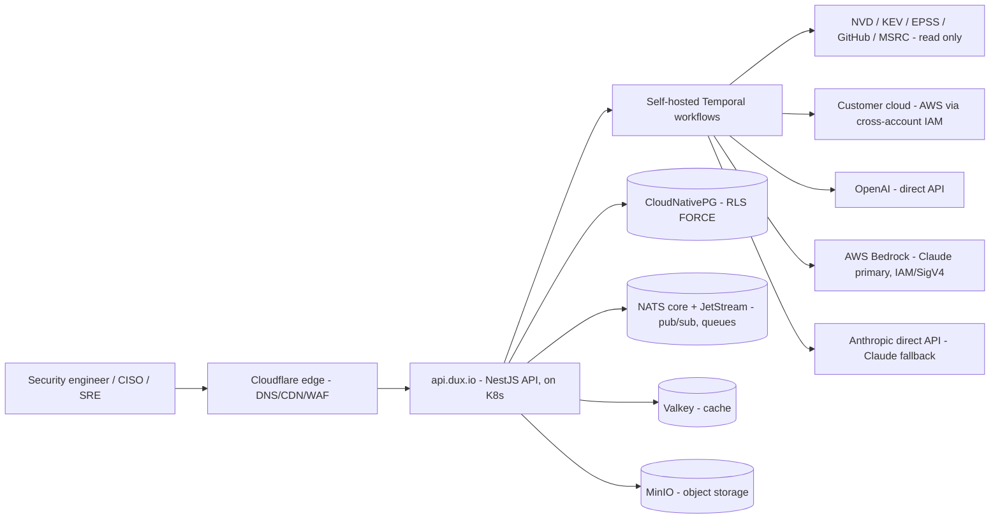

## 2. Container / service topology

Three Kubernetes Deployments carry the workload from Gate 1: the API, connector sync, and sandbox broker (the LiteLLM proxy is retired — Bedrock calls go direct from `dux-api` via `LLMProviderPort`, ADR-010 R5). Each is isolated from the others; only `dux-connector-sync` and `dux-sandbox` are permitted to reach outside the platform boundary for ingest and script execution respectively.

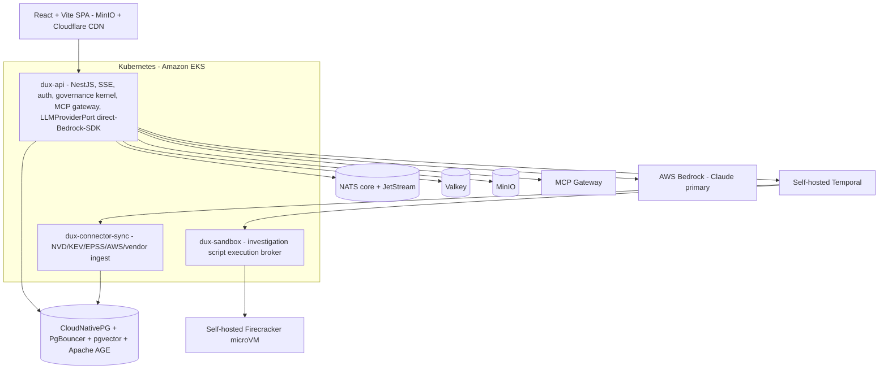

## 3. Agent orchestration / harness

Each assessment runs as one Temporal child workflow per tenant, on a tenant-scoped task queue (`assessment-{tenant_id}`). No agent framework mediates the loop (ADR-021) — the workflow calls the Bedrock Converse API directly, as ordinary Temporal activities, with message history read/written to Postgres and turn deltas fanned out over NATS. `TraceRecorder` persists the run without making any LLM calls itself.

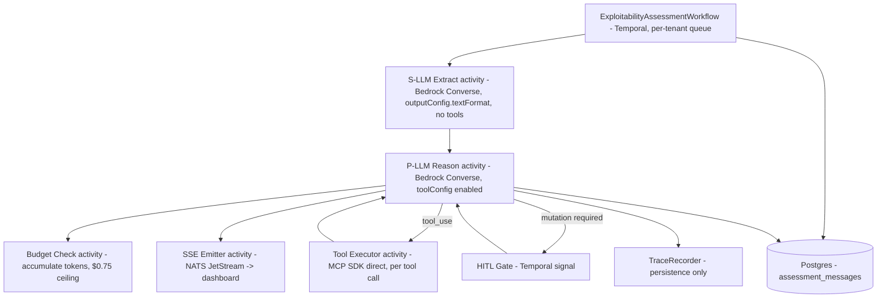

State machine per activity: `IDLE -> REASONING -> TOOL_CALLING -> EVALUATING -> {COMPLETE | BLOCKED | FAILED}`.

## 4. CaMeL dual-LLM guardrail

The Suspicious LLM (S-LLM) is the only component that reads untrusted content (CVE text, tool output); it never executes tools and its output is schema-constrained. The Privileged LLM (P-LLM) executes tools and reasons over the assessment, but never sees raw untrusted text. A tool schema with an unconstrained free-text field defeats the boundary, so P-LLM tool schemas are structured JSON only.

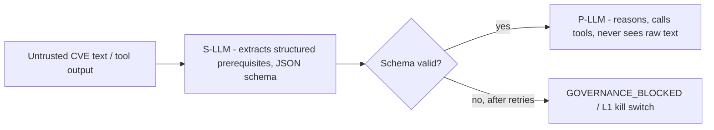

## 5. Governance kernel chain (guardrails)

Every LLM call and MCP tool invocation is checked by `KillSwitchRelay` first; an active kill switch short-circuits the whole chain with a 503. Otherwise, five gates run in sequence, ending with `VendorActionGate` — the only legal path to a vendor mutation API — and then `HITLGate`, whose default outcome depends on the specific action's confidence floor.

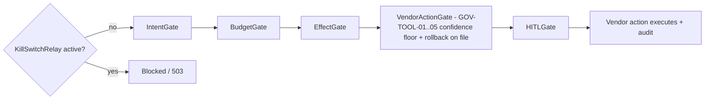

`VendorActionGate` outcome by tool: `network.blocklist_add` and `policy.deploy_device_config` need confidence >= 0.75 or escalate to HITL; `ticket.create_remediation` always executes unattended; `endpoint.isolate` and `patch.deploy_special_devices` require a live HITL response on every call, with no confidence floor that bypasses it.

## 6. MCP gateway security layers

Six defense layers sit between the reasoning loop and every tool call, whether a read-only research tool or a vendor write action.

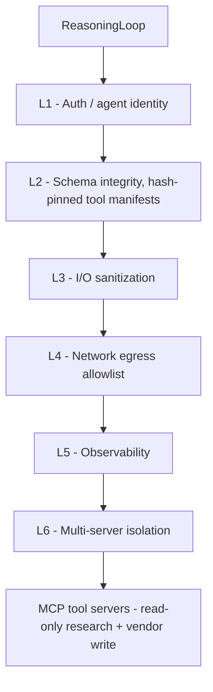

## 7. Vendor write-path sequence

Fast actions and the mitigation write path share the same gate. Three of the five canonical actions execute unattended by default and only escalate to HITL on anomaly (confidence-abstention band, sandbox timeout/OOM, T4 outlier); two fleet-impacting actions require a live human response on every call until each earns unattended execution via a field-proven safety record.

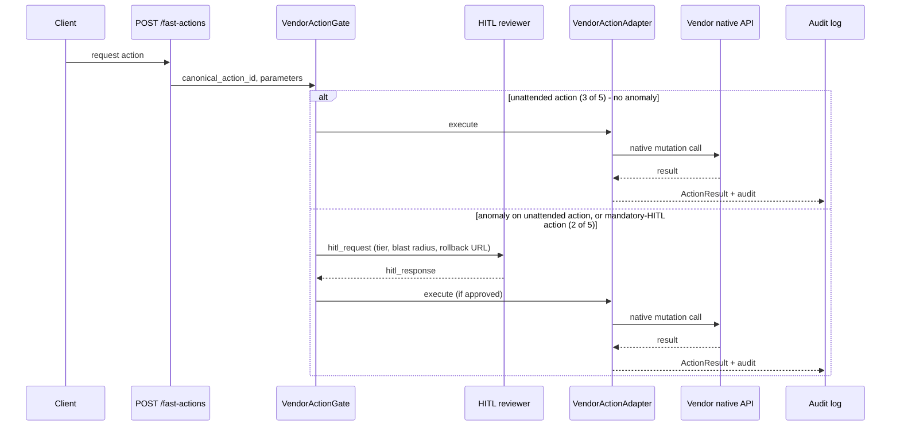

## 8. Evals & confidence pipeline

Golden-set regression is a merge-blocking CI gate. The exploitability verdict itself is scored by a three-signal confidence ensemble, calibrated with Platt scaling, and mapped to abstention bands that decide routing, including whether a case escalates into the HITL path shown in diagram 5.

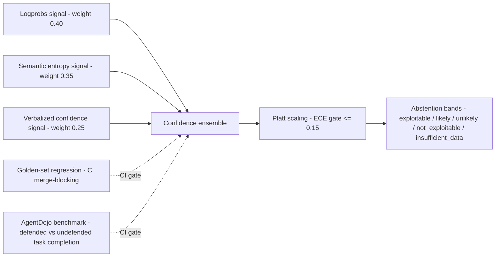

## 9. Sandbox execution

Investigation scripts written by the agent are statically scanned before they ever run, then executed in a fresh microVM that is discarded after one invocation, with default-drop network egress.

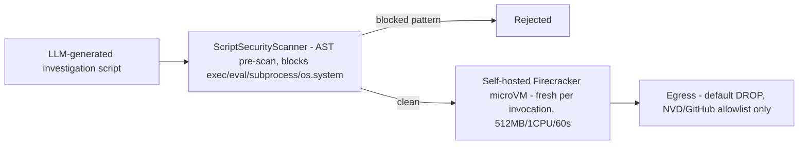

## 10. Multi-tenant isolation overlay

Isolation is enforced at every layer the request touches: Postgres RLS with FORCE, composite `(tenant_id, id)` lookups, tenant-scoped Temporal task queues, tenant-scoped kill-switch pub/sub channels, and HMAC-hashed tenant IDs in all telemetry so raw tenant IDs never appear in logs or traces.

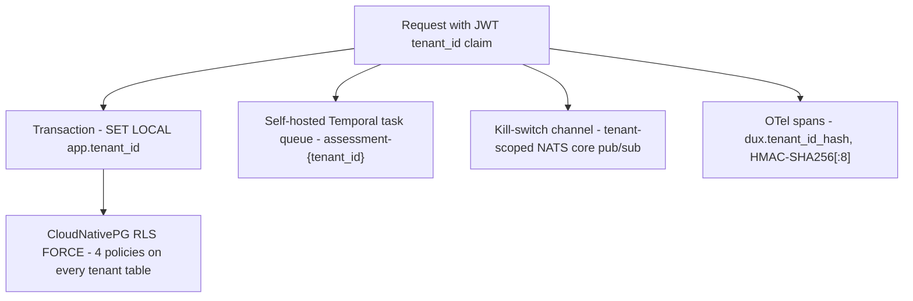

## 11. Observability closing the loop

Every LLM and MCP call is wrapped by an instrumented client so no call bypasses tracing. Spans follow the OTel GenAI semantic convention into self-hosted Langfuse and self-hosted Grafana LGTM (Loki/Tempo/Prometheus), and burn-rate alerts watch the resulting metrics.

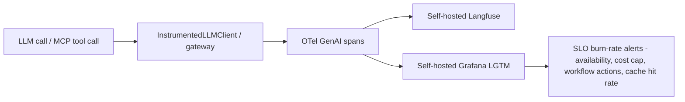

## Sources

[architecture-overview.md](architecture-overview.md) · [adr-index.md](adr-index.md) · [workflows.md](workflows.md) · [multi-tenancy.md](multi-tenancy.md) · [data-model.md](data-model.md) · [governance-kernel.md](../40-ai-safety/governance-kernel.md) · [kill-switch-hitl.md](../40-ai-safety/kill-switch-hitl.md) · [camel-plane.md](../40-ai-safety/camel-plane.md) · [mcp-security.md](../40-ai-safety/mcp-security.md) · [confidence-calibration.md](../40-ai-safety/confidence-calibration.md) · [sandbox-execution.md](../40-ai-safety/sandbox-execution.md) · [safety-overview.md](../40-ai-safety/safety-overview.md) · [mitigation-write-path.md](../10-product/features/mitigation-write-path.md) · [catalogs.md](../10-product/catalogs.md) · [observability-slo.md](../60-operations/observability-slo.md)
