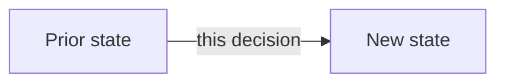

# ADR-{{number}}: {{title}}

## Status

Proposed | Accepted | Superseded by ADR-### | Deprecated

## Context

What situation forces this decision. What constraint, incident, or requirement made the status quo untenable. State facts, not the preferred conclusion.

## Decision

The decision itself, stated as a single clear sentence at the top of this section, then elaborated.

## Alternatives considered

| Option | Why not chosen |
|---|---|
| | |

## Consequences

**Positive:** what this unlocks or simplifies.

**Negative / accepted tradeoffs:** what this costs, or what it forecloses. An ADR with no negative consequences was not a real decision.

## Revisions

| Revision | Date | Change |
|---|---|---|
| R1 | | initial |

## Diagram

## Related

- Link the ADRs, specs, or decisions-log entries this supersedes or depends on.

## Sources

- Path to the source document, if any.
