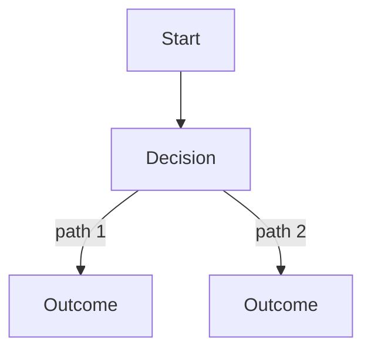

# {{title}}

## Summary

One or two sentences: what this is, who owns it, and current status/gate.

## Executive Summary

The single paragraph a reader should remember if they read nothing else: the problem, the decision, and the consequence. Lead with the non-obvious finding, not a restatement of the title.

## Problem

What is broken, missing, or underserved today. Cite the evidence (metric, incident, user report) — do not assert a problem without a source.

## Goals and non-goals

**Goals:** the outcomes this PRD commits to.

**Non-goals:** explicitly out of scope, so scope creep has a place to be rejected against.

## Specification

### Personas

Who uses this and what they need from it.

### Requirements

| ID | Requirement | Priority |
|---|---|---|
| FR-### | | P0/P1/P2 |

### Acceptance criteria

What "done" means, testably.

### Dependencies

What this requires to exist first.

## Diagram

## Entities & Concepts

- Link related people, tools, and concepts.

## Related

- Link at least 2 existing notes.

## Sources

- Path to the source document(s), if any.
