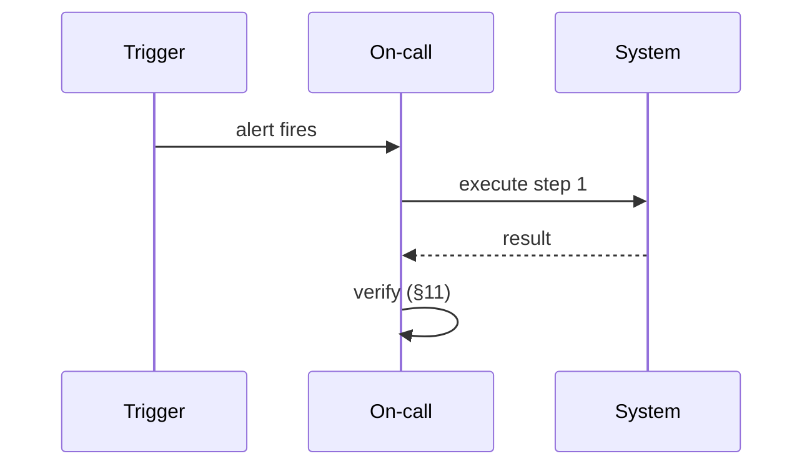

# {{title}} Runbook

## 1. Trigger

The alert, symptom, or condition that starts this runbook. Be specific — a named alert ID or a measurable threshold, not "something seems wrong."

## 2. Service catalog

Which service(s) this affects, and their on-call routing.

## 3. Business impact

How impact is calculated (a formula, if one exists) and who it's reported to at what severity.

## 4. User impact

What the affected user or customer actually experiences.

## 5. System boundary

What this runbook's remediation can and cannot reach — the blast radius.

## 6. Incident roles

| Role | Responsibility | Default assignee |
|---|---|---|
| Incident Commander | | |
| Technical Lead | | |
| Comms Lead | | |

## 7. Pre-conditions

What must be true before executing this runbook (access, tooling, confirmed diagnosis).

## 8. Automation gate

The command or check that must pass before automated remediation proceeds, and what happens on timeout.

## 9. Execution steps

| Step | Command | Expected result | Human fallback |
|---|---|---|---|
| 1 | | | |

## 10. Safety check

Any checks that must pass regardless of what triggered this runbook (e.g., isolation, cost, audit-trail integrity).

## 11. Verification

The specific query or test that confirms the incident is resolved, not just quiet.

## 12. Post-incident

Postmortem timing, evidence retention, and any regulatory notification clock this incident starts.

## Diagram

## Related

- Link the systems and adjacent runbooks this one depends on or escalates to.

## Sources

- Path to the source document, if any.
