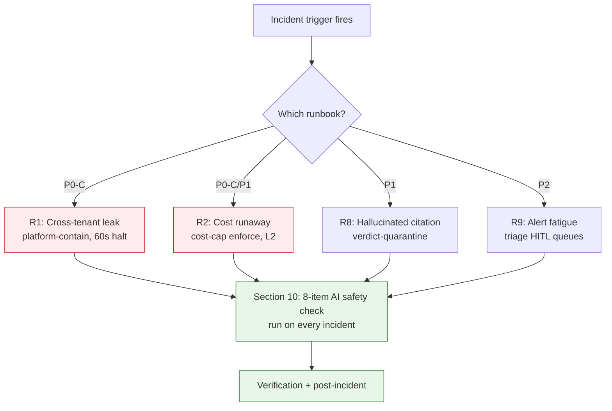

# AI Safety Incident Runbooks

## Summary

The twelve canonical agentic failure modes and the procedure for each — the source of truth these procedures; [[Support Playbook]] adds stage deltas only, never duplicates the step tables. Owner: Security. Status: canonical. Gate: 1. Decisions: D-3.

## Executive Summary

Every runbook follows the same 12-section template, and every incident runs the same eight-item AI safety check (§10) regardless of type: agent loop <=50 iterations, clean tool diff, passing prompt-injection CI, drained HITL queue, zero cross-tenant references, zero undeclared shadow AI, valid AI-BOM, confirmed cost-cap state. **The AI Safety Lead holds 60-second halt authority and that role cannot be merged with the Incident Commander** — a structural separation of powers. The highest-severity runbook, cross-tenant context leak (P0-C), triggers `admin:platform-contain` (L4) with a 60-second agent halt and mandatory counsel engagement if PII is involved (GDPR 72-hour clock). A recurring theme across the runbooks is distinguishing genuine incidents from miscalibration — R9 (alert fatigue) and R12 (prompt brittleness) both root-cause into "is this a real problem or a threshold that needs adjusting" before acting.

## Specification

### Runbook template (12 sections)

Trigger, Service catalog, Business impact (MRR-at-risk formula), User impact, System/agent boundary, Incident roles, Pre-conditions, Automation gate, Execution steps, AI safety check (§10, all 8 items every incident), Verification, Post-incident.

### The twelve runbooks

| # | Runbook | Severity | Trigger | Core containment |
|---|---|---|---|---|
| R1 | Cross-tenant context leak | P0-C | `foreign_tenant_refs > 0` + isolation SLO burn >=5%/1h | `admin:platform-contain` (L4), agent halt <=60s, counsel if PII (72h) |
| R2 | Token cost runaway | P0-C/P1 | spend >3x 7-day baseline, or >$25/hr/tenant | `admin:cost-cap enforce`, L2 kill switch, halt top-spend agent |
| R3 | Model provider outage | P1 | provider status non-operational | `admin:model-route --fallback on` (<=60s), golden-set spot check, halt if regression >5% |
| R4 | MCP dependency failure | P2 | MCP errors >50%/5min | `admin:mcp-circuit-breaker --open`, verify no hallucinated success |
| R5 | Rate limit cascade | P2 | dual 429 (model + customer) | jitter backoff, halt runaway agent, escalate provider quota |
| R6 | Context window exhaustion | P2 | 128K ceiling hit | checkpoint at 80%, abandon at 100%, halt retry loop |
| R7 | Prompt cache invalidation | P2 | hit-rate drop >15%/5min | identify deploy/pin cause, rollback or `admin:llm-cache-warm` |
| R8 | Hallucinated-CVE citation | P1 | EXP-CIT-001 fails at generation | `admin:verdict-quarantine`, re-verify against NVD |
| R9 | Alert fatigue | P2 | HITL backlog, rubber-stamp pattern (>95% approved) | triage mandatory vs anomaly queues, time-boxed confidence-floor raise |
| R10 | Memory / context poisoning | P1 | `camel.output_audit_failed` spike | agent halt <=60s, `admin:agent-context-audit`, isolate suspect connector |
| R11 | Coordination overhead | P2 | assessment p95 latency regression, loop counters within limits | `admin:workflow-trace`, batch/cache redundant MCP calls |
| R12 | Prompt brittleness | P2 | golden-set regression >2%, traced to prompt/schema edit | `admin:prompt-pin --rollback`, re-run golden set |

### R1 — Cross-tenant context leak (full detail as the P0-C exemplar)

Execution: discover active agents -> `admin:agent-halt` within 60s -> `admin:agent-context-audit` (post-hoc scan, not real-time — a known detection-latency tradeoff) -> `admin:export-session` evidence to MinIO -> engage counsel if PII -> root-cause fix -> full `test:isolation` pass -> PM approves customer notification -> `admin:platform-contain --release`. Business impact formula: `monthly_MRR x (affected / total) x (hours / 730)`. Regulatory: GDPR Art. 33 and DORA Art. 5 — 72 hours if PII involved.

### R2 — Token cost runaway

Cost evaluation order (D-3): $0.675/assessment breaker -> $25/hour CostCap -> 2x baseline. Verify spend below 1.5x baseline **before** releasing the L2 kill switch.

### R3b — Model EOL / forced deprecation (H6, Gate-2 hardening, planned not incident-triggered)

Provider models are EOL-dated dependencies; ChatGPT-surface models have been retired on two weeks' notice, with an API minimum of 6 months GA (3 months for variants — the S-LLM workhorse is a variant). Schema-parity checks alone will not catch quality drift ("Drift or Dice" 2026 documented a zero-regression schema gate while output shrank 15.7%). Migration eval must include golden set plus output-length, latency, and tier-failure deltas.

### R8 — Hallucinated-CVE citation

`admin:citation-audit` confirms which claim's citation failed NVD resolution or diverged on CVSS/description -> `admin:verdict-quarantine` hides the verdict pending manual verification -> root-cause: model hallucination vs. stale NVD cache vs. upstream NVD outage.

### R9 — Alert fatigue

Triage separates the 2 mandatory-HITL actions (never paused or floor-adjusted) from the 3 anomaly-escalation-only actions (eligible for a time-boxed, logged confidence-floor raise). Root-cause: miscalibration vs. genuine incident surge.

## Diagram

## Entities & Concepts

- [[Kill Switch]] — L1-L4 levels invoked across every runbook
- [[AI Safety Overview]] — the spine these runbooks protect
- [[Support Playbook]] — seed-stage deltas (PagerDuty IDs, admin CLI, agent-quota mode)

## Related

- [[OWASP Assessments]]
- [[Confidence Calibration]]

## Sources

- `.raw/dux/40-ai-safety/incident-runbooks.md`
