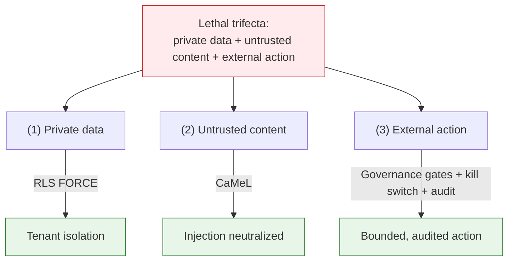

# AI Safety Overview

## Summary

The safety spine every Dux write and execution surface inherits, and the index to its component specs. Owner: Security. Status: canonical. Gate: 1. Decisions: D-4, D-10, D-17.

## Executive Summary

Dux agents hold all three properties of the "lethal trifecta" that make an agent dangerous: they read private customer data, ingest untrusted content (CVE text, exploit code, threat intel), and can act externally against vendor APIs. An agent holding all three is a lateral-movement vector — prompt-inject it and the attacker inherits every credential and network path it holds. Because three of five vendor write actions execute **unattended by default** at Gate 1, human review is an anomaly-escalation path, not a gate on every write — which means the six-control safety spine, not a human, is the primary defense for those actions. The two fleet-impacting actions (`endpoint.isolate`, `patch.deploy_special_devices`) are held to mandatory HITL on every call until each earns unattended execution via a field-proven safety record (D-17). Dux is also a credential honeypot by design: every marketed write executes against the customer's own CrowdStrike/Intune/ServiceNow using credentials Dux holds, making a platform compromise equivalent to write access across every customer's EDR, cloud, and ITSM.

## Specification

### Safety spine (invariant, all six on every agent surface)

| Control | Guarantee |
|---|---|
| RLS FORCE tenant isolation | no cross-tenant read or write reachable, even by a compromised agent |
| CaMeL dual-LLM boundary | untrusted content never reaches a tool-calling context |
| MCP gateway | deny-by-default tool access |
| Kill switch KS-L1-L4 | halt propagates in <5s, tenant-scoped |
| Hash-chained audit | every action recorded, tamper-evident |
| AIBOM CI | supply chain pinned, drift-blocked |

### Defense in depth (L1-L8)

| Layer | Control | Addresses |
|---|---|---|
| L1 Input containment | CaMeL dual-LLM | ASI01, ASI06 |
| L2 Structured output | constrained decoding | ASI01, ASI05 |
| L3 Tool contracts | MCP hash pinning + schema validation | ASI02, ASI04 |
| L4 Identity | JWT/SPIFFE claims | ASI03 |
| L5 Execution isolation | self-hosted Firecracker microVM + AST pre-scan | ASI05, ASI10 |
| L6 Governance gates | Intent + Budget + Effect + DLP kernel | ASI01-10 |
| L7 Audit | HMAC-SHA256 hash chain + hourly anchoring | ASI09 |
| L8 Kill switch | <5s propagation, tenant-scoped | ASI10 |

### Credential-honeypot mitigations

Least-privilege scoped action credentials per connector, limited to the 5 canonical actions, never broad admin. Per-action short-lived credential minting where the vendor supports it; AES-256 at rest with Vault transit otherwise. Bounded blast radius: worst case per tenant is the canonical action set on connected assets, bounded by governance-kernel budget/effect gates, the kill switch, and hash-chained audit; replay of an approved action is countered by `mutation_key` idempotency plus audit anchoring.

### Gate-1 exit criteria (safety)

OWASP LLM and Agentic assessments at Partial or better. ASI01 and ASI02 Implemented; ASI10 Partial or better (kill switch and cost cap Implemented, eBPF deferred to Series A Month 9). LLM01, LLM06, LLM10 Implemented. **LLM09 is the only Gate-1 blocker** (the EXP-CIT-001 citation test).

### Component index

| Concern | Note |
|---|---|
| Dual-LLM boundary, prerequisite schema, retrieval | [[CaMeL]] |
| GOV-001-013 synchronous gates | [[Governance Kernel]] |
| KS-L1-L4 and the HITL contract | [[Kill Switch]] |
| Agent identity, lifecycle, shadow AI | [[Agent Identity]] |
| MCP policy, tool catalog | [[MCP Security]] |
| Sandbox execution | [[Sandbox Execution]] |
| Confidence ensemble, Platt scaling | [[Confidence Calibration]] |
| OWASP crosswalks | [[OWASP Assessments]] |
| Incident procedures | [[AI Safety Incident Runbooks]] |

## Diagram

## Entities & Concepts

- [[CaMeL]] — L1 input containment
- [[Governance Kernel]] — L6 gate chain
- [[Kill Switch]] — L8 halt mechanism

## Related

- [[Dux AI Safety Area]]
- [[Mitigation & Remediation Write Path]]

## Sources

- `.raw/dux/40-ai-safety/safety-overview.md`
