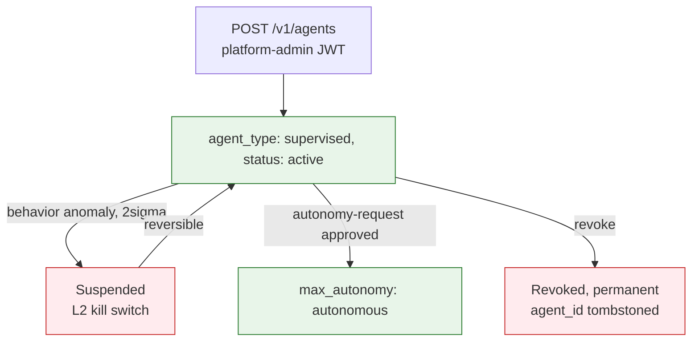

# Agent Identity

## Summary

How assessment agents and Gate-5 physical-residency agents are identified, authenticated, authorized, and audited. Owner: Security. Status: canonical. Gate: 1.

## Executive Summary

Phase 1 uses JWT with SPIFFE-format claims (`sub: spiffe://dux.io/tenant/{tenant_id}/agent/{agent_id}`); full SPIFFE/SPIRE X.509 SVIDs target a Month-3 proof of concept. The credential migration ladder runs pre-seed session JWT + API key, to seed Gate-2 session JWT + OAuth, to post-seed mTLS + SPIRE SVID. A Public Data API key is a hard boundary: it can never authenticate MCP tool calls or `POST /v1/agents`, regardless of scopes. Shadow AI detection runs daily, comparing declared agents against observed MCP headers and runtime audit records — undeclared drift triggers P0-B containment with a 1-hour investigate / 4-hour contain SLA. Revocation is permanent and the `agent_id` is never reused, recorded in a tombstone table.

## Specification

### JWT claim schema

| Claim | Required | Example |
|---|---|---|
| `sub` | yes | `spiffe://dux.io/tenant/{tenant_id}/agent/{agent_id}` |
| `agent_id` | yes, for agent tokens | uuid |
| `tenant_id` | yes | tenant scope |
| `allowed_tools` | yes, for MCP sessions | `["query_assets","query_controls"]` |
| `exp` | yes | agent tokens default 15 min |

### Identity model and credential types

Attributes: `agent_id`, `tenant_id`, `identity_ref`, `agent_type` (`assessment`/`physical_resident`/`supervised`), `credential_id`, `status` (`active`/`suspended`/`revoked`).

| Credential type | Use |
|---|---|
| Per-agent session JWT | MCP gateway authentication |
| API key `agt_<prefix>_<secret>` | Public Data API only, SHA-256 hashed — never MCP tool calls, never `POST /v1/agents` |
| OAuth client credentials | seed, enterprise |
| mTLS X.509 | post-seed, 90-day rotation |

### Lifecycle

**Creation:** platform admin calls `POST /v1/agents` (platform-admin JWT); default `agent_type` is `supervised`; audit `agent.created`.

**Rotation:** at most 2 active credentials (one API key, one session-JWT issuer, never two keys with different scopes); old credential revoked after 24h grace period.

**Suspension:** fires an L2 kill switch; new session credentials blocked, existing sessions terminated; reversible without regenerating credentials. Suspending a `physical_resident` agent may escalate to L3.

**Revocation:** permanent, `status = revoked`, all sessions terminated, `agent_id` never reused (`agents_tombstone`). Decommissioning purges cached credentials, anonymizes PII once retention expires, opens an AIBOM removal ticket.

**Autonomous approval:** `max_autonomy: autonomous` requires tenant-admin approval via `POST /v1/agents/{id}/autonomy-request`.

### Physical-residency agents (Gate 5)

DaemonSet `dux-resident-agent`; heartbeat via mTLS (preferred) or a signed JWT with `agent_id`/`tenant_id`/`nonce`/`exp<=60s` — a stale nonce is rejected. Response may carry `halt: true` to trip the kill switch. Not used by the default Unified Integration Layer.

### Shadow AI and behavioral baselines

Daily job compares declared agents against observed MCP `agent_id` headers and `agent.session.started` audit records. Undeclared drift triggers P0-B containment plus a registry update (1h investigate / 4h contain SLA).

| `agent_type` | req/min | Tool distribution | Output tokens p50/p95 | Cost p50/p95 | Cache hit | Fallback rate |
|---|---|---|---|---|---|---|
| `assessment` | 2-8 | `query_assets` 60%, `run_assessment` 30%, other 10% | 800/2,400 | $0.08/$0.25 | 80-95% | <5% |
| `physical_resident` (Gate 5) | 0.5-2 | heartbeat 80%, sync 20% | 200/600 | $0.02/$0.06 | 70-90% | <2% |

`pnpm admin:agent-baseline-diff` raises `DuxAgentBehaviorAnomaly` on a 2-sigma breach.

### Authorization and audit

An agent cannot self-escalate; cross-tenant access is forbidden at the credential-validation layer. MCP write-tool permissions (`allowed_tools`) are distinct from vendor mutation permissions (routed through `VendorActionGate`). Required audit fields on every action: `agent_id`, `tenant_id`, `credential_id`, `session_id`, `action`, `timestamp`, `request_id` — retained 2 years (GDPR RoPA). `agent_audit_log` is WORM append-only with an HMAC-SHA256 hash chain; `chain_key` lives in Vault, and `/audit/verify` validates with the server-held key so a database writer cannot recompute a valid chain.

## Diagram

## Entities & Concepts

- [[Dux Agent]] — the entity this identity model authenticates
- [[Kill Switch]] — triggered by suspension and shadow-AI containment
- [[AI Safety Overview]] — L4 identity layer of the defense-in-depth stack

## Related

- [[MCP Security]]
- [[API Overview]]

## Sources

- `.raw/dux/40-ai-safety/agent-identity.md`
