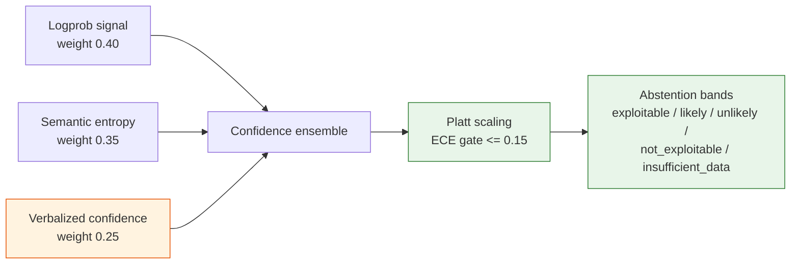

# Confidence Calibration

## Summary

How an assessment's `confidence_score` is produced, calibrated, and turned into a verdict label or abstention. Owner: Engineering. Status: canonical. Gate: 1.

## Executive Summary

Confidence is a three-signal ensemble — mean top-1 logprob (0.40), semantic entropy (0.35), verbalized confidence (0.25) — deliberately not verbalized confidence alone, because RLHF rewards confident-sounding responses over accurate uncertainty, making stated confidence the weakest signal on its own. The ensemble is Platt-scaled and gated by an ECE (expected calibration error) threshold of <=0.15 on a golden-set holdout of n>=50; without an active `CalibrationRecord` meeting that bar, the runtime returns `CALIBRATION_MISSING` and raises a P2 alert rather than serving an uncalibrated score. A power analysis (resolving OI-21) confirms the n>=50 holdout floor is already above the 40-60 samples statistically required for a 2-parameter Platt fit across 2 outcome classes — with the 20% theoretical-exploit-maturity stratum (n≈50) sitting exactly at that floor, making it the first stratum to watch for calibration instability.

## Specification

### Three-signal ensemble

| Signal | Weight | When available |
|---|---|---|
| Mean top-1 logprob (claim-bearing tokens) | 0.40 | when the API exposes logprobs |
| Semantic entropy (meaning-clustered completions) | 0.35 | always, multi-sample max 3 |
| Verbalized confidence (structured output) | 0.25 | always |

When logprobs are unavailable, entropy/verbalized renormalize to 0.54/0.46.

### Platt scaling and abstention

`CalibrationRecord` (global): `model_version`, `prompt_version`, `platt_params`, `brier_score`, `ece`, `training_set_size`, `active`. ECE gate <=0.15 enforced by `pnpm test:calibration --ece-threshold 0.15`.

| Calibrated confidence | Label | Human review |
|---|---|---|
| [0.85, 1.00] | `exploitable` | if a critical asset |
| [0.70, 0.85) | `likely` | always (HITL queue) |
| [0.40, 0.70) | `unlikely` | always (HITL queue) |
| [0.00, 0.40) | `not_exploitable` | if a critical asset |
| Uncertain | `insufficient_data` | always |

This table governs review of the *analysis verdict*, separate from write-action approval — write actions execute unattended by default per [[Kill Switch]]; these bands still route critical-asset verdicts and abstentions to human review.

### Critic rules (rule-based from Month 1; ML critic shadow from seed)

| Rule | Check | Severity |
|---|---|---|
| Schema compliance | Zod against `assessmentSchema` | Blocking |
| Confidence in range | value present in 0.0-1.0 | Blocking |
| Prerequisite consistency | no affected assets => conclusion cannot be `exploitable` | Blocking |
| Source traceability | reasoning references permitted sources only | Escalation |
| Self-contradiction | no X and not-X in the same chain | Escalation |
| Tool result injection | matched against fixture patterns, CI last-pass | Escalation |

### Sample-size power analysis (resolves OI-21)

Platt scaling fits 2 parameters over a 1-D logistic regression. Standard practice (Peduzzi et al. events-per-variable heuristic) requires 10-15 held-out samples per parameter per outcome class — for 2 parameters x 2 classes, a floor of 40-60 samples overall, already below the existing n>=50 ECE-gate holdout. The golden set's CVSS-decile stratification (~25 CVEs/bin, crossed with environment fixtures) comfortably clears this floor. The binding constraint is exploit-maturity stratification (30% functional / 50% PoC / 20% theoretical of 250 ≈ 75/125/50) — the 20% theoretical stratum (n≈50) sits at the floor exactly, making it the first stratum to watch.

**Re-sampling schedule:** re-fit whenever `model_version` or `prompt_version` changes (already required, `CalibrationRecord` is keyed on both), plus quarterly regardless, to catch distribution drift in incoming CVEs. A stratum whose Brier score regresses more than 10% between fits triggers a targeted re-sample rather than a full 250-case re-collection.

## Diagram

## Entities & Concepts

- [[Dux Taxonomy and Controlled Vocabulary]] — public API projection of these labels
- [[Data Model]] — `CALIBRATION_RECORD` and `EXPLOITABILITY_ASSESSMENT.confidence_score`

## Related

- [[AI Safety Overview]]
- [[Exposure Analysis]]

## Sources

- `.raw/dux/40-ai-safety/confidence-calibration.md`
