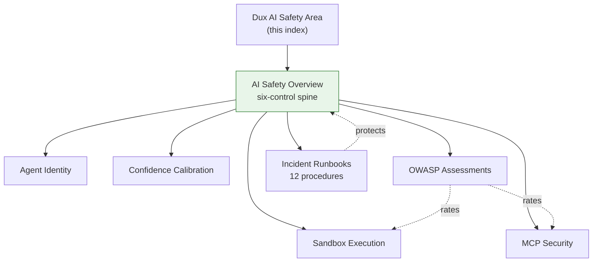

# Dux AI Safety Area

## Scope

Everything under `40-ai-safety/` in the Dux corpus: the safety spine, agent identity, MCP security policy, sandbox execution, confidence calibration, OWASP assessments, and incident runbooks. **In scope:** safety-overview.md, agent-identity.md, confidence-calibration.md, sandbox-execution.md, mcp-security.md, owasp-assessments.md, incident-runbooks.md. **Out of scope, reused by reference:** [[CaMeL]], [[Governance Kernel]], [[Kill Switch]], which live as concepts in `wiki/resources/concepts/` because they're referenced from product, architecture, and safety areas alike.

## Standards

**Owner:** Security for all files except confidence-calibration.md and sandbox-execution.md-adjacent architecture pieces (Engineering).

**The AI Safety Lead holds 60-second halt authority and cannot be merged with the Incident Commander role** — see [[AI Safety Incident Runbooks]].

## Reference material

- [[AI Safety Overview]] — the six-control safety spine, defense-in-depth L1-L8
- [[Agent Identity]] — JWT/SPIFFE identity, credential lifecycle, shadow AI
- [[Confidence Calibration]] — three-signal ensemble, Platt scaling, abstention bands
- [[Sandbox Execution]] — self-hosted Firecracker, AST pre-scan
- [[MCP Security]] — PS-001-016, six defense layers, write-tool catalog
- [[OWASP Assessments]] — ASI01-10, LLM01-10, MCP Top 10 crosswalk
- [[AI Safety Incident Runbooks]] — the twelve canonical procedures

## Diagram

## Review cadence

Weekly, or quarterly for OWASP re-assessment / any MCP-catalog change.
