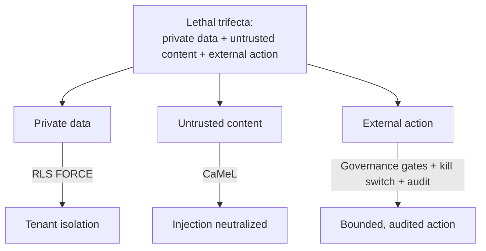
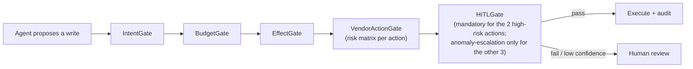
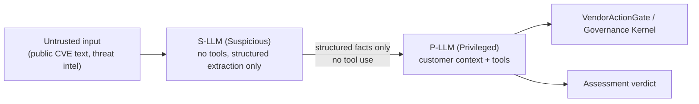
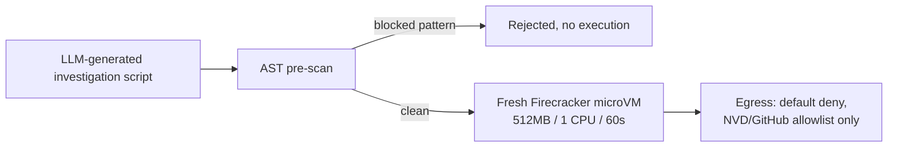

# Dux AI Safety Guide

Navigation: [[Dux]] | [[Dux AI Safety Operations Reference]] | [[Dux Architecture Guide]]

## The problem this guide solves

Any agent that reads private customer data, ingests untrusted content, and can act externally holds all three legs of what the security community calls the "lethal trifecta." Dux's agents hold all three by design: they read a customer's private asset inventory, they ingest CVE text and exploit write-ups that anyone on the internet can shape, and (for three of five possible actions) they can act against a customer's own vendor APIs without waiting for a human. An agent holding all three legs is a lateral-movement vector: prompt-inject it successfully, and the attacker inherits every credential and network path the agent holds.

That framing is why this guide exists as its own document, not a subsection of the product spec. Because three of five vendor write actions execute unattended by default at Gate 1, human review is reserved for anomaly escalation, not a checkpoint on every action. That means the safety spine described below, not a person, is the primary defense for those three actions. The two highest-blast-radius actions (`endpoint.isolate` and `patch.deploy_special_devices`) stay on mandatory human approval for every call until each earns unattended execution through a field-proven safety record.

There's a second framing worth holding alongside the first: Dux is a credential honeypot by design. Every write action it markets executes against a customer's own CrowdStrike, Intune, or ServiceNow instance, using credentials Dux itself holds. A platform compromise is therefore equivalent to write access across every connected customer's EDR, cloud, and ITSM simultaneously. That's precisely why the mitigations below treat credential handling as seriously as they treat the reasoning loop itself.

## The six-control safety spine

Every agent surface in the product inherits all six of these, with no exceptions:

| Control | What it guarantees |
|---|---|
| RLS-forced tenant isolation | No cross-tenant read or write is reachable, even by a fully compromised agent |
| CaMeL dual-LLM boundary | Untrusted content never reaches a tool-calling context |
| MCP gateway | Deny-by-default tool access |
| Kill switch (KS-L1 – KS-L4) | Halt propagates in under 5 seconds, tenant-scoped |
| Hash-chained audit | Every action is recorded and tamper-evident |
| AI-BOM in CI | Supply chain stays pinned; drift is blocked at merge |

Layered on top of the spine, an eight-layer defense-in-depth model maps each layer to the specific agentic-risk categories it addresses:

| Layer | Control | Addresses |
|---|---|---|
| L1 Input containment | CaMeL dual-LLM split | Goal hijack, memory poisoning |
| L2 Structured output | Constrained decoding | Goal hijack, context poisoning |
| L3 Tool contracts | MCP hash pinning + schema validation | Tool misuse, supply chain |
| L4 Identity | JWT/SPIFFE claims | Identity & privilege abuse |
| L5 Execution isolation | Self-hosted Firecracker microVM + AST pre-scan | Unexpected code execution, rogue agents |
| L6 Governance gates | Intent + Budget + Effect + DLP kernel | Nearly every category at once |
| L7 Audit | HMAC-SHA256 hash chain, hourly anchoring | Human-agent trust exploitation |
| L8 Kill switch | Sub-5-second propagation, tenant-scoped | Rogue agents |

### Credential-honeypot mitigations

Because a platform compromise means vendor-wide blast radius, credential handling gets its own dedicated discipline: least-privilege scoped action credentials per connector, limited strictly to the five canonical write actions and never a broad admin grant; per-action short-lived credential minting wherever a vendor supports it, and AES-256-at-rest via Vault transit encryption everywhere else. The worst case per tenant is bounded by construction: the canonical action set on connected assets only, bounded further by the governance kernel's budget and effect gates, the kill switch, and the hash-chained audit trail. Replay of an already-approved action is countered by idempotency keys plus audit anchoring, so replaying a captured request can't duplicate its effect.

### Where Dux stands at Gate 1

OWASP LLM and Agentic assessments sit at Partial or better across the board. ASI01 (goal hijack) and ASI02 (tool misuse) are fully Implemented; ASI10 (rogue agents) is Partial-or-better, with the kill switch and cost cap already Implemented and eBPF-based enforcement deferred to Series A. LLM01 (prompt injection), LLM06 (excessive agency), and LLM10 (unbounded consumption) are Implemented. **LLM09 (misinformation) is the one Gate-1 blocker**: closed by a citation-resolution test described in [[Dux AI Safety Operations Reference]].

## The Governance Kernel: the gate every privileged action passes through

The governance kernel is a synchronous chain of thirteen gates (`GOV-001` through `GOV-013`), evaluated in full before any privileged agent action executes: this is the mechanism that's actually supposed to make an unattended-by-default write path safe, not just a policy statement that it is. Each gate is a Chain-of-Responsibility handler that returns `continue`, `block`, or `escalate`, and there is no bypass path anywhere in Phase 1. A `KillSwitchRelay` check runs *before* the chain even starts: an active L3-or-higher kill switch returns a 503 without evaluating a single gate.

| Gate | Checks | On failure |
|---|---|---|
| GOV-001 Intent | Action matches the assessment plan's allowed tool sequence, target CVEs, and step ceiling | `GOVERNANCE_BLOCKED` |
| GOV-002 Budget | Token and cost limits per tenant/session | `BUDGET_EXCEEDED` (escalates to P0 if over 3x baseline) |
| GOV-003 ActionBudget | Per-assessment weighted action count: warns above 100, halts at 200+ | Warning or halt |
| GOV-004 WorkflowTenantBudget | Daily cap by plan: Starter 500, Professional 5,000, Enterprise floor 50,000 | `WORKFLOW_TENANT_BUDGET_EXCEEDED` |
| GOV-005 WorkflowCircuitBreaker | Tenant exceeds 2x its rolling 7-day baseline actions/hour | L2 kill switch, banner within 15 minutes |
| GOV-006 CostForecast | Forecasts cost before starting; re-forecasts every 25 actions or on a 50% asset-count jump | `COST_FORECAST_EXCEEDED` |
| GOV-007 CostCap | Hard per-tenant spend cap, $25/hour default, checked before every LLM call | L2 kill switch |
| GOV-008 Effect | Tool side effects stay within tenant scope; blast tiers scale from single-asset up to tenant-wide | Block + audit |
| GOV-009 DLP | Regex-based redaction, upgrading to NER-based detection once false positives drop below 5% | Redact or block |
| GOV-010 Loop | Max 50 reasoning iterations per assessment, max 10 tool calls per iteration | `GOVERNANCE_BLOCKED` |
| GOV-011 PromptScreen | The trusted user prompt is screened before the privileged reasoning step ever plans against it | `PROMPT_SCREEN_BLOCKED` |
| GOV-012 OutputAudit | Untrusted-tier output is scanned for instruction leakage before it reaches the privileged tier | `OUTPUT_AUDIT_BLOCKED` |
| GOV-013 TieredRisk | A tool's blast-radius tier must match the session's risk tier | `TIERED_RISK_BLOCKED`, tiered HITL |

Cost thresholds evaluate in a fixed order, first match wins: a $0.675-per-assessment soft breaker, then the $25/hour hard cap, then the 2x-baseline circuit breaker. Latency stays tight by design (sequential p99 under 75ms total in the initial rollout, with DLP itself under 5ms) because a governance check that's slow enough to notice is a governance check someone will eventually route around.

### GOV-014: VendorActionGate, the fourteenth and most consequential gate

Sitting downstream of the thirteen synchronous gates is `VendorActionGate`: effectively GOV-014, specified separately because it's the gate that actually authorizes a vendor-facing write. It carries a risk matrix with one row per canonical write action, each row specifying a consequence scope, a reversibility class, an unattended-execution confidence floor, and the HITL tier the action falls back to if that floor isn't met. Connectors are never permitted to call a vendor's mutation API directly: every write, without exception, passes through this gate first.

One invariant is worth calling out because it constrains all future extension of this gate, not just today's five actions: **no future risk-matrix row may allowlist a write action that disables or weakens MFA, logging, encryption, or audit, whether on the target system, on Dux's own control plane, or on the action's own audit trail.** A proposed action that trips this rule never reaches `continue`, the same way an action with a missing rollback entry never does, and no new row can land without a passing test proving it respects the invariant.

The write path shipped unattended-by-default at Gate 1 on the premise that this gate chain would make it safe: the chain itself was formally specified only after that premise was already live, closing a real operational gap rather than a hypothetical one. Today, the gate chain, the kill switch, least-privilege credentials, hash-chained audit, and blast-radius tiering together carry the safety burden that a mandatory human-approval step used to backstop before the write path was re-gated to unattended-by-default.

## The kill switch: the emergency override

Four escalating levels, on two distinct propagation paths that are never conflated: KS-L2 through KS-L4 relay over NATS core pub/sub at under 5 seconds at p99, while KS-L1 rides a separate Unleash feature-flag path at up to 30 seconds:

| Level | Scope | Propagation |
|---|---|---|
| KS-L1 | Single-action halt | Separate Unleash path, ≤30s |
| KS-L2 | Tenant-scope freeze: this is what a budget breach triggers | NATS pub/sub, <5s p99 |
| KS-L3 | Broader tenant-level halt (e.g., tenant suspension, a compromised resident agent) | NATS pub/sub, <5s p99 |
| KS-L4 | Platform-wide halt | NATS pub/sub, <5s p99 |

The kill switch is the primary compensating control for the unattended-by-default write path: alongside the governance kernel, least-privilege credentials, and hash-chained audit, it replaces the mandatory human-approval step that used to gate every write before that path was re-gated. A concrete trigger example: a per-tenant sandbox budget breach (above 300 sandbox-seconds/hour or 5 concurrent microVMs) fires an L2 freeze automatically. Any L2/L3/L4 activation for a tenant or session also populates a short-TTL JWT denylist, forcing re-authentication before that tenant's sessions can resume.

## CaMeL: the dual-LLM boundary that neutralizes prompt injection

**CaMeL** (never "camel-plane" outside internal docs) is the answer to a specific, unavoidable problem: an agent that reads adversary-controlled CVE text and also holds tool access to a customer's environment is a textbook prompt-injection target. CaMeL's dual-LLM split makes injected instructions structurally unable to reach a tool-calling context, rather than relying on a classifier to catch them after the fact.

The **S-LLM (Suspicious)** tier ingests untrusted public text and has no tool access at all: it produces only structured, schema-validated facts, and raw CVE text never crosses the boundary into the next tier. The **P-LLM (Privileged)** tier receives only those structured facts plus legitimate customer/asset context, and it's the only tier with tool access. If the S-LLM's output fails schema validation repeatedly, the system doesn't silently keep retrying: after retries exhaust, it resolves to a governance block and an L1 kill switch rather than letting malformed output anywhere near the privileged tier.

Two invariants extend this discipline beyond the reasoning loop itself. First, a data-residency rule: until Zero Data Retention is contractually in place with both LLM providers, the S-LLM must never receive customer-identifying context. This is treated as a hard data-residency invariant, not merely an injection defense. Second, the same schema-validated, no-free-text discipline extends to Agentic RAG retrieval: every retrieve/reason/decide step is forced through constrained tool-use output, so there's no free-text surface anywhere in the loop for a hallucination or an injected instruction to hide inside.

Two evaluation numbers exist for this boundary and are never conflated in customer-facing copy: the CaMeL+ research paper's own benchmark reports 67% task completion under a strict untrusted-data policy (the enterprise-hardening baseline), while Dux's own CI target is roughly 77% defended versus 84% undefended. That second figure is a defense-layer uplift measurement, not a raw completion rate. Any customer-facing citation of either number has to say which one it means.

## Sandbox execution: where investigation code actually runs

Every LLM-generated investigation script runs inside a fresh, self-hosted Firecracker microVM on Kubernetes, never reused across invocations: VM reuse is itself treated as a data-leak vector. This shipped at Gate 1, accelerated from an original Gate-2/3 timeline, and it fully retires an earlier managed-microVM approach rather than keeping it as a fallback.

The underlying reasoning is blunt: shared-kernel containers are not a security boundary for AI-generated code. Named escape vulnerabilities (the "Leaky Vessels" runc CVE among them) and published sandbox-escape benchmarks demonstrate real escapes under adversarial LLM-generated code, so gVisor is acceptable only as read-only defense-in-depth for non-script tool containers: never for actually executing a script. And the microVM boundary itself isn't treated as CVE-immune either: two Firecracker escapes are on record for 2026, which is exactly why patch cadence is an active, ongoing control rather than a one-time hardening pass. A newly disclosed hypervisor-class CVE is treated as a kill-path rehearsal trigger, and if patching lags behind disclosure, the on-call safety lead is expected to exercise the emergency no-op sandbox adapter rather than wait it out.

Before any script reaches the microVM, an AST pre-scan pipeline walks the parsed script against a blocked-pattern ruleset: process spawning, `eval`/`Function` construction, and filesystem/network primitives beyond a narrow allowlist are all rejected outright, with the script never executed and an audit record written regardless. Inside the microVM itself: a read-only filesystem, 512MB/1 CPU, a 60-second wall-clock limit, and default-deny network egress with only NVD and GitHub allowlisted (no cloud metadata endpoints unless a tenant explicitly opts in). A per-tenant budget of 300 sandbox-seconds per hour and 5 concurrent microVMs is enforced by the budget gate: a breach raises the same `budget_exceeded` signal that trips an L2 kill switch elsewhere in the stack.

An assessment can never silently complete with an `exploitable` verdict on missing execution: a sandbox timeout or out-of-memory failure on a strong verdict routes straight to mandatory human review rather than being treated as a pass.

## MCP security: the tool-calling boundary

Every MCP tool is registered in the AI Bill of Materials and in the gateway itself with a SHA-256 schema pin, re-validated before each invocation and auto-disabled on any drift. The tenant ID a tool call operates under is always injected from the agent's own JWT: it is never accepted as a caller-supplied parameter, closing off an entire class of confused-deputy attack before it can start.

Six defense layers apply to every tool call in sequence:

| Layer | Focus |
|---|---|
| L1 Auth & identity | Short-lived, per-agent JWT |
| L2 Schema integrity | SHA-256 pins, re-validated before every invocation |
| L3 I/O sanitization | JSON Schema validation, sub-5ms regex-based data-loss prevention, an SSRF allowlist |
| L4 Network egress | Gateway-only egress with host validation |
| L5 Observability | Hashed I/O logged to SIEM, 730-day retention |
| L6 Multi-server isolation | Each MCP server sits in its own security domain |

Every tool is rate-limited per tenant and per session and hash-pinned with a sub-2ms cache-backed integrity check. A circuit breaker trips on over 50% tool errors in a 5-minute window (or p99 latency above 2 seconds), returns 503s for a 60-second cooldown, and auto-closes after 5 minutes of stable metrics.

### The write-tool catalog: the five actions that touch a customer's environment

| Tool | Vendor | HITL posture |
|---|---|---|
| `endpoint.isolate` | CrowdStrike | Mandatory human approval, every call |
| `network.blocklist_add` | CrowdStrike | Unattended by default; drops to mandatory review below a 0.75 confidence floor |
| `policy.deploy_device_config` | Intune (Gate 3) | Unattended once shipped; same 0.75 confidence floor |
| `patch.deploy_special_devices` | none pinned | Mandatory human approval: firmware-only devices have no API-level rollback |
| `ticket.create_remediation` | ServiceNow | Unattended, the lowest blast-radius tier, no confidence floor at all |

Beyond the write path, a smaller read-only research catalog (NVD search, GitHub search, ExploitDB search, threat-intel search, Microsoft Security Response Center search, plus asset/control queries) covers the evidence-gathering side of an investigation: each with its own rate limits and a documented attack story it defends against, from CVE-text hijacking to SSRF via a repository URL. Two tool-risk classes stay fully prohibited in Phase 1 regardless of use case: arbitrary external/code-execution tools, and anything touching financial systems.

## Where to go next

- [[Dux AI Safety Operations Reference]]: agent identity, confidence calibration, OWASP maturity ratings, and the twelve incident runbooks
- [[Dux Architecture Guide]]: the infrastructure this safety spine runs on
- [[Dux Feature Reference]]: the product-facing write surfaces this spine protects

## Sources

- `.raw/dux/40-ai-safety/safety-overview.md`
- `.raw/dux/40-ai-safety/governance-kernel.md`
- `.raw/dux/40-ai-safety/kill-switch-hitl.md`
- `.raw/dux/40-ai-safety/camel-plane.md`
- `.raw/dux/40-ai-safety/sandbox-execution.md`
- `.raw/dux/40-ai-safety/mcp-security.md`
- `.raw/dux/20-architecture/adr-index.md`
- `.raw/dux/00-meta/decisions-log.md`
- `.raw/dux/20-architecture/architecture-diagrams.md`
