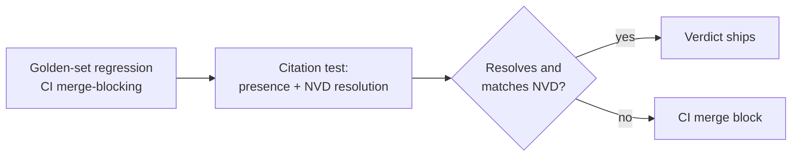

# Dux AI Safety Operations Reference

Navigation: [[Dux]] | [[Dux AI Safety Guide]] | [[Dux Operations Guide]]

Where [[Dux AI Safety Guide]] covers the safety architecture itself (the gates, the kill switch, the dual-LLM boundary) this page covers the operational layer running on top of it: how an agent proves who it is, how confident an assessment is allowed to sound, how the whole system is scored against industry standards, and what actually happens when something goes wrong.

## Agent identity: who's acting, and how we know

Phase 1 authenticates agents with JWTs carrying SPIFFE-format claims (`spiffe://dux.io/tenant/{tenant_id}/agent/{agent_id}`), with full SPIFFE/SPIRE X.509 certificates targeted for a Month-3 proof of concept. The credential model matures in three stages: pre-seed runs on a session JWT plus an API key; seed/Gate-2 adds OAuth client credentials; post-seed moves to mTLS with SPIRE-issued certificates rotating every 90 days.

One boundary is absolute and worth stating precisely: **a Public Data API key can never authenticate an MCP tool call or a `POST /v1/agents` request, regardless of what scopes it carries.** Data-plane and control-plane credentials are different families by construction, not by convention.

### Lifecycle

- **Creation** requires a platform-admin JWT calling `POST /v1/agents`; the default agent type is `supervised`, and creation is always audited.
- **Rotation** caps an agent at two active credentials at once (one API key, one session-JWT issuer, never two keys with different scopes simultaneously), with a 24-hour grace period before the old credential is revoked.
- **Suspension** fires an L2 kill switch, blocks new session credentials, and terminates existing sessions: but it's reversible without regenerating credentials. Suspending a physical-residency agent can escalate as far as L3.
- **Revocation** is permanent: status flips to `revoked`, every session terminates, and the `agent_id` itself is never reused: it's tombstoned. Decommissioning purges cached credentials, anonymizes PII once retention expires, and opens an AI-BOM removal ticket.
- **Autonomous approval:** moving an agent to `max_autonomy: autonomous` requires an explicit tenant-admin approval call: it's never a default an agent can grant itself.

### Shadow AI detection

A daily job compares the set of declared agents against what's actually observed in MCP request headers and session-start audit records. Any undeclared drift triggers P0-B containment on a strict clock: one hour to investigate, four hours to contain. Behavioral baselines back this up continuously: assessment agents are expected to run 2–8 requests/minute with a roughly 60/30/10 split across asset queries, assessment runs, and other tool calls, output tokens in the 800/2,400 p50/p95 range, and a cache-hit rate of 80–95%. A 2-sigma deviation from that baseline raises an automated anomaly alert.

### Authorization and audit

An agent can never self-escalate its own privileges, and cross-tenant access is refused at the credential-validation layer before a request gets anywhere near business logic. Every action's audit record carries the agent ID, tenant ID, credential ID, session ID, the action itself, a timestamp, and a request ID: retained for 2 years to satisfy GDPR records-of-processing requirements. The audit log itself is append-only with an HMAC-SHA256 hash chain, and verification uses a server-held key specifically so that a compromised database writer can't forge a valid chain after the fact.

## Confidence calibration: how sure is "sure"

Every exploitability verdict carries a confidence score, and that score is deliberately *not* the model's own stated confidence taken at face value: RLHF training rewards confident-sounding responses over accurate uncertainty, which makes verbalized confidence the weakest signal available on its own. Instead, confidence comes from a three-signal ensemble:

| Signal | Weight | Available when |
|---|---|---|
| Mean top-1 logprob on claim-bearing tokens | 0.40 | Only when the model API exposes logprobs |
| Semantic entropy across meaning-clustered completions | 0.35 | Always |
| Verbalized confidence (structured output) | 0.25 | Always |

When logprobs aren't available, the remaining two signals renormalize to 0.54/0.46. The blended ensemble is Platt-scaled and gated by an expected-calibration-error threshold of 0.15 or better on a golden-set holdout of at least 50 samples: and if no calibration record currently meets that bar, the runtime returns a hard `CALIBRATION_MISSING` error and raises an alert rather than quietly serving an uncalibrated score to a customer.

A dedicated power analysis confirms that 50-sample floor is statistically sound: Platt scaling fits two parameters over a one-dimensional logistic regression, and standard practice calls for 10–15 held-out samples per parameter per outcome class: 40 to 60 samples overall for two parameters across two classes, comfortably at or below the existing floor. The golden set's stratification by exploit maturity (roughly 30% functional exploit, 50% proof-of-concept, 20% theoretical, out of 250 total cases) means the theoretical-maturity stratum sits at almost exactly that 50-sample floor: making it the first place to watch for calibration instability as the golden set evolves. Recalibration is triggered by any model or prompt version change, plus a standing quarterly refresh to catch distribution drift in incoming CVEs; a stratum whose Brier score regresses more than 10% between fits triggers a targeted re-sample rather than a full 250-case re-collection.

### From score to verdict

| Calibrated confidence | Verdict label | Human review |
|---|---|---|
| 0.85 – 1.00 | `exploitable` | Only if it's a critical asset |
| 0.70 – 0.85 | `likely` | Always queued for review |
| 0.40 – 0.70 | `unlikely` | Always queued for review |
| 0.00 – 0.40 | `not_exploitable` | Only if it's a critical asset |
| Uncertain | `insufficient_data` | Always queued for review |

This table governs review of the *analysis verdict* specifically: it's a separate concern from write-action approval, which follows the earned-autonomy model in [[Dux AI Safety Guide]]. A verdict can require human review under this table even when the write action it might trigger is on the unattended-by-default path.

### Critic rules that gate every reasoning chain

A rule-based critic runs from Month 1, with an ML-based critic joining in shadow mode from Seed onward:

| Rule | What it checks | Severity |
|---|---|---|
| Schema compliance | Output validates against the assessment schema | Blocking |
| Confidence in range | Value falls between 0.0 and 1.0 | Blocking |
| Prerequisite consistency | No affected assets means the conclusion can't be `exploitable` | Blocking |
| Source traceability | Reasoning only cites permitted sources | Escalation |
| Self-contradiction | No claim and its negation coexist in the same chain | Escalation |
| Tool-result injection | Output checked against known injection fixture patterns | Escalation |

## OWASP maturity: how Dux scores against industry standards

Dux tracks against the current OWASP Top 10 for Agentic Applications (published December 2025) rather than an older or generic label: a distinction that matters because the agentic-specific list captures failure modes (goal hijack, tool misuse, rogue agents) that a generic LLM Top 10 doesn't.

### Agentic risks (ASI01–10)

| Risk | Maturity | Residual risk |
|---|---|---|
| ASI01 Agent Goal Hijack | Implemented | Low |
| ASI02 Tool Misuse | Implemented | Low–Medium |
| ASI03 Identity & Privilege Abuse | Partial | Medium |
| ASI04 Agentic Supply Chain | Partial | Medium |
| ASI05 Unexpected Code Execution | Partial | Medium |
| ASI06 Memory & Context Poisoning | Partial | Medium |
| ASI07 Insecure Inter-Agent Comms | Planned | Low: single-agent architecture in Phase 1 |
| ASI08 Cascading Failures | Partial | Medium |
| ASI09 Human-Agent Trust Exploitation | Partial | Medium–High |
| ASI10 Rogue Agents | Partial (kill switch and cost cap already Implemented) | Low |

### LLM risks (LLM01–10)

| Risk | Maturity | Gate-1 blocker? |
|---|---|---|
| LLM01 Prompt Injection | Implemented | No |
| LLM02 Sensitive Info Disclosure | Partial in weeks 1–10 (regex) → Implemented from week 11 (Presidio) | No |
| LLM03 Supply Chain | Partial → Implemented after the week-8 pin gate | No |
| LLM04 Data/Model Poisoning | Implemented | No |
| LLM05 Improper Output Handling | Partial → Implemented at week 9 (schema pins) | No |
| LLM06 Excessive Agency | Implemented | No |
| LLM07 System Prompt Leakage | Partial (seed red team) | No |
| LLM08 Vector/Embedding Weaknesses | Implemented | No |
| **LLM09 Misinformation** | Partial → Implemented at Gate 1 | **Yes** |
| LLM10 Unbounded Consumption | Implemented | No |

**LLM09 is the single Gate-1 blocker across the entire safety program**, closed by a CI-enforced citation test: any `exploitable`/`likely` claim whose citation doesn't resolve against NVD, or whose CVSS score or description diverges from the resolved record, fails the build. That test exists because "citation-first" is itself an attack surface: a poisoned repository or write-up surfaced as a citation delivers attacker-controlled content wrapped in Dux's own authority. The mitigation is a combined domain-and-integrity allowlist: every citation carries a fetched-content hash and a source-reputation flag, and citations to mutable sources like a GitHub README or a Medium post are explicitly labeled unverified-third-party rather than presented with NVD-grade authority.

### MCP-specific risks (selected)

| Risk | Maturity (pre-seed) |
|---|---|
| Tool poisoning | Implemented |
| SSRF / egress | Implemented |
| Confused deputy | Partial |
| Supply chain | Partial |

### The remediation calendar

| When | What lands |
|---|---|
| Week 8 (Gate 2) | Self-hosted Firecracker fully operational; HITL API live |
| Week 11 | NER-based DLP (Presidio) replaces regex-only |
| Month 3 | SPIRE proof of concept for ASI03 |
| Seed | Red-team exercise; ECDSA message signing; vector-poisoning controls |
| Series A, Month 9 | eBPF-based syscall filtering for ASI10 |

## The twelve incident runbooks

Every runbook shares the same twelve-section template (trigger, service catalog, business impact, user impact, system/agent boundary, incident roles, pre-conditions, automation gate, execution steps, an eight-item AI-safety check, verification, and post-incident review) and every incident, regardless of type, runs the same eight-item safety check before it's considered closed: agent loop under 50 iterations, a clean tool diff, passing prompt-injection tests, a drained HITL queue, zero cross-tenant references, zero undeclared shadow AI, a valid AI-BOM, and a confirmed cost-cap state.

One structural rule sits above all twelve runbooks: **the AI Safety Lead holds 60-second halt authority, and that role can never be merged with the Incident Commander role.** It's a deliberate separation of powers: the person with unilateral halt authority is never the same person managing the broader incident response.

| # | Runbook | Severity | Trigger | Core containment |
|---|---|---|---|---|
| R1 | Cross-tenant context leak | P0-C | Any foreign-tenant reference detected, plus isolation SLO burn ≥5%/hour | Platform-wide containment, 60-second agent halt, counsel engaged if PII involved |
| R2 | Token cost runaway | P0-C/P1 | Spend over 3x the 7-day baseline, or over $25/hr/tenant | Cost-cap enforcement, L2 kill switch, halt the top-spending agent |
| R3 | Model provider outage | P1 | Provider status goes non-operational | Fallback route (under 60s) to the backup model, golden-set spot check, halt if regression exceeds 5% |
| R4 | MCP dependency failure | P2 | MCP tool errors above 50% in 5 minutes | Open the circuit breaker, verify no hallucinated "success" results |
| R5 | Rate-limit cascade | P2 | Simultaneous 429s from both model and customer side | Jittered backoff, halt the runaway agent, escalate the provider quota |
| R6 | Context window exhaustion | P2 | Hits the 128K token ceiling | Checkpoint at 80%, abandon at 100%, halt any retry loop |
| R7 | Prompt cache invalidation | P2 | Cache hit rate drops over 15% in 5 minutes | Identify the deploy or pin that caused it, roll back or re-warm the cache |
| R8 | Hallucinated CVE citation | P1 | The citation test fails at generation time | Quarantine the verdict, re-verify against NVD |
| R9 | Alert fatigue | P2 | HITL backlog with a rubber-stamp approval pattern above 95% | Separate mandatory-review queues from anomaly-only queues, consider a time-boxed confidence-floor raise |
| R10 | Memory / context poisoning | P1 | A spike in output-audit failures | 60-second agent halt, context audit, isolate the suspect connector |
| R11 | Coordination overhead | P2 | Assessment latency regresses with loop counters still within limits | Trace the workflow, batch or cache redundant tool calls |
| R12 | Prompt brittleness | P2 | Golden-set regression over 2%, traced to a prompt or schema edit | Roll back the pinned prompt, re-run the golden set |

### R1 in full: the P0-C exemplar

Cross-tenant context leak is the highest-severity runbook in the set, and its execution sequence is worth walking through once as the template for how seriously a P0-C is actually treated: discover every active agent involved → halt within 60 seconds → run a post-hoc context audit (a known detection-latency tradeoff, this is not real-time) → export the session evidence for the record → engage legal counsel immediately if PII is involved, since that starts a GDPR 72-hour disclosure clock → root-cause and fix → run a full isolation test suite → get product-management sign-off before any customer notification goes out → only then release the platform-wide containment. The business-impact calculation is standardized too: monthly recurring revenue, times the fraction of tenants affected, times hours affected divided by hours in a month.

### A few runbooks worth knowing by their reasoning, not just their trigger

**R2 (cost runaway)** evaluates thresholds in a fixed order (the $0.675 per-assessment soft breaker first, then the $25/hour hard cap, then the 2x-baseline circuit breaker) and requires spend to fall back below 1.5x baseline *before* the kill switch is released, not merely below the trigger threshold, to avoid immediately re-tripping.

**R9 (alert fatigue)** is really a calibration problem wearing an incident's clothes: the runbook's job is to separate the two mandatory-HITL actions, which are never paused or floor-adjusted under any circumstance, from the three anomaly-escalation-only actions, which are eligible for a time-boxed, fully logged confidence-floor adjustment. The root-cause question every time is the same: is this a genuine incident, or a threshold that needs tuning? R12 (prompt brittleness) asks the same underlying question from the opposite direction.

**R3b (model deprecation)**, unlike the other eleven, is a planned hardening item rather than an incident trigger: it exists because LLM provider models are dependencies with real end-of-life dates (some consumer-surface models have been retired on as little as two weeks' notice), and because a passing schema-parity check alone doesn't catch quality drift: published 2026 research documented a model migration where a zero-regression schema gate coexisted with a 15.7% output-quality shrinkage. Any future model migration evaluation has to include the golden set plus explicit output-length, latency, and tier-failure deltas, not schema conformance alone.

## Sources

- `.raw/dux/40-ai-safety/agent-identity.md`
- `.raw/dux/40-ai-safety/confidence-calibration.md`
- `.raw/dux/40-ai-safety/owasp-assessments.md`
- `.raw/dux/40-ai-safety/incident-runbooks.md`
