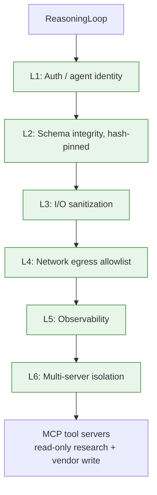

# MCP Security

## Summary

MCP server registration, tool invocation, and resource-access policy (PS-001-016) across six defense layers. Owner: Security. Status: canonical. Gate: 1. Decisions: D-4, D-17.

## Executive Summary

Every MCP tool is registered in the AIBOM and the gateway with SHA-256 schema pins; `tenant_id` is injected from the agent JWT and is never accepted as a tool parameter. Five canonical write actions route through `VendorActionGate`: three (`network.blocklist_add`, `policy.deploy_device_config`, `ticket.create_remediation`) execute unattended by default with human review reserved for anomaly escalation, and two (`endpoint.isolate`, `patch.deploy_special_devices`) require mandatory HITL on every call (D-17) until each earns unattended execution via a field-proven Gate-3 safety record. Connectors themselves must never call vendor mutation APIs directly — every write is gated. Credential isolation is deliberately row-scoped rather than path-scoped: all tenants' connector credentials sit behind one shared Vault KEK, a cost/ops tradeoff at this stage, with tenant separation enforced by the `tenant_id`-scoped row and `SecretsPort` access control rather than per-tenant key material.

## Specification

### Six defense layers

| Layer | Focus | Policy IDs |
|---|---|---|
| L1 Auth & identity | per-agent short-lived JWT | PS-001, PS-002, PS-005, PS-011 |
| L2 Schema integrity | SHA-256 pins, re-validated before invocation | PS-006, PS-009 (seed) |
| L3 I/O sanitization | JSON Schema, regex DLP <5ms, SSRF allowlist | PS-003, PS-008 |
| L4 Network egress | gateway-only egress, host validation | PS-004 |
| L5 Observability | hashed I/O, SIEM 730-day retention | PS-007 |
| L6 Multi-server isolation | per-server security domain | PS-002, PS-006 |

### Read-only tool catalog

The only tools with defined PS rows today besides the write catalog below. Gateway enforces `min(tenant_limit, session_remaining)`; all tools are hash-pinned with a <2ms p99 cache-backed check.

| Tool | Integration | Rate (tenant/session) | Attack story |
|---|---|---|---|
| `search_nvd(cve_id)` | nvd | 200/50 rpm | hijack via malicious CVE text |
| `search_github(cve_id)` | github-research | 30/15 rpm | SSRF via repo URL |
| `search_exploitdb(cve_id)` | metasploit-index | 30/15 rpm | poisoned module metadata |
| `search_threat_intel(cve_id)` | medium-rss | 20/10 rpm | malicious blog redirect |
| `search_msrc(cve_id)` | microsoft-msrc | 30/15 rpm | spoofed advisory content |
| `query_assets(filters)` | aws | 100/50 rpm, max 50 rows/call, overflow to `summarizeContext` | filter injection |
| `query_controls(asset_id)` | aws | 100/50 rpm | cross-asset enumeration |

### Write-tool catalog

| PS ID | Tool | Connector | Rate (tenant/session) | HITL posture |
|---|---|---|---|---|
| PS-012 | `endpoint.isolate` | crowdstrike | 10/5 rpm | Mandatory HITL T3, every call |
| PS-013 | `network.blocklist_add` | crowdstrike | 20/10 rpm | Unattended default; HITL T2 below 0.75 confidence |
| PS-014 | `policy.deploy_device_config` | intune (Gate 3) | 20/10 rpm | Unattended once shipped; HITL T2 below 0.75 confidence |
| PS-015 | `patch.deploy_special_devices` | none pinned | 10/5 rpm | Mandatory HITL T3 — no API-level rollback on firmware-only devices |
| PS-016 | `ticket.create_remediation` | servicenow | 60/30 rpm | Unattended, lowest blast tier, no confidence floor |

### Key policy statements

- **PS-001 Registration:** explicit tenant-admin registration, no implicit discovery; agents must not invoke unregistered servers.
- **PS-003 Tool invocation:** research tools are egress-DLP'd (no tenant asset identifiers outbound); `query_assets` returns <=50 rows; output secret/PII-scanned at <5ms p99; kill switch checked before every invocation.
- **PS-005 Credentials:** per-agent session JWT, `aud`/`resource` matched to `server_id`; credentials live in Vault, rotated 90 days, never in prompts/logs/telemetry.
- **PS-006 Supply chain:** SHA-256 pin over canonical JSON; `admin:mcp-scan` runs on every registration change, merge-blocking; hash re-validated before every invocation, auto-disabled on drift.
- **PS-009 Message signing (seed):** ECDSA P-256, 128-bit nonce, 5-minute freshness window; pre-seed interim is PS-006 hash-only.

### Gateway circuit breaker

| Property | Value |
|---|---|
| Trip condition | >50% tool errors in 5 min, or p99 latency >2s |
| Cooldown | 60s (503) |
| Automatic close | 5 min of stable metrics |

### Tool risk classes (Phase 1)

Read-only: shipped. Write: shipped, the five ADR-012 R3 canonical actions only. External, Code, Financial: prohibited in Phase 1.

## Diagram

## Entities & Concepts

- [[Governance Kernel]] — `VendorActionGate` this policy feeds into
- [[Mitigation & Remediation Write Path]] — product-facing write-action UX
- [[AI Safety Overview]] — L3 tool-contracts layer

## Related

- [[OWASP Assessments]]
- [[Agent Identity]]

## Sources

- `.raw/dux/40-ai-safety/mcp-security.md`
- `.raw/dux/20-architecture/architecture-diagrams.md` (diagram 6)
