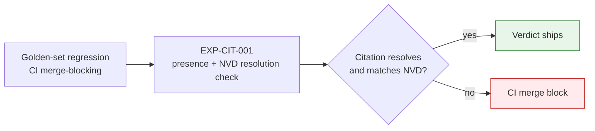

# OWASP Assessments

## Summary

Standing OWASP risk assessments and maturity ratings: Agentic ASI01-10, LLM01-10, MCP Top 10. Owner: Security. Status: canonical. Gate: 1. Decisions: D-21, D-34.

## Executive Summary

The corpus tracks against the current peer-reviewed **OWASP Top 10 for Agentic Applications 2026** (published Dec 2025), not a generic label. **LLM09 (Misinformation) is the single Gate-1 blocker**, enforced by `pnpm test:exposure-citations` (EXP-CIT-001) — a presence-plus-resolution check that fails any `exploitable`/`likely` claim whose citation doesn't resolve against NVD or whose CVSS/description diverges from the resolved record; it is a CI merge block. Two rows were reassessed and moved to Implemented by D-55: LLM04 (Data/Model Poisoning) and LLM08 (Vector/Embedding Weaknesses), now covered by per-edge provenance hashing on the Apache AGE graph and per-row integrity hashing on `tenant_embeddings` — with live adversarial-neighbor testing against the HNSW index remaining a residual execution artifact (OI-59), not a spec gap. ASI02 and ASI09 reflect the D-17 mixed HITL posture directly: governance-kernel gates plus kill switch plus audit are the primary control for the 3 unattended-by-default actions, while mandatory HITL is the primary control for the 2 gated actions.

## Specification

### OWASP Agentic (ASI01-10)

| ID | Risk | Maturity | Residual |
|---|---|---|---|
| ASI01 | Agent Goal Hijack | Implemented | Low |
| ASI02 | Tool Misuse | Implemented | Low-Medium |
| ASI03 | Identity & Privilege Abuse | Partial | Medium |
| ASI04 | Agentic Supply Chain | Partial | Medium |
| ASI05 | Unexpected Code Execution | Partial | Medium |
| ASI06 | Memory & Context Poisoning | Partial | Medium |
| ASI07 | Insecure Inter-Agent Comms | Planned | Low (single-agent in Phase 1) |
| ASI08 | Cascading Failures | Partial | Medium |
| ASI09 | Human-Agent Trust Exploitation | Partial | Medium-High |
| ASI10 | Rogue Agents | Partial (kill switch + cost cap Implemented) | Low |

Pre-seed exit: every applicable row Partial or better; ASI01/ASI02 Implemented; ASI10 Partial or better.

### OWASP LLM (LLM01-10)

| ID | Risk | Maturity | Gate-1 blocker? |
|---|---|---|---|
| LLM01 | Prompt Injection | Implemented | No |
| LLM04 | Data/Model Poisoning | Reassessed Implemented (D-55) | No |
| LLM06 | Excessive Agency | Implemented | No |
| LLM08 | Vector/Embedding Weaknesses | Reassessed Implemented (D-55) | No |
| **LLM09** | **Misinformation** | Partial -> Implemented at Gate 1 | **Yes — EXP-CIT-001** |
| LLM10 | Unbounded Consumption | Implemented | No |

### Citation integrity (H7, Gate-2 hardening)

"Citation-first" is itself an injection surface — a poisoned repository or writeup surfaced as a citation delivers attacker-controlled content carrying Dux's authority. The allowlist is domain **and** integrity: every citation carries a fetched-content hash and a source-reputation flag; citations to mutable sources (GitHub README, Medium post) are labeled unverified-third-party and never presented with NVD-grade authority.

### Remediation calendar (selected)

| When | Items |
|---|---|
| Week 8 (Gate 2) | Self-hosted Firecracker operational; HITL API; LLM03 pin gate |
| Week 11 | LLM02 — Presidio DLP |
| Month 3 | ASI03 — SPIRE proof of concept |
| Seed | LLM07 red team; ASI04 ECDSA; ASI06/LLM04 vector-poison controls |
| Series A Month 9 | ASI10 — eBPF |

### OWASP MCP Top 10 crosswalk (selected)

| MCP risk | Policy IDs | Maturity (pre-seed) |
|---|---|---|
| Tool poisoning | PS-006, PS-003, mcp-scan CI | Implemented |
| SSRF / egress | PS-004, PS-003 | Implemented |
| Confused deputy | PS-005, PS-011 | Partial |
| Supply chain | PS-006, ASI04 | Partial |

## Diagram

## Entities & Concepts

- [[CaMeL]] — ASI01/ASI06 controls
- [[MCP Security]] — MCP Top 10 crosswalk detail
- [[AI Safety Overview]] — the spine these ratings assess

## Related

- [[AI Safety Incident Runbooks]]
- [[Confidence Calibration]]

## Sources

- `.raw/dux/40-ai-safety/owasp-assessments.md`
