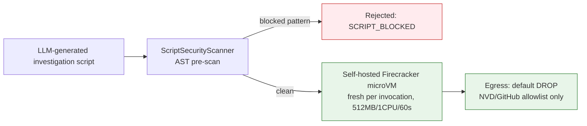

# Sandbox Execution

## Summary

The execution boundary for LLM-generated investigation scripts (ADR-015 R4). Owner: Security. Status: canonical. Gate: 1. Decisions: D-1, D-9, D-33, D-34.

## Executive Summary

Self-hosted Firecracker on Kubernetes ships at Gate 1, accelerated from an earlier Gate-2/3 timeline; the managed-microVM era (E2B default, Modal fallback) is retired outright, not kept as fallback. The core rationale is that shared-kernel containers are not a security boundary for AI-generated code — named escape CVEs (CVE-2024-21626 "Leaky Vessels", CVE-2024-0132) and SandboxEscapeBench demonstrate escape under adversarial LLM code, so gVisor is acceptable only as read-only defense in depth, never for script execution. The microVM boundary itself is not CVE-free — two 2026 Firecracker escapes are on record (CVE-2026-5747, CVE-2026-1386) — so patch cadence is an active, ongoing control: a newly disclosed VMM-class CVE is a kill-path rehearsal trigger, and if patching lags, the on-call AI Safety Lead exercises the emergency `NoOpSandboxAdapter` kill path rather than waiting. Every invocation gets a fresh ephemeral microVM, never reused — VM reuse is a data-leak vector.

## Specification

### Decision matrix

| Case | Adapter | Behavior |
|---|---|---|
| Gate 1 | `SelfHostedFirecrackerAdapter` via `SandboxPort` | AST pre-scan mandatory; `execution_results` populated |
| Emergency kill path | `NoOpSandboxAdapter` | artifact-only, `execution_results = null` |
| Gate 2+ read-only containers | gVisor | defense in depth for non-script MCP tool containers only |
| Gate 5 physical residency | customer-side DaemonSet + `SandboxPort` remote adapter | optional |

### AST scan pipeline (`ScriptSecurityScanner`)

Runs before every execution: script submitted -> parsed (`@babel/parser` for TS/JS, tree-sitter for Python) -> AST walked against `packages/security/script-rules/` -> pass enqueues the microVM, fail returns `SCRIPT_BLOCKED` plus an audit record with no execution.

| Component | Specification |
|---|---|
| Blocked calls | `exec()`, `eval()`, `Function()`, `child_process`, `subprocess`, `os.system`, `spawn` |
| Blocked imports | `fs` (read-only allowlist exception), `net`, `http`, `https`, `dgram`, `child_process`, `cluster` |
| Network egress | default DROP; NVD and GitHub allowlist only; no AWS metadata endpoints unless tenant opts in, IMDSv2 hop limit 1 |
| Sandbox limits | read-only filesystem (tmpfs output); 512MB / 1 CPU; 60s wall-clock |
| Audit | SHA-256 script hash, output, `scanner_version`, `ruleset_version` written to `AUDIT_EVENT`; execution blocked if `ruleset_version` mismatches the deployed scanner |

CI gate: `pnpm test:script-security`, merge-blocking on any blocked-pattern bypass.

### eBPF timeline

| Phase | Timeline | Scope |
|---|---|---|
| Gate 2 pilot | Seed Month 2+ | read-only syscall audit |
| Series A Months 1-8 | interim | Firecracker + MCP allowlist as compensating controls |
| Series A Month 9 | mandatory | per-agent eBPF syscall filtering for transaction-touching agents |
| Series B | hardening | policy hardening, escape detection, quarterly purple team |

### Partial-failure semantics and sandbox budget (D-9)

| Failure | Retry | Verdict effect |
|---|---|---|
| `SCRIPT_BLOCKED` | none | no exploitable-verdict credit |
| `SCRIPT_SANDBOX_TIMEOUT` | 1 retry | still failing with a strong verdict -> HITL T3 |
| `SCRIPT_SANDBOX_OOM` | none | strong verdict -> HITL T3 |

An assessment never silently completes as `exploitable` on missing execution. Per-tenant sandbox budget: 300 sandbox-seconds/hour and 5 concurrent microVMs, enforced by `BudgetGate`; a breach raises `budget_exceeded` -> L2.

## Diagram

## Entities & Concepts

- [[AI Safety Overview]] — L5 execution isolation layer
- [[Dux Architecture Decision Records]] — ADR-015 (sandbox)

## Related

- [[Architecture Overview]]
- [[MCP Security]]

## Sources

- `.raw/dux/40-ai-safety/sandbox-execution.md`
- `.raw/dux/20-architecture/architecture-diagrams.md` (diagram 9)
