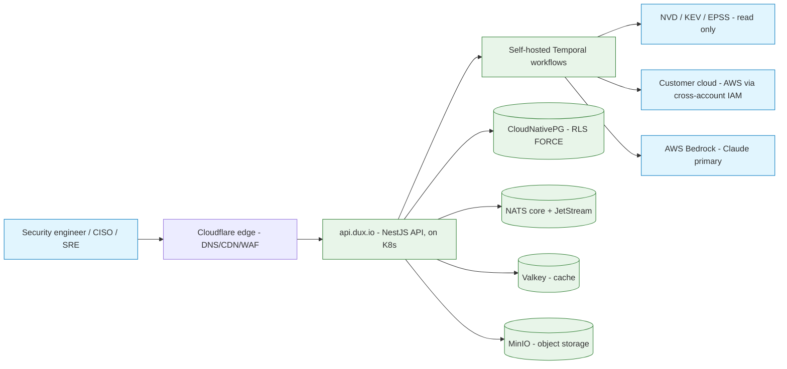
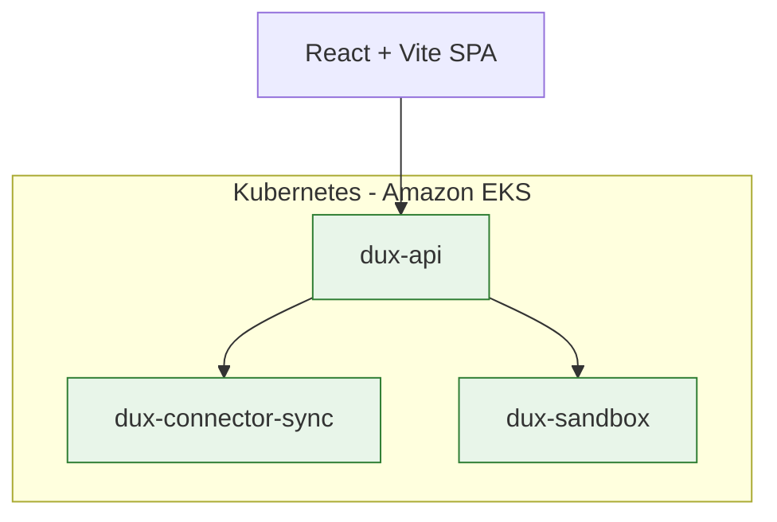

# Architecture Overview

## Summary

System context, deployment topology, monorepo layout, and provider ports (the TRD). Owner: Engineering. Status: canonical. Gate: 1. Decisions: D-1, D-2, D-5, D-34.

## Executive Summary

Dux runs on **Kubernetes from Gate 1** — managed control plane on **Amazon EKS**, with CloudNativePG, NATS+JetStream, Valkey, and MinIO run in-cluster. This is a deliberate portability bet: the same manifests run on any CSP or on-prem, satisfying SOC 2/FedRAMP-conscious finance/healthcare buyers who may need to audit or redeploy — a property AWS-only ECS Fargate could not offer. The **ADRs are the sole authority**; any diagram or legacy TRD row that disagrees with an ADR is stale by definition. Blast-radius isolation comes from three separate Kubernetes Deployments (`dux-api`, `dux-connector-sync`, `dux-sandbox`), each independently autoscaled via HPA. Secrets moved from AWS SSM to self-hosted **HashiCorp Vault**; the WAF layer moved from AWS WAF to **Cloudflare edge WAF** plus in-cluster **Falco** runtime security as the compensating control. Every architectural swap point (auth, workflow engine, storage, vector store, graph, LLM provider, sandbox) is abstracted behind a named port, guaranteeing a week-scale exit per ADR-013.

## Specification

### System context (C1)

| External system | Role |
|---|---|
| CloudNativePG | application data, workflow state, pgvector (self-hosted Postgres operator on K8s) |
| NATS + JetStream | event bus (kill-switch pub/sub, continuous-assessment triggers), durable async queues |
| Valkey | cache, rate limits, session state, LLM response cache |
| MinIO | object storage, self-hosted S3-compatible, WORM/Object Locking for the audit anchor |
| Cloudflare | DNS, CDN (fronting MinIO-served static assets), edge WAF |
| LLM providers | OpenAI (GPT tier, direct API); Claude via direct Bedrock SDK + NestJS fallback chain (Bedrock -> direct Anthropic -> local vLLM, ADR-017 R3) |
| Customer AWS APIs | asset discovery only (ADR-004) — unrelated to Dux's own hosting |
| NVD / CISA KEV / EPSS | CVE feeds |
| Langfuse (self-hosted) | LLM tracing |
| MCP Security Gateway | CaMeL-plane tool governance — see [[CaMeL]] |
| Self-hosted Temporal | durable execution, on Kubernetes |
| Self-hosted Firecracker | microVM sandbox, on Kubernetes |

**Trust boundaries:** users reach `api.dux.io` only through the Cloudflare edge; per-tenant rate limits apply post-auth (`@nestjs/throttler` + Valkey); assessment agents run as tenant-scoped Temporal workflows; the platform reaches customer AWS accounts via per-tenant cross-account IAM (asset discovery only); connectors to NVD/KEV/EPSS are read-only with no tenant credentials on the wire; optional Gate-5 resident agents heartbeat via HMAC or mTLS, capped at 4 KB once per minute.

### Deployment topology

| K8s Deployment | Responsibility |
|---|---|
| `dux-api` | NestJS API, SSE termination, auth, governance kernel, MCP gateway |
| `dux-connector-sync` | NVD/KEV/EPSS/AWS and vendor connector ingest — isolated from the API |
| `dux-sandbox` | investigation-script execution broker to self-hosted Firecracker microVMs — isolated |

Single EKS cluster per environment (dev/staging/prod), 3-AZ node pools, managed-node-group autoscaling (CPU >70%/2min or memory >80%/2min scales the node group; agent queue depth >50 scales Temporal workers). An nginx Ingress Controller fronts `dux-api`, terminating TLS.

**HPA scaling targets:**

| Service | Scaling metric | Target |
|---|---|---|
| `dux-api` | nginx `RequestCountPerTarget` | 1,000 req/min/pod |
| `dux-connector-sync` | `nvd_sync_queue_depth` | scale out >200 queued, scale in <50 |
| `dux-sandbox` | concurrent microVM count | scale out above 80% of 5 concurrent microVMs x active tenants |

Min 2 / max 10 replicas per service; scale-out cooldown 60s, scale-in cooldown 300s.

**Secrets-rotation cadence:** database credentials and Temporal mTLS certs (90 days, Vault/cert-manager), OAuth refresh tokens (per-vendor lifetime), SSO/SCIM tokens (90 days), audit hash-chain key (quarterly), LLM provider API keys (180 days, or immediately on suspected exposure), Cloudflare API token (90 days). Bedrock authenticates via IAM-bound service-account role, not a stored credential.

### Monorepo structure

```
dux/
├── packages/
│   ├── core/          # workflows (Temporal), CaMeL-plane, MCP tools, Saga coordinator
│   ├── api/            # NestJS backend, auth, tenants, webhooks, SSE+POST realtime
│   ├── web/             # React + Vite dashboard
│   ├── database/       # Drizzle schema + migrations, RLS policies
│   ├── connectors/     # NVD/KEV/AWS + vendor connectors
│   ├── actions/        # vendor action catalog, policy gate, adapters
│   ├── observability/  # OTel, cost metrics, audit logging
│   ├── python-eval/    # DeepEval, Evidently, calibration
│   ├── notifications/  # notification queues
│   ├── mcp/            # MCP gateway + tools
│   ├── llm/            # router, models.json, proxy-adapter
│   ├── security/       # script-rules (AST scanner), AIBOM manifest
│   ├── agents/         # agent-registry source of truth
│   └── adapters/       # only place vendor SDKs may be imported
├── infra/              # Pulumi (TypeScript), Kubernetes/EKS single target
└── tests/              # integration, e2e, golden (250 CVEs), fuzz
```

Dependency rules (enforced by turbo + ESLint): `core/` -> database, connectors, observability; `api/` -> core, database, notifications; `web/` -> api types only; no circular dependencies; only `packages/adapters/*` may import a vendor SDK.

### Provider ports

Each port guarantees a week-scale exit (ADR-013):

| Port | Gate-1 default | Swap target |
|---|---|---|
| `AuthPort` | Better Auth | Supabase Auth, WorkOS (enterprise SAML) |
| `WorkflowPort` | Self-hosted Temporal on K8s | Restate, Hatchet, DBOS |
| `RealtimePort` | SSE + POST + NATS core pub/sub | Ably, Centrifugo |
| `StoragePort` | MinIO | S3, R2 |
| `VectorPort` | pgvector in CloudNativePG | dedicated vector store at ~100M vectors |
| `GraphPort` | Apache AGE (same CloudNativePG instance) | Neo4j at scale |
| `LLMProviderPort` | Direct Bedrock SDK, NestJS fallback (Bedrock -> Anthropic -> vLLM) | Bifrost, evaluated at Gate 2 only |
| `SandboxPort` | Self-hosted Firecracker on K8s | firecracker-containerd/Kata bridge; `NoOpSandboxAdapter` emergency kill path |
| `WorldModelQueryPort` | PostgresWorldModelAdapter (agentic RAG over graph + vector + threat-intel) | HybridGraphWorldModelAdapter (Neo4j trigger) |
| `VendorConnector` | AWS + >=3 live at Gate 1 (CrowdStrike, Wiz, ServiceNow or Entra ID) | Intune/Qualys (W2), long tail (W3) |
| `NotificationPort` | NatsJetStreamNotificationAdapter | dedicated queue service if JetStream bottlenecks |

### Technology stack (pinned 2026-07-19, D-33/D-34)

API: NestJS/TypeScript. Durable execution: self-hosted Temporal on K8s. Database: CloudNativePG + PgBouncer + Drizzle, RLS FORCE. Graph: Apache AGE. Vector: pgvector + pgvectorscale. Cache: Valkey. Event bus: NATS core + JetStream. Storage: MinIO. Frontend: React + Vite (TanStack Router/Query); headless UI stack of React Aria Components (data-dense/WCAG-critical surfaces) and Radix/shadcn elsewhere, Visx + custom SVG for charts and attack paths (ADR-018/ADR-019 — see [[Dux Architecture Decision Records]]). Auth: Better Auth. LLM routing: direct Bedrock SDK + NestJS fallback (Bedrock -> Anthropic -> vLLM). Agent orchestration: Temporal workflow calling Bedrock Converse directly, no framework (ADR-021). Observability: OTel GenAI -> self-hosted Langfuse + Grafana LGTM. Runtime security: Falco. Container scanning: Trivy. Feature flags: Unleash (fail-safe to false above 500ms). Secrets: HashiCorp Vault. Sandbox: self-hosted Firecracker. Deploy: EKS via Pulumi (TypeScript, chosen over CDK for multi-cloud portability and over Terraform to avoid a second IaC language).

### Agent execution model (Temporal + Bedrock direct)

No agent framework sits inside the reasoning loop (ADR-021). `ExploitabilityAssessmentWorkflow` is a Temporal workflow calling Bedrock Converse directly as ordinary activities: a bounded loop (max 10 turns); an S-LLM extraction activity (`claude-haiku-4-5`, structured JSON schema, no tools); a P-LLM reasoning activity (`claude-sonnet-4-6`, `toolConfig` enabled, never sees raw CVE text); a per-tool-call execution activity; a budget-check activity (hard ceiling $0.75/assessment); an SSE-emitter activity streaming to NATS; and a Temporal-signal HITL gate. Message history lives in Postgres (`assessment_messages` table), not Temporal workflow state, because Bedrock Converse resends the full message array every turn and ten turns of tool results can exceed Temporal's ~50KB default state limit.

**Gate-2 triage path (D-35).** Classification, severity triage, and duplicate detection additionally route to the Bedrock Converse API's cheapest available model (e.g. `amazon.titan-text-lite-v2`), alongside — not replacing — the `gpt-5.4-mini -> claude-haiku-4-5 -> rule-based` S-LLM fallback chain. This retired an earlier self-hosted vLLM + Phi-4 S-LLM option; no self-hosted inference remains anywhere in the stack. Gate-2 scoped, no Phase-1 change to the Gate-1 routing chain above.

### Logical residency

Dux runs entirely in Dux Cloud; customer data is reached through read-only APIs and OAuth, never in-VPC compute. "Lives inside your environment" means continuous logical visibility via the Unified Integration Layer (Credential Manager -> Evidence Collector -> World Model graph -> Exploitability Engine), not physical residency — physical residency (the `dux-resident-agent` DaemonSet) is Gate 5 only, and sales copy must not imply otherwise before then.

## Diagram





## Entities & Concepts

- [[Dux Architecture Decision Records]] — the ADRs this overview is subordinate to
- [[CaMeL]] — MCP Security Gateway tool governance referenced in system context
- [[Data Model]] — canonical RLS DDL and entity index
- [[Workflows & Agent Orchestration]] — detail on the agent execution model summarized above

## Related

- [[Dux Overview]]
- [[Multi-Tenancy]]

## Sources

- `.raw/dux/20-architecture/architecture-overview.md`
- `.raw/dux/20-architecture/architecture-diagrams.md` (diagrams 1-2)
