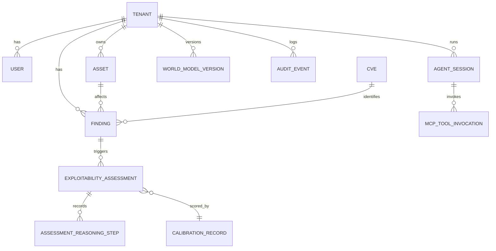

# Data Model

## Summary

The entities, tenancy classification, referential integrity, retention, indexes, and canonical RLS DDL (the ERD). Owner: Engineering. Status: canonical. Gate: 1. Decisions: D-34.

## Executive Summary

Dux uses **shared database, shared schema with row-level security** (ADR-002), not database- or schema-per-tenant. Nearly every entity carries a `tenant_id` foreign key — including, deliberately, `WORLD_MODEL_VERSION`: a global version row would let one tenant's connector sync cancel every other tenant's in-flight assessments through the version-purge job, a cross-tenant blast-radius bug rather than a modelling preference. The composite key rule `(tenant_id, id)` (never `id` alone) is what prevents IDOR, and every tenant-scoped index leads with `tenant_id` so the RLS query rewrite stays index-backed. The audit trail is a hash chain (`HMAC-SHA256(chain_key, prev_hash + tenant_id + action + payload_hash + created_at)`) anchored hourly to MinIO Object Locking in COMPLIANCE mode for 7 years. Agentic RAG (D-34) is enabled over `tenant_embeddings`, partitioned by `tenant_id` with a local HNSW index per partition — because pgvector's HNSW cannot compose with a leading scalar column the way a btree can, tenant isolation for ANN search is achieved by partition boundary, not query-time filtering.

## Specification

### Tenancy model

Global entities (no `tenant_id`): `CVE`, `EPSS_SCORE`, `CALIBRATION_RECORD`, `AGENT_DEFINITION`. Everything else is tenant-scoped.

### Core entities (selected)

| Entity | Notes |
|---|---|
| `TENANT` | `status` enum: `provisioning` -> `active` <-> `suspended` -> `deleted` -> `purged`. `purged` is terminal, no transition out |
| `USER` | composite UK `(tenant_id, email)`; `role` enum `admin`/`member`/`viewer` |
| `CVE`, `EPSS_SCORE`, `EPSS_SCORE_HISTORY` (global) | EPSS history has 90-day rolling retention, feeds [[Predictive Risk Forecasting]] |
| `ASSET` | `asset_type`, `vpc_id`, `subnet_id`, `os_family`, `has_public_ip`, soft-delete via `deleted_at` |
| `FINDING` | `state` enum: `open`/`under_research`/`exploitable`/`mitigated`/`accepted`/`false_positive` |
| `EXPLOITABILITY_ASSESSMENT` | `status` enum: `queued`/`researching`/`evaluating`/`complete`/`failed`; `confidence_score` (Platt-scaled); partial unique on `(tenant_id, finding_id) WHERE status IN (active states)` |
| `AGENT_SESSION` | the KS-L1 kill-switch scope |
| `MCP_TOOL_INVOCATION` | the PS-007 audit record: `tool_name`, `server_id`, `outcome`, `latency_ms` |
| `AUDIT_EVENT` | hash chain, monotonic `chain_seq` per tenant, genesis row `prev_hash = 'GENESIS'`; `chain_key` in Vault, rotated quarterly |
| `LLM_USAGE_EVENT` | enforces the $25/hour per-tenant cap |
| `CALIBRATION_RECORD` (global) | `platt_params`, `brier_score`, `ece` |
| `WORLD_MODEL_VERSION` | tenant-scoped by design (see Executive Summary) |

### Referential integrity

| Parent | Child | ON DELETE |
|---|---|---|
| `tenants` | every `tenant_id` FK table | CASCADE |
| `findings` | `exploitability_assessments` | RESTRICT |
| `assets` | `findings` | RESTRICT — composite FK |
| `webhook_configs` | `webhook_dead_letters` | SET NULL — preserve the DLQ |

**Tenant purge order (must not be reordered):** halt workflows and trip the kill switch -> delete the MinIO prefix -> `DELETE FROM tenants` (cascade does the rest) -> revoke Vault secrets -> write the `tenant.purged` audit record.

### Retention matrix

| Data | Hot (Postgres) | Cold | Notes |
|---|---|---|---|
| `audit_events` | 90 days | 7 years, Parquet in MinIO | actor IDs hashed 2 years post-purge; chain head anchored hourly |
| `mcp_tool_invocations` | 90 days | tenant-prefix archive | purged on hard delete |
| `chat_messages` | 1 year | export bundle | PII lives in `content`, purged on hard delete |
| API traces | 7 days | — | 10% head sampling + 100% of errors |

### Indexing and monitoring

Every tenant-scoped index leads with `tenant_id` (e.g. `ASSET (tenant_id, hostname)`, `AUDIT_EVENT (tenant_id, created_at DESC)`). Alert if any tenant-scoped table exceeds 0 sequential scans per 5 min in staging or 10 per hour in production — a sequential scan there means the RLS rewrite lost its index.

### Row-level security (canonical DDL)

```sql
ALTER TABLE assets ENABLE ROW LEVEL SECURITY;
ALTER TABLE assets FORCE ROW LEVEL SECURITY;
CREATE POLICY tenant_select ON assets FOR SELECT USING (tenant_id = current_setting('app.tenant_id', true)::uuid);
CREATE POLICY tenant_insert ON assets FOR INSERT WITH CHECK (tenant_id = current_setting('app.tenant_id', true)::uuid);
CREATE POLICY tenant_update ON assets FOR UPDATE USING (tenant_id = current_setting('app.tenant_id', true)::uuid) WITH CHECK (tenant_id = current_setting('app.tenant_id', true)::uuid);
CREATE POLICY tenant_delete ON assets FOR DELETE USING (tenant_id = current_setting('app.tenant_id', true)::uuid);
```

Applied to every tenant-scoped table, including `world_model_versions`. Global tables (`cves`, `epss_scores`, `calibration_records`, `agent_definitions`) get `FOR SELECT USING (true)`. `check-rls.sh` verifies `ENABLE` and `FORCE` on every `tenant_id` table in CI.

### RAG schema

Enabled (D-34): `rag_enabled = true`. `tenant_embeddings` (`vector(1536)`, RLS FORCE) is declaratively partitioned by `tenant_id`, with a local HNSW index built per partition — ANN recall stays tenant-scoped by construction. Graph layer: **Apache AGE**, same CloudNativePG instance as the embeddings — no second database or isolation model to secure. Two gaps tracked as open items: the ISO-012 adversarial-neighbor test against the live HNSW index is not yet confirmed executed ([[Open Items Register|OI-59]]), and the AGE node/edge/provenance column-level schema is not yet specified ([[Open Items Register|OI-46]] — resolved by D-43, first-line response is AGE-native tuning, not a Neo4j migration).

## Diagram



## Entities & Concepts

- [[Architecture Overview]] — deployment context this data model runs inside
- [[Multi-Tenancy]] — application-layer enforcement of the tenancy model specified here
- [[Dux Architecture Decision Records]] — ADR-002 (RLS), ADR-020 (RAG/graph)

## Related

- [[Open Items Register]]
- [[Dux Overview]]

## Sources

- `.raw/dux/20-architecture/data-model.md`
