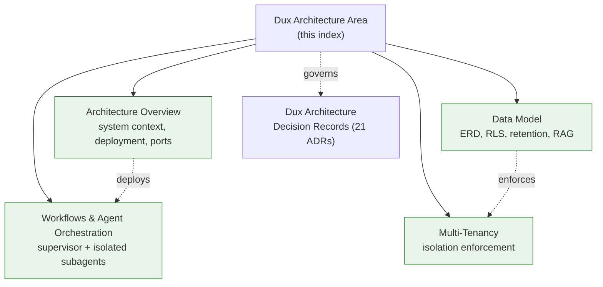

# Dux Architecture Area

## Scope

Everything under `20-architecture/` in the Dux corpus: system context, deployment topology, data model, agent orchestration, multi-tenancy, and the full end-to-end diagram set. **In scope:** architecture-overview.md, data-model.md, workflows.md, multi-tenancy.md, architecture-diagrams.md, adr-index.md. **Out of scope, reused by reference:** [[Dux Architecture Decision Records]], which holds the 21 ADRs as a resource in `wiki/resources/dux-architecture/`.

## Standards

**Authority: the ADRs win.** Where a diagram or prose spec disagrees with an ADR, the ADR is correct and the other document is stale — see [[Dux Architecture Decision Records]].

**Document contract:** every source file carries `owner` (Engineering), `status` (`canonical`), `gate` (1), `last_reviewed`, and `decisions: [D-#]`.

## Active projects in this area

- [[Dux Portfolio]]

## Reference material

- [[Architecture Overview]] — system context, deployment topology, provider ports, tech stack
- [[Data Model]] — ERD, RLS DDL, retention, RAG schema
- [[Workflows & Agent Orchestration]] — orchestration loop, Temporal contract, action budget
- [[Multi-Tenancy]] — isolation enforcement layer by layer
- [[Dux Architecture Decision Records]] — the 21 ADRs

## Diagram

## Review cadence

Weekly, or immediately after any ADR revision — mirrors the corpus's own `last_reviewed` discipline.
