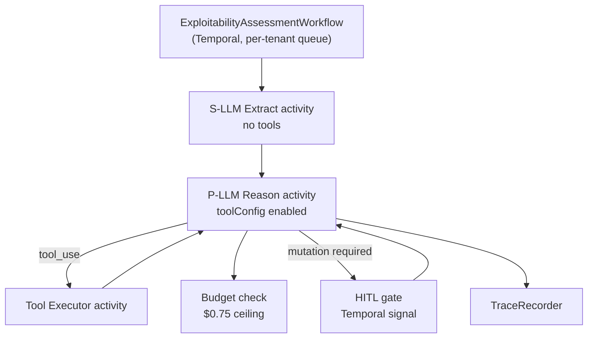
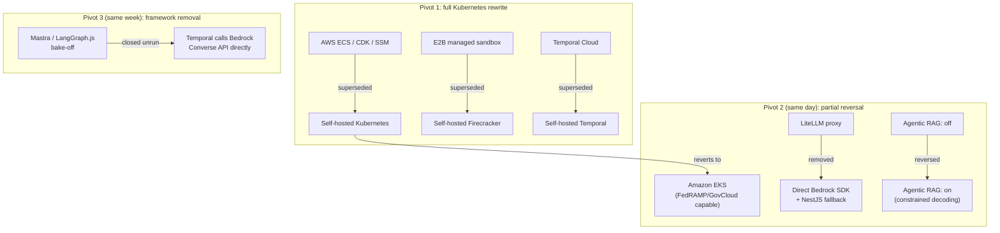

# Dux Architecture Guide

Navigation: [[Dux]] | [[Dux Product Guide]] | [[Dux AI Safety Guide]]

**One rule governs every disagreement in this document: the ADRs win.** If a diagram, a prose description, or a legacy spec ever contradicts an Architecture Decision Record, the ADR is correct and the other document is stale by definition. That convention matters because Dux's infrastructure went through three pivots in five days in mid-July 2026, and this guide describes the state that landed, not the journey: the full pivot story lives in the ADR log below and in [[Dux Decisions & Traceability Reference]].

## The portability bet

Dux runs on Kubernetes from Gate 1: a managed control plane on Amazon EKS, with CloudNativePG, NATS+JetStream, Valkey, and MinIO all running in-cluster. That's a deliberate bet, not a default: the same manifests run on any cloud provider or on-prem, which matters to the finance and healthcare buyers Dux sells into, who may need to audit the stack or require it redeployed into their own infrastructure. An AWS-only serverless path (ECS Fargate) would have been faster to ship but couldn't offer that property.

The same portability instinct shows up as a design pattern throughout the stack: every major architectural swap point (auth, workflow engine, storage, vector store, graph, LLM provider, sandbox) sits behind a named "port" abstraction, so that changing providers is a week-scale exit, not a rewrite (ADR-013). The table further down under [Provider ports](#provider-ports-the-exit-hatches) is the concrete list.

## System context

| External system | Role |
|---|---|
| CloudNativePG | application data, workflow state, pgvector: self-hosted Postgres operator on Kubernetes |
| NATS + JetStream | event bus (kill-switch pub/sub, continuous-assessment triggers), durable async queues |
| Valkey | cache, rate limits, session state, LLM response cache |
| MinIO | self-hosted S3-compatible object storage, with WORM/Object Locking anchoring the audit trail |
| Cloudflare | DNS, CDN, edge WAF |
| LLM providers | OpenAI direct API (GPT tier); Claude via direct Bedrock SDK with a NestJS fallback chain (Bedrock → direct Anthropic → local vLLM) |
| Customer AWS APIs | asset discovery only: unrelated to Dux's own hosting |
| NVD / CISA KEV / EPSS | CVE intelligence feeds |
| Langfuse (self-hosted) | LLM tracing |
| Self-hosted Temporal | durable execution engine, on Kubernetes |
| Self-hosted Firecracker | microVM sandbox, on Kubernetes |

The trust boundaries worth internalizing: users only ever reach `api.dux.io` through the Cloudflare edge, with per-tenant rate limits applied post-auth; assessment agents run as tenant-scoped Temporal workflows; the platform reaches into customer AWS accounts only via per-tenant cross-account IAM, scoped to asset discovery; NVD/KEV/EPSS connectors are read-only with no tenant credentials ever on the wire; and optional Gate-5 resident agents heartbeat over HMAC or mTLS, capped at 4KB once a minute.

## Deployment topology

Three separate Kubernetes Deployments give blast-radius isolation, each independently autoscaled:

| Deployment | Responsibility |
|---|---|
| `dux-api` | NestJS API, SSE termination, auth, the governance kernel, the MCP gateway |
| `dux-connector-sync` | NVD/KEV/EPSS/AWS and vendor connector ingest: isolated from the API |
| `dux-sandbox` | investigation-script execution broker to self-hosted Firecracker microVMs: isolated |

A single EKS cluster per environment (dev/staging/prod) runs across 3 availability zones with managed-node-group autoscaling: nodes scale on CPU above 70% or memory above 80% sustained for 2 minutes, and Temporal workers scale when queue depth exceeds 50. Autoscaling targets per service:

| Service | Scaling metric | Target |
|---|---|---|
| `dux-api` | requests per pod | 1,000 req/min/pod |
| `dux-connector-sync` | NVD sync queue depth | scale out above 200 queued, scale in below 50 |
| `dux-sandbox` | concurrent microVM count | scale out above 80% of (5 concurrent × active tenants) |

Every service runs 2–10 replicas, with a 60-second scale-out cooldown and a 300-second scale-in cooldown. Secrets rotate on a fixed cadence: database credentials and Temporal mTLS certs every 90 days, LLM provider keys every 180 days (or immediately on suspected exposure), the audit hash-chain key quarterly. Bedrock itself authenticates through an IAM-bound service-account role: there's no stored credential to rotate at all.

## Technology stack

Pinned 2026-07-19 after the infrastructure pivots settled:

- **API:** NestJS/TypeScript
- **Durable execution:** self-hosted Temporal on Kubernetes
- **Database:** CloudNativePG + PgBouncer + Drizzle, RLS forced everywhere
- **Graph:** Apache AGE · **Vector:** pgvector + pgvectorscale · **Cache:** Valkey · **Event bus:** NATS core + JetStream · **Storage:** MinIO
- **Frontend:** React + Vite (TanStack Router/Query); React Aria Components for data-dense, WCAG-critical surfaces, Radix/shadcn elsewhere; Visx + custom SVG for charts and attack paths (see the [ADR-018/019 rationale](#selected-decisions-worth-understanding-in-depth) below)
- **Auth:** Better Auth · **LLM routing:** direct Bedrock SDK with a Bedrock → Anthropic → vLLM fallback chain · **Agent orchestration:** a bare Temporal workflow calling Bedrock Converse directly, no framework
- **Observability:** OTel GenAI into self-hosted Langfuse + Grafana LGTM · **Runtime security:** Falco · **Container scanning:** Trivy
- **Feature flags:** Unleash, fail-safe to `false` above 500ms · **Secrets:** HashiCorp Vault · **Sandbox:** self-hosted Firecracker
- **Deploy:** EKS via Pulumi (TypeScript): chosen over CDK for multi-cloud portability, and over Terraform to avoid maintaining a second infrastructure-as-code language

### Monorepo layout

```
dux/
├── packages/
│   ├── core/            # workflows (Temporal), CaMeL-plane, MCP tools, Saga coordinator
│   ├── api/              # NestJS backend, auth, tenants, webhooks, SSE+POST realtime
│   ├── web/               # React + Vite dashboard
│   ├── database/         # Drizzle schema + migrations, RLS policies
│   ├── connectors/       # NVD/KEV/AWS + vendor connectors
│   ├── actions/          # vendor action catalog, policy gate, adapters
│   ├── observability/    # OTel, cost metrics, audit logging
│   ├── python-eval/      # DeepEval, Evidently, calibration
│   ├── mcp/              # MCP gateway + tools
│   ├── llm/              # router, models.json, proxy-adapter
│   ├── security/         # script-rules AST scanner, AI-BOM manifest
│   ├── agents/            # agent-registry source of truth
│   └── adapters/          # the only place a vendor SDK may be imported
├── infra/                 # Pulumi (TypeScript), Kubernetes/EKS single target
└── tests/                  # integration, e2e, golden set (250 CVEs), fuzz
```

Dependency direction is enforced in CI (turbo + ESLint): `core` may depend on database/connectors/observability; `api` may depend on core/database/notifications; `web` may only import API types; no circular dependencies are permitted; and `packages/adapters/*` is the *only* place a third-party vendor SDK is allowed to be imported.

## Provider ports: the exit hatches

| Port | Gate-1 default | Swap target if needed |
|---|---|---|
| `AuthPort` | Better Auth | Supabase Auth, WorkOS (enterprise SAML) |
| `WorkflowPort` | Self-hosted Temporal on Kubernetes | Restate, Hatchet, DBOS |
| `RealtimePort` | SSE + POST + NATS core pub/sub | Ably, Centrifugo |
| `StoragePort` | MinIO | S3, R2 |
| `VectorPort` | pgvector in CloudNativePG | a dedicated vector store around 100M vectors |
| `GraphPort` | Apache AGE, same CloudNativePG instance | Neo4j, at scale |
| `LLMProviderPort` | Direct Bedrock SDK, NestJS fallback chain | Bifrost, evaluated only at Gate 2 |
| `SandboxPort` | Self-hosted Firecracker on Kubernetes | firecracker-containerd/Kata bridge; a `NoOpSandboxAdapter` emergency kill path |
| `WorldModelQueryPort` | Postgres-backed adapter (agentic RAG over graph + vector + threat intel) | a hybrid graph adapter (Neo4j trigger) |
| `VendorConnector` | AWS plus 3+ live connectors at Gate 1 | Intune/Qualys at W2, long tail at W3 |
| `NotificationPort` | NATS JetStream adapter | a dedicated queue service if JetStream becomes a bottleneck |

## How an assessment actually runs

The single most consequential architecture decision in the whole product is what Dux *didn't* build: a monolithic, many-tool ReAct agent. That pattern is well-documented to fail at scale: production teams running it report context bloat around 180K tokens, early-result eviction, and real accuracy problems (one publicly documented 47-tool monolith had 39% of its outputs flagged for factual errors). Dux instead runs a **supervisor with isolated subagents**, and every part of the orchestration design follows from that choice.

### The subagent layers

| Layer | Component | Responsibility |
|---|---|---|
| Outer orchestration | `ExploitabilityAssessmentWorkflow` (Temporal) | lifecycle, CVE trigger, state machine, one child workflow per tenant |
| Activity facade | `AssessmentActivity` | thin entrypoint, no inline business logic |
| Prerequisite subagent | `PrerequisiteExtractor` | S-LLM only, schema-validated output |
| Asset-context subagent | `AssetContextWorker` | scoped asset/runtime evidence |
| Control-mapping subagent | `ControlMappingWorker` | vendor control panels, attack-path evidence |
| Reasoning loop | `ReasoningLoop` | direct Bedrock Converse tool calls, no framework, enforces the action budget |
| Trace recording | `TraceRecorder` | persists reasoning steps; makes no LLM calls itself |

Each subagent gets a clean context window, a narrow tool allowlist, and a fixed output schema that doubles as the CaMeL security boundary (see [[Dux AI Safety Guide]]). A few hard rules keep this pattern from eroding over time: every tier gets its own distinct system prompt: never reuse the orchestrator's prompt for a subagent; a worker's first message is always a structured brief (objective, allowed tools, limits, output schema); there's exactly one child workflow per tenant, for blast-radius isolation; and Saga-style compensation persists partial state on failure ("analysis incomplete: asset context loaded, exploitability still pending") instead of silently discarding partial work.

Four loop guards escalate to a human rather than retrying silently forever:

| Guard | Fires when |
|---|---|
| `loop_detected` | the same tool is called with the same arguments more than 3 times |
| `budget_exceeded` | the action or cost budget is exhausted |
| `convergence_failure` | 3 consecutive turns yield zero new entities |
| `oscillation_detected` | the pattern A → B → A → B repeats within the last 4 turns |

### The Temporal contract

Bedrock Converse resends the entire message array on every turn, and ten turns of tool results can blow past Temporal's roughly 50KB default workflow-state limit: so message history lives in Postgres (`assessment_messages`), and workflow state itself carries only a history ID, turn count, spend, and status. Beyond that:

- **Child workflows:** one per tenant, `taskQueue: assessment-{tenant_id}`
- **Heartbeats:** NVD 30s/10s, AWS 120s/30s, MCP 60s/15s; a 15-minute close timeout, max 2 retries, exponential backoff from 1s to 30s
- **Continue-as-new:** suggested at 8,000+ events, mandatory at 10,000+, hard-capped at 35,000
- **Versioning:** `ExploitabilityAssessmentWorkflow` v1 stays pinned until the golden-set gate passes for v2: an unversioned worker is, by a wide margin, the most common cause of Temporal production incidents, so this is a Gate-1 exit criterion, not a nice-to-have
- **Action budget:** a cost-cap check runs every iteration alongside the kill-switch check, with hard checkpoints at iterations 5, 10, and 15, halting via an L2 kill-switch trip at 200 weighted actions

A typical assessment costs 40–80 weighted actions (median around 55, p95 around 58): comfortably inside a p95-under-60 SLO. Weighting: an LLM call counts as 1, an MCP read as 2, an MCP write as 5. The rare 70–80-action tail (under 5% of assessments) comes from multi-hop attack-path traversal on large inventories, not from inefficiency.



Agents never invoke a vendor's mutation API inline: every write routes through `ActionPolicyGate.isAllowed` → `VendorActionAdapter.execute` → the vendor's native API → an audit record. Two GDPR-relevant workflows round out the lifecycle picture: `TenantExportWorkflow` (Article 15/20, completes within 24 hours) and `GDPRDeletionWorkflow` (Article 17: soft-delete, a 30-day export hold, hard-delete, then cryptographic purge within 90 days).

## The data model

Dux uses **shared database, shared schema with row-level security**: not database-per-tenant or schema-per-tenant. That choice cascades through nearly everything below.

### Tenancy classification

Only four entities are global (no `tenant_id`): `CVE`, `EPSS_SCORE`, `CALIBRATION_RECORD`, and `AGENT_DEFINITION`. Everything else (deliberately including `WORLD_MODEL_VERSION`) is tenant-scoped. That last one is worth explaining, because it looks at first glance like it should be global: a single global version row would let one tenant's connector sync cancel every other tenant's in-flight assessments through the version-purge job. That's not a modeling preference, it's closing a cross-tenant blast-radius bug.

The composite key rule (`(tenant_id, id)`, never `id` alone) is what actually prevents insecure direct object references, and every tenant-scoped index leads with `tenant_id` so the row-level-security query rewrite stays index-backed rather than falling back to a sequential scan.

### Core entities worth knowing by name

| Entity | Notes |
|---|---|
| `TENANT` | lifecycle: `provisioning` → `active` ↔ `suspended` → `deleted` → `purged` (terminal, no way back) |
| `USER` | composite unique key `(tenant_id, email)`; role is `admin`/`member`/`viewer` |
| `CVE`, `EPSS_SCORE`, `EPSS_SCORE_HISTORY` | global; the history table has 90-day rolling retention and feeds predictive risk forecasting |
| `ASSET` | asset type, VPC/subnet, OS family, public-IP flag; soft-deleted |
| `FINDING` | state machine: `open` → `under_research` → `exploitable`/`mitigated`/`accepted`/`false_positive` |
| `EXPLOITABILITY_ASSESSMENT` | status plus a Platt-scaled `confidence_score`; one active assessment per finding, enforced by a partial unique index |
| `AGENT_SESSION` | the scope an L1 kill switch operates on |
| `MCP_TOOL_INVOCATION` | the audit record for every tool call: name, server, outcome, latency |
| `VULNERABILITY_INSTANCE` | per-asset instance of a CVE: sources, exploitability status, network exposure, last-seen |
| `VULNERABILITY_INSTANCE_ACKNOWLEDGMENT` | reason, expiry, revocation; auto-expires |
| `CUSTOM_METRIC` | display name, entity type, DQL filter, grouping, dashboard binding |
| `ASSESSMENT_REASONING_STEP` | the individual steps behind the Assessment Trace panel |
| `ATTACK_PATH` | path nodes as JSONB, normalizing to a dedicated table only if the query degrades at Gate 2 |
| `CONTROL`, `CONTROL_ASSET_MAPPING` | vendor, control type, settings, mapping type |
| `CHAT_SESSION`/`CHAT_MESSAGE`/`CHAT_ACTION` | messages partitioned yearly; token count tracked for billing |
| `AUDIT_EVENT` | the hash chain: see below |
| `LLM_USAGE_EVENT` | enforces the $25/hour per-tenant spend cap |
| `WORLD_MODEL_VERSION` | tenant-scoped by design, per the blast-radius reasoning above |
| `USER_PREFERENCE`, `PREFERENCE_SCOPE`, `PREFERENCE_APPLICATION` | a natural-language preference query, its parsed scope, action, confidence, and expiry |
| `ASSET_RELATIONSHIP` | `source_asset_id`, `target_asset_id`, `relationship_type`; unique on `(tenant_id, source, target, type)` |
| `ASSESSMENT_STATE_TRANSITION` | `from_status`, `to_status`, `actor_id`: the audit trail behind an assessment's own state machine |
| `MITIGATION_STEP`, `OWNERSHIP_EVIDENCE` | Gate-2 entities, dotted in the ERD rather than solid: not yet load-bearing at Gate 1 |

### Referential integrity and the purge order

Tenant deletion cascades from `tenants`; `findings` restrict deletion of `exploitability_assessments`; `assets` restrict deletion of `findings` via a composite FK; deleting a `webhook_config` sets its dead-letters' foreign key to null rather than cascading, so the dead-letter queue survives for investigation. `exploitability_assessments` and `attack_paths` both cascade to `assessment_state_transitions`; `user_preferences` cascades to `preference_scopes` and `preference_applications`.

**The tenant purge order must never be reordered:** halt workflows and trip the kill switch → delete the MinIO prefix → `DELETE FROM tenants` (cascade handles the rest) → revoke Vault secrets → write the `tenant.purged` audit record.

### Retention

| Data | Hot (Postgres) | Cold | Notes |
|---|---|---|---|
| Audit events | 90 days | 7 years, Parquet in MinIO | actor IDs are hashed 2 years post-purge; the chain head is anchored hourly |
| MCP tool invocations | 90 days | tenant-prefix archive | purged on hard delete |
| Chat messages | 1 year | export bundle | PII lives in `content`, purged on hard delete |
| API traces | 7 days | - | 10% head sampling plus 100% of errors |

### The audit hash chain

Every audit event is chained: `HMAC-SHA256(chain_key, prev_hash + tenant_id + action + payload_hash + created_at)`, anchored hourly to MinIO Object Locking in Compliance mode for 7 years, with a monotonic sequence number per tenant and a genesis row whose `prev_hash` is the literal string `GENESIS`. The chain key itself lives in Vault and rotates quarterly.

### Row-level security, canonically

```sql
ALTER TABLE assets ENABLE ROW LEVEL SECURITY;
ALTER TABLE assets FORCE ROW LEVEL SECURITY;
CREATE POLICY tenant_select ON assets FOR SELECT
  USING (tenant_id = current_setting('app.tenant_id', true)::uuid);
CREATE POLICY tenant_insert ON assets FOR INSERT
  WITH CHECK (tenant_id = current_setting('app.tenant_id', true)::uuid);
CREATE POLICY tenant_update ON assets FOR UPDATE
  USING (tenant_id = current_setting('app.tenant_id', true)::uuid)
  WITH CHECK (tenant_id = current_setting('app.tenant_id', true)::uuid);
CREATE POLICY tenant_delete ON assets FOR DELETE
  USING (tenant_id = current_setting('app.tenant_id', true)::uuid);
```

This exact pattern applies to every tenant-scoped table, `world_model_versions` included. The four global tables get a simple `FOR SELECT USING (true)` instead. A CI script (`check-rls.sh`) verifies both `ENABLE` and `FORCE` are set on every tenant-scoped table before merge: this is not a convention that's trusted to hold by discipline alone.

### Retrieval: pgvector and Apache AGE, not a separate vector database

Agentic RAG is enabled: `tenant_embeddings` is a `vector(1536)` column, RLS-forced, and declaratively partitioned by `tenant_id` with a local HNSW index built per partition. That partitioning choice is a technical necessity, not a preference: pgvector's HNSW index can't compose with a leading scalar column the way a btree can, so tenant isolation for approximate-nearest-neighbor search has to come from the partition boundary itself, not a query-time filter. The graph layer, Apache AGE, lives in the same CloudNativePG instance as the embeddings: one database and one isolation model to secure, not two.

## Isolation: how multi-tenancy is actually enforced

Row-level security carries a real, acknowledged cost (roughly 5–15% overhead per 2026 field consensus) kept manageable by the tenant-leading composite indexes described above. Every layer a request touches asserts tenant identity independently:

| Layer | Enforcement |
|---|---|
| API gateway | rejects any request without a valid JWT-derived tenant context |
| Service layer | asserts `resource.tenant_id == request.tenant_id` |
| Database transaction | `SET LOCAL app.tenant_id` scopes RLS for that transaction only |
| Cache (Valkey) | key is an HMAC hash of the tenant ID; a read whose payload tenant doesn't match is treated as a cache miss |
| File storage | per-tenant envelope encryption, key wrapped by a platform key in Vault; pre-signed URLs valid 15 minutes max |
| Message queue | tenant ID travels in the payload and is validated before any `SET LOCAL` |
| LLM calls | every usage event is tagged with `tenant_id` for cost attribution |

Tenant context always originates from the authenticated JWT claim (never a header, never a query parameter) and seven context-propagation rules are OWASP-validated and treated as mandatory, not best-effort: the JWT-only origin rule above; every tenant-scoped operation running inside a `SET LOCAL`-scoped transaction; every query running through PgBouncer in transaction mode (so `SET LOCAL` can never leak to the next connection borrower); a fully audited admin-impersonation flow (validate admin JWT → verify MFA → read the impersonation header → swap the effective tenant ID → write an audit record → proceed, with RLS still enforced against the impersonated tenant); service-to-service calls carrying a short-lived internal JWT that a worker rejects outright if `tenant_id` is missing; the kill-switch pub/sub fallback using a dedicated unpooled connection since `LISTEN`/`NOTIFY` needs a persistent session; and every telemetry span carrying only a hashed tenant ID, never the raw value.

**Any cross-tenant read is a CI merge block, full stop.** A dedicated fuzz suite (`pnpm test:fuzz-tenant-id`) runs on every PR touching the API, database, or core packages.

### Auth hardening

Access tokens carry the standard claims plus `tenant_id` and a JWT ID; a mismatched audience is an automatic 401. Refresh tokens use rotating families with reuse detection: if a refresh token gets reused, the entire token family is invalidated, not just that one token. Because a live access token has no forced-invalidation path before its natural 60-minute expiry, a short-TTL denylist is checked on every request and populated on password change, admin-forced logout, SCIM deprovisioning, or a kill-switch activation. Pre-authentication endpoints (login, signup, password reset, MFA) don't have a tenant ID yet, so they get their own backstop instead of the per-tenant throttler: 5 failed logins per account per 15 minutes with progressive backoff, 20 per IP per 15 minutes, sitting behind Cloudflare's coarser edge limits.

Tokens themselves are signed with RS256, not a shared symmetric secret: a compromised API instance can verify a token but never mint one, and the signing key rotates quarterly via AWS SSM. Dashboard session cookies carry the full hardened attribute set: `Secure`, `HttpOnly`, `SameSite=Strict`, and the `__Host-` prefix.

### Tenant lifecycle

**Provisioning:** create the tenant and default roles (first user becomes admin) → validate the AWS role ARN and external ID → run isolation tests plus `check-rls.sh`, blocking activation on any failure → run the first connector sync → write a `tenant.provisioned` audit record.

**Suspension:** block new assessments and writes with a 403 → mark agent sessions blocked → send a Temporal cancel signal → open a 30-day read-only export window → activate an L3 kill switch → audit.

**Deletion:** soft-delete → a 24-hour-SLA export window for days 0–30 → legal-hold retention for days 31–90 → a hard purge across MinIO, database, and backups on day 90. A `legal_hold` flag blocks that final purge and notifies Legal automatically.

### Noisy-neighbor protection

The primary detector watches each tenant's share of total query load: above 10% sustained for 5 minutes throttles that tenant's assessment queue, auto-resuming below 5%. A secondary detector catches slower bleeds the primary would miss: above 8% for 30 minutes. Each tenant gets a 5-connection pool cap plus 20% headroom, and a hard $25/hour spend cap enforced via the LLM usage-event index.

### Graph latency: two numbers, on purpose

| Number | Value | Purpose |
|---|---|---|
| SLO ceiling | a 3-hop graph query, p95 under 200ms, above 2,000 assets | the actual commitment |
| Migration trigger | p95 over 150ms above 1,000 assets, for 7 consecutive days | the early warning |

The trigger fires deliberately before the ceiling would breach, buying lead time to act. And per an explicit decision, the first-line response to that trigger is Apache-AGE-native tuning (index tuning, read-replica routing, partitioning) not a database migration to Neo4j. Neo4j stays on the table only as a further-future escape valve.

## Key architecture decisions

Twenty-one ADRs govern this architecture, five of them revised three or more times across a single week of infrastructure churn in July 2026. The throughline across nearly every revision is the same trade-off, stated explicitly each time: **portability and auditability for regulated buyers, over the cheaper and faster managed-service default.**

| ADR | Decision | Status |
|---|---|---|
| ADR-001 | Better Auth via `AuthPort`; JWT + refresh rotation; SPIFFE agent claims | Accepted |
| ADR-002 R2 | Shared-schema RLS, forced, on CloudNativePG | Accepted |
| ADR-006 R4 | Kubernetes (EKS) from Gate 1, Pulumi IaC, Vault, Cloudflare WAF, MinIO audit anchor | Accepted |
| ADR-007 R3 | Self-hosted Temporal on Kubernetes as the canonical workflow port from Gate 1 | Accepted |
| ADR-008 R2 | CaMeL-tiered LLM routing, ≤$0.75 SLO at 45% cache hit rate; Gate-2 triage routes to the Bedrock Converse API's cheapest available model (`amazon.titan-text-lite-v2`), retiring an earlier self-hosted vLLM plus Phi-4 14B option | Accepted |
| ADR-010 R5 | LiteLLM removed: direct Bedrock SDK behind `LLMProviderPort` | Accepted |
| ADR-011 R2 | Vendor connector framework, 3+ live at Gate 1 | Accepted |
| ADR-012 R3 | Vendor-action write path, unattended by default at Gate 1 | Accepted |
| ADR-015 R4 | Self-hosted Firecracker on Kubernetes as the Gate-1 default; E2B retired | Accepted |
| ADR-017 R3 | Multi-provider Claude inference: Bedrock → direct Anthropic → local vLLM | Accepted |
| ADR-018 | Frontend design system: headless components (React Aria + Radix/shadcn) on a token source of truth | Accepted |
| ADR-019 | Data visualization: headless charts (Visx) plus SVG, same token/accessibility discipline | Accepted |
| ADR-020 R2 | Agentic RAG enabled: pgvector + Apache AGE, constrained decoding | Accepted |
| ADR-021 | Mastra and LangGraph.js removed; Temporal calls Bedrock Converse directly | Accepted |

### Selected decisions worth understanding in depth

**Durable execution (ADR-007 R3).** Self-hosted Temporal buys more than reliability: every approval, rejection, and escalation becomes an immutable workflow-history event, which turns out to be a genuine sales-relevant property for finance and healthcare buyers who need an auditable trail. Orchestration follows the supervisor-plus-isolated-subagents pattern described above, one child workflow per tenant. The golden set that gates every release validates (CVE × synthetic-environment) *pairs*, with per-environment ground truth: exploitability is treated as a property of the pair, never the CVE in isolation.

**Sandbox isolation (ADR-015 R4).** Shared-kernel containers were rejected outright for running LLM-generated code: the 2026 security consensus, backed by CVE-2024-21626 ("Leaky Vessels"), CVE-2024-0132, and the SandboxEscapeBench 2026 results, is that plain Docker/runc isolation isn't a real security boundary for AI-generated code. Every investigation script runs in a fresh, ephemeral Firecracker microVM that's never reused: VM reuse is itself a data-leak vector. `firecracker-containerd`/Kata Containers remain an allowed interim bridge technology, not a fallback decision; Firecracker is the actual target architecture.

**Agentic RAG (ADR-020 R2).** This decision reverses an earlier rejection of RAG on safety grounds ("RAG hallucinates; security cannot"): not by lowering the bar, but by removing the objection itself through constrained decoding: every retrieve/reason/decide step is forced through schema-validated tool use, with no free-text output anywhere in the reasoning loop. The vector store stays on Postgres (pgvector/pgvectorscale) until roughly 100M vectors; the graph store is Apache AGE in the same instance. A poisoned graph edge gates any unattended write specifically because GraphRAG poisoning attacks have demonstrated over 93% success at under 0.05% corpus edit rates in published research: that's the threat model this decision is defending against.

**Removing the agent frameworks (ADR-021).** Mastra and LangGraph.js were both evaluated and removed for the same reason: they're abstraction layers over capabilities the stack already owns outright: Temporal for durable execution and retries, Bedrock Converse for tool use and structured output and streaming. `ExploitabilityAssessmentWorkflow` is a plain Temporal TypeScript workflow calling Bedrock Converse directly. The scheduled Week-6 bake-off between the two frameworks was closed without ever being run, once it became clear neither added anything the stack didn't already have.

**Frontend design system (ADR-018, ADR-019).** Rather than adopting a full component library, Dux owns its own styling on top of a headless component layer and an existing design-token source of truth. React Aria Components handle the data-dense, accessibility-critical surfaces (asset tables, instance lists up to 5,000 rows, the research queue) where WCAG 2.2 AA with zero automated-scan violations is a hard gate; Radix/shadcn cover everything else. The same discipline extends to charts: Visx for donut/trend/distribution visualizations, custom SVG for today's single-hop attack path (with Cytoscape.js or Sigma queued for when multi-hop traversal ships), always with a contrast-validated palette that encodes by color *and* a second channel, plus a table/ARIA fallback per chart. The rationale in both cases is the same: a full off-the-shelf library would impose a house style that fights the accessibility rules the rest of the product already lives by.



## Sources

- `.raw/dux/20-architecture/architecture-overview.md`
- `.raw/dux/20-architecture/architecture-diagrams.md`
- `.raw/dux/20-architecture/data-model.md`
- `.raw/dux/20-architecture/multi-tenancy.md`
- `.raw/dux/20-architecture/workflows.md`
- `.raw/dux/20-architecture/adr-index.md`
