# Dux Architecture Guide

Navigation: [[Dux]] | [[Dux Product Guide]] | [[Dux AI Safety Guide]]

**One rule governs every disagreement in this document: the ADRs win.** If a diagram, a prose description, or a legacy spec ever contradicts an Architecture Decision Record, the ADR is correct and the other document is stale by definition. That convention matters because Dux's infrastructure went through three pivots in five days in mid-July 2026, and this guide describes the state that landed, not the journey: the full pivot story lives in the ADR log below and in [[Dux Decisions & Traceability Reference]].

---

## 1. System Context

### External Systems

| System | Role |
|--------|------|
| **CloudNativePG** | application data, workflow state, pgvector (self-hosted Postgres operator on K8s) |
| **NATS + JetStream** | event bus (kill-switch pub/sub, continuous-assessment triggers), durable async queues |
| **Valkey** | cache, rate limits, session state, LLM response cache |
| **MinIO** | object storage, self-hosted S3-compatible, WORM/Object Locking for the audit anchor |
| **Cloudflare** | DNS, CDN (fronting MinIO-served static assets), edge WAF — no longer the deployment target |
| **LLM providers** | OpenAI (GPT tier, direct API); Claude via the **direct Bedrock SDK + NestJS fallback chain** — Bedrock → direct Anthropic → local vLLM (ADR-017 R3); Azure OpenAI EU at trigger (flagged, see [decisions-log D-34](../00-meta/decisions-log.md)) |
| **Customer AWS APIs** | asset discovery only (ADR-004) — unrelated to Dux's own hosting |
| **NVD / CISA KEV / EPSS** | CVE feeds |
| **Langfuse (self-hosted)** | LLM tracing |
| **MCP Security Gateway** | CaMeL-plane tool governance (see [architecture-diagrams §4](architecture-diagrams.md#4-camel-dual-llm-guardrail) and `40-ai-safety/camel-plane.md`) |
| **Self-hosted Temporal** | durable execution, on Kubernetes |
| **Self-hosted Firecracker** | microVM sandbox, on Kubernetes |

### Trust Boundaries

- **Users → Cloudflare edge** (TLS, DDoS, coarse limits) → MinIO-served SPA / `api.dux.io` → NestJS API. Auth is JWT plus session cookies; per-tenant limits are applied **post-auth** by `@nestjs/throttler` + Valkey.
- **Assessment agents → Temporal workflows.** Workflow IDs are tenant-scoped; state lives in CloudNativePG.
- **API ↔ NATS**, over tenant-scoped kill-switch channels.
- **Platform → customer AWS accounts**, via cross-account IAM, per tenant (asset discovery only — Dux's own platform no longer runs on AWS).
- **Connectors → NVD/KEV/EPSS:** read-only, and no tenant credentials on the wire.
- **Platform → LLM:** API key (OpenAI, direct Anthropic fallback via Vault) or IAM/SigV4 (Bedrock primary), with tenant-scoped Langfuse metadata.
- **Optional resident agents (Gate 5) → platform:** HMAC or mTLS heartbeat, ≤4 KB, once per minute.

### System Context Diagram

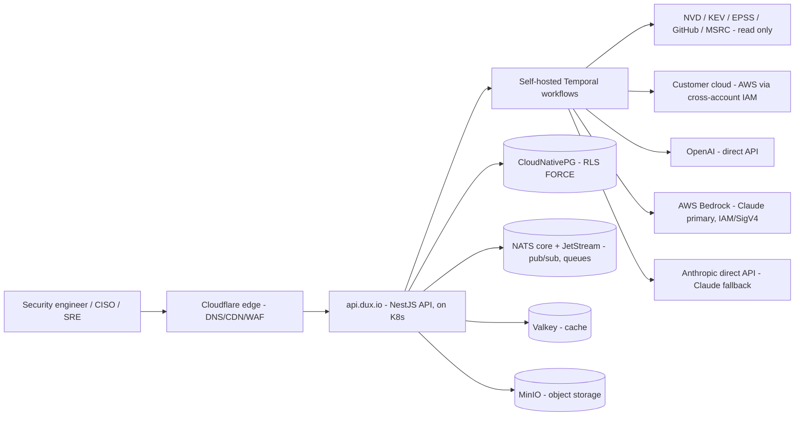

*Users reach Dux only through Cloudflare edge and `api.dux.io`. Connectors reach vendor and threat-intel systems read-only; no tenant credentials cross the wire to intel sources. The platform reaches customer cloud accounts via per-tenant cross-account IAM, and reaches LLM providers by direct API key (OpenAI), IAM/SigV4 (Bedrock primary), or a direct Anthropic API key (fallback leg).*

---

## 2. Deployment Topology

### The Portability Bet

Dux runs on Kubernetes from Gate 1: a managed control plane on **Amazon EKS**, with CloudNativePG, NATS+JetStream, Valkey, and MinIO all running in-cluster. That's a deliberate bet, not a default: the same manifests run on any cloud provider or on-prem, which matters to the finance and healthcare buyers Dux sells into, who may need to audit the stack or require it redeployed into their own infrastructure. An AWS-only serverless path (ECS Fargate) would have been faster to ship but couldn't offer that property.

EKS additionally restores FedRAMP-authorized-CSP/GovCloud availability that the prior DigitalOcean/Linode LKE target lacked.

### Kubernetes Deployments

Blast-radius isolation comes from separate K8s Deployments:

| K8s Deployment | Responsibility |
|-----------------|----------------|
| `dux-api` | NestJS API, SSE termination, auth, governance kernel, MCP gateway (in-process or sidecar) |
| `dux-connector-sync` | NVD/KEV/EPSS/AWS and vendor connector ingest — **isolated from the API** |
| `dux-sandbox` | investigation-script execution broker → self-hosted Firecracker microVMs — **isolated** |

### Network Topology

A single EKS cluster per environment (dev/staging/prod), 3-AZ node pools with managed-node-group autoscaling (CPU >70%/2min or memory >80%/2min scales the node group; agent queue depth >50 scales Temporal workers). Node pools map to the three Deployment roles above, with K8s `NetworkPolicy` enforcing the same isolation ECS security groups previously provided.

An **nginx Ingress Controller** fronts `dux-api`, terminating TLS and applying rate limiting via Valkey. CloudNativePG, NATS, Valkey, and MinIO run as in-cluster StatefulSets/operators — no external managed-tier network hop.

**Frontend:** React + Vite SPA (TanStack Router/Query) — a static build served from MinIO behind Cloudflare CDN, talking only to `api.dux.io`.

### WAF

AWS WAF is retired with ECS Fargate. **Cloudflare's edge WAF** (DDoS, bot management, managed rule sets) becomes the sole WAF layer, sitting in front of `api.dux.io` and the MinIO-served SPA. **Falco** (in-cluster runtime security) is the compensating control for what AWS WAF's network-layer backstop used to catch closer to the workload — anomalous syscalls, sandbox escape attempts — layered with the unchanged `@nestjs/throttler` + Valkey application-layer limits.

### Secrets

**HashiCorp Vault** (self-hosted on K8s), replacing AWS SSM Parameter Store (D-5 R2). Temporal payloads carry secret *references*, never values.

**Local dev:** `docker compose up` — Postgres, PgBouncer, Valkey, MinIO, Vault, and Unleash, at parity.

### Secrets Rotation Cadence

| Secret class | Rotation | Mechanism |
|--------------|----------|-----------|
| Database credentials (CloudNativePG) | 90 days | Vault, self-service rotation UI ([runbooks §6](../60-operations/runbooks.md)) |
| Self-hosted Temporal mTLS client certs | 90 days | cert-manager or Vault (D-16 R2) |
| OAuth refresh tokens (vendor connectors) | per-vendor token lifetime, refreshed on use | Vault transit (ADR-011 R2, unchanged) |
| SSO/SCIM tokens | 90 days | Vault, emits `sso.scim.token.rotated` audit record ([runbooks §4](../60-operations/runbooks.md)) |
| Audit hash-chain key (`chain_key`) | quarterly | Vault, `audit/chain-key` ([data-model §2](data-model.md), unchanged) |
| LLM provider API keys (OpenAI, direct Anthropic fallback) | 180 days, or immediately on suspected exposure | Vault, 30/7/1-day expiry notification sequence ([runbooks §6](../60-operations/runbooks.md)) |
| Cloudflare API token (DNS/CDN rollback) | 90 days | Vault ([dr-bcp](../60-operations/dr-bcp.md)) |

Bedrock (ADR-017 R3, primary leg only) has no entry — it authenticates via the workload's IAM-bound credential native to the EKS node pool's service-account role, not a stored Vault credential.

---

## 3. Container Architecture

### Service Topology

Web (React + Vite on MinIO + Cloudflare CDN) → `dux-api` (K8s) → MCP Gateway → CloudNativePG / NATS / Valkey / MinIO. Connector-sync and sandbox run as separate K8s Deployments. The optional physical-resident agent (Gate 5) heartbeats to `dux-api`.

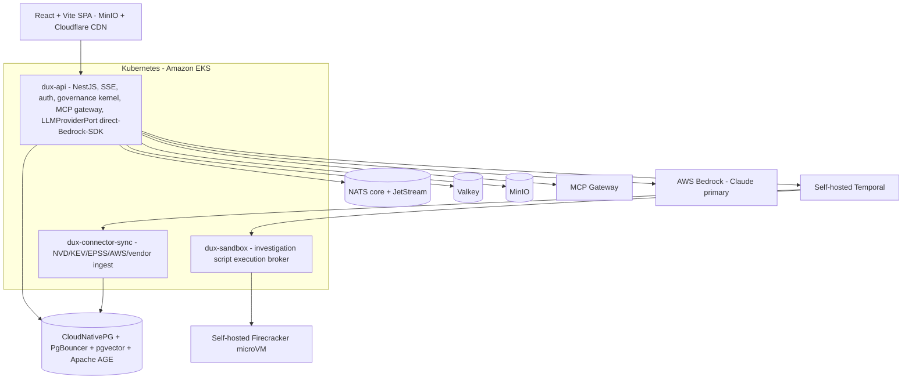

*Three Kubernetes Deployments carry the workload from Gate 1: the API, connector sync, and sandbox broker (the LiteLLM proxy is retired — Bedrock calls go direct from `dux-api` via `LLMProviderPort`, ADR-010 R5). Each is isolated from the others; only `dux-connector-sync` and `dux-sandbox` are permitted to reach outside the platform boundary for ingest and script execution respectively.*

### Workflow Process Groups

Process groups are logically separated:

| Group | Metric | Guard |
|-------|--------|-------|
| Connector sync | `nvd_sync_queue_depth` | max 5 concurrent NVD activities cluster-wide, on a dedicated `connector-*` queue prefix — **so NVD 429 backoff can never starve assessment capacity** |
| Assessment | `workflow_actions_per_assessment` p95 | warn above 100, halt at 200 |

### Autoscale-on-Queue-Depth Policy

Each Deployment scales independently via a Kubernetes `HorizontalPodAutoscaler` (HPA), min 2 / max 10 replicas per service:

| Service | Scaling metric | Target |
|---------|----------------|--------|
| `dux-api` | nginx Ingress `RequestCountPerTarget` (Prometheus adapter) | 1,000 req/min/pod |
| `dux-connector-sync` | `nvd_sync_queue_depth` (custom Prometheus metric, published every 60 s) | scale out above 200 queued items; scale in below 50 |
| `dux-sandbox` | concurrent microVM count (`dux_cost_sandbox_seconds_per_tenant` derived gauge) | scale out above 80% of `5 concurrent microVMs × active tenants` |

Scale-out cooldown 60 s; scale-in cooldown 300 s, to avoid flapping on the same NVD-429-backoff bursts GOV-005/§3's connector-sync isolation already guards against.

---

## 4. Technology Stack

Pins dated 2026-07-19 (D-33 stack replacement, narrowed and extended by D-34).

| Layer | Technology |
|-------|-----------|
| API | NestJS, TypeScript |
| Durable execution | **Self-hosted Temporal on K8s** behind `WorkflowPort` |
| Database | CloudNativePG (self-hosted operator) + PgBouncer + Drizzle, with RLS FORCE |
| Graph | **Apache AGE** (Postgres extension, same CloudNativePG instance) — attack-path/asset-vulnerability-control relationships, per-edge provenance + integrity hashing (ADR-020 R2) |
| Vector | pgvector + pgvectorscale, same CloudNativePG instance |
| Retrieval | **Agentic RAG, enabled** — Temporal workflow (plan → retrieve → reason → decide → synthesize) with constrained decoding via Bedrock Converse API tool-use (ADR-020 R2) |
| Cache | Valkey — rate limits, LLM response cache, session state, Temporal activity-result cache |
| Event bus | NATS core (kill-switch pub/sub, SSE fan-out signaling, continuous-assessment triggers) + NATS JetStream (durable queues) |
| Storage | MinIO (self-hosted, S3-compatible), WORM/Object Locking for the audit anchor |
| Rate limiting | Cloudflare edge + `@nestjs/throttler` + Valkey |
| Frontend | React + Vite SPA (TanStack Router + TanStack Query), static build on MinIO behind Cloudflare CDN |
| Auth | Better Auth, via `AuthPort` |
| Asset discovery | AWS SDK v3 (customer AWS accounts — unrelated to Dux's own hosting) |
| CVE feeds | NVD API v2.0, CISA KEV JSON, EPSS (FIRST.org) |
| Notifications | notification queues on NATS JetStream + SES + Slack |
| LLM routing | **Direct Bedrock SDK behind `LLMProviderPort`, NestJS-level provider fallback/retry** (ADR-008 R2 / ADR-010 R5); Bifrost evaluated at Gate 2 only if routing complexity outgrows NestJS fallback logic |
| S-LLM (Gate 2 triage) | **Bedrock Converse API, cheapest available model** (e.g. `amazon.titan-text-lite-v2`) for classification/triage/dedup — no self-hosted inference (ADR-021, retires the vLLM + Phi-4 14B path) |
| Agent orchestration (assessment loop) | **Temporal TypeScript workflow calling AWS Bedrock Converse API directly** — no agent framework in the loop (ADR-021); see [§5](#5-agent-execution-model-temporal--bedrock-direct) |
| Observability | OTel GenAI → self-hosted Langfuse + **Grafana LGTM** (Loki/Tempo/Prometheus/Grafana, self-hosted) |
| Runtime security | Falco (in-cluster anomaly detection) |
| Container scanning | Trivy in CI/CD |
| Feature flags | Unleash — server-side, **fail-safe to false above 500 ms** (self-hosted, unchanged) |
| Secrets | HashiCorp Vault (self-hosted on K8s) |
| Sandbox | Self-hosted Firecracker on K8s, via `SandboxPort` (Gate-1 default, ADR-015 R4) |
| Deploy | Kubernetes (**Amazon EKS**, ADR-006 R4), provisioned via **Pulumi** (TypeScript) |
| Claude inference | Multi-provider via direct Bedrock SDK + NestJS fallback — Bedrock → direct Anthropic → local vLLM (ADR-017 R3) |
| Eval | python-eval (DeepEval), golden set of 250 CVEs |

### IaC Tool Choice

Pulumi, not AWS CDK (2026-07-19, D-33, supersedes the 2026-07-16 OI-17 CDK decision). CDK is AWS-only and cannot provision a portable Kubernetes target. Pulumi keeps the OI-17 one-language rationale (TypeScript across app and infra) while adding the multi-cloud/on-prem portability the new stack requires — the only real alternative, Terraform (HCL, a second language), was rejected on the same "no existing footprint" grounds OI-17 originally used against it. `infra/` (§4) is the Pulumi app; stacks map one-to-one to the K8s Deployments in §2.

### Monorepo Layout

```
dux/
├── packages/
│   ├── core/          # workflows (Temporal), CaMeL-plane, MCP tools, Saga coordinator
│   │   ├── ports/     # port interfaces (DIP)
│   │   ├── assessment/# PrerequisiteExtractor, ReasoningLoop, TraceRecorder, AssessmentActivity
│   │   ├── governance/# GOV-001–013 kernel
│   │   └── world-model/
│   ├── api/           # NestJS backend, auth, tenants, webhooks, SSE+POST realtime
│   │   └── projections/ # ExposureProjection, ProtectionProjection, ActionCardProjection
│   ├── web/           # React + Vite dashboard (TanStack Router/Query), exposure/trace viewer
│   ├── database/      # Drizzle schema + migrations, RLS policies, seed data
│   ├── connectors/    # NVD/KEV/AWS + vendor connectors (vendor-contract.ts)
│   ├── actions/       # vendor action catalog, policy gate, vendor adapters (ADR-012)
│   ├── observability/ # OTel, CostMetricsService, InstrumentedLLMClient, audit logging
│   ├── python-eval/   # DeepEval, Evidently, calibration
│   ├── notifications/ # notification queues, email/Slack/PDF templates (ADR-005)
│   ├── mcp/           # MCP gateway + tools
│   ├── llm/           # router, models.json, proxy-adapter
│   ├── security/      # script-rules (AST scanner), aibom/manifest.json (ADR-009)
│   ├── agents/        # agent-registry SSoT: {type}/ manifests, CODEOWNERS-gated (ADR-009)
│   └── adapters/      # ONLY place vendor SDKs may be imported
├── infra/             # Pulumi (TypeScript) app; Kubernetes/EKS single target (ADR-006 R4); NO vps scripts
├── tests/             # integration, e2e (Playwright), golden (250 CVEs), fuzz
└── turbo.json
```

### Dependency Rules

Enforced by turbo and ESLint:

- `core/` → database, connectors, observability.
- `api/` → core, database, notifications.
- `web/` → api **types only**.
- **No circular dependencies.**
- **Only `packages/adapters/*` may import a vendor SDK** (`import/no-restricted-paths`).

---

## 5. Provider Ports: The Exit Hatches

Each port exists to guarantee a week-scale exit (ADR-013).

| Port | Gate-1 default | Swap targets |
|------|----------------|--------------|
| `AuthPort` | Better Auth (`BetterAuthAdapter`) | Supabase Auth ↔ WorkOS (enterprise SAML; LOCK-01 unbuilt) |
| `WorkflowPort` | **Self-hosted Temporal on K8s** (`TemporalWorkflowAdapter`) | Restate ↔ Hatchet ↔ DBOS (future cost spike) |
| `RealtimePort` | SSE + POST + **NATS core pub/sub** | Ably ↔ Centrifugo |
| `StoragePort` | **MinIO** (self-hosted, S3-compatible) | S3, R2 |
| `VectorPort` | pgvector in **CloudNativePG** | a dedicated vector store, at ~100M vectors |
| `GraphPort` | **Apache AGE** (Postgres extension, same CloudNativePG instance) — per-edge provenance + integrity hashing (ADR-020 R2) | Neo4j, at scale |
| `LLMProviderPort` | **Direct Bedrock SDK** (`@aws-sdk/client-bedrock-runtime`) behind `LLMProviderPort`; NestJS `LLMFallbackService` orchestrates Bedrock → direct Anthropic → local vLLM (ADR-010 R5) | Bifrost, evaluated at Gate 2 only if multi-provider routing complexity outgrows NestJS fallback logic |
| `ModelRouterPort` | in-process cost-aware router | — |
| `SandboxPort` | **`SelfHostedFirecrackerAdapter` (Gate-1 default, on K8s)** | `firecracker-containerd`/Kata as the interim K8s-integration bridge ↔ SmolVM-class sub-200 ms cold-start vendors. `NoOpSandboxAdapter` is the emergency kill path. E2B/`ManagedMicroVmAdapter` retired (ADR-015 R4) |
| `WorldModelQueryPort` | `PostgresWorldModelAdapter` (CloudNativePG) — agentic RAG loop over graph + vector + threat-intel (ADR-020 R2) | `HybridGraphWorldModelAdapter` (Neo4j trigger) |
| `VendorConnector` | AWS + ≥3 live at Gate 1: CrowdStrike, Wiz, and ServiceNow **or** Entra ID (ADR-011 R2) | Intune / Qualys (W2); long tail (W3) |
| `VendorActionPort` / `ActionPolicyPort` | unattended by default at Gate 1; HITL on anomaly escalation only | closed-loop validation at Gate 3 (US-019) |
| `NotificationPort` | **`NatsJetStreamNotificationAdapter`** (ADR-005 R2) | a dedicated queue service, if JetStream queue depth becomes the bottleneck |

`InstrumentedLLMClient` is a **Decorator** over `LLMProviderPort` — cost metering, cache, fallback, OTel.

`TenantContext` is a value object `{tenantId, userId?, connectorIds[], rlsSession}`, passed via `AsyncLocalStorage`.

---

## 6. Agent Execution Model (Temporal + Bedrock Direct)

### Why Supervisor + Isolated Subagents, Not a Monolith

Production teams running monolithic, many-tool ReAct agents hit **context bloat** (around 180 K tokens), **early-result eviction**, and **high factual-error rates from context confusion** — a documented 47-tool monolith had **39% of its outputs flagged for factual errors**.

The industry converged on supervisor plus isolated subagents (LangChain Deep Agents, Red Hat's multi-agent supervisor, the Agent Patterns Catalog's "Subagent Isolation"). **Each subagent runs in a clean context window, with a narrow tool allowlist and a fixed output schema — and that schema doubles as the CaMeL security boundary.**

Start-small discipline: **three Gate-1 subagents, mapped to three distinct evidence domains.** Multi-agent chaining (ASI07) is deferred, behind a signed inter-agent-JWT stub.

### The Assessment Loop

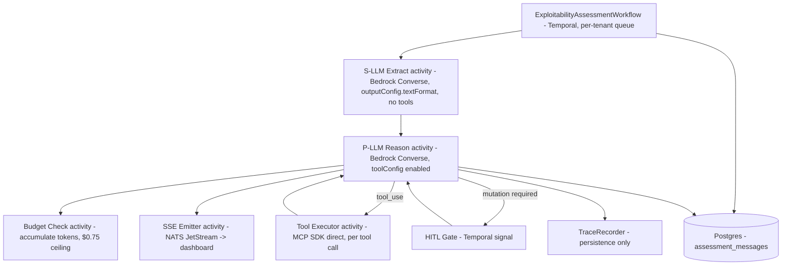

*State machine per activity: `IDLE → REASONING → TOOL_CALLING → EVALUATING → {COMPLETE | BLOCKED | FAILED}`.*

**No agent framework sits inside the reasoning loop (ADR-021).** `ExploitabilityAssessmentWorkflow` is a Temporal TypeScript workflow that calls the Bedrock Converse API directly, as ordinary Temporal activities:

- A bounded `while` loop, max 10 turns.
- **S-LLM activity:** `modelId: anthropic.claude-haiku-4-5`, `outputConfig.textFormat` with a JSON schema — structured CVE fact extraction only, no `toolConfig`, and raw CVE text never reaches the P-LLM.
- **P-LLM activity:** `modelId: anthropic.claude-sonnet-4-6`, `toolConfig` enabled with the discovered MCP tool schemas — receives structured facts plus asset context, never raw CVE text.
- **Tool-execution activity:** each tool call is its own retryable Temporal activity (`@modelcontextprotocol/sdk` client, direct — no framework mediates the call).
- **Budget-check activity:** accumulates token cost per turn; hard ceiling **$0.75/assessment** (same SLO as ADR-008 R2), `BUDGET_EXCEEDED` aborts the workflow.
- **SSE-emitter activity:** streams `ConverseStream` deltas onto NATS for dashboard real-time updates.
- **HITL:** a Temporal signal pauses the workflow at `VendorActionGate` or above the high-exploitability threshold, same signal mechanism as every other Gate-3 human-approval path in this corpus (ADR-007 R3, ADR-020 R2).

### CaMeL Dual-LLM Guardrail

The Suspicious LLM (S-LLM) is the only component that reads untrusted content (CVE text, tool output); it never executes tools and its output is schema-constrained. The Privileged LLM (P-LLM) executes tools and reasons over the assessment, but never sees raw untrusted text. A tool schema with an unconstrained free-text field defeats the boundary, so P-LLM tool schemas are structured JSON only.

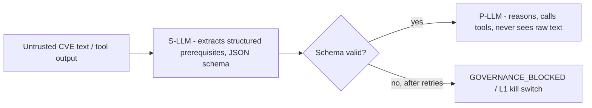

### Orchestration Loop

```
IDLE → REASONING → TOOL_CALLING → EVALUATING → { COMPLETE | BLOCKED (governance) | FAILED }
```

**Loop guards** — each escalates to a human; none retries silently:

| Guard | Condition |
|-------|-----------|
| `loop_detected` | the same tool with the same arguments, more than 3 times |
| `budget_exceeded` | the action or cost budget is exhausted |
| `convergence_failure` | 3 turns yielding zero new entities |
| `oscillation_detected` | A → B → A → B within the last 4 turns |

### Orchestrator-Worker Layers

| Layer | Component | Responsibility |
|-------|-----------|----------------|
| Outer orchestration | Temporal workflow (`ExploitabilityAssessmentWorkflow`) | lifecycle, CVE trigger, state machine, one child workflow per tenant |
| Activity facade | `AssessmentActivity` | thin entrypoint; wires collaborators; **no inline business logic** |
| Prerequisite subagent | `PrerequisiteExtractor` | S-LLM only; Zod-validated prerequisite schema (US-001) |
| Asset-context subagent | `AssetContextWorker` | scoped asset and runtime evidence (US-002) |
| Control-mapping subagent | `ControlMappingWorker` | vendor control panels and attack-path evidence (US-003) |
| Reasoning loop | `ReasoningLoop` | direct Bedrock Converse API `toolConfig` calls (no framework, ADR-021) plus MCP tool activities; enforces the action budget |
| Trace recording | `TraceRecorder` | persists `ASSESSMENT_REASONING_STEP` and code artifacts; **makes no LLM calls** |

**Hard rules:**

- **A distinct system prompt per tier.** Never reuse the orchestrator's prompt for a subagent.
- A worker's first message is a **structured brief**: objective, allowed tools, limits, output schema.
- **One child workflow per tenant**, for blast-radius isolation.
- Saga compensation persists partial state — for example, "analysis incomplete: asset context loaded, exploitability pending".
- Continue-as-new before the event limit.

**`AssessmentActivity` decomposition — each collaborator has one job:**

| Component | Must not |
|-----------|----------|
| `PrerequisiteExtractor` | call MCP or the P-LLM |
| `ReasoningLoop` | persist the trace |
| `TraceRecorder` | invoke an LLM or a tool |
| `AssessmentActivity` | contain vendor or SQL logic |

### Message History Storage

Bedrock Converse resends the full `messages` array every turn — ten turns of tool results can exceed Temporal's ~50 KB default workflow-state limit. Message history therefore lives in Postgres, not workflow state:

| Concern | Detail |
|---------|--------|
| Table | `assessment_messages` — `id`, `assessment_id`, `turn`, `role`, `content` (jsonb), `tool_use_id`, `created_at` |
| Workflow state | carries only `history_id` (UUID), `turn_count` (int), `spent_usd` (decimal), `status` (enum) — never the message array itself |
| Read/write | `ReasoningLoop` fetches by `history_id` at the top of each turn, appends the model response and any tool results at the end |

### Temporal Execution Contract

| Concern | Specification |
|---------|---------------|
| Child workflows | one per tenant — `taskQueue: assessment-{tenant_id}`; the orchestrator runs on `assessment-orchestrator` |
| CaMeL middleware | synchronous request/response **inside** each activity — not a separate runtime |
| Heartbeats | required on MCP and external activities. NVD 30 s / 10 s; AWS 120 s / 30 s; MCP 60 s / 15 s. `scheduleToCloseTimeout` 15 min; max 2 retries; backoff 1 s → 30 s |
| Continue-as-new | `continueAsNewSuggested` at ≥8 K events; hard at ≥10 K; **never exceed the 35 K safety cap** |
| Versioning | `patched()` and worker build IDs. Pin `ExploitabilityAssessmentWorkflow` v1 until the golden-set gate passes v2. **Gate-1 exit criterion — an unversioned worker is the single most common Temporal production failure** |
| Tracing | OTel spans on **every** workflow. **Gate-1 exit criterion.** Spans carry `tenant_id_hash`, never the raw ID |
| Saga compensation | partial failure → `status=incomplete`, `partial_context_loaded=true` |
| Action budget | `checkCostCap` is a per-iteration guard — it runs every iteration alongside `checkKillSwitch` (§5's "2 per iteration"). It additionally evaluates cumulative cost against the governance-kernel cost ladder ([governance-kernel §2](../40-ai-safety/governance-kernel.md)) at hard checkpoints on iterations 5, 10, and 15. Halt with `status=blocked` plus an L2 kill switch when `workflow_actions_per_assessment` reaches 200 |
| Step-effect idempotency | external effects carry a `mutation_key` and reconcile at resume time — exactly-once effects |

### Child-Workflow Mapping and Action Budget

| Transition | Child workflow / activity | Estimated actions |
|------------|---------------------------|-------------------|
| IDLE → REASONING | `PrerequisiteExtractionWorkflow` (S-LLM + schema) | 2 |
| REASONING → TOOL_CALLING (loop) | `ReasoningWorkflow` + `MCPInvocationWorkflow`, per iteration | 4–6 per iteration |
| Per-iteration guards | `checkKillSwitch`, `checkCostCap` | 2 per iteration |
| EVALUATING → COMPLETE | `FinalizeAssessmentWorkflow` | 2 |
| **Total** | 10 iterations, typical | **40–80** (p50 ≈ 55, p95 ≈ 58) |

Instrument `workflow_actions_per_assessment` from day one. Weighting: LLM = 1, MCP read = 2, MCP write = 5.

**The 70–80 tail is rare by construction, not by luck.** It occurs in under 5% of assessments, driven by multi-hop attack-path traversal on large asset inventories — cases that run past the 10-iteration typical case, up to the GOV-010 50-iteration ceiling. That tail pulls the mean up without moving the p95, which lands at 58 — inside the Phase-1 KPI SLO of p95 <60.

**Complexity pre-downgrade:** more than 100 assets, **or** a CVE description over 2 K tokens, auto-routes to the pinned `gpt-5.4-mini` (Unleash `complexity_router`). Log `downgrade_reason`.

---

## 7. Governance Kernel Chain

Every LLM call and MCP tool invocation is checked by `KillSwitchRelay` first; an active kill switch short-circuits the whole chain with a 503. Otherwise, five gates run in sequence, ending with `VendorActionGate` — the only legal path to a vendor mutation API — and then `HITLGate`, whose default outcome depends on the specific action's confidence floor.

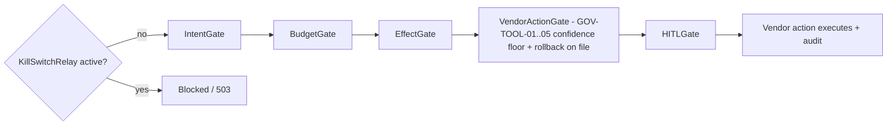

`VendorActionGate` outcome by tool:

| Tool | Behavior |
|------|----------|
| `network.blocklist_add` | needs confidence ≥ 0.75 or escalate to HITL |
| `policy.deploy_device_config` | needs confidence ≥ 0.75 or escalate to HITL |
| `ticket.create_remediation` | always executes unattended |
| `endpoint.isolate` | requires a live HITL response on every call, no confidence floor bypass |
| `patch.deploy_special_devices` | requires a live HITL response on every call, no confidence floor bypass |

---

## 8. MCP Gateway Security Layers

Six defense layers sit between the reasoning loop and every tool call, whether a read-only research tool or a vendor write action.

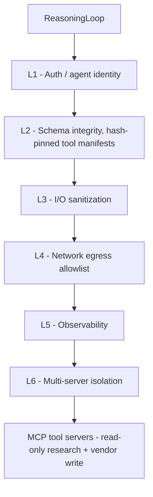

---

## 9. Vendor Write Path

Fast actions and the mitigation write path share the same gate. Three of the five canonical actions execute unattended by default and only escalate to HITL on anomaly (confidence-abstention band, sandbox timeout/OOM, T4 outlier); two fleet-impacting actions require a live human response on every call until each earns unattended execution via a field-proven safety record.

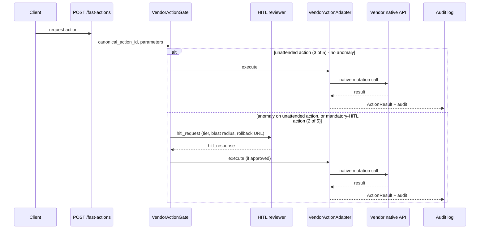

### Vendor Integration Flows

| Flow | Stage | Gate | Backend | Writes to vendor? |
|------|-------|------|---------|-------------------|
| A — Analyze | Analysis | Gate 1 | `ExploitabilityAssessmentWorkflow` + MCP read | No |
| B — Connector ingest | context source | Gate 1 | `sync()` → World Model | No |
| C — Action cards | Mitigations | **Gate 1, unattended by default** | `ActionCardProjection` + `QuickMitigationWorkflow` → ADR-012 R3 adapter | **Yes** |
| D — Fast Actions | Mitigations | **Gate 1, unattended by default** | `POST /fast-actions` → `QuickMitigationWorkflow` → ADR-012 R3 adapter | **Yes** |
| F — Remediation ticket | Remediation | **Gate 1 create + route, unattended by default** | `RemediationWorkflow` → `ticket.create_remediation` | **Yes** |
| G — Closed-loop validate | Mitigations | Gate 3 | `ClosedLoopValidationWorkflow` | re-assessment only |

### Gate-3 Workflows

`QuickMitigationWorkflow` runs four phases: policy check → execute via `VendorActionPort` → enqueue the post-action sync → hand off to `ClosedLoopValidationWorkflow`.

`ClosedLoopValidationWorkflow` is a saga. Forward: `reassess`, `update_ticket`, `notify`. Compensating: `mark_superseded`, `revert_ticket`, `notify_rollback`.

### The Vendor Mutation Sequence

```
POST /fast-actions
  → ActionPolicyGate.isAllowed
    → (escalate to HITL only on an anomaly)
      → VendorActionAdapter.execute
        → vendor native API
          → ActionResult + audit
```

**Agents reason over World Model snapshots and external intel. They do not invoke vendor mutation APIs inline.**

---

## 10. Data Model

### Tenancy Model

Shared database, shared schema, with RLS (ADR-002).

**Global entities — no `tenant_id`:** `CVE`, `EPSS_SCORE`, `CALIBRATION_RECORD`, `AGENT_DEFINITION`.

**Everything else carries a `tenant_id` foreign key — including `WORLD_MODEL_VERSION`.**

> **Why `WORLD_MODEL_VERSION` is tenant-scoped, not global.** ADR-011 R2 bumps it whenever a connector reports a material change. A global version row would let one tenant's connector sync cancel every other tenant's in-flight assessments, through `WorldModelVersionPurgeJob` — see [workflows §9](workflows.md). That is a cross-tenant blast-radius bug, not a modelling preference.

**Composite key rule.** Every resource lookup uses `(tenant_id, id)` — **never `id` alone**. This is what prevents IDOR.

**Index policy.** Every tenant-scoped index **leads with `tenant_id`**. The RLS query rewrite depends on it.

### Core Entities

Columns abbreviated; the full column tables are preserved in the ERD.

| Entity | Key columns and notes |
|--------|----------------------|
| `TENANT` | `id`, `name`, `slug` (UK), `settings` jsonb (requires `aws_role_arn`, `external_id`), `status` enum — `provisioning` → `active` ↔ `suspended` → `deleted` → `purged`. **`purged` is terminal; there is no transition out of it** |
| `USER` | composite UK `(tenant_id, email)`; `role` enum `admin` / `member` / `viewer`; `auth_provider`; `external_auth_id` |
| `CVE` *(global)* | `id`, `description`, `cvss_score`, `kev_status`, `last_modified` |
| `EPSS_SCORE` *(global)* | `cve_id` PK, `epss_score`, `percentile`, `synced_at` |
| `EPSS_SCORE_HISTORY` *(global)* | `cve_id`, `epss_score`, `percentile`, `snapshot_date`; composite PK `(cve_id, snapshot_date)`; 90-day rolling retention. Appended daily alongside the `EPSS_SCORE` upsert — feeds [predictive-risk-forecasting](../10-product/features/predictive-risk-forecasting.md) |
| `ASSET` | `hostname`, `asset_type` enum, `vpc_id`, `subnet_id`, `os_family`, `has_public_ip`, `metadata` jsonb, `deleted_at` (soft delete) |
| `ASSET_RELATIONSHIP` | `source_asset_id`, `target_asset_id`, `relationship_type`; unique on `(tenant_id, source, target, type)` |
| `FINDING` | `asset_id`, `cve_id`, `state` enum — `open` / `under_research` / `exploitable` / `mitigated` / `accepted` / `false_positive` |
| `VULNERABILITY_INSTANCE` | `asset_id`, `cve_id`, `sources[]`, `exploitability_status`, `network_exposure`, `last_seen_at`, `external_uids` |
| `VULNERABILITY_INSTANCE_ACKNOWLEDGMENT` | `reason`, `expires_at`, `revoked_at`; auto-expire job |
| `CUSTOM_METRIC` | `display_name`, `entity_type`, `dql_filter`, `group_by[]`, `dashboard_id`, `ordinal` |
| `EXPLOITABILITY_ASSESSMENT` | `finding_id`, `agent_session_id` (the KS-L1 target), `status` enum — `queued` / `researching` / `evaluating` / `complete` / `failed`; `reasoning_chain` (legacy, dropped at Gate 3); `confidence_score` (Platt); `calibration_record_id`. Partial unique on `(tenant_id, finding_id) WHERE status IN (active states)` |
| `ASSESSMENT_REASONING_STEP` | `step_order`, `step_type` (`reasoning` / `tool_result` / `conclusion`), `content`, `source_refs` |
| `ATTACK_PATH` | `path_nodes` jsonb — normalize to `ATTACK_PATH_NODE` at Gate 2 if the CTE degrades; `validated` |
| `CONTROL`, `CONTROL_ASSET_MAPPING` | vendor; `control_type` and subtype; `settings`; `mapping_type` |
| `AGENT_SESSION` | `session_type` (`assessment` / `chat`), `status`. **This is the KS-L1 scope** |
| `MCP_TOOL_INVOCATION` | `tool_name`, `server_id`, `outcome`, `latency_ms` — the PS-007 audit record |
| `CHAT_SESSION` / `CHAT_MESSAGE` / `CHAT_ACTION` | messages partitioned (1 year); `token_count` for billing; `hitl_status` |
| `USER_PREFERENCE` + `PREFERENCE_SCOPE` + `PREFERENCE_APPLICATION` | natural-language query, parsed scope, action, confidence, expiry |
| `ASSESSMENT_STATE_TRANSITION` | `from_status`, `to_status`, `actor_id` |
| `WEBHOOK_CONFIG` + `WEBHOOK_DEAD_LETTER` | `secret_ref` (Vault/SSM); DLQ payload and `attempt_count` |
| `AUDIT_EVENT` | `action`; `hash_chain` = `HMAC-SHA256(chain_key, prev_hash ‖ tenant_id ‖ action ‖ payload_hash ‖ created_at)`; `chain_seq` (monotonic per tenant, TEN-08); the genesis row has `prev_hash = 'GENESIS'`. **`chain_key` lives in Vault at `audit/chain-key`, rotated quarterly** |
| `MITIGATION_STEP`, `OWNERSHIP_EVIDENCE` | Gate-2 entities (dotted in the diagram) |
| `WORLD_MODEL_VERSION` (`world_model_versions`) | `tenant_id` FK; composite PK `(tenant_id, version)`; `active` |
| `AGENT_DEFINITION` *(global)* | `name`, `version`, `permission_scope`, `active` |
| `LLM_USAGE_EVENT` | `model`, `input_tokens`, `output_tokens`, `cost_usd`. **Enforces the $25/hour cap** |
| `CALIBRATION_RECORD` *(global)* | `model_version`, `prompt_version`, `platt_params`, `brier_score`, `ece`, `active` |

### Referential Integrity

| Parent | Child | ON DELETE |
|--------|-------|-----------|
| `tenants` | every `tenant_id` FK table | CASCADE |
| `findings` | `exploitability_assessments` | RESTRICT |
| `assets` | `findings` | RESTRICT — composite FK `(tenant_id, asset_id)` |
| `exploitability_assessments` | `assessment_state_transitions`, `attack_paths` | CASCADE |
| `user_preferences` | `preference_scopes`, `preference_applications` | CASCADE |
| `webhook_configs` | `webhook_dead_letters` | SET NULL — **preserve the DLQ** |

### Tenant Purge Order

**Do not reorder these:**

1. Halt workflows, and trip the kill switch.
2. Delete the MinIO prefix `tenants/{hash}/`.
3. `DELETE FROM tenants` — the cascade does the rest.
4. Revoke Vault secrets.
5. Write the `tenant.purged` audit record.

### Retention Matrix

| Data | Hot (Postgres) | Cold | Notes |
|------|----------------|------|-------|
| `audit_events` | 90 days | 7 years, Parquet in MinIO | actor IDs hashed 2 years post-purge; chain head anchored hourly to MinIO Object Locking (`dux-audit-anchors/`, COMPLIANCE mode, 7 years) |
| `mcp_tool_invocations` | 90 days | tenant-prefix archive | purged on hard delete |
| `chat_messages` | 1 year | export bundle | **PII lives in `content`**; purged on hard delete |
| Assessment state | per partition | — | state transitions retained |
| LLM traces | Langfuse retention | — | `tenant_id` in metadata; the sanitizer runs before export |
| API traces | 7 days | — | 10% head sampling, plus 100% of errors |

### Indexing Strategy

Physical tables are `snake_case` plural; ERD entities are `SCREAMING_SNAKE` singular. Global tables lead their index with the natural primary key.

**Every tenant-scoped index leads with `tenant_id`.** Representative set:

| Table | Index |
|-------|-------|
| `ASSET` | `(tenant_id, hostname)`, `(tenant_id, subnet_id)`, `(tenant_id, last_synced_at DESC)` |
| `FINDING` | `(tenant_id, cve_id, asset_id)` |
| `EXPLOITABILITY_ASSESSMENT` | `(tenant_id, status, completed_at)`, `(tenant_id, finding_id)` |
| `ASSESSMENT_REASONING_STEP` | `(tenant_id, assessment_id, step_order)` |
| `AUDIT_EVENT` | `(tenant_id, created_at DESC)` |
| `EPSS_SCORE` *(global)* | `(cve_id)` |

**Monitoring.** Alert if any tenant-scoped table exceeds **more than 0 sequential scans per 5 min in staging**, or **more than 10 per hour in production**. A sequential scan on a tenant-scoped table means the RLS rewrite has lost its index.

### Row-Level Security (Canonical DDL)

```sql
ALTER TABLE assets ENABLE ROW LEVEL SECURITY;
ALTER TABLE assets FORCE ROW LEVEL SECURITY;
CREATE POLICY tenant_select ON assets FOR SELECT
  USING (tenant_id = current_setting('app.tenant_id', true)::uuid);
CREATE POLICY tenant_insert ON assets FOR INSERT
  WITH CHECK (tenant_id = current_setting('app.tenant_id', true)::uuid);
CREATE POLICY tenant_update ON assets FOR UPDATE
  USING (tenant_id = current_setting('app.tenant_id', true)::uuid)
  WITH CHECK (tenant_id = current_setting('app.tenant_id', true)::uuid);
CREATE POLICY tenant_delete ON assets FOR DELETE
  USING (tenant_id = current_setting('app.tenant_id', true)::uuid);
```

**Apply all four policies to every tenant-scoped table, including `world_model_versions`** (see §10.1).

**Global tables:** `cves` gets `FOR SELECT USING (true)`, and ingestion runs under a separate connector role. Likewise `epss_scores`, `calibration_records`, `agent_definitions`.

**Migration CI.** `check-rls.sh` verifies `ENABLE` **and** `FORCE` on every `tenant_id` table, within a single transaction: `CREATE TABLE` → `ENABLE` → `FORCE` → `CREATE POLICY` → `CREATE INDEX`. ISO-013 covers the `tenant_cve_findings` materialized-view refresh.

### RAG Schema

**Enabled (D-34, ADR-020 R2): `rag_enabled = true`.** Agentic RAG runs hybrid vector + BM25 retrieval over `tenant_embeddings`, extended with an Apache AGE graph layer.

`tenant_embeddings` — `embedding vector(1536)`, RLS FORCE. A `tenant_id`-leading HNSW index is not implementable in pgvector — HNSW is a single-column ANN index type and cannot compose with a leading scalar column the way a btree does. The actual approach: `tenant_embeddings` is declaratively partitioned by `tenant_id` (`PARTITION BY LIST (tenant_id)`, matching the composite-key pattern in §10.1), with a local HNSW index built per tenant partition — search never crosses a partition boundary, so ANN recall stays tenant-scoped by construction, not by query-time filtering.

**Graph layer (D-34, ADR-020 R2): Apache AGE**, a Postgres extension on the same CloudNativePG instance as `tenant_embeddings` — no second database, no second isolation model to secure. Per-edge provenance and integrity hashing apply the same "connector-asserted data is untrusted for negative verdicts" rule to every graph edge ([camel-plane §7](../40-ai-safety/camel-plane.md)).

---

## 11. Multi-Tenancy

### Isolation Model

| Aspect | Decision |
|--------|----------|
| Isolation | shared database, shared schema |
| Tenant key | `tenant_id` — a cryptographically secure UUID |
| Database enforcement | PostgreSQL RLS, with FORCE |
| Application enforcement | middleware sets tenant context on **every** request |
| Auth source of truth | the NestJS JWT `tenant_id` claim (ADR-001) |
| Resource lookup | composite key `(tenant_id, id)` |
| Exceptions | **none, without a new ADR** |
| Overhead budget | RLS costs roughly **5–15%** (2026 field consensus). Owned explicitly, and kept low by `tenant_id`-leading composite indexes |

### Context Propagation Rules (OWASP-Validated, All Mandatory)

1. **Tenant context comes from the authenticated JWT claim only.** Never from a client header, query parameter, or path segment without validation.
2. Every tenant-scoped database operation runs inside a transaction with `SET LOCAL app.tenant_id = $1`.
3. **Every tenant-scoped query runs through PgBouncer in transaction mode (`pool_mode=transaction`), with `SET LOCAL app.tenant_id` inside that transaction.** `SET LOCAL` is transaction-scoped by construction — the GUC cannot leak to the next borrower, because it does not survive past the transaction that set it. **CloudNativePG-fronted PgBouncer (2026-07-19, D-33) can run session-mode pooling if ever needed** — unlike Neon's pooler, this is now self-hosted and unconstrained — but transaction mode remains the default with no stated reason to change it.

   > The pool-reset trap this guards against is real, and transaction-mode `SET LOCAL` closes it without `DISCARD ALL` or session-mode pooling. A prior version of this document required PgBouncer session mode — unimplementable on Neon's pooled endpoint, which was transaction-mode only. That mandate is retired; the self-hosted CloudNativePG migration makes session mode available again, but there is still no reason stated to use it.

4. **Admin impersonation**, in order: validate the admin JWT → verify MFA → read `X-Impersonate-Tenant` → replace the effective `tenant_id` → write the `admin.impersonate` audit record → `SET LOCAL` → query. **RLS still applies to the impersonated tenant.**
5. **Service to service:** an internal JWT with `iss=dux-internal`, `aud=worker`, TTL 5 min. It **must** carry `tenant_id`, and the worker rejects a missing claim *before* `SET LOCAL`.
6. **The kill-switch `LISTEN/NOTIFY` fallback (KS-007) uses CloudNativePG's direct, unpooled endpoint** — `LISTEN`/`NOTIFY` require a persistent session connection, which the pooled endpoint cannot provide in either mode. Local development may use the same direct connection with `SET LOCAL`, for parity.
7. **Every OTel span carries `dux.tenant_id_hash`** — `HMAC-SHA256[:8]`. **The raw `tenant_id` never appears in a log.**

### Application-Layer Enforcement

| Layer | Enforcement | Verification |
|-------|-------------|--------------|
| API gateway | reject any request without valid tenant context; JWT-derived only | AUTH-003 |
| Service layer | assert `resource.tenant_id == request.tenant_id` | unit tests |
| Cache (Valkey) | key is `tenant:{HMAC-SHA256(tenant_id, secret)[:16]}:`. On read: deserialize, then **assert `payload.tenant_id === request.tenant_id`** — otherwise treat it as a miss and emit `cache_tenant_mismatch` | key-naming lint |
| File storage (R2) | per-tenant envelope encryption — a DEK wrapped by the platform KEK in Vault/SSM. **The path `tenants/{HMAC[:12]}/` is obfuscation only, not a control.** `StoragePort` mints pre-signed URLs valid ≤15 min, after a JWT check; a GET verifies the JWT tenant **before** unwrapping the DEK | `test:storage-envelope` |
| Message queue | `tenant_id` travels in the payload; `WorkerTenantGuard` validates it before `SET LOCAL` | consumer tests |
| Search (Postgres FTS) | `tenant_search_index (tenant_id, doc_type, entity_id)`; every query includes `tenant_id` | ISO-006 |
| LLM calls | `llm_usage_events` tagged with `tenant_id` | metering tests |

`TenantScopedRepository<T>` enforces composite-key lookups. **ESLint bans `findOne({ where: { id } })` without a `tenant_id`.** The GUC is re-asserted at runtime before every query.

### Multi-Tenant Isolation Diagram

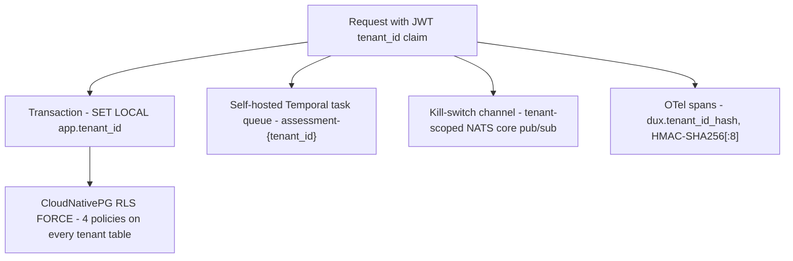

*Isolation is enforced at every layer the request touches: Postgres RLS with FORCE, composite `(tenant_id, id)` lookups, tenant-scoped Temporal task queues, tenant-scoped kill-switch pub/sub channels, and HMAC-hashed tenant IDs in all telemetry so raw tenant IDs never appear in logs or traces.*

### Graph Latency — Two Numbers, Deliberately Not Unified

| Number | Value | Purpose |
|--------|-------|---------|
| **NFR-004 SLO ceiling** | 3-hop CTE p95 **<200 ms above 2 K assets** (TR-NFR-006) | the commitment |
| **Migration trigger** | p95 **>150 ms above 1 K assets, for 7 consecutive days** | the early warning |

The trigger fires *before* the SLO breaches, giving lead time to act. **Apache AGE (D-34) is the first-line response (2026-07-20, D-43):** the graph layer already lives on the same CloudNativePG Postgres, so the trigger is answered with AGE-native scaling levers — index tuning, read-replica routing, partitioning — not a database migration. **Neo4j is kept on the books only as a further-future escape valve**, for the case where AGE-native tuning itself can't hold the SLO; it is not an active migration in progress. The 50 ms and 1 K-asset gap between the trigger and the SLO ceiling is deliberate lead-time budget. Do not "simplify" it into one number.

### Tenant Lifecycle

**Provisioning.** Create the tenant and default roles (the first user is admin) → validate the AWS role ARN and external ID → run `pnpm test:isolation --filter ISO-007` and `check-rls.sh` (**activation is blocked on failure**) → connector sync → audit `tenant.provisioned`.

**Suspension.** Block new assessments and writes (403); set `agent_sessions.status = blocked`; send the Temporal cancel signal; open a read-only 30-day export window; activate KS-L3; audit `tenant.suspended`.

**Deletion.** Soft-delete → days 0–30, export available (24 h SLA) → days 31–90, legal-hold retention → **day 90, hard purge** across MinIO, the database, and backups. Audit logs are anonymized on purge. Audit `tenant.deleted`, then `tenant.purged`.

A `legal_hold` flag blocks the day-90 purge, and notifies Legal.

### Noisy Neighbor Protection

**Primary detector:**

```promql
sum by (tenant_id)(rate(pg_stat_statements_calls[5m]))
  / sum(rate(pg_stat_statements_calls[5m])) > 0.10
```

Sustained for 5 min → throttle that tenant's assessment queue. Auto-resume below 5%.

**Secondary (TEN-05):** above 8% for 30 min — this catches the slow bleed the primary detector misses.

**Pool cap:** 5 connections per tenant, plus 20% headroom, with a `pgbouncer_pool_exhaustion` alert.

**Cost cap:** $25 per hour per tenant, enforced through the `LLM_USAGE_EVENT` index.

### Isolation Testing

**Mandatory:** ISO-001–010, plus API-layer tenant-ID fuzzing (`pnpm test:fuzz-tenant-id`, ISO-FUZZ-001–005).

These run on **every** PR touching `packages/api/`, `packages/database/`, or `packages/core/`.

**Any cross-tenant read is a merge block.** Full suite tables: [ci-cd-testing](../50-engineering/ci-cd-testing.md).

---

## 12. Observability

Every LLM and MCP call is wrapped by an instrumented client so no call bypasses tracing. Spans follow the OTel GenAI semantic convention into self-hosted Langfuse and self-hosted Grafana LGTM (Loki/Tempo/Prometheus), and burn-rate alerts watch the resulting metrics.

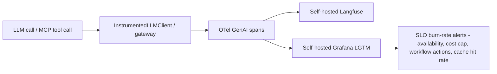

---

## 13. Evals & Confidence Pipeline

Golden-set regression is a merge-blocking CI gate. The exploitability verdict itself is scored by a three-signal confidence ensemble, calibrated with Platt scaling, and mapped to abstention bands that decide routing, including whether a case escalates into the HITL path shown in [§7](#7-governance-kernel-chain).

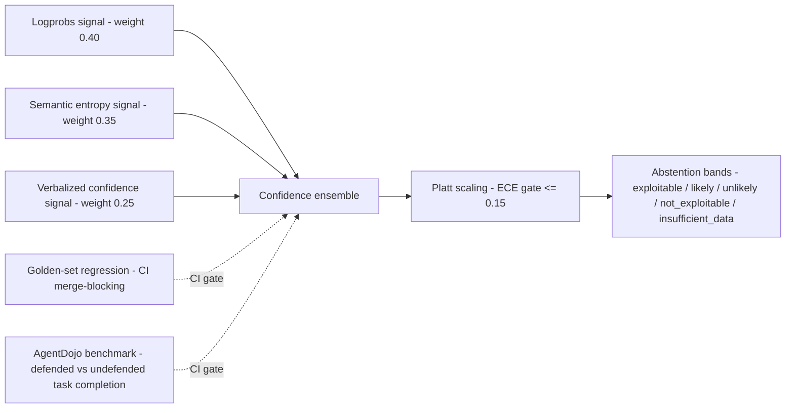

---

## 14. Sandbox Execution

Investigation scripts written by the agent are statically scanned before they ever run, then executed in a fresh microVM that is discarded after one invocation, with default-drop network egress.

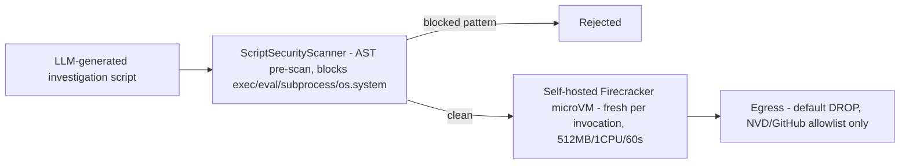

Shared-kernel containers were rejected outright for running LLM-generated code: the 2026 security consensus, backed by CVE-2024-21626 ("Leaky Vessels"), CVE-2024-0132, and the SandboxEscapeBench 2026 results, is that plain Docker/runc isolation isn't a real security boundary for AI-generated code. Every investigation script runs in a fresh, ephemeral Firecracker microVM that's never reused: VM reuse is itself a data-leak vector. `firecracker-containerd`/Kata Containers remain an allowed interim bridge technology, not a fallback decision; Firecracker is the actual target architecture.

---

## 15. Lives-Inside Architecture (Logical Residency)

**Dux runs in Dux Cloud.** Customer data is reached through **read-only APIs and OAuth**, not in-VPC compute.

**"Lives inside your environment" means deep, continuous *logical* visibility — not physical residency.** Sales copy must not imply otherwise.

The Unified Integration Layer:

```
Credential Manager (IAM STS + external ID, OAuth 2.0, scoped API keys, SAML/OIDC)
  → Evidence Collector (unified polling)
    → World Model graph
      → Exploitability Engine (LLM reasoning + rule engine + sandbox)
```

Physical residency — the `dux-resident-agent` DaemonSet — is **Gate 5 only**.

---

## 16. Application-Service Conventions

Services are named `{Verb}{Noun}Service`. **Controllers and SSE handlers delegate to the same service** — `POST /research/queue` and the chat `request_research` event both go through `AssessmentEnqueuePort`.

| Concern | Pattern |
|---------|---------|
| Governance kernel | Chain of Responsibility — `IntentGate → BudgetGate → EffectGate → VendorActionGate → HITLGate` |
| S-LLM fallback | Strategy |
| Control refinements (FR-019) | Specification |

---

## 17. GDPR and Lifecycle Workflows

| Workflow | Contract |
|----------|----------|
| `TenantExportWorkflow` | GDPR Art. 15 and 20 — completes within 24 h |
| `GDPRDeletionWorkflow` | Art. 17 — soft-delete → 30-day export hold → hard-delete → crypto purge within 90 days |
| `WorldModelVersionPurgeJob` | cancels workflows older than 24 h on a superseded version, **scoped to the affected tenant only**. `world_model_versions` is tenant-scoped — **one tenant's connector sync must never cancel another tenant's in-flight work** |
| `ReassessmentSchedulerWorkflow` | continuous re-assessment (ADR-016) — see [continuous-assessment](../10-product/features/continuous-assessment.md) |

The canonical deletion timeline — day-0 soft-delete, 30-day export window, day-90 hard purge — is authoritative in [multi-tenancy §5](multi-tenancy.md#5-tenant-lifecycle) (D-18).

---

## 18. Key Architecture Decisions

Twenty-one ADRs govern this architecture, five of them revised three or more times across a single week of infrastructure churn in July 2026. The throughline across nearly every revision is the same trade-off, stated explicitly each time: **portability and auditability for regulated buyers, over the cheaper and faster managed-service default.**

| ADR | Decision | Status |
|-----|----------|--------|
| ADR-001 | Better Auth via `AuthPort`; JWT + refresh rotation; SPIFFE agent claims | Accepted |
| ADR-002 R2 | Shared-schema RLS, forced, on CloudNativePG | Accepted |
| ADR-006 R4 | Kubernetes (EKS) from Gate 1, Pulumi IaC, Vault, Cloudflare WAF, MinIO audit anchor | Accepted |
| ADR-007 R3 | Self-hosted Temporal on Kubernetes as the canonical workflow port from Gate 1 | Accepted |
| ADR-008 R2 | CaMeL-tiered LLM routing, ≤$0.75 SLO at 45% cache hit rate; Gate-2 triage routes to the Bedrock Converse API's cheapest available model (`amazon.titan-text-lite-v2`), retiring an earlier self-hosted vLLM plus Phi-4 14B option | Accepted |
| ADR-010 R5 | LiteLLM removed: direct Bedrock SDK behind `LLMProviderPort` | Accepted |
| ADR-011 R2 | Vendor connector framework, 3+ live at Gate 1 | Accepted |
| ADR-012 R3 | Vendor-action write path, unattended by default at Gate 1 | Accepted |
| ADR-015 R4 | Self-hosted Firecracker on Kubernetes as the Gate-1 default; E2B retired | Accepted |
| ADR-017 R3 | Multi-provider Claude inference: Bedrock → direct Anthropic → local vLLM | Accepted |
| ADR-018 | Frontend design system: headless components (React Aria + Radix/shadcn) on a token source of truth | Accepted |
| ADR-019 | Data visualization: headless charts (Visx) plus SVG, same token/accessibility discipline | Accepted |
| ADR-020 R2 | Agentic RAG enabled: pgvector + Apache AGE, constrained decoding | Accepted |
| ADR-021 | Mastra and LangGraph.js removed; Temporal calls Bedrock Converse directly | Accepted |

### Selected Decisions Worth Understanding in Depth

**Durable execution (ADR-007 R3).** Self-hosted Temporal buys more than reliability: every approval, rejection, and escalation becomes an immutable workflow-history event, which turns out to be a genuine sales-relevant property for finance and healthcare buyers who need an auditable trail. Orchestration follows the supervisor-plus-isolated-subagents pattern described above, one child workflow per tenant. The golden set that gates every release validates (CVE × synthetic-environment) *pairs*, with per-environment ground truth: exploitability is treated as a property of the pair, never the CVE in isolation.

**Sandbox isolation (ADR-015 R4).** Shared-kernel containers were rejected outright for running LLM-generated code: the 2026 security consensus, backed by CVE-2024-21626 ("Leaky Vessels"), CVE-2024-0132, and the SandboxEscapeBench 2026 results, is that plain Docker/runc isolation isn't a real security boundary for AI-generated code. Every investigation script runs in a fresh, ephemeral Firecracker microVM that's never reused: VM reuse is itself a data-leak vector.

**Agentic RAG (ADR-020 R2).** This decision reverses an earlier rejection of RAG on safety grounds ("RAG hallucinates; security cannot"): not by lowering the bar, but by removing the objection itself through constrained decoding: every retrieve/reason/decide step is forced through schema-validated tool use, with no free-text output anywhere in the reasoning loop. The vector store stays on Postgres (pgvector/pgvectorscale) until roughly 100M vectors; the graph store is Apache AGE in the same instance. A poisoned graph edge gates any unattended write specifically because GraphRAG poisoning attacks have demonstrated over 93% success at under 0.05% corpus edit rates in published research.

**Removing the agent frameworks (ADR-021).** Mastra and LangGraph.js were both evaluated and removed for the same reason: they're abstraction layers over capabilities the stack already owns outright: Temporal for durable execution and retries, Bedrock Converse for tool use and structured output and streaming. `ExploitabilityAssessmentWorkflow` is a plain Temporal TypeScript workflow calling Bedrock Converse directly. The scheduled Week-6 bake-off between the two frameworks was closed without ever being run, once it became clear neither added anything the stack didn't already have.

**Frontend design system (ADR-018, ADR-019).** Rather than adopting a full component library, Dux owns its own styling on top of a headless component layer and an existing design-token source of truth. React Aria Components handle the data-dense, accessibility-critical surfaces (asset tables, instance lists up to 5,000 rows, the research queue) where WCAG 2.2 AA with zero automated-scan violations is a hard gate; Radix/shadcn cover everything else. The same discipline extends to charts: Visx for donut/trend/distribution visualizations, custom SVG for today's single-hop attack path (with Cytoscape.js or Sigma queued for when multi-hop traversal ships), always with a contrast-validated palette that encodes by color *and* a second channel, plus a table/ARIA fallback per chart.

### Infrastructure Pivot Diagram

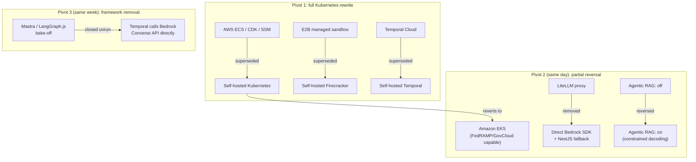

---

## Sources

- `.raw/dux/20-architecture/architecture-overview.md`
- `.raw/dux/20-architecture/architecture-diagrams.md`
- `.raw/dux/20-architecture/data-model.md`
- `.raw/dux/20-architecture/multi-tenancy.md`
- `.raw/dux/20-architecture/workflows.md`
- `.raw/dux/20-architecture/adr-index.md`
