# Three Pivots in Five Days: Building Dux's Architecture Under Fire

### How a security-assessment platform rebuilt its infrastructure twice in one week — and why every decision still traces back to one buyer requirement

Navigation: [[Dux]] | [[Dux Product Guide]] | [[Dux AI Safety Guide]]

In mid-July 2026, over the course of five days, Dux's infrastructure pivoted three times. A team that had shipped an AWS-native, serverless stack tore it down for a self-hosted Kubernetes rewrite, then narrowed that rewrite's cloud target, then ripped two agent frameworks back out of the reasoning loop it had just finished wiring up. That is not the kind of week engineering teams like to advertise. But the throughline across all three pivots is a single, defensible thread: **portability and auditability for regulated buyers, over the cheaper and faster managed-service default.** Finance and healthcare customers — the buyers Dux actually sells into — need to audit the stack, and some need the option to redeploy it inside their own boundary. A fast AWS-only path could never offer that. Everything documented below is the state that landed, not a chronicle of the churn; the full pivot story lives in the ADR log in §18 and in [[Dux Decisions & Traceability Reference]].

**One rule governs every disagreement in this document: the ADRs win.** If a diagram, a prose description, or a legacy spec ever contradicts an Architecture Decision Record, the ADR is correct and the other document is stale by definition.

---

## 1. System Context: Who Talks to Whom, and Why It's Locked Down

Before you can reason about a system's tradeoffs, you need the map. Dux's system context is deliberately narrow: users reach the platform through exactly one edge, connectors reach the outside world read-only, and even LLM providers are reached through a small, enumerated set of trust boundaries.

### External Systems

| System | Role |
|--------|------|
| **CloudNativePG** | application data, workflow state, pgvector (self-hosted Postgres operator on K8s) |
| **NATS + JetStream** | event bus (kill-switch pub/sub, continuous-assessment triggers), durable async queues |
| **Valkey** | cache, rate limits, session state, LLM response cache |
| **MinIO** | object storage, self-hosted S3-compatible, WORM/Object Locking for the audit anchor |
| **Cloudflare** | DNS, CDN (fronting MinIO-served static assets), edge WAF — no longer the deployment target |
| **LLM providers** | OpenAI (GPT tier, direct API); Claude via the **direct Bedrock SDK + NestJS fallback chain** — Bedrock → direct Anthropic → local vLLM (ADR-017 R3); Azure OpenAI EU at trigger (flagged, see decisions-log D-34) |
| **Customer AWS APIs** | asset discovery only (ADR-004) — unrelated to Dux's own hosting |
| **NVD / CISA KEV / EPSS** | CVE feeds |
| **Langfuse (self-hosted)** | LLM tracing |
| **MCP Security Gateway** | CaMeL-plane tool governance (see [architecture-diagrams §4](#4-the-camel-dual-llm-guardrail) and `40-ai-safety/camel-plane.md`) |
| **Self-hosted Temporal** | durable execution, on Kubernetes |
| **Self-hosted Firecracker** | microVM sandbox, on Kubernetes |

### Trust Boundaries

- **Users → Cloudflare edge** (TLS, DDoS, coarse limits) → MinIO-served SPA / `api.dux.io` → NestJS API. Auth is JWT plus session cookies; per-tenant limits are applied **post-auth** by `@nestjs/throttler` + Valkey.
- **Assessment agents → Temporal workflows.** Workflow IDs are tenant-scoped; state lives in CloudNativePG.
- **API ↔ NATS**, over tenant-scoped kill-switch channels.
- **Platform → customer AWS accounts**, via cross-account IAM, per tenant (asset discovery only — Dux's own platform no longer runs on AWS).
- **Connectors → NVD/KEV/EPSS:** read-only, and no tenant credentials on the wire.
- **Platform → LLM:** API key (OpenAI, direct Anthropic fallback via Vault) or IAM/SigV4 (Bedrock primary), with tenant-scoped Langfuse metadata.
- **Optional resident agents (Gate 5) → platform:** HMAC or mTLS heartbeat, ≤4 KB, once per minute.

The system-context table above was rewritten 2026-07-19 (D-33, narrowed by D-34) specifically for the self-hosted-Kubernetes-on-EKS stack. Here is the diagram that captures it — note that connectors reach vendor and threat-intel systems read-only, no tenant credentials cross the wire to intel sources, and the platform reaches customer cloud accounts via per-tenant cross-account IAM while reaching LLM providers by direct API key, IAM/SigV4, or direct Anthropic key:

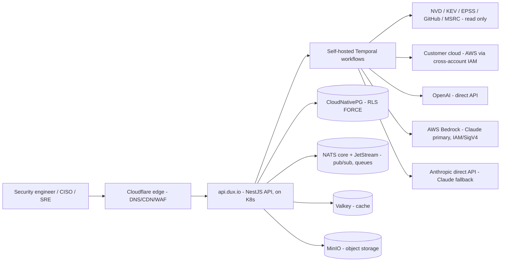

---

## 2. Deployment Topology: The Portability Bet

### Why Kubernetes From Day One

Dux runs on Kubernetes from Gate 1: a managed control plane on **Amazon EKS**, with CloudNativePG, NATS+JetStream, Valkey, and MinIO all running in-cluster. That's a deliberate bet, not a default. The same manifests run on any cloud provider or on-prem — a property that matters directly to the finance and healthcare buyers Dux sells into, some of whom need to audit the stack or require it redeployed into their own infrastructure. An AWS-only serverless path (ECS Fargate) would have shipped faster, but it couldn't offer that property, and it is a rewrite the moment an ideal customer profile demands air-gapped or on-prem deployment — the exact failure mode already observed with the managed sandbox vendor E2B (see ADR-015 R4 below).

EKS additionally restores FedRAMP-authorized-CSP/GovCloud availability that the prior DigitalOcean/Linode LKE target lacked — a compliance detail with real weight for the buyer segment Dux targets, since EKS is FedRAMP Moderate and GovCloud-capable per Appendix B of the source design document.

### Kubernetes Deployments

Blast-radius isolation comes from separate K8s Deployments:

| K8s Deployment | Responsibility |
|-----------------|----------------|
| `dux-api` | NestJS API, SSE termination, auth, governance kernel, MCP gateway (in-process or sidecar) |
| `dux-connector-sync` | NVD/KEV/EPSS/AWS and vendor connector ingest — **isolated from the API** |
| `dux-sandbox` | investigation-script execution broker → self-hosted Firecracker microVMs — **isolated** |

### Network Topology

This section resolves part of OI-31 (the Deployment Guide gap) — rewritten 2026-07-19, D-33, narrowed by D-34. A single EKS cluster per environment (dev/staging/prod), 3-AZ node pools with managed-node-group autoscaling (CPU >70%/2min or memory >80%/2min scales the node group; agent queue depth >50 scales Temporal workers). Node pools map to the three Deployment roles above, with K8s `NetworkPolicy` enforcing the same isolation ECS security groups previously provided. Cross-account customer asset-discovery IAM (ADR-004) remains a signed AWS API call against the *customer's* AWS account — a separate concern from EKS being Dux's own platform-hosting target.

An **nginx Ingress Controller** fronts `dux-api`, terminating TLS and applying rate limiting via Valkey. CloudNativePG, NATS, Valkey, and MinIO run as in-cluster StatefulSets/operators — no external managed-tier network hop.

**Frontend:** React + Vite SPA (TanStack Router/Query) — a static build served from MinIO behind Cloudflare CDN, talking only to `api.dux.io`.

### WAF

AWS WAF is retired with ECS Fargate. **Cloudflare's edge WAF** (DDoS, bot management, managed rule sets) becomes the sole WAF layer, sitting in front of `api.dux.io` and the MinIO-served SPA. **Falco** (in-cluster runtime security) is the compensating control for what AWS WAF's network-layer backstop used to catch closer to the workload — anomalous syscalls, sandbox escape attempts — layered with the unchanged `@nestjs/throttler` + Valkey application-layer limits. Defense-in-depth shifts from network-layer-plus-app-layer to edge-layer-plus-runtime-layer.

### Secrets

**HashiCorp Vault** (self-hosted on K8s), replacing AWS SSM Parameter Store (D-5 R2) — Vault was already carried as "optional later" in the original D-5 decision; this migration makes it the default. Temporal payloads carry secret *references*, never values.

**Local dev:** `docker compose up` — Postgres, PgBouncer, Valkey, MinIO, Vault, and Unleash, at parity.

### Secrets Rotation Cadence

| Secret class | Rotation | Mechanism |
|--------------|----------|-----------|
| Database credentials (CloudNativePG) | 90 days | Vault, self-service rotation UI (runbooks §6) |
| Self-hosted Temporal mTLS client certs | 90 days | cert-manager or Vault (D-16 R2) |
| OAuth refresh tokens (vendor connectors) | per-vendor token lifetime, refreshed on use | Vault transit (ADR-011 R2, unchanged) |
| SSO/SCIM tokens | 90 days | Vault, emits `sso.scim.token.rotated` audit record (runbooks §4) |
| Audit hash-chain key (`chain_key`) | quarterly | Vault, `audit/chain-key` (data-model §2, unchanged) |
| LLM provider API keys (OpenAI, direct Anthropic fallback) | 180 days, or immediately on suspected exposure | Vault, 30/7/1-day expiry notification sequence (runbooks §6) |
| Cloudflare API token (DNS/CDN rollback) | 90 days | Vault (dr-bcp) |

Bedrock (ADR-017 R3, primary leg only) has no entry — it authenticates via the workload's IAM-bound credential native to the EKS node pool's service-account role, not a stored Vault credential.

---

## 3. Container Architecture: Three Deployments, One Boundary

Web (React + Vite on MinIO + Cloudflare CDN) → `dux-api` (K8s) → MCP Gateway → CloudNativePG / NATS / Valkey / MinIO. Connector-sync and sandbox run as separate K8s Deployments. The optional physical-resident agent (Gate 5) heartbeats to `dux-api`.

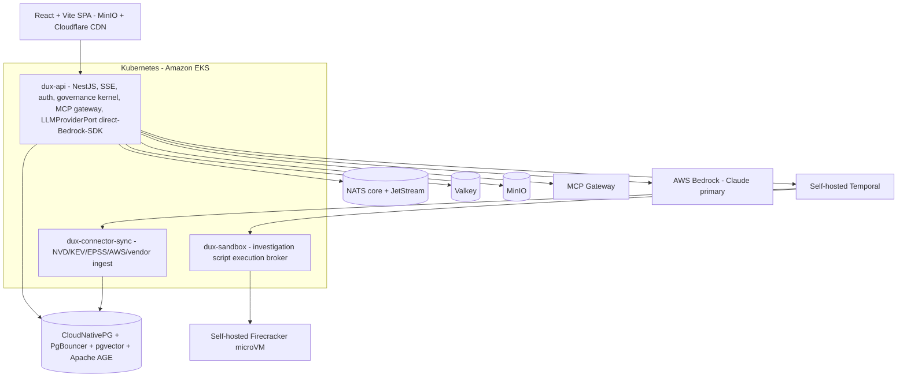

Three Kubernetes Deployments carry the workload from Gate 1: the API, connector sync, and sandbox broker — the LiteLLM proxy is retired, so Bedrock calls go direct from `dux-api` via `LLMProviderPort` (ADR-010 R5). Each is isolated from the others; only `dux-connector-sync` and `dux-sandbox` are permitted to reach outside the platform boundary, for ingest and script execution respectively.

### Workflow Process Groups

Process groups are logically separated:

| Group | Metric | Guard |
|-------|--------|-------|
| Connector sync | `nvd_sync_queue_depth` | max 5 concurrent NVD activities cluster-wide, on a dedicated `connector-*` queue prefix — **so NVD 429 backoff can never starve assessment capacity** |
| Assessment | `workflow_actions_per_assessment` p95 | warn above 100, halt at 200 |

### Autoscale-on-Queue-Depth Policy

This policy resolves OI-30/DA-18, rewritten 2026-07-19 (D-33 for K8s, narrowed by D-34 for EKS). Each Deployment scales independently via a Kubernetes `HorizontalPodAutoscaler` (HPA), min 2 / max 10 replicas per service:

| Service | Scaling metric | Target |
|---------|----------------|--------|
| `dux-api` | nginx Ingress `RequestCountPerTarget` (Prometheus adapter) | 1,000 req/min/pod |
| `dux-connector-sync` | `nvd_sync_queue_depth` (custom Prometheus metric, published every 60 s) | scale out above 200 queued items; scale in below 50 |
| `dux-sandbox` | concurrent microVM count (`dux_cost_sandbox_seconds_per_tenant` derived gauge) | scale out above 80% of `5 concurrent microVMs × active tenants` |

Scale-out cooldown 60 s; scale-in cooldown 300 s, to avoid flapping on the same NVD-429-backoff bursts the connector-sync isolation above already guards against.

---

## 4. Technology Stack: What's Pinned, and Why

Pins dated 2026-07-19 (D-33 stack replacement, narrowed and extended by D-34).

| Layer | Technology |
|-------|-----------|
| API | NestJS, TypeScript |
| Durable execution | **Self-hosted Temporal on K8s** behind `WorkflowPort` |
| Database | CloudNativePG (self-hosted operator) + PgBouncer + Drizzle, with RLS FORCE |
| Graph | **Apache AGE** (Postgres extension, same CloudNativePG instance) — attack-path/asset-vulnerability-control relationships, per-edge provenance + integrity hashing (ADR-020 R2) |
| Vector | pgvector + pgvectorscale, same CloudNativePG instance |
| Retrieval | **Agentic RAG, enabled** — Temporal workflow (plan → retrieve → reason → decide → synthesize) with constrained decoding via Bedrock Converse API tool-use (ADR-020 R2) |
| Cache | Valkey — rate limits, LLM response cache, session state, Temporal activity-result cache |
| Event bus | NATS core (kill-switch pub/sub, SSE fan-out signaling, continuous-assessment triggers) + NATS JetStream (durable queues) |
| Storage | MinIO (self-hosted, S3-compatible), WORM/Object Locking for the audit anchor |
| Rate limiting | Cloudflare edge + `@nestjs/throttler` + Valkey |
| Frontend | React + Vite SPA (TanStack Router + TanStack Query), static build on MinIO behind Cloudflare CDN |
| Auth | Better Auth, via `AuthPort` |
| Asset discovery | AWS SDK v3 (customer AWS accounts — unrelated to Dux's own hosting) |
| CVE feeds | NVD API v2.0, CISA KEV JSON, EPSS (FIRST.org) |
| Notifications | notification queues on NATS JetStream + SES + Slack |
| LLM routing | **Direct Bedrock SDK behind `LLMProviderPort`, NestJS-level provider fallback/retry** (ADR-008 R2 / ADR-010 R5); Bifrost evaluated at Gate 2 only if routing complexity outgrows NestJS fallback logic |
| S-LLM (Gate 2 triage) | **Bedrock Converse API, cheapest available model** (e.g. `amazon.titan-text-lite-v2`) for classification/triage/dedup — no self-hosted inference (ADR-021, retires the vLLM + Phi-4 14B path) |
| Agent orchestration (assessment loop) | **Temporal TypeScript workflow calling AWS Bedrock Converse API directly** — no agent framework in the loop (ADR-021); see [§6](#6-agent-execution-model-temporal--bedrock-direct) |
| Observability | OTel GenAI → self-hosted Langfuse + **Grafana LGTM** (Loki/Tempo/Prometheus/Grafana, self-hosted) |
| Runtime security | Falco (in-cluster anomaly detection) |
| Container scanning | Trivy in CI/CD |
| Feature flags | Unleash — server-side, **fail-safe to false above 500 ms** (self-hosted, unchanged) |
| Secrets | HashiCorp Vault (self-hosted on K8s) |
| Sandbox | Self-hosted Firecracker on K8s, via `SandboxPort` (Gate-1 default, ADR-015 R4) |
| Deploy | Kubernetes (**Amazon EKS**, ADR-006 R4), provisioned via **Pulumi** (TypeScript) |
| Claude inference | Multi-provider via direct Bedrock SDK + NestJS fallback — Bedrock → direct Anthropic → local vLLM (ADR-017 R3) |
| Eval | python-eval (DeepEval), golden set of 250 CVEs |

### IaC Tool Choice

Pulumi, not AWS CDK (2026-07-19, D-33, supersedes the 2026-07-16 OI-17 CDK decision). CDK is AWS-only and cannot provision a portable Kubernetes target. Pulumi keeps the OI-17 one-language rationale (TypeScript across app and infra) while adding the multi-cloud/on-prem portability the new stack requires — the only real alternative, Terraform (HCL, a second language), was rejected on the same "no existing footprint" grounds OI-17 originally used against it. `infra/` (§4) is the Pulumi app; stacks map one-to-one to the K8s Deployments in §2.

### Monorepo Layout

```
dux/
├── packages/
│   ├── core/          # workflows (Temporal), CaMeL-plane, MCP tools, Saga coordinator
│   │   ├── ports/     # port interfaces (DIP)
│   │   ├── assessment/# PrerequisiteExtractor, ReasoningLoop, TraceRecorder, AssessmentActivity
│   │   ├── governance/# GOV-001–013 kernel
│   │   └── world-model/
│   ├── api/           # NestJS backend, auth, tenants, webhooks, SSE+POST realtime
│   │   └── projections/ # ExposureProjection, ProtectionProjection, ActionCardProjection
│   ├── web/           # React + Vite dashboard (TanStack Router/Query), exposure/trace viewer
│   ├── database/      # Drizzle schema + migrations, RLS policies, seed data
│   ├── connectors/    # NVD/KEV/AWS + vendor connectors (vendor-contract.ts)
│   ├── actions/       # vendor action catalog, policy gate, vendor adapters (ADR-012)
│   ├── observability/ # OTel, CostMetricsService, InstrumentedLLMClient, audit logging
│   ├── python-eval/   # DeepEval, Evidently, calibration
│   ├── notifications/ # notification queues, email/Slack/PDF templates (ADR-005)
│   ├── mcp/           # MCP gateway + tools
│   ├── llm/           # router, models.json, proxy-adapter
│   ├── security/      # script-rules (AST scanner), aibom/manifest.json (ADR-009)
│   ├── agents/        # agent-registry SSoT: {type}/ manifests, CODEOWNERS-gated (ADR-009)
│   └── adapters/      # ONLY place vendor SDKs may be imported
├── infra/             # Pulumi (TypeScript) app; Kubernetes/EKS single target (ADR-006 R4); NO vps scripts
├── tests/             # integration, e2e (Playwright), golden (250 CVEs), fuzz
└── turbo.json
```

### Dependency Rules

Enforced by turbo and ESLint:

- `core/` → database, connectors, observability.
- `api/` → core, database, notifications.
- `web/` → api **types only**.
- **No circular dependencies.**
- **Only `packages/adapters/*` may import a vendor SDK** (`import/no-restricted-paths`).

---

## 5. Provider Ports: The Exit Hatches

A theme runs through every layer of this stack: nothing is wired in so tightly that switching it costs more than a week. Each port below exists specifically to guarantee that week-scale exit (ADR-013), and the boundary is enforced structurally, not by convention — CI merge-blocks any net-new `eslint-disable` in `api/` or `core/`, and the restriction extends to `@neondatabase/*` and `dbos` outside `adapters/` and `core/workflow`.

| Port | Gate-1 default | Swap targets |
|------|----------------|--------------|
| `AuthPort` | Better Auth (`BetterAuthAdapter`) | Supabase Auth ↔ WorkOS (enterprise SAML; LOCK-01 unbuilt) |
| `WorkflowPort` | **Self-hosted Temporal on K8s** (`TemporalWorkflowAdapter`) | Restate ↔ Hatchet ↔ DBOS (future cost spike) |
| `RealtimePort` | SSE + POST + **NATS core pub/sub** | Ably ↔ Centrifugo |
| `StoragePort` | **MinIO** (self-hosted, S3-compatible) | S3, R2 |
| `VectorPort` | pgvector in **CloudNativePG** | a dedicated vector store, at ~100M vectors |
| `GraphPort` | **Apache AGE** (Postgres extension, same CloudNativePG instance) — per-edge provenance + integrity hashing (ADR-020 R2) | Neo4j, at scale |
| `LLMProviderPort` | **Direct Bedrock SDK** (`@aws-sdk/client-bedrock-runtime`) behind `LLMProviderPort`; NestJS `LLMFallbackService` orchestrates Bedrock → direct Anthropic → local vLLM (ADR-010 R5) | Bifrost, evaluated at Gate 2 only if multi-provider routing complexity outgrows NestJS fallback logic |
| `ModelRouterPort` | in-process cost-aware router | — |
| `SandboxPort` | **`SelfHostedFirecrackerAdapter` (Gate-1 default, on K8s)** | `firecracker-containerd`/Kata as the interim K8s-integration bridge ↔ SmolVM-class sub-200 ms cold-start vendors. `NoOpSandboxAdapter` is the emergency kill path. E2B/`ManagedMicroVmAdapter` retired (ADR-015 R4) |
| `WorldModelQueryPort` | `PostgresWorldModelAdapter` (CloudNativePG) — agentic RAG loop over graph + vector + threat-intel (ADR-020 R2) | `HybridGraphWorldModelAdapter` (Neo4j trigger) |
| `VendorConnector` | AWS + ≥3 live at Gate 1: CrowdStrike, Wiz, and ServiceNow **or** Entra ID (ADR-011 R2) | Intune / Qualys (W2); long tail (W3) |
| `VendorActionPort` / `ActionPolicyPort` | unattended by default at Gate 1; HITL on anomaly escalation only | closed-loop validation at Gate 3 (US-019) |
| `NotificationPort` | **`NatsJetStreamNotificationAdapter`** (ADR-005 R2) | a dedicated queue service, if JetStream queue depth becomes the bottleneck |

`InstrumentedLLMClient` is a **Decorator** over `LLMProviderPort` — cost metering, cache, fallback, OTel.

`TenantContext` is a value object `{tenantId, userId?, connectorIds[], rlsSession}`, passed via `AsyncLocalStorage`.

A related resolved item is worth noting here: **OI-08 was resolved 2026-07-16.** The `NotificationPort` row had been pointing at a stale `DbosNotificationAdapter` default left over from before DBOS was demoted (ADR-007 R2). ADR-005 already specified the actual notification engine — Neon-backed queues (`email_queue`/SES, `slack_queue`, `pdf_queue`/Gotenberg, `webhook_queue`) — not BullMQ, and never DBOS; the port table simply hadn't been updated to cite it. `NatsJetStreamNotificationAdapter` is that same ADR-005 R2 mechanism (NATS JetStream durable queues, Neon-backed prior to the 2026-07-19 D-33 migration), named as the actual `NotificationPort` implementation — no new subsystem was introduced.

---

## 6. Agent Execution Model (Temporal + Bedrock Direct)

### Why Supervisor + Isolated Subagents, Not a Monolith

The industry's collective experience with monolithic, many-tool ReAct agents is not encouraging. Production teams hit **context bloat** (around 180 K tokens), **early-result eviction**, and **high factual-error rates from context confusion** — a documented 47-tool monolith had **39% of its outputs flagged for factual errors**.

The industry converged on supervisor plus isolated subagents (LangChain Deep Agents, Red Hat's multi-agent supervisor, the Agent Patterns Catalog's "Subagent Isolation"). **Each subagent runs in a clean context window, with a narrow tool allowlist and a fixed output schema — and that schema doubles as the CaMeL security boundary.**

Start-small discipline: **three Gate-1 subagents, mapped to three distinct evidence domains.** Multi-agent chaining (ASI07) is deferred, behind a signed inter-agent-JWT stub.

### The Assessment Loop

Each assessment runs as one Temporal child workflow per tenant, on a tenant-scoped task queue (`assessment-{tenant_id}`). No agent framework mediates the loop (ADR-021) — the workflow calls the Bedrock Converse API directly, as ordinary Temporal activities, with message history read from and written to Postgres and turn deltas fanned out over NATS. `TraceRecorder` persists the run without making any LLM calls itself.

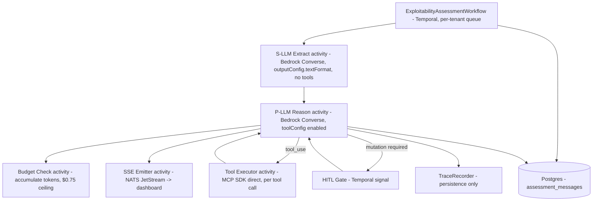

*State machine per activity: `IDLE → REASONING → TOOL_CALLING → EVALUATING → {COMPLETE | BLOCKED | FAILED}`.*

**No agent framework sits inside the reasoning loop (ADR-021).** `ExploitabilityAssessmentWorkflow` is a Temporal TypeScript workflow that calls the Bedrock Converse API directly, as ordinary Temporal activities:

- A bounded `while` loop, max 10 turns.
- **S-LLM activity:** `modelId: anthropic.claude-haiku-4-5`, `outputConfig.textFormat` with a JSON schema — structured CVE fact extraction only, no `toolConfig`, and raw CVE text never reaches the P-LLM.
- **P-LLM activity:** `modelId: anthropic.claude-sonnet-4-6`, `toolConfig` enabled with the discovered MCP tool schemas — receives structured facts plus asset context, never raw CVE text.
- **Tool-execution activity:** each tool call is its own retryable Temporal activity (`@modelcontextprotocol/sdk` client, direct — no framework mediates the call).
- **Budget-check activity:** accumulates token cost per turn; hard ceiling **$0.75/assessment** (same SLO as ADR-008 R2), `BUDGET_EXCEEDED` aborts the workflow.
- **SSE-emitter activity:** streams `ConverseStream` deltas onto NATS for dashboard real-time updates.
- **HITL:** a Temporal signal pauses the workflow at `VendorActionGate` or above the high-exploitability threshold, same signal mechanism as every other Gate-3 human-approval path in this corpus (ADR-007 R3, ADR-020 R2).

### CaMeL Dual-LLM Guardrail

The Suspicious LLM (S-LLM) is the only component that reads untrusted content (CVE text, tool output); it never executes tools and its output is schema-constrained. The Privileged LLM (P-LLM) executes tools and reasons over the assessment, but never sees raw untrusted text. A tool schema with an unconstrained free-text field defeats the boundary, so P-LLM tool schemas are structured JSON only.

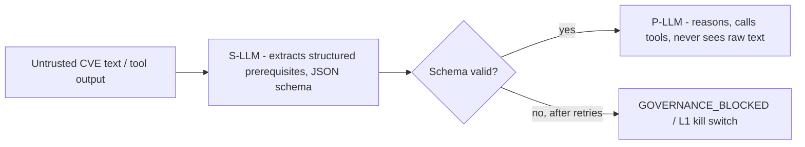

### Orchestration Loop

```
IDLE → REASONING → TOOL_CALLING → EVALUATING → { COMPLETE | BLOCKED (governance) | FAILED }
```

Agent status messages map to `REASONING` / `TOOL_CALLING` / `EVALUATING` / `COMPLETE` in the product taxonomy, and the `getLoopGuardStatus` query surfaces the guard state below in the US-017 trace-viewer API.

**Loop guards** — each escalates to a human; none retries silently:

| Guard | Condition |
|-------|-----------|
| `loop_detected` | the same tool with the same arguments, more than 3 times |
| `budget_exceeded` | the action or cost budget is exhausted |
| `convergence_failure` | 3 turns yielding zero new entities |
| `oscillation_detected` | A → B → A → B within the last 4 turns |

### Orchestrator-Worker Layers

| Layer | Component | Responsibility |
|-------|-----------|----------------|
| Outer orchestration | Temporal workflow (`ExploitabilityAssessmentWorkflow`) | lifecycle, CVE trigger, state machine, one child workflow per tenant |
| Activity facade | `AssessmentActivity` | thin entrypoint; wires collaborators; **no inline business logic** |
| Prerequisite subagent | `PrerequisiteExtractor` | S-LLM only; Zod-validated prerequisite schema (US-001) |
| Asset-context subagent | `AssetContextWorker` | scoped asset and runtime evidence (US-002) |
| Control-mapping subagent | `ControlMappingWorker` | vendor control panels and attack-path evidence (US-003) |
| Reasoning loop | `ReasoningLoop` | direct Bedrock Converse API `toolConfig` calls (no framework, ADR-021) plus MCP tool activities; enforces the action budget |
| Trace recording | `TraceRecorder` | persists `ASSESSMENT_REASONING_STEP` and code artifacts; **makes no LLM calls** |

**Hard rules:**

- **A distinct system prompt per tier.** Never reuse the orchestrator's prompt for a subagent.
- A worker's first message is a **structured brief**: objective, allowed tools, limits, output schema.
- **One child workflow per tenant**, for blast-radius isolation.
- Saga compensation persists partial state — for example, "analysis incomplete: asset context loaded, exploitability pending".
- Continue-as-new before the event limit.

**`AssessmentActivity` decomposition — each collaborator has one job, and is forbidden from the others:**

| Component | Must not |
|-----------|----------|
| `PrerequisiteExtractor` | call MCP or the P-LLM |
| `ReasoningLoop` | persist the trace |
| `TraceRecorder` | invoke an LLM or a tool |
| `AssessmentActivity` | contain vendor or SQL logic |

### Message History Storage

Bedrock Converse resends the full `messages` array every turn — ten turns of tool results can exceed Temporal's ~50 KB default workflow-state limit. Message history therefore lives in Postgres, not workflow state:

| Concern | Detail |
|---------|--------|
| Table | `assessment_messages` — `id`, `assessment_id`, `turn`, `role`, `content` (jsonb), `tool_use_id`, `created_at` |
| Workflow state | carries only `history_id` (UUID), `turn_count` (int), `spent_usd` (decimal), `status` (enum) — never the message array itself |
| Read/write | `ReasoningLoop` fetches by `history_id` at the top of each turn, appends the model response and any tool results at the end |

### Temporal Execution Contract

| Concern | Specification |
|---------|---------------|
| Child workflows | one per tenant — `taskQueue: assessment-{tenant_id}`; the orchestrator runs on `assessment-orchestrator` |
| CaMeL middleware | synchronous request/response **inside** each activity — not a separate runtime |
| Heartbeats | required on MCP and external activities. NVD 30 s / 10 s; AWS 120 s / 30 s; MCP 60 s / 15 s. `scheduleToCloseTimeout` 15 min; max 2 retries; backoff 1 s → 30 s |
| Continue-as-new | `continueAsNewSuggested` at ≥8 K events; hard at ≥10 K; **never exceed the 35 K safety cap** |
| Versioning | Temporal's current GA **Worker Deployment Versioning** mechanism — the pre-2025 experimental `patched()` + build-ID scheme was removed from Temporal Server in March 2026, though `patched()` itself remains a valid in-workflow fallback. Pin `ExploitabilityAssessmentWorkflow` v1 until the golden-set gate passes v2. **Gate-1 exit criterion — an unversioned worker is the single most common Temporal production failure** |
| Tracing | OTel spans on **every** workflow. **Gate-1 exit criterion.** Spans carry `tenant_id_hash`, never the raw ID |
| Saga compensation | partial failure → `status=incomplete`, `partial_context_loaded=true` |
| Action budget | `checkCostCap` is a per-iteration guard — it runs every iteration alongside `checkKillSwitch` (§5's "2 per iteration"). It additionally evaluates cumulative cost against the governance-kernel cost ladder (governance-kernel §2) at hard checkpoints on iterations 5, 10, and 15. Halt with `status=blocked` plus an L2 kill switch when `workflow_actions_per_assessment` reaches 200 |
| Step-effect idempotency | external effects carry a `mutation_key` and reconcile at resume time — exactly-once effects |

The design deliberately aligns with the Temporal-community **Sandbox Orchestration Harness** reference pattern (temporal.io blog, May 2026; a Code-Exchange community pattern, not an official Temporal product) — a durable workflow dispatching untrusted agent-generated code to ephemeral isolated sandboxes. Where the community reference uses pause/resume plus snapshot-fork, Dux deliberately tightens to fresh-microVM-per-invocation with no snapshot reuse (see §14, Sandbox Execution).

### Child-Workflow Mapping and Action Budget

| Transition | Child workflow / activity | Estimated actions |
|------------|---------------------------|-------------------|
| IDLE → REASONING | `PrerequisiteExtractionWorkflow` (S-LLM + schema) | 2 |
| REASONING → TOOL_CALLING (loop) | `ReasoningWorkflow` + `MCPInvocationWorkflow`, per iteration | 4–6 per iteration |
| Per-iteration guards | `checkKillSwitch`, `checkCostCap` | 2 per iteration |
| EVALUATING → COMPLETE | `FinalizeAssessmentWorkflow` | 2 |
| **Total** | 10 iterations, typical | **40–80** (p50 ≈ 55, p95 ≈ 58) |

Instrument `workflow_actions_per_assessment` from day one. Weighting: LLM = 1, MCP read = 2, MCP write = 5.

**The 70–80 tail is rare by construction, not by luck.** It occurs in under 5% of assessments, driven by multi-hop attack-path traversal on large asset inventories — cases that run past the 10-iteration typical case, up to the GOV-010 50-iteration ceiling. That tail pulls the mean up without moving the p95, which lands at 58 — inside the Phase-1 KPI SLO of p95 <60.

**Complexity pre-downgrade:** more than 100 assets, **or** a CVE description over 2 K tokens, auto-routes to the pinned `gpt-5.4-mini` (Unleash `complexity_router`). Log `downgrade_reason`.

The golden set that gates every release validates (CVE × synthetic-environment) *pairs*, with per-environment ground truth: exploitability is treated as a property of the pair, never the CVE in isolation — a CVE-only set validates triage, not environmental reasoning (H1).

---

## 7. Governance Kernel Chain

Every LLM call and MCP tool invocation is checked by `KillSwitchRelay` first; an active kill switch short-circuits the whole chain with a 503. Otherwise, five gates run in sequence, ending with `VendorActionGate` — the only legal path to a vendor mutation API — and then `HITLGate`, whose default outcome depends on the specific action's confidence floor.

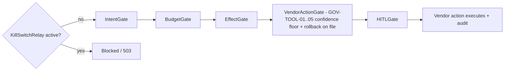

`VendorActionGate` outcome by tool:

| Tool | Behavior |
|------|----------|
| `network.blocklist_add` | needs confidence ≥ 0.75 or escalate to HITL |
| `policy.deploy_device_config` | needs confidence ≥ 0.75 or escalate to HITL |
| `ticket.create_remediation` | always executes unattended |
| `endpoint.isolate` | requires a live HITL response on every call, no confidence floor bypass |
| `patch.deploy_special_devices` | requires a live HITL response on every call, no confidence floor bypass |

---

## 8. MCP Gateway Security Layers

Six defense layers sit between the reasoning loop and every tool call, whether a read-only research tool or a vendor write action.

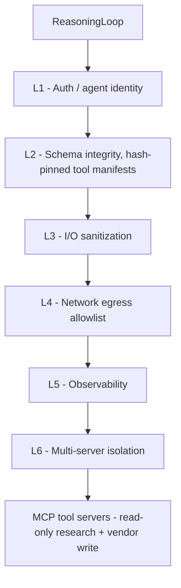

---

## 9. Vendor Write Path

Fast actions and the mitigation write path share the same gate. Three of the five canonical actions execute unattended by default and only escalate to HITL on anomaly (confidence-abstention band, sandbox timeout/OOM, T4 outlier); two fleet-impacting actions require a live human response on every call until each earns unattended execution via a field-proven safety record.

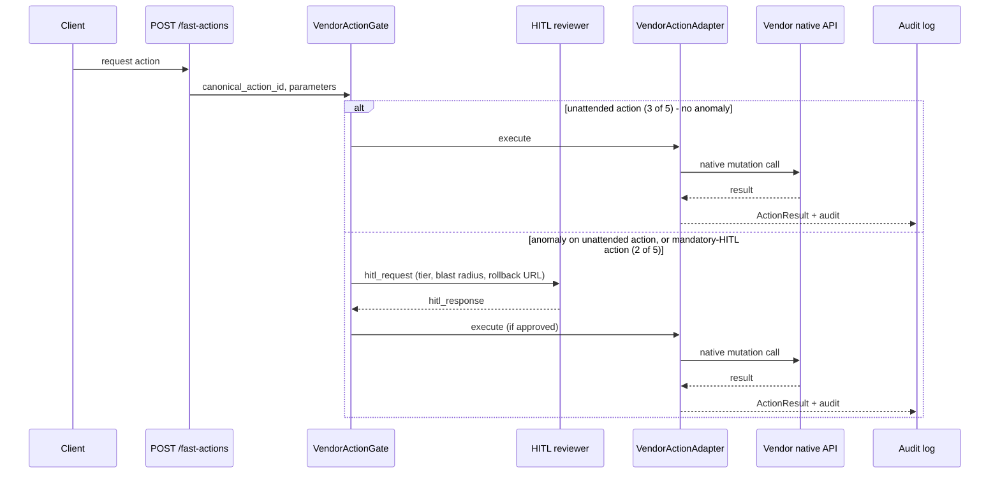

### Vendor Integration Flows

| Flow | Stage | Gate | Backend | Writes to vendor? |
|------|-------|------|---------|-------------------|
| A — Analyze | Analysis | Gate 1 | `ExploitabilityAssessmentWorkflow` + MCP read | No |
| B — Connector ingest | context source | Gate 1 | `sync()` → World Model | No |
| C — Action cards | Mitigations | **Gate 1, unattended by default** | `ActionCardProjection` + `QuickMitigationWorkflow` → ADR-012 R3 adapter | **Yes** |
| D — Fast Actions | Mitigations | **Gate 1, unattended by default** | `POST /fast-actions` → `QuickMitigationWorkflow` → ADR-012 R3 adapter | **Yes** |
| F — Remediation ticket | Remediation | **Gate 1 create + route, unattended by default** | `RemediationWorkflow` → `ticket.create_remediation` | **Yes** |
| G — Closed-loop validate | Mitigations | Gate 3 | `ClosedLoopValidationWorkflow` | re-assessment only |

### Gate-3 Workflows

`QuickMitigationWorkflow` runs four phases: policy check → execute via `VendorActionPort` → enqueue the post-action sync → hand off to `ClosedLoopValidationWorkflow`.

`ClosedLoopValidationWorkflow` is a saga. Forward: `reassess`, `update_ticket`, `notify`. Compensating: `mark_superseded`, `revert_ticket`, `notify_rollback`.

### The Vendor Mutation Sequence

```
POST /fast-actions
  → ActionPolicyGate.isAllowed
    → (escalate to HITL only on an anomaly)
      → VendorActionAdapter.execute
        → vendor native API
          → ActionResult + audit
```

**Agents reason over World Model snapshots and external intel. They do not invoke vendor mutation APIs inline.**

---

## 10. Data Model

### Tenancy Model

Shared database, shared schema, with RLS (ADR-002).

**Global entities — no `tenant_id`:** `CVE`, `EPSS_SCORE`, `CALIBRATION_RECORD`, `AGENT_DEFINITION`.

**Everything else carries a `tenant_id` foreign key — including `WORLD_MODEL_VERSION`.**

> **Why `WORLD_MODEL_VERSION` is tenant-scoped, not global.** ADR-011 R2 bumps it whenever a connector reports a material change. A global version row would let one tenant's connector sync cancel every other tenant's in-flight assessments, through `WorldModelVersionPurgeJob` — see [§17](#17-gdpr-and-lifecycle-workflows). That is a cross-tenant blast-radius bug, not a modelling preference.

**Composite key rule.** Every resource lookup uses `(tenant_id, id)` — **never `id` alone**. This is what prevents IDOR.

**Index policy.** Every tenant-scoped index **leads with `tenant_id`**. The RLS query rewrite depends on it.

### Core Entities

Columns abbreviated; the full column tables are preserved in the ERD.

| Entity | Key columns and notes |
|--------|----------------------|
| `TENANT` | `id`, `name`, `slug` (UK), `settings` jsonb (requires `aws_role_arn`, `external_id`), `status` enum — `provisioning` → `active` ↔ `suspended` → `deleted` → `purged`. **`purged` is terminal; there is no transition out of it** |
| `USER` | composite UK `(tenant_id, email)`; `role` enum `admin` / `member` / `viewer`; `auth_provider`; `external_auth_id` |
| `CVE` *(global)* | `id`, `description`, `cvss_score`, `kev_status`, `last_modified` |
| `EPSS_SCORE` *(global)* | `cve_id` PK, `epss_score`, `percentile`, `synced_at` |
| `EPSS_SCORE_HISTORY` *(global)* | `cve_id`, `epss_score`, `percentile`, `snapshot_date`; composite PK `(cve_id, snapshot_date)`; 90-day rolling retention. Appended daily alongside the `EPSS_SCORE` upsert — feeds predictive-risk-forecasting |
| `ASSET` | `hostname`, `asset_type` enum, `vpc_id`, `subnet_id`, `os_family`, `has_public_ip`, `metadata` jsonb, `deleted_at` (soft delete) |
| `ASSET_RELATIONSHIP` | `source_asset_id`, `target_asset_id`, `relationship_type`; unique on `(tenant_id, source, target, type)` |
| `FINDING` | `asset_id`, `cve_id`, `state` enum — `open` / `under_research` / `exploitable` / `mitigated` / `accepted` / `false_positive` |
| `VULNERABILITY_INSTANCE` | `asset_id`, `cve_id`, `sources[]`, `exploitability_status`, `network_exposure`, `last_seen_at`, `external_uids` |
| `VULNERABILITY_INSTANCE_ACKNOWLEDGMENT` | `reason`, `expires_at`, `revoked_at`; auto-expire job |
| `CUSTOM_METRIC` | `display_name`, `entity_type`, `dql_filter`, `group_by[]`, `dashboard_id`, `ordinal` |
| `EXPLOITABILITY_ASSESSMENT` | `finding_id`, `agent_session_id` (the KS-L1 target), `status` enum — `queued` / `researching` / `evaluating` / `complete` / `failed`; `reasoning_chain` (legacy, dropped at Gate 3); `confidence_score` (Platt); `calibration_record_id`. Partial unique on `(tenant_id, finding_id) WHERE status IN (active states)` |
| `ASSESSMENT_REASONING_STEP` | `step_order`, `step_type` (`reasoning` / `tool_result` / `conclusion`), `content`, `source_refs` |
| `ATTACK_PATH` | `path_nodes` jsonb — normalize to `ATTACK_PATH_NODE` at Gate 2 if the CTE degrades; `validated` |
| `CONTROL`, `CONTROL_ASSET_MAPPING` | vendor; `control_type` and subtype; `settings`; `mapping_type` |
| `AGENT_SESSION` | `session_type` (`assessment` / `chat`), `status`. **This is the KS-L1 scope** |
| `MCP_TOOL_INVOCATION` | `tool_name`, `server_id`, `outcome`, `latency_ms` — the PS-007 audit record |
| `CHAT_SESSION` / `CHAT_MESSAGE` / `CHAT_ACTION` | messages partitioned (1 year); `token_count` for billing; `hitl_status` |
| `USER_PREFERENCE` + `PREFERENCE_SCOPE` + `PREFERENCE_APPLICATION` | natural-language query, parsed scope, action, confidence, expiry |
| `ASSESSMENT_STATE_TRANSITION` | `from_status`, `to_status`, `actor_id` |
| `WEBHOOK_CONFIG` + `WEBHOOK_DEAD_LETTER` | `secret_ref` (Vault/SSM); DLQ payload and `attempt_count` |
| `AUDIT_EVENT` | `action`; `hash_chain` = `HMAC-SHA256(chain_key, prev_hash ‖ tenant_id ‖ action ‖ payload_hash ‖ created_at)`; `chain_seq` (monotonic per tenant, TEN-08); the genesis row has `prev_hash = 'GENESIS'`. **`chain_key` lives in Vault at `audit/chain-key`, rotated quarterly** |
| `MITIGATION_STEP`, `OWNERSHIP_EVIDENCE` | Gate-2 entities (dotted in the diagram) |
| `WORLD_MODEL_VERSION` (`world_model_versions`) | `tenant_id` FK; composite PK `(tenant_id, version)`; `active` |
| `AGENT_DEFINITION` *(global)* | `name`, `version`, `permission_scope`, `active` |
| `LLM_USAGE_EVENT` | `model`, `input_tokens`, `output_tokens`, `cost_usd`. **Enforces the $25/hour cap** |
| `CALIBRATION_RECORD` *(global)* | `model_version`, `prompt_version`, `platt_params`, `brier_score`, `ece`, `active` |

### Referential Integrity

| Parent | Child | ON DELETE |
|--------|-------|-----------|
| `tenants` | every `tenant_id` FK table | CASCADE |
| `findings` | `exploitability_assessments` | RESTRICT |
| `assets` | `findings` | RESTRICT — composite FK `(tenant_id, asset_id)` |
| `exploitability_assessments` | `assessment_state_transitions`, `attack_paths` | CASCADE |
| `user_preferences` | `preference_scopes`, `preference_applications` | CASCADE |
| `webhook_configs` | `webhook_dead_letters` | SET NULL — **preserve the DLQ** |

### Tenant Purge Order

**Do not reorder these:**

1. Halt workflows, and trip the kill switch.
2. Delete the MinIO prefix `tenants/{hash}/`.
3. `DELETE FROM tenants` — the cascade does the rest.
4. Revoke Vault secrets.
5. Write the `tenant.purged` audit record.

### Retention Matrix

| Data | Hot (Postgres) | Cold | Notes |
|------|----------------|------|-------|
| `audit_events` | 90 days | 7 years, Parquet in MinIO | actor IDs hashed 2 years post-purge; chain head anchored hourly to MinIO Object Locking (`dux-audit-anchors/`, COMPLIANCE mode, 7 years) |
| `mcp_tool_invocations` | 90 days | tenant-prefix archive | purged on hard delete |
| `chat_messages` | 1 year | export bundle | **PII lives in `content`**; purged on hard delete |
| Assessment state | per partition | — | state transitions retained |
| LLM traces | Langfuse retention | — | `tenant_id` in metadata; the sanitizer runs before export |
| API traces | 7 days | — | 10% head sampling, plus 100% of errors |

### Indexing Strategy

Physical tables are `snake_case` plural; ERD entities are `SCREAMING_SNAKE` singular. Global tables lead their index with the natural primary key.

**Every tenant-scoped index leads with `tenant_id`.** Representative set:

| Table | Index |
|-------|-------|
| `ASSET` | `(tenant_id, hostname)`, `(tenant_id, subnet_id)`, `(tenant_id, last_synced_at DESC)` |
| `FINDING` | `(tenant_id, cve_id, asset_id)` |
| `EXPLOITABILITY_ASSESSMENT` | `(tenant_id, status, completed_at)`, `(tenant_id, finding_id)` |
| `ASSESSMENT_REASONING_STEP` | `(tenant_id, assessment_id, step_order)` |
| `AUDIT_EVENT` | `(tenant_id, created_at DESC)` |
| `EPSS_SCORE` *(global)* | `(cve_id)` |

**Monitoring.** Alert if any tenant-scoped table exceeds **more than 0 sequential scans per 5 min in staging**, or **more than 10 per hour in production**. A sequential scan on a tenant-scoped table means the RLS rewrite has lost its index.

### Row-Level Security (Canonical DDL)

```sql
ALTER TABLE assets ENABLE ROW LEVEL SECURITY;
ALTER TABLE assets FORCE ROW LEVEL SECURITY;
CREATE POLICY tenant_select ON assets FOR SELECT
  USING (tenant_id = current_setting('app.tenant_id', true)::uuid);
CREATE POLICY tenant_insert ON assets FOR INSERT
  WITH CHECK (tenant_id = current_setting('app.tenant_id', true)::uuid);
CREATE POLICY tenant_update ON assets FOR UPDATE
  USING (tenant_id = current_setting('app.tenant_id', true)::uuid)
  WITH CHECK (tenant_id = current_setting('app.tenant_id', true)::uuid);
CREATE POLICY tenant_delete ON assets FOR DELETE
  USING (tenant_id = current_setting('app.tenant_id', true)::uuid);
```

**Apply all four policies to every tenant-scoped table, including `world_model_versions`** (see §10.1).

**Global tables:** `cves` gets `FOR SELECT USING (true)`, and ingestion runs under a separate connector role. Likewise `epss_scores`, `calibration_records`, `agent_definitions`.

**Migration CI.** `check-rls.sh` verifies `ENABLE` **and** `FORCE` on every `tenant_id` table, within a single transaction: `CREATE TABLE` → `ENABLE` → `FORCE` → `CREATE POLICY` → `CREATE INDEX`. ISO-013 covers the `tenant_cve_findings` materialized-view refresh.

### RAG Schema

**Enabled (D-34, ADR-020 R2): `rag_enabled = true`.** Agentic RAG runs hybrid vector + BM25 retrieval over `tenant_embeddings`, extended with an Apache AGE graph layer.

`tenant_embeddings` — `embedding vector(1536)`, RLS FORCE. A `tenant_id`-leading HNSW index is not implementable in pgvector — HNSW is a single-column ANN index type and cannot compose with a leading scalar column the way a btree does. The actual approach: `tenant_embeddings` is declaratively partitioned by `tenant_id` (`PARTITION BY LIST (tenant_id)`, matching the composite-key pattern in §10.1), with a local HNSW index built per tenant partition — search never crosses a partition boundary, so ANN recall stays tenant-scoped by construction, not by query-time filtering.

Two open items trail this design, and are worth naming rather than smoothing over: **the ISO-012 ANN adversarial-neighbor test against this live, tenant-scoped HNSW index is not yet confirmed executed** — the architectural flip to `rag_enabled = true` is current canon, but a documentation pass alone cannot produce that execution artifact (tracked as **OI-41**). And the **concrete node/edge/provenance column-level schema for the Apache AGE graph layer is not yet specified anywhere in the corpus** — the architectural decision exists, the ERD entities for it don't yet (tracked as **OI-46**).

**Graph layer (D-34, ADR-020 R2): Apache AGE**, a Postgres extension on the same CloudNativePG instance as `tenant_embeddings` — no second database, no second isolation model to secure. Per-edge provenance and integrity hashing apply the same "connector-asserted data is untrusted for negative verdicts" rule to every graph edge (camel-plane §7).

---

## 11. Multi-Tenancy

### Isolation Model

| Aspect | Decision |
|--------|----------|
| Isolation | shared database, shared schema |
| Tenant key | `tenant_id` — a cryptographically secure UUID |
| Database enforcement | PostgreSQL RLS, with FORCE |
| Application enforcement | middleware sets tenant context on **every** request |
| Auth source of truth | the NestJS JWT `tenant_id` claim (ADR-001) |
| Resource lookup | composite key `(tenant_id, id)` |
| Exceptions | **none, without a new ADR** |
| Overhead budget | RLS costs roughly **5–15%** (2026 field consensus). Owned explicitly, and kept low by `tenant_id`-leading composite indexes |

### Context Propagation Rules (OWASP-Validated, All Mandatory)

1. **Tenant context comes from the authenticated JWT claim only.** Never from a client header, query parameter, or path segment without validation.
2. Every tenant-scoped database operation runs inside a transaction with `SET LOCAL app.tenant_id = $1`.
3. **Every tenant-scoped query runs through PgBouncer in transaction mode (`pool_mode=transaction`), with `SET LOCAL app.tenant_id` inside that transaction.** `SET LOCAL` is transaction-scoped by construction — the GUC cannot leak to the next borrower, because it does not survive past the transaction that set it. **CloudNativePG-fronted PgBouncer (2026-07-19, D-33) can run session-mode pooling if ever needed** — unlike Neon's pooler, this is now self-hosted and unconstrained — but transaction mode remains the default with no stated reason to change it.

   > The pool-reset trap this guards against is real, and transaction-mode `SET LOCAL` closes it without `DISCARD ALL` or session-mode pooling. A prior version of this document required PgBouncer session mode — unimplementable on Neon's pooled endpoint, which was transaction-mode only. That mandate is retired; the self-hosted CloudNativePG migration makes session mode available again, but there is still no reason stated to use it.

4. **Admin impersonation**, in order: validate the admin JWT → verify MFA → read `X-Impersonate-Tenant` → replace the effective `tenant_id` → write the `admin.impersonate` audit record → `SET LOCAL` → query. **RLS still applies to the impersonated tenant.**
5. **Service to service:** an internal JWT with `iss=dux-internal`, `aud=worker`, TTL 5 min. It **must** carry `tenant_id`, and the worker rejects a missing claim *before* `SET LOCAL`.
6. **The kill-switch `LISTEN/NOTIFY` fallback (KS-007) uses CloudNativePG's direct, unpooled endpoint** — `LISTEN`/`NOTIFY` require a persistent session connection, which the pooled endpoint cannot provide in either mode. Local development may use the same direct connection with `SET LOCAL`, for parity.
7. **Every OTel span carries `dux.tenant_id_hash`** — `HMAC-SHA256[:8]`. **The raw `tenant_id` never appears in a log.**

### Application-Layer Enforcement

| Layer | Enforcement | Verification |
|-------|-------------|--------------|
| API gateway | reject any request without valid tenant context; JWT-derived only | AUTH-003 |
| Service layer | assert `resource.tenant_id == request.tenant_id` | unit tests |
| Cache (Valkey) | key is `tenant:{HMAC-SHA256(tenant_id, secret)[:16]}:`. On read: deserialize, then **assert `payload.tenant_id === request.tenant_id`** — otherwise treat it as a miss and emit `cache_tenant_mismatch` | key-naming lint |
| File storage (R2) | per-tenant envelope encryption — a DEK wrapped by the platform KEK in Vault/SSM. **The path `tenants/{HMAC[:12]}/` is obfuscation only, not a control.** `StoragePort` mints pre-signed URLs valid ≤15 min, after a JWT check; a GET verifies the JWT tenant **before** unwrapping the DEK | `test:storage-envelope` |
| Message queue | `tenant_id` travels in the payload; `WorkerTenantGuard` validates it before `SET LOCAL` | consumer tests |
| Search (Postgres FTS) | `tenant_search_index (tenant_id, doc_type, entity_id)`; every query includes `tenant_id` | ISO-006 |
| LLM calls | `llm_usage_events` tagged with `tenant_id` | metering tests |

`TenantScopedRepository<T>` enforces composite-key lookups. **ESLint bans `findOne({ where: { id } })` without a `tenant_id`.** The GUC is re-asserted at runtime before every query.

### Multi-Tenant Isolation Diagram

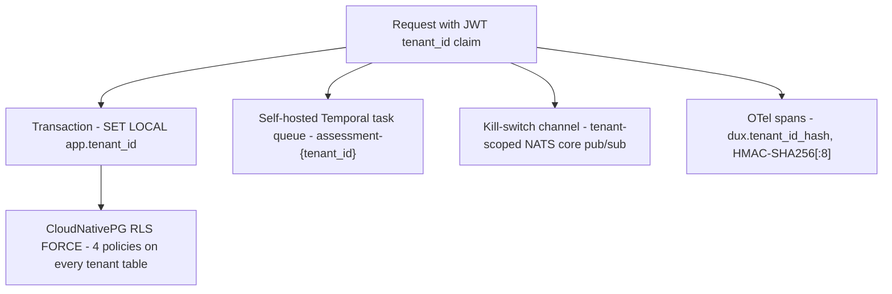

*Isolation is enforced at every layer the request touches: Postgres RLS with FORCE, composite `(tenant_id, id)` lookups, tenant-scoped Temporal task queues, tenant-scoped kill-switch pub/sub channels, and HMAC-hashed tenant IDs in all telemetry so raw tenant IDs never appear in logs or traces.*

### Graph Latency — Two Numbers, Deliberately Not Unified

| Number | Value | Purpose |
|--------|-------|---------|
| **NFR-004 SLO ceiling** | 3-hop CTE p95 **<200 ms above 2 K assets** (TR-NFR-006) | the commitment |
| **Migration trigger** | p95 **>150 ms above 1 K assets, for 7 consecutive days** | the early warning |

The trigger fires *before* the SLO breaches, giving lead time to act. **Apache AGE (D-34) is the first-line response (2026-07-20, D-43):** the graph layer already lives on the same CloudNativePG Postgres, so the trigger is answered with AGE-native scaling levers — index tuning, read-replica routing, partitioning — not a database migration. **Neo4j is kept on the books only as a further-future escape valve**, for the case where AGE-native tuning itself can't hold the SLO; it is not an active migration in progress. The 50 ms and 1 K-asset gap between the trigger and the SLO ceiling is deliberate lead-time budget. Do not "simplify" it into one number.

### Tenant Lifecycle

**Provisioning.** Create the tenant and default roles (the first user is admin) → validate the AWS role ARN and external ID → run `pnpm test:isolation --filter ISO-007` and `check-rls.sh` (**activation is blocked on failure**) → connector sync → audit `tenant.provisioned`.

**Suspension.** Block new assessments and writes (403); set `agent_sessions.status = blocked`; send the Temporal cancel signal; open a read-only 30-day export window; activate KS-L3; audit `tenant.suspended`.

**Deletion.** Soft-delete → days 0–30, export available (24 h SLA) → days 31–90, legal-hold retention → **day 90, hard purge** across MinIO, the database, and backups. Audit logs are anonymized on purge. Audit `tenant.deleted`, then `tenant.purged`.

A `legal_hold` flag blocks the day-90 purge, and notifies Legal.

### Noisy Neighbor Protection

**Primary detector:**

```promql
sum by (tenant_id)(rate(pg_stat_statements_calls[5m]))
  / sum(rate(pg_stat_statements_calls[5m])) > 0.10
```

Sustained for 5 min → throttle that tenant's assessment queue. Auto-resume below 5%.

**Secondary (TEN-05):** above 8% for 30 min — this catches the slow bleed the primary detector misses.

**Pool cap:** 5 connections per tenant, plus 20% headroom, with a `pgbouncer_pool_exhaustion` alert.

**Cost cap:** $25 per hour per tenant, enforced through the `LLM_USAGE_EVENT` index.

### Isolation Testing

**Mandatory:** ISO-001–010, plus API-layer tenant-ID fuzzing (`pnpm test:fuzz-tenant-id`, ISO-FUZZ-001–005).

These run on **every** PR touching `packages/api/`, `packages/database/`, or `packages/core/`.

**Any cross-tenant read is a merge block.** Full suite tables: ci-cd-testing.

---

## 12. Observability

Every LLM and MCP call is wrapped by an instrumented client so no call bypasses tracing. Spans follow the OTel GenAI semantic convention into self-hosted Langfuse and self-hosted Grafana LGTM (Loki/Tempo/Prometheus), and burn-rate alerts watch the resulting metrics.

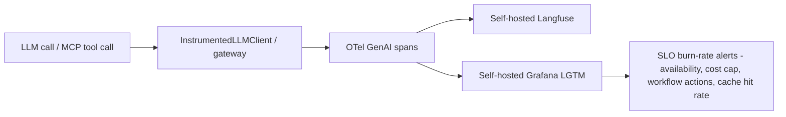

---

## 13. Evals & Confidence Pipeline

Golden-set regression is a merge-blocking CI gate. The exploitability verdict itself is scored by a three-signal confidence ensemble, calibrated with Platt scaling, and mapped to abstention bands that decide routing, including whether a case escalates into the HITL path shown in [§7](#7-governance-kernel-chain).

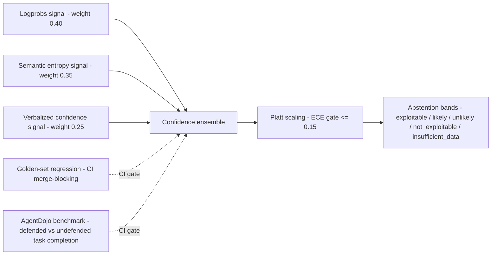

---

## 14. Sandbox Execution

Investigation scripts written by the agent are statically scanned before they ever run, then executed in a fresh microVM that is discarded after one invocation, with default-drop network egress.

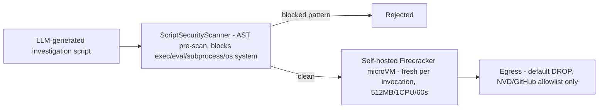

Shared-kernel containers were rejected outright for running LLM-generated code: the 2026 security consensus, backed by CVE-2024-21626 ("Leaky Vessels"), CVE-2024-0132, and the SandboxEscapeBench 2026 results, is that plain Docker/runc isolation isn't a real security boundary for AI-generated code. gVisor is read-only defense in depth only, and never runs LLM code. Every investigation script runs in a fresh, ephemeral Firecracker microVM that's never reused: VM reuse is itself a data-leak vector. `firecracker-containerd`/Kata Containers remain an allowed interim bridge technology, not a fallback decision; Firecracker is the actual target architecture.

---

## 15. Lives-Inside Architecture (Logical Residency)

**Dux runs in Dux Cloud.** Customer data is reached through **read-only APIs and OAuth**, not in-VPC compute.

**"Lives inside your environment" means deep, continuous *logical* visibility — not physical residency.** Sales copy must not imply otherwise.

The Unified Integration Layer:

```
Credential Manager (IAM STS + external ID, OAuth 2.0, scoped API keys, SAML/OIDC)
  → Evidence Collector (unified polling)
    → World Model graph
      → Exploitability Engine (LLM reasoning + rule engine + sandbox)
```

Physical residency — the `dux-resident-agent` DaemonSet — is **Gate 5 only**.

---

## 16. Application-Service Conventions

Services are named `{Verb}{Noun}Service`. **Controllers and SSE handlers delegate to the same service** — `POST /research/queue` and the chat `request_research` event both go through `AssessmentEnqueuePort`.

| Concern | Pattern |
|---------|---------|
| Governance kernel | Chain of Responsibility — `IntentGate → BudgetGate → EffectGate → VendorActionGate → HITLGate` |
| S-LLM fallback | Strategy |
| Control refinements (FR-019) | Specification |

---

## 17. GDPR and Lifecycle Workflows

| Workflow | Contract |
|----------|----------|
| `TenantExportWorkflow` | GDPR Art. 15 and 20 — completes within 24 h |
| `GDPRDeletionWorkflow` | Art. 17 — soft-delete → 30-day export hold → hard-delete → crypto purge within 90 days |
| `WorldModelVersionPurgeJob` | cancels workflows older than 24 h on a superseded version, **scoped to the affected tenant only**. `world_model_versions` is tenant-scoped — **one tenant's connector sync must never cancel another tenant's in-flight work** |
| `ReassessmentSchedulerWorkflow` | continuous re-assessment (ADR-016) — see continuous-assessment |

The canonical deletion timeline — day-0 soft-delete, 30-day export window, day-90 hard purge — is authoritative in [multi-tenancy §5 above](#11-multi-tenancy) (D-18).

---

## 18. Key Architecture Decisions

Twenty-one ADRs govern this architecture, five of them revised three or more times across a single week of infrastructure churn in July 2026. The throughline across nearly every revision is the same trade-off, stated explicitly each time: **portability and auditability for regulated buyers, over the cheaper and faster managed-service default.**

**Status convention.** `Accepted` unless noted. **R2** is the ideal-state revision (2026-07-05, Gap Closure v2.2); **R3** is the 2026-07-13 write-path re-gating. Where a revision exists it is canonical, and the original decision is retained beneath it as `Superseded` — an ADR is a decision record, and unlike a spec it is *meant* to carry its own history. **Legacy numbering (AI-22):** Blueprint ADR-034–037 map to corpus ADR-003–006; CI blocks any out-of-corpus ADR reference. **Staleness rule (AI-21):** every ADR carries a `last_reviewed`/`next_review` pair, and CI lint fails any ADR more than 180 days stale.

### Summary Table

| ADR | Decision | Status |
|-----|----------|--------|
| ADR-001 | Better Auth via `AuthPort`; JWT + refresh rotation; SPIFFE-format agent claims | Accepted |
| ADR-002 | **R2:** Shared-schema RLS FORCE on CloudNativePG; NATS/Valkey cache and pub/sub | Accepted (R2) |
| ADR-003 | **R2:** Drizzle ORM on CloudNativePG; expand-contract migrations; ephemeral cluster-per-PR | Accepted (R2) |
| ADR-004 | AWS SDK v3 asset discovery; cross-account IAM + external ID | Accepted |
| ADR-005 | **R2:** Notification queues on NATS JetStream + SES/Slack/webhooks — **not** BullMQ | Accepted (R2) |
| ADR-006 | **R4:** Kubernetes (EKS) from Gate 1, Pulumi IaC; Vault secrets; Cloudflare-only WAF; MinIO audit anchor | Accepted (R4) |
| ADR-007 | **R3:** Self-hosted Temporal on K8s is the canonical `WorkflowPort` from Gate 1; DBOS demoted | Accepted (R3) |
| ADR-008 | **R2:** CaMeL-tiered LLM routing; ≤$0.75 SLO at 45% cache; **Gate-2 triage via Bedrock's cheapest model (D-35), vLLM+Phi-4 retired** | Accepted (R2) |
| ADR-009 | Agent-as-directory registry — filesystem SSoT, AIBOM-native | Accepted |
| ADR-010 | **R5:** LiteLLM removed — direct Bedrock SDK behind `LLMProviderPort`, NestJS-level provider fallback/retry; Bifrost demoted to a Gate-2 spike, evaluated only if routing complexity outgrows NestJS fallback logic | Accepted (R5) |
| ADR-011 | **R2:** Vendor connector framework in Phase 1; ≥3 connectors live at Gate 1 | Accepted (R2) |
| ADR-012 | **R3:** Vendor-action write path in Phase 1, **unattended by default at Gate 1**; HITL is anomaly escalation only; closed-loop validation at Gate 3 | Accepted (R3) |
| ADR-013 | Provider ports + ESLint boundary — only `packages/adapters/*` may import vendor SDKs | Accepted |
| ADR-014 | **R2:** React + Vite SPA (TanStack Router/Query), MinIO + Cloudflare CDN; SSE + POST, not WebSocket | Accepted (R2) |
| ADR-015 | **R4:** Self-hosted Firecracker on K8s is the **Gate-1 default**; E2B retired; AST pre-scan mandatory | Accepted (R4) |
| ADR-016 | **R2:** Continuous Assessment Engine — event-driven (NATS pub/sub) + scheduled + dirty-check | Accepted (R2) |
| ADR-017 | **R3:** Multi-provider Claude inference — Bedrock primary → direct Anthropic fallback → local vLLM emergency, via direct SDK + NestJS fallback (not LiteLLM); OpenAI stays direct | Accepted (R3) |
| ADR-018 | Frontend design system — headless (React Aria + Radix) on a design-token source of truth; WCAG 2.2 AA enforced | Accepted |
| ADR-019 | Data visualization — headless charts (Visx) + SVG; dedicated graph lib when multi-hop ships | Accepted |
| ADR-020 | **R2:** Agentic RAG enabled — Postgres/pgvector + Apache AGE graph extension (both on CloudNativePG); hybrid + self-hosted reranker; constrained decoding, GraphRAG as a security component | Accepted (R2) |
| ADR-021 | Remove Mastra and LangGraph.js; the agent reasoning loop is a Temporal TypeScript workflow calling AWS Bedrock Converse API directly | Accepted |

### ADR-001 — Authentication

**Better Auth** (a library, $0 per MAU) behind `AuthPort`. Users live in CloudNativePG under RLS.

| Concern | Decision |
|---------|----------|
| Access JWT | claims `sub`, `email`, `tenant_id`, `role`, `jti`, `aud`, `exp`. `aud` is `api.dux.io` or `app.dux.io`; **a wrong `aud` is a 401** |
| Refresh | token families with rotation and reuse detection — `REFRESH_TOKEN_REUSE_DETECTED` invalidates the entire family |
| Lifetimes | access 60 min; refresh 7 days; **agent tokens 15 min** |
| Transport | HTTP-only cookies for the dashboard; Bearer JWT for the API. **No browser Supabase client** |
| MFA | optional TOTP in Phase 1; **mandatory before any pilot ≥$50 K**; enforced for `admin` |
| Passwords | Argon2id (m=65536, t=3, p=4), 12-character minimum, HIBP check |
| Route guards | `UserAuthGuard` / `AgentAuthGuard` / dual-scope matrix |
| Impersonation | session GUCs (`app.tenant_id`, `impersonator_sub`, `impersonation_reason`); nightly IdP reconciliation; manual grants expire after 24 h |
| Agent claims | SPIFFE format — `spiffe://dux.io/tenant/{t}/agent/{a}` |

**Adapters:** `BetterAuthAdapter` (default) ↔ Supabase ↔ WorkOS (enterprise SAML).

A security review (resolving SR-02, 2026-07-16) turned up three gaps, all fixed:

| # | Gap | Fix |
|---|-----|-----|
| SEC-AUTH-01 | Per-tenant rate limiting is applied **post-auth** (§1 above) — `login`, `signup`, `password-reset`, and `mfa-verify` are pre-auth and have no `tenant_id` yet, so they were undocumented against brute-force/credential-stuffing. | IP-based **and** account-based throttling on all four endpoints, ahead of and independent from the per-tenant throttler: max 5 failed logins per account per 15 min (progressive backoff), max 20 per IP per 15 min. Cloudflare edge (coarse limits, already in the trust-boundary diagram) is the first layer; this is the application-layer backstop. |
| SEC-AUTH-02 | No documented path to force-invalidate a **live access JWT** before its 60-minute natural expiry. Refresh-token-family invalidation (`REFRESH_TOKEN_REUSE_DETECTED`) stops a new access token from being minted, but an already-issued one stays valid until it expires — on a suspected account compromise, forced admin logout, or SCIM deprovisioning, that's up to a 60-minute exposure window. | A short-TTL Upstash denylist (`revoked_jti:{jti}`), checked by `UserAuthGuard`/`AgentAuthGuard` on every request, TTL'd to the token's remaining `exp`. Populated on: password change, admin-forced logout, SCIM deprovision, and KS-L2/L3/L4 activation for the affected tenant or session. This is a targeted denylist, not a full session store — it only ever holds tokens actively being revoked early. |
| SEC-AUTH-03 | JWT signing algorithm and cookie security attributes were unspecified. | **RS256** (asymmetric — a compromised API instance can verify but not mint tokens), with quarterly key rotation via AWS SSM (D-5 convention). Dashboard session cookies: `Secure`, `HttpOnly` (already stated), `SameSite=Strict`, `__Host-` prefix. |

**Not flagged as a gap:** Better Auth's own supply-chain posture is already covered by the Gate-1 full-tree SBOM + CI-runner credential-hygiene control (ci-cd-testing §5) — it's an npm-tree dependency like any other, not a special case.

**LOCK-01: Better Auth 1.5 (2026-02-28) shipped self-service SAML, with SCIM reaching GA on 2026-04-16 — SAML/SCIM is no longer a triggering gap.** A two-rung exit ladder stands ready if enterprise demand outgrows it: rung 1 is the Better Auth SSO plugin (days, $0 marginal cost); rung 2 is WorkOS ($125/connection/month), reserved for capabilities the plugin doesn't cover. **Trigger:** the first enterprise security questionnaire demanding SSO — pre-RFP, not the first SAML RFP.

**Rejected:** Clerk and Auth0 (per-MAU cost); Keycloak (operational burden). **Series A:** hardware keys.

**OI-36 closed (2026-07-19, D-33).** The live `demo`/`api-demo.dux.io` deployment observed running Descope was environment drift, not an adopted alternative — Better Auth is confirmed as canon.

### ADR-002 R2 — Multi-tenancy

Shared database, shared schema, with a `tenant_id` UUID on every tenant-scoped table.

- **RLS FORCE.** No `BYPASSRLS`, and no superuser for the application or migration roles.
- `SET LOCAL app.tenant_id` per transaction. **Fail closed if the GUC is unset.**
- `TenantContextMiddleware` validates the UUID → 401 `tenant_context_invalid`.
- **Composite foreign keys prevent IDOR.**
- `cves` is global and read-only — ESLint `no-direct-cves-query`; join through `findings` only.
- **Transaction-mode pooling via PgBouncer, with `SET LOCAL` per transaction.** `SET LOCAL` is transaction-scoped by construction, so RLS is correct under transaction-mode pooling. Session-mode pooling is now an available option (self-hosted PgBouncer, no Neon-imposed constraint) but there is no stated reason to switch off the transaction-mode default.
- `TenantScopedRepository<T>` plus a `no-raw-findone` lint. The GUC is re-asserted at runtime before every query.

**Rejected:** schema-per-tenant and database-per-tenant — cost and operational burden at pre-seed. EDBT 2026 validates shared-schema RLS with `tenant_id`-leading indexes.

**R2 (2026-07-19, D-33): Postgres host moves from Neon to CloudNativePG** (self-hosted operator on Kubernetes) — see ADR-006 R4 below. RLS FORCE, `SET LOCAL`, `TenantContextMiddleware`, composite-FK, and `TenantScopedRepository` mechanics are all host-agnostic and unchanged. Backups move from Neon's managed PITR to CloudNativePG's native backup/restore (WAL archiving to MinIO). **Superseded:** Neon branch-per-PR ephemeral test databases — see ADR-003 R2 below for the replacement mechanism.

Full spec: [§11 above](#11-multi-tenancy).

### ADR-003 R2 — Database migrations

**Drizzle ORM** on CloudNativePG. **Expand-contract only**; forward-fix preferred; a pre-migration base-backup snapshot runs before any destructive change (CloudNativePG's native backup, replacing Neon's PITR pre-hook).

- **Ephemeral CloudNativePG cluster per PR**, provisioned via the K8s operator (`Cluster` CR from a base-backup template) — replaces Neon's branch-per-PR. 7-day stale cleanup, alert above 20 live ephemeral clusters, same lifecycle intent as the original.
- `pnpm ops:migrate` runs before deploy.
- **`check-rls.sh` is a merge gate**, and ships with a negative fixture that *must* fail.
- `SchemaSyncService` detects drift → fail-closed P1.
- `world_model_versions` gets a 24 h in-flight compatibility window plus a purge job.
- `CREATE INDEX CONCURRENTLY` from seed.

**Rejected:** TypeORM, Prisma, Flyway (JVM). **Reversal trigger:** more than 3 rollbacks in a quarter.

**R2 (2026-07-19, D-33).** Host moves Neon → CloudNativePG (ADR-002 R2/ADR-006 R4). The per-PR ephemeral-database mechanism above is new engineering surface this migration creates — no equivalent existed for a self-hosted operator before; sized in the backlog re-cost.

### ADR-004 — Asset discovery

**AWS SDK v3**, modular clients: EC2, IAM, ELBv2, ECS (list → describe), EKS (cluster only), S3, RDS, Lambda, CloudFront.

Cross-account IAM assume-role with an external ID (`tenants.settings.aws_role_arn` + `external_id`); STS validation errors map to UI banners. Delta sync per tenant and service; throttle backoff, max 5 retries; assets soft-delete via `deleted_at` and carry a historical badge.

**One AWS account per tenant in Phase 1.** AWS Organizations delegated admin lands at Gate 2; AWS Config at Phase 2+.

**Rejected:** CloudQuery (premature), Prowler (a scanner, not discovery). **Reversal trigger:** if the SDK approach proves inadequate above 10 K assets, revisit CloudQuery.

### ADR-005 R2 — Notification engine

**Durable queues on NATS JetStream** — `email_queue` (SES), `slack_queue`, `pdf_queue` (Gotenberg), `webhook_queue` (durable retries). **Not BullMQ.**

- MJML + Handlebars templates, with snapshot CI.
- SES with DKIM, SPF, DMARC. Bounce <5% and complaint <0.1% are P2; **internal halt at 0.05%**.
- Webhooks: 5 attempts with exponential backoff → `webhook_dead_letter` (a JetStream dead-letter stream); alert above 10 per tenant per hour; replay CLI; HMAC-SHA256 plus `Idempotency-Key`.

**Rejected:** SNS/SQS (AWS-only, breaks portability), a custom queue.

> **Correction (BS-10, retained).** The legacy TRD's "Webhooks (outbound)" table specified BullMQ on Redis DB1. That contradicts this ADR and FR-010. Canonical delivery uses the JetStream-backed durable queue, with the same retry, HMAC, and idempotency parameters.

**R2 (2026-07-19, D-33): Neon-backed table queues → NATS JetStream.** Same four queue roles, same retry/HMAC/idempotency contract — transport only. Closes a gap this ADR never carried a reversal trigger for, by resolving the choice outright rather than adding a trigger to the old one. **Superseded:** the Neon-table transport is retained only as prior-state history.

### ADR-006 R4 — Deployment topology

**Kubernetes (Amazon EKS, managed control plane) from Gate 1.** `dux-api`, `dux-connector-sync`, and `dux-sandbox` are separate K8s Deployments, same blast-radius isolation intent as the prior ECS services (`dux-litellm` is retired — see ADR-010 R5). **Pulumi (TypeScript)** provisions the EKS cluster and workloads — same monorepo language as `packages/api`/`packages/core`, keeping the OI-17 one-language rationale intact. Managed node group with auto-scaling: CPU >70% for 2 min or memory >80% for 2 min scales the node group up; agent queue depth >50 scales Temporal workers.

**R4 (2026-07-19, D-34): DigitalOcean/Linode LKE → EKS.** The self-hosted-Kubernetes decision itself (R3, D-33) is unchanged — this narrows only the CSP/cluster flavor. EKS is a FedRAMP-authorized CSP with GovCloud availability, reopening OI-38 favorably; the manifests, Pulumi IaC language, Vault/NATS/Valkey/MinIO/CloudNativePG/self-hosted-Temporal/self-hosted-Firecracker workloads, and the Cloudflare-edge-WAF-plus-Falco defense-in-depth posture all continue to run unchanged, now on EKS. The multi-cloud/on-prem-portability rationale from R3 still holds — Kubernetes manifests run identically on EKS, GCP, Azure, DigitalOcean, Linode, and on-prem; EKS is a specific, FedRAMP-capable point on that same portability spectrum, not a reversal of it.

**Rationale (2026-07-19, D-33, retained).** Dux sells to finance and healthcare. AWS-only (ECS Fargate) is a rewrite the moment an ICP demands air-gapped or on-prem deployment — the exact failure mode already observed with E2B in ADR-015 R4.

**Secrets:** **HashiCorp Vault** (self-hosted on K8s) replaces AWS SSM Parameter Store — Vault was already carried as "optional later" in the original D-5; this migration makes it the default.

**WAF:** AWS WAF is retired with ECS. **Cloudflare edge WAF** (already retained for DNS/CDN) becomes the sole WAF layer, backstopped by **Falco** for in-cluster runtime detection (sandbox escapes, anomalous syscalls) — defense-in-depth shifts from network-layer-plus-app-layer to edge-layer-plus-runtime-layer.

**Audit archive:** **MinIO Object Locking (Compliance mode)** replaces the AWS S3 + Object Lock anchor — same S3-API object-lock semantics, self-hosted.

> **Superseded (R4):** DigitalOcean Kubernetes / Linode LKE as the cluster CSP. **Superseded (R3):** ECS Fargate, AWS CDK, AWS SSM Parameter Store, AWS WAF, and the AWS S3 audit anchor — all retired in favor of the Kubernetes/Pulumi/Vault/Cloudflare-WAF/MinIO stack above. **Superseded (R2, retained from history):** a single Railway container, an inline Railway → AWS migration RFC, VPS deploy scripts, and the resident-agent chart in Phase-1 infrastructure.

### ADR-007 R3 — Durable execution engine

**Self-hosted Temporal (on Kubernetes) is the canonical `WorkflowPort` engine from Gate 1** — battle-tested durability, native retries, visibility, and HITL signals, now run in-boundary rather than as a SaaS dependency.

**R3 (2026-07-19, D-33): Temporal Cloud → self-hosted Temporal on K8s, persistence on CloudNativePG.** This closes a gap where the $500/mo Temporal Cloud cost trigger was fireable but unmonitored — no `dux_cost_temporal_cents` panel existed — by removing the SaaS cost variable entirely rather than instrumenting it. Self-hosted Temporal gives **event-sourced audit trails** — every approval, rejection, and escalation is an immutable workflow-history event, in-boundary — which is now a sales-relevant property for finance/healthcare ICPs, not just infrastructure. mTLS between workers and the Temporal frontend is now issued via **cert-manager or Vault** (replacing D-16's AWS-SSM-stored-certificate mechanism); the per-tenant-DEK `PayloadCodec` wrapping scheme is unchanged, now wrapped by a Vault-held KEK instead of an SSM-held one.

**DBOS is demoted to a future cost-optimization spike behind the same port** (R2, retained) — this removes the single largest unverified bet — the un-passed DBOS safety spike — from the critical path.

**Namespace-per-tenant trigger (flagged for re-derivation, D-33).** The original ~20K-poller-per-namespace ceiling and the 15,000-active-task-queue trigger (OI-22/D-2) were both keyed to Temporal Cloud's SaaS multi-tenancy limits. Self-hosted Temporal's actual scaling ceiling depends on the cluster's own resource allocation, not a vendor-imposed poller cap — the trigger needs re-deriving against self-hosted capacity planning, not silently carried forward. Tracked as a new open item pending that re-derivation.

**Near-ceiling scale path (SR-15, retained pending re-derivation).** **Task Queue Priority & Fairness** (fairness key = `tenant_id`) remains the mechanism for capping one tenant's queue depth without starving others, inside the single-namespace-per-environment model (D-2) — its trigger threshold is part of the namespace re-derivation flagged above, not the mechanism itself.

**Orchestration pattern.** Supervisor plus isolated subagents; one child workflow per tenant (`assessment-{tenant_id}`); a distinct system prompt per tier; saga compensation; continue-as-new (suggest ≥8 K, hard 10 K, cap 35 K); heartbeat timeouts NVD 30 s/10 s, AWS 120 s/30 s, MCP 60 s/15 s; max 2 retries.

**Inner reasoning loop.** No agent framework runs inside workflow steps — the Week-6 Mastra vs. LangGraph.js bake-off (C1–C5) is closed without being run: the reasoning loop calls the Bedrock Converse API directly, as ordinary Temporal activities. See ADR-021.

**App UI** is hand-rolled SSE via `RealtimePort`, with a CopilotKit/AG-UI spike in Week 10.

**The golden set is the security regression gate.** DeepEval, over **(CVE × synthetic-environment) pairs with per-environment ground-truth verdicts** — exploitability is a property of the pair, not of the CVE. **A CVE-only set validates triage, not environmental reasoning** (H1).

**Reference pattern.** This design aligns with the Temporal-community **Sandbox Orchestration Harness** reference (temporal.io blog, May 2026; a Code-Exchange community pattern, not an official Temporal product) — a durable workflow dispatching untrusted agent-generated code to ephemeral isolated sandboxes. The community reference itself uses pause/resume + snapshot-fork; Dux deliberately tightens to fresh-microVM-per-invocation, no snapshot reuse (see ADR-015).

**Gate-1 exit additions.** **Worker Deployment Versioning** (Temporal's current GA mechanism — the pre-2025 experimental `patched()` + build-ID scheme was removed from Temporal Server in March 2026; `patched()` itself remains a valid in-workflow fallback), pinned to v1 until the golden set passes on v2 — **an unversioned worker is the most common Temporal production failure** — and OTel tracing on all workflows.

**State-ownership rules.** Workflow history is durable engine state, and must stay replay-safe. Message history is **never** carried in workflow state — it lives in Postgres (`assessment_messages`, RLS-scoped), and workflow state carries only `history_id`/`turn_count`/`spent_usd`/`status` (ADR-021). **Never dual-write reasoning state alongside workflow history (anti-criterion A4).** CaMeL split state is ephemeral per activity; the tool audit lives in `agent_audit_log` (durable, classification SECRET).

**Rejected:** an unconstrained swarm (AutoGen, Strands-swarm); CrewAI; eve-as-runtime (Vercel lock-in — its conventions were adopted into ADR-009 instead).

**Transport and payload security (D-16 R2, D-33).** The self-hosted Temporal frontend uses mTLS client certificates, issued per environment via **cert-manager or Vault** (replacing the AWS-SSM-stored-certificate mechanism) — rotated every 90 days; the SDK loads them via `TEMPORAL_TLS_CERT` / `TEMPORAL_TLS_KEY` references, never inline values. A custom `PayloadCodec` (data converter) encrypts every workflow and activity payload with a per-tenant DEK, wrapped by the platform KEK using Vault's transit engine (replacing the SSM half of the prior Vault/SSM wrapping scheme), before the payload leaves the worker process. Self-hosted Temporal never holds plaintext payloads — same guarantee as the SaaS deployment, now enforced in-boundary rather than trusted to a vendor.

> **Superseded (R3, 2026-07-19, D-33):** Temporal Cloud as the deployment target. **Superseded (R2):** ADR-007 was "Provisional (DBOS gated by safety spike)", with Temporal as the fallback. R2 inverts that. Retained from the DBOS era: **(a)** the DBOS-vs-Inngest appendix — DBOS as an in-process library with state in its own database, $0 SaaS, and a credible exit, versus Inngest as managed, with state in a vendor's US cloud and per-step metering from $75/month; the verdict was DBOS for the audited multi-tenant core, with Inngest optional for non-critical async only. **(b)** The AI-44 database-split RFC (Week 8, a Gate-2a blocker): DBOS table inventory, RLS migration plan, connection-string swap via `DatabasePort`, checkpoint replay validation, and COST-03 reconciliation. Moot for Temporal state — but it applies again if the DBOS spike revives.

### ADR-008 R2 — Multi-provider LLM routing

**CaMeL-tiered routing.**

| Tier | Input | Providers | Model |
|------|-------|-----------|-------|
| **S-LLM** | untrusted public CVE text; no tools | US/EU-domiciled only | `gpt-5.4-mini`; optional Groq Llama fallback (US-domiciled) |
| **P-LLM** | customer context | trusted US/EU only | `gpt-5.4`; escalation to `gpt-5.5` via `reasoning_model_tier` (enterprise + critical CVE) |

Fallback model: `claude-sonnet-4-6`. S-LLM chain: `gpt-5.4-mini → claude-haiku-4-5 → rule-based extractor`, after 3 failures. Router step taxonomy: triage, extract, reason, summarize. **`claude-*` models route via the direct Bedrock SDK's multi-provider fallback chain — see ADR-017 R3.**

**Gate-2 triage path (D-35, retired the vLLM + Phi-4 S-LLM option below).** Classification, severity triage, and duplicate detection route to the **Bedrock Converse API's cheapest available model** (e.g. `amazon.titan-text-lite-v2`), alongside — not replacing — the `gpt-5.4-mini → claude-haiku-4-5 → rule-based` chain above. No self-hosted inference; see ADR-021. Gate-2 scoped: no Phase-1 change to the routing chain.

> **Superseded (D-35):** the self-hosted **vLLM + Phi-4 14B** Gate-2 S-LLM path (D-33) — retired in favor of Bedrock's cheapest model, removing the Kubernetes GPU-node operational surface for no material accuracy loss on this class of call.

**Failover.** Triggered by a PromQL error rate above 50% with more than 10 requests in 5 min, **or** a status-page poll, **or** p95 above 2× for 5 min. Detection within 60 s.

**Low-traffic guard: force HITL T3 on fallback verdicts until a golden-set spot check passes — at least 5 assessments per 15 min.** Auto-rollback if fallback accuracy drops more than 5% for 15 min. An emergency model pin lasts at most 24 h. Per-tenant daily caps raise `LLM_TENANT_BUDGET_EXCEEDED` and freeze at L2.

**R2 cost envelope.** SLO **≤$0.75 per assessment hard, ≤$0.55 design, on a 45% cache-hit assumption**. **$0.28–0.32 is a stretch figure only, and is never a pricing input.**

**Cost gates (D-3):** soft circuit breaker **$0.675**; the CI cost gate blocks a staging average above **$0.55**; the Gate-1 criterion is **<$0.75 per workflow**.

Prompt caching is engineered around a stable prefix — roughly 90% cache-read discounts at both providers. Semantic cache from Phase 1, now a NestJS interceptor responsibility on the direct-SDK path rather than a LiteLLM proxy feature (ADR-010 R5). The Batch API gives 50% off offline jobs: golden set, calibration, enrichment.

**SEC-03 side-channel residual:** a fixed 3-sample count, with token padding at **512/1024/2048**. Accepted risk, with CISO sign-off.

**EU routing:** an EU tenant goes Azure OpenAI EU → Bedrock EU (`eu-central-1`, Claude) → OpenAI US (Art. 49 consent). **Flagged, not resolved this pass (D-34 judgment call b):** the Azure OpenAI EU leg predates ADR-010 R5's LiteLLM removal, and the source document that drove this pass's other changes does not mention Azure OpenAI anywhere — it may be an orphaned routing leg now that LiteLLM's multi-provider routing is gone, or an intentionally-retained regional detail the source was simply silent on. Left as-is pending explicit Founder confirmation.

> **Superseded:** the $0.28–0.32 target, the $0.50 hard ceiling, and the $0.45 soft breaker — all keyed to the old ceiling and an optimistic 85% cache rate.

### ADR-009 — Agent-as-directory registry

Agent configuration lives in Git-versioned `packages/agents/{type}/` — `agent.ts`, `instructions.md`, `tools/`, `skills/`, `connections/`, `sandbox/`.

The AIBOM (CycloneDX 1.6) is generated per deploy at `security/aibom/manifest.json`, with a CI drift check and `test:agent-registry-parity`. **CODEOWNERS puts `@dux-security` on `tools/` and `instructions.md`.** A deploy-time checksum is verified against the signed release artifact.

This adopts eve's best pattern without the Vercel coupling.

**Rejected:** DB-stored prompts (weak audit trail); eve platform configs (lock-in).

### ADR-010 R5 — LLM routing layer

**R5 (2026-07-19, D-34): LiteLLM is removed entirely.** Direct Bedrock SDK (TypeScript, `@aws-sdk/client-bedrock-runtime`) behind `LLMProviderPort`, with **NestJS-level fallback/retry orchestration** (Bedrock primary → direct Anthropic API fallback → local vLLM emergency — see ADR-017 R3) replaces the proxy. This resolves the R3/R4 tenant-isolation and supply-chain concerns outright rather than mitigating them: the cross-tenant `redis-semantic` cache-hit defect (LiteLLM issue #19575, closed upstream "not planned") and the March-2026 PyPI supply-chain backdoor are moot once there is no LiteLLM dependency to carry the risk.

**What moves where.** LiteLLM's per-tenant virtual keys, budget enforcement, and semantic caching become NestJS interceptor/middleware responsibilities on `LLMProviderPort`, not a sidecar proxy's job:

| LiteLLM responsibility (retired) | NestJS-native replacement |
|---|---|
| Per-tenant virtual keys | `LLMProviderPort` resolves the provider credential per-tenant from Vault; no shared proxy-level key |
| Budget enforcement (`LLM_TENANT_BUDGET_EXCEEDED`) | `LLMBudgetInterceptor` on the same port, same per-tenant-daily-cap semantics and L2 freeze behavior (ADR-008 R2) |
| Semantic caching (`redis-semantic`) | `LLMSemanticCacheInterceptor` on Valkey, same tenant-invariant-only restriction (ADR-008 R2) — the cross-namespace defect this restriction was mitigating no longer applies once the cache lives in application code, not a third-party proxy's shared cache namespace |
| Provider fallback chain | NestJS `LLMFallbackService` (Bedrock → Anthropic direct → vLLM), weighted-retry logic replacing LiteLLM's router |

**Bifrost, reframed.** No longer a primary-slot bake-off. **Evaluated at Gate 2 only if multi-provider routing complexity outgrows what the NestJS fallback logic can cleanly own** — a possible future gateway layer, not a required migration target. Portkey and TensorZero are no longer tracked as bake-off candidates; the tenant-isolation and supply-chain posture that motivated the R3/R4 bake-off no longer applies once the LiteLLM dependency itself is gone.

**Supply chain.** The `no-litellm-pypi` ESLint rule and `.pip-audit` LiteLLM gate are retired — replaced by ordinary npm-dependency auditing on `@aws-sdk/client-bedrock-runtime` and the rest of the Bedrock SDK tree, same posture as any other first-party dependency (ADR-001's "not flagged as a gap" precedent for Better Auth's supply-chain treatment).

**Rejected:** keeping LiteLLM as a degraded-mode fallback behind the direct SDK — carries the same #19575/PyPI-backdoor exposure for no operational benefit once the direct SDK is the primary path; Vercel AI Gateway (lock-in).

**Note (D-35).** With Mastra and LangGraph.js also removed (ADR-021), `LLMProviderPort` and `LLMFallbackService` construct the Bedrock `ConverseCommand` directly — no proxy and no agent framework sits between NestJS and Bedrock.

> **Superseded (R5):** the LiteLLM proxy (R2–R4) and its Gate-2/P0-spike Bifrost-as-primary-slot bake-off framing. **Superseded (R4, retained from history):** the Bifrost bake-off pulled forward to a parallel P0 spike. **Superseded (R3, retained from history):** LiteLLM stays the Phase-1 proxy with Bifrost/Portkey promoted to a required primary-slot bake-off. **Superseded (R2, retained from history):** LiteLLM proxy in Phase 1 for per-tenant virtual keys, budget enforcement, and semantic caching, restricted to tenant-invariant calls; `dux-litellm` K8s Deployment, signed-GHCR-digest-only supply chain.

### ADR-011 R2 — Vendor connector framework

The framework ships in **Phase 1**, with **≥3 live connectors at Gate 1**: CrowdStrike (runtime and controls), Wiz (cloud findings), and ServiceNow **or** Entra ID (ownership).

Shared contract in `packages/connectors/vendor-contract.ts`: a base `VendorConnector` (`validateCredentials`, `sync(SyncCursor)`, `mapToWorldModel`, `healthCheck`, `connectorRole`) plus role marker interfaces — `AssetDiscoveryConnector`, `ScannerConnector`, `IdentityConnector`, and the R2 additions `ThreatIntelConnector`, `NetworkContextConnector`, `ValidationConnector`, `TicketingConnector`.

`AbstractVendorConnector.sync()` is a Template Method — **vendors override only `fetchPage` and `mapRecord`**.

Credentials: AES-256 in JSONB, with Vault/SSM transit for OAuth; RLS-scoped by `tenant_id` and `connector_id`. `world_model_versions` bumps on a material change.

**NestJS role-token injection means a `ScannerConnector` cannot be injected into a US-002 runtime path.** Sync runs as an isolated `dux-connector-sync` K8s Deployment (ADR-006 R4).

The full source × ConnectorRole × wave taxonomy is preserved, and **CI asserts no orphan OpenAPI `Sources` value**. The enumerated wire values live in the product catalogs; the count discrepancy against the previously-cited figure is OI-37.

Per-vendor field-mapping annexes: CrowdStrike (`device_id`, `prevention_policy`); Intune (`complianceState`); Qualys (`QID`); Wiz (`issue_id`); ServiceNow (`cmdb_ci`, `assignment_group`); Entra (`objectId`, `department`, `manager`).

**Rejected:** per-vendor ADRs (sprawl); iPaaS middleware (residency).

> **Superseded:** connectors gated at Gate 2c.

### ADR-012 R3 — Vendor action framework

**The vendor-action write path ships in Phase 1, unattended by default.** `endpoint.isolate`, `network.blocklist_add`, `patch.deploy_special_devices`, and `ticket.create_remediation` execute at Gate 1 **without waiting for human approval**. `policy.deploy_device_config` is the exception: it is gated to **Gate 3**, pending the Intune connector — the action has no vendor to execute against until that connector ships, and goes unattended-by-default once it does.

HITL (T1–T3) is retained as the **anomaly-escalation path** — confidence abstention, sandbox `TIMEOUT`/`OOM`, or a T4 outlier.

Canonical execution lives in `packages/actions/`, behind `VendorActionPort` and `ActionPolicyPort`. **Connectors must not call vendor mutation APIs — every write goes through `VendorActionGate`.** Adapters map canonical IDs to vendor-native names, and persist both in the audit record.

**Post-action refresh:** `VendorActionExecution` → targeted delta sync (`sync_reason=post_mitigation`) → closed-loop re-assessment (Gate 3, US-019). **Gate 3 still requires a field-proven safety record before any finding is auto-closed on validation.**

**Gate-3 remediation orchestration (resolves OI-29).** **Strands A2A v0.2 is the default candidate**, superseding the LiteLLM-native-A2A-client candidate (ADR-010 R5 retired the LiteLLM dependency that candidate reused). It is adopted for Gate-3 remediation-agent orchestration only if it passes:

| # | Criterion |
|---|-----------|
| C1 | Supports the supervisor/subagent topology already in use for the assessment workflow — no rewrite of the Temporal child-workflow-per-tenant shape |
| C2 | Carries `tenant_id`-scoped auth end to end (JWT claims, SPIFFE format per ADR-001), not a shared service credential between remediation agents |
| C3 | Preserves the governance-kernel gate chain (`IntentGate → … → HITLGate`) as a synchronous pre-check on every A2A-dispatched action — no action bypasses `VendorActionGate` because it originated from an agent-to-agent call instead of a direct tool call |
| C4 | Adds no un-auditable hop — every A2A message is a span in the existing OTel trace tree, replayable via `replay_trace_id` |
| C5 | Latency overhead versus a direct MCP tool call stays within the existing p95 <60 actions/assessment budget |

**If Strands A2A v0.2 fails any of C1–C5**, the fallback is a custom JWT-scoped handler. **No bespoke transport is built before the Strands candidate has actually been spiked against C1–C5.** This is an evaluation framework, not yet a completed evaluation: the spike itself is Gate-3 scoped work, tracked as a backlog task under EP-06.

**Rejected:** an unconstrained Strands swarm.

> **Superseded (R1):** the entire write path gated to Gate 3. **Superseded (R2):** mandatory HITL on every write at Gate 1.

### ADR-013 — Provider ports

Only `packages/adapters/*` may import a vendor SDK (`import/no-restricted-paths`). **CI merge-blocks any net-new `eslint-disable` in `api/` or `core/`.** The boundary extends to `@neondatabase/*` and `dbos` outside `adapters/` and `core/workflow`.

Detail: [§5 above](#5-provider-ports-the-exit-hatches).

### ADR-014 R2 — Frontend

**React + Vite (SPA), with TanStack Router and TanStack Query.** Static build served from **MinIO, behind Cloudflare CDN**. **The browser talks only to NestJS — no browser BaaS client.** Realtime is **SSE + POST via `RealtimePort`, not WebSocket**. Session cookies come from Better Auth.

**R2 (2026-07-19, D-33): TanStack Start on Cloudflare Pages → React + Vite SPA.** TanStack Start's own R1 text already flagged it as "the highest API-churn-risk component until Gate 2" and beta-maturity risk; a security dashboard cannot break because a server-function framework changes its API mid-Gate. React + Vite is boring and proven; **TanStack Router + TanStack Query are retained** for type-safe routing and server state — only the SSR/server-function framework layer is dropped, not the whole TanStack ecosystem. If SSR is ever needed for auth, **React Router v7 framework mode** is the named fallback (more mature than TanStack Start), not adopted now.

Static hosting moves from Cloudflare Pages to **MinIO** (self-hosted, S3-compatible) fronted by **Cloudflare CDN** — Cloudflare is retained for DNS/CDN/edge WAF, not as the deployment target; this also resolves the Pages-vs-Workers question the prior R1 text raised (moot once Pages itself is retired).

Lockfile pinning, with a bump policy: changelog review plus a golden-path smoke test over US-012, US-011, and US-008.

**Rejected:** Next.js (heavy, Vercel-optimized); browser BaaS clients; Vercel-coupled hosting; keeping TanStack Start (beta-maturity risk on a compliance-sold dashboard outweighs its DX advantages).

### ADR-015 R4 — Sandbox

**R4 (2026-07-19, D-33): self-hosted Firecracker on Kubernetes is the Gate-1 default, not a Gate-2/3 pull-forward.** R3 already established that finance/healthcare ICPs refuse a managed microVM vendor (E2B) probing their environment regardless of a signed DPA — that's a live procurement fact, not a future risk. Under the 2026-07-19 portability/compliance-first stack decision, waiting until Gate-2/3 to ship the thing enterprise buyers actually require is no longer consistent with the rest of the stack's priorities. `firecracker-containerd` or Kata Containers are an allowed K8s-integration bridge if the direct-Firecracker path isn't ready Day 1 — **Firecracker is the target architecture; Kata is an interim implementation detail, not a fallback decision.** E2B is retired, not kept as a fallback.

**R3 (2026-07-18, retained reasoning).** E2B (managed) sees the customer's environment being probed by executed investigation code, which is a heavier subprocessor than a generic sandbox for the finance/healthcare design-partner ICP — several such buyers will refuse it in procurement regardless of a signed DPA.

The `ScriptSecurityScanner` AST pre-scan runs before **every** execution, unchanged. `NoOpSandboxAdapter` is retained **only** as the emergency kill path.

This is what makes "agents write and run code" true at Gate 1: `execution_results` is populated at Gate 1.

**Why a microVM.** Shared-kernel containers are rejected for LLM-generated code — CVE-2024-21626 (runc, "Leaky Vessels"), CVE-2024-0132, and SandboxEscapeBench 2026. The 2026 consensus is that Docker and runc isolation **is not a security boundary for AI-generated code**. gVisor is read-only defense in depth only, and never runs LLM code. **Now that the deployment target is Kubernetes rather than a managed PaaS, Firecracker runs directly, self-hosted, in-boundary** — the prior constraint ("managed PaaS cannot run Firecracker, so a managed microVM vendor sits behind `SandboxPort`") no longer applies.

**A fresh ephemeral microVM per invocation, never reused across runs** — VM reuse is a data-leak vector.

This durable-workflow → ephemeral-microVM shape is Temporal's published Sandbox Orchestration Harness reference (May 2026, see ADR-007). Emerging SmolVM-class sub-200 ms cold-start vendors are `SandboxPort` swap candidates at scale — no Phase-1 change.

> **Superseded (R4):** E2B/Modal as the managed-microVM default — retired, not kept as a fallback; self-hosted Firecracker/Kata is now the Gate-1 default rather than residency-only. **Superseded (R1):** artifact-only Phase 1, with execution deferred to Gate 2. The AI-17 runtime assertion that `execution_results` be null now inverts — it is null **only** during the kill path.

### ADR-016 R2 — Continuous Assessment Engine

Event-driven re-assessment (a KEV/NVD/EPSS delta, or a connector bumping `world_model_versions`) plus a scheduled sweep (24 h by default), through `ReassessmentSchedulerWorkflow` (Temporal) and a **NATS core pub/sub** event bus.

**R2 (2026-07-19, D-33): Upstash pub/sub → NATS core pub/sub**, the same bus now used for kill-switch propagation (ADR-006 R4) — one event-bus technology across the platform instead of two. Debounce/dirty-check mechanics below are unchanged.

`ReassessmentDebouncer` coalesces per `(tenant, cve, asset)` within a 15-minute window. **An evidence-hash dirty-check gates the P-LLM re-run, so most triggers resolve as "no material change" without any LLM call.**

This is what makes the continuous-assessment claim true at Gate 1.

### ADR-017 R3 — Multi-provider Claude inference path

**Multi-provider via the direct Bedrock SDK + NestJS fallback logic: Bedrock primary → direct Anthropic API fallback → local vLLM emergency path.** OpenAI models (`gpt-5.4-mini`, `gpt-5.4`, `gpt-5.5`) stay on the direct OpenAI API, unaffected.

**R3 (2026-07-19, D-34): the transport mechanism changes, not the provider order or rationale.** ADR-010 R5 retires LiteLLM entirely; the Bedrock→Anthropic→vLLM fallback chain below is now carried by `LLMProviderPort`'s direct Bedrock SDK client plus a NestJS `LLMFallbackService` (weighted retry, provider health tracking) rather than a LiteLLM proxy hop. The R2 rationale for multi-provider resilience itself — no single point of failure, AWS not the sole/primary cloud since ADR-006 R4 reaffirms EKS as one CSP among several the manifests run on — is unchanged.

**R2 (2026-07-19, D-33, retained reasoning).** Supersedes ADR-017 R1/D-13's Bedrock-only decision. R1's core rationale — routing Claude through Bedrock keeps inference inside the same AWS IAM boundary as the rest of the platform — no longer holds once AWS is not the primary/only cloud. R1's own reversal trigger (Bedrock p95 latency >2× the direct-Anthropic baseline for 7 days) was flagged as unenforceable (no Bedrock-specific latency panel existed, no pre-cutover baseline preserved). A single-provider strategy is a single point of failure: a Bedrock regional outage previously meant no Claude inference at all.

**Mechanics.** `LLMProviderPort` (direct Bedrock SDK, `@aws-sdk/client-bedrock-runtime`) carries three provider entries for `claude-sonnet-4-6`/`claude-haiku-4-5`: Bedrock (primary, IAM/SigV4 via the workload's K8s service-account-bound IAM role, native on EKS), direct Anthropic API (fallback, API key via Vault), and a local **vLLM** deployment (emergency path, same self-hosted footprint as the Gate-2 S-LLM path in ADR-008 R2). NestJS `LLMFallbackService` tracks per-provider latency/error-rate and reweights on the fly (mirroring the failover triggers in ADR-008 R2). Prompt-caching and semantic-cache behavior (ADR-008 R2, ADR-010 R5) are unchanged across all three legs — now NestJS interceptor logic rather than proxy-level config.

**Compliance note.** EKS restores the FedRAMP-relevant AWS-hosting-boundary story R1 relied on (Appendix B of the source document: EKS is FedRAMP Moderate, GovCloud-capable).

**Rejected:** Bedrock-only (status quo before R2) — reintroduces the single-point-of-failure that multi-provider resilience addresses; a load-balanced (not failover) dual-path — same operational-surface-doubling objection R1 raised against it, still valid; keeping LiteLLM as the transport (superseded by ADR-010 R5).

> **Superseded (R3):** LiteLLM as the transport mechanism for this fallback chain. **Superseded (R2, retained from history):** the Bedrock-only decision and its AWS-IAM-boundary/FedRAMP rationale (R1, 2026-07-14, D-13).

### ADR-018 — Frontend design system

**Decision (D-29): adopt a headless component layer on a design-token source of truth, and own the styling.** The corpus already carries the taxonomy design tokens (stage-pill colors, risk-group and exposure-state icons, the accessibility rules); this ADR decides the component layer that consumes them.

| Concern | Decision |
|---------|----------|
| Data-dense surfaces | **React Aria Components** for the asset tables, the ≤5,000-row vulnerability-instance lists, and the research queue — its grid/table/listbox accessibility is the deepest available, and these grids are where **WCAG 2.2 AA at 0 axe-core violations (TR-NFR-010)** is at most risk |
| Everything else | Radix primitives (a shadcn-style setup is an acceptable single-system alternative — Radix-based, source-owned) for overlays, menus, dialogs |
| Tokens | A single design-token source of truth (Style Dictionary or CSS custom properties) drives the Tailwind theme. **The amber token is fixed at the token layer** — the taxonomy contrast audit fails it at 2.4:1, below the 3:1 non-text / 4.5:1 text AA floors — so it can never regress per-component |
| Enforcement | **"Color and shape, never color alone" and "SVG-with-ARIA, never emoji" become CI lints**, not conventions; axe-core runs in CI (already implied by TR-NFR-010) |
| Streaming | The SSE row-patch surfaces (`RealtimePort`, queue <1s / dashboard <5s) carry **`aria-live="polite"` regions with focus preservation** — the specific accessibility gap H10 names on streaming surfaces; headless primitives do not solve this for you |

Runs on the ADR-014 R2 frontend (React + Vite, browser-talks-only-to-NestJS, SSE + POST).

**Rejected:** a full component library (MUI / Mantine / Chakra) — faster to ship but imposes a house style that fights the bespoke taxonomy design system; hand-rolling every component from tokens — heaviest cost against the Gate-1 buffer for a 5-engineer team.

### ADR-019 — Data visualization

**Decision (D-30): headless charts plus SVG, on the same token system and accessibility discipline as the rest of the UI.** The product is chart-dense — the exposure donut, the vulnerability-reduction trend, the confidence distribution, factor cards, and the reachability/attack-path graph.

| Surface | Decision |
|---------|----------|
| Standard charts (donut, trend, distributions) | **Visx** (D3 scales/shapes as React primitives) — fully themeable to the design tokens, no vendor house-style. Recharts is an acceptable faster path for the plain donut/trend if the buffer bites |
| Attack-path / relationship graph | **Custom SVG now** (single-hop vuln → asset → control). When multi-hop attack-path traversal ships (ADR-020), adopt a dedicated graph library — **Cytoscape.js or Sigma + graphology** — rather than hand-rolling layout |
| Color | A contrast-validated categorical palette encoding by **color and a second channel** — already the corpus rule, and already visible in the eye/umbrella/tree risk-group icons |
| Accessibility | **Every chart carries a table or ARIA-description fallback** — charts are the most common silent WCAG failure; the fallback is budgeted, not bolted on |

**Rejected:** a high-level charting library (Nivo / ECharts / Chart.js) — fast defaults, but a recognizable house style that fights the bespoke design system and the icon/shape accessibility rules.

### ADR-020 R2 — Agentic RAG and graph retrieval

**R2 (2026-07-19, D-34): `rag_enabled = true`.** This reverses D-31's own decision, which itself reversed nothing before it — D-31 explicitly endorsed `rag_enabled = false` ("RAG hallucinates; security cannot"), and D-33 explicitly reaffirmed that endorsement. The reversal is deliberate, not silent, and answers the original objection directly rather than overwriting it.

**Why now, and not before.** D-31's objection was that unconstrained RAG output can't be trusted as an input to security decisions. The Agentic RAG design specified here does not remove that objection by assumption — it removes it by **constrained decoding**: every retrieve/reason/decide step in the retrieval loop is forced through schema-validated tool-use (Bedrock Converse API `toolConfig`, `toolChoice` pinned to a specific tool), the same token-by-token structural enforcement mechanism already mandatory for every other LLM output in this corpus. There is no free-text LLM output anywhere in the loop for a hallucination to hide in — the model can only ever emit values that satisfy the declared JSON schema. This mechanism did not exist as a stated mitigation when D-31/D-33 rejected RAG; its availability is the entire basis for the reversal.

**The loop.** A Temporal workflow (`agenticRAGWorkflow`) runs plan → retrieve (parallel: graph, episodic memory, threat-intel APIs, semantic knowledge) → reason → decide (confidence < 0.85 loops back with new queries, max 5 iterations) → synthesize. A confidence band of 0.85–0.95 routes to a human-approval gate (signal-based, 2-hour timeout, escalates to on-call) before the workflow proceeds — this sits on the same `WorkflowPort`/HITL-signal mechanism as every other Gate-3 human-approval path in this corpus (ADR-007 R3), not a new mechanism.

| Concern | Decision |
|---------|----------|
| Vector store | **Postgres (pgvector + pgvectorscale)** on CloudNativePG until ~100M vectors force a dedicated store — one RLS-enforced store keeps the tenancy model unified. Keep the camel-plane requirement: `tenant_id`-leading HNSW, adversarial-neighbor test satisfied before the flag flips |
| Graph store | **Apache AGE** (Postgres extension), same CloudNativePG instance as pgvector — no second database, no second isolation model to secure. This is the concrete implementation of D-31's "the graph is built as a security-reviewed component" line: **per-edge provenance + integrity hashing**, and the "connector-asserted controls are untrusted for negative verdicts" rule extended to **every edge**. A poisoned edge gates an unattended write (GraphRAG poisoning: >93% success at <0.05% corpus edit) |
| Retrieval | **Hybrid search (dense + BM25) + a cross-encoder reranker** on top-20 → 5 — the reranker buys more precision (5–15 NDCG@10) than aggressive ANN tuning |
| Reranker hosting | **Self-hosted `bge-reranker-v2-m3` as the residency-clean default** (in-boundary, no per-call fee); Cohere/Voyage API as the speed-first option for non-residency tenants — mirroring the sandbox/inference residency logic |
| Constrained decoding | Every plan/analyze/synthesize step uses Bedrock Converse API tool-use with `toolChoice` pinned to a single named tool and a required-fields JSON schema — no `JSON.parse` retry loop anywhere in the pipeline |

**Rejected:** free-text LLM output anywhere in the retrieval/reasoning loop (the exact pattern D-31 rejected, still rejected — constrained decoding is additive, not a relaxation); a dedicated vector or graph store at first-need (premature — a second isolation model to secure, deferred until scale forces it); managed reranker as the default (data leaves the boundary — friction for the EU/residency posture).

> **Superseded (R2):** `rag_enabled = false` and the structured-retrieval-only posture (R1/D-31, 2026-07-18) — reversed per the constrained-decoding rationale above, not silently dropped. R1's non-graph mechanics (Postgres-first vector store, hybrid+reranker retrieval, self-hosted reranker default) carry forward unchanged into R2's table.

**Note (D-35).** The plan/retrieve/reason/decide loop above is a Temporal workflow calling the Bedrock Converse API directly — retrieval is a Temporal activity against pgvector + Apache AGE, not a call mediated by an agent framework (ADR-021).

### ADR-021 — Remove Mastra and LangGraph.js; use Temporal + Bedrock Converse API direct

**Status:** Accepted

**Context.** ADR-007 R3 carried Mastra (primary) and LangGraph.js (alternative) as a conditional inner-reasoning-graph bake-off, gated on criteria C1–C5 and a Week-6 decision sprint (US-008-T02). OI-39 already shows the Gate-1 backlog running over its 2,080 h envelope, with the Gate-2 vLLM+Phi-4 S-LLM path (ADR-008 R2) as unestimated net-new scope. Both Mastra and LangGraph.js are abstraction layers over capabilities the stack already owns outright: Temporal (durable execution, retries, signals, per-tenant queues) and the Bedrock Converse API (multi-turn conversation, native tool use via `toolConfig`, structured output via `outputConfig.textFormat`, and streaming via `ConverseStream`) — the same constrained-decoding mechanism already load-bearing in ADR-020 R2.

**Decision.**
- **Remove** Mastra and LangGraph.js from the architecture entirely — the Week-6 bake-off (C1–C5) is closed without being run; engine-only was always the fallback, and now ships as canon.
- **Implement** the agent reasoning loop, `ExploitabilityAssessmentWorkflow`, as a Temporal TypeScript workflow calling the Bedrock Converse API directly as ordinary activities — no agent framework in the loop.
- **S-LLM activity** uses `outputConfig.textFormat` with a JSON schema for structured CVE fact extraction — no `toolConfig`, and raw CVE text never reaches the P-LLM.
- **P-LLM activity** uses `toolConfig` with the discovered MCP tool schemas, receiving only structured facts and asset context.
- **Message history** lives in Postgres (`assessment_messages`), not Temporal workflow state.
- **Retire** the Gate-2 self-hosted vLLM + Phi-4 S-LLM triage path (ADR-008 R2); Gate-2 triage/classification/dedup routes to Bedrock's cheapest available model instead.
- The multi-provider Claude inference chain (ADR-017 R3) is unaffected — Bedrock → direct Anthropic → local vLLM emergency fallback stays as-is; only the Gate-2 triage path and the inner reasoning graph are retired.

**Consequences.**
- (+) Reduced supply-chain attack surface — no framework dependency tree to audit alongside `@aws-sdk/client-bedrock-runtime`.
- (+) Single debug surface: Temporal plus first-party code, not framework indirection on top of it.
- (+) Direct access to Bedrock Converse features (constrained decoding, `ConverseStream`) without waiting on a framework's support for them.
- (+) Closes the Week-6 bake-off task (backlog-ep05 US-008-T02, 16 h) without running it, and removes the vLLM+Phi-4 Gate-2 path from OI-39's unestimated scope.
- (-) The platform owns the ReAct loop directly (S-LLM extract → P-LLM reason → tool execute → budget check, a few hundred lines) rather than delegating it to a framework.
- (-) No framework-provided agent-graph visualization — mitigated by Temporal's own workflow-history UI plus Langfuse tracing (already in the stack for OTel GenAI).

**Rejected:** any replacement agent framework (LangChain, the OpenAI Agents SDK, CrewAI, AutoGen) — the point of this ADR is that Temporal + Bedrock Converse already cover the required capabilities; adding a different framework would reintroduce the same abstraction cost under a new name.

### The Pivots, Selected for Depth

**Durable execution (ADR-007 R3).** Self-hosted Temporal buys more than reliability: every approval, rejection, and escalation becomes an immutable workflow-history event, which turns out to be a genuine sales-relevant property for finance and healthcare buyers who need an auditable trail. Orchestration follows the supervisor-plus-isolated-subagents pattern described above, one child workflow per tenant. The golden set that gates every release validates (CVE × synthetic-environment) *pairs*, with per-environment ground truth: exploitability is treated as a property of the pair, never the CVE in isolation.

**Sandbox isolation (ADR-015 R4).** Shared-kernel containers were rejected outright for running LLM-generated code: the 2026 security consensus, backed by CVE-2024-21626 ("Leaky Vessels"), CVE-2024-0132, and the SandboxEscapeBench 2026 results, is that plain Docker/runc isolation isn't a real security boundary for AI-generated code. Every investigation script runs in a fresh, ephemeral Firecracker microVM that's never reused: VM reuse is itself a data-leak vector.

**Agentic RAG (ADR-020 R2).** This decision reverses an earlier rejection of RAG on safety grounds ("RAG hallucinates; security cannot"): not by lowering the bar, but by removing the objection itself through constrained decoding: every retrieve/reason/decide step is forced through schema-validated tool use, with no free-text output anywhere in the reasoning loop. The vector store stays on Postgres (pgvector/pgvectorscale) until roughly 100M vectors; the graph store is Apache AGE in the same instance. A poisoned graph edge gates any unattended write specifically because GraphRAG poisoning attacks have demonstrated over 93% success at under 0.05% corpus edit rates in published research.

**Removing the agent frameworks (ADR-021).** Mastra and LangGraph.js were both evaluated and removed for the same reason: they're abstraction layers over capabilities the stack already owns outright: Temporal for durable execution and retries, Bedrock Converse for tool use and structured output and streaming. `ExploitabilityAssessmentWorkflow` is a plain Temporal TypeScript workflow calling Bedrock Converse directly. The scheduled Week-6 bake-off between the two frameworks was closed without ever being run, once it became clear neither added anything the stack didn't already have.

**Frontend design system (ADR-018, ADR-019).** Rather than adopting a full component library, Dux owns its own styling on top of a headless component layer and an existing design-token source of truth. React Aria Components handle the data-dense, accessibility-critical surfaces (asset tables, instance lists up to 5,000 rows, the research queue) where WCAG 2.2 AA with zero automated-scan violations is a hard gate; Radix/shadcn cover everything else. The same discipline extends to charts: Visx for donut/trend/distribution visualizations, custom SVG for today's single-hop attack path (with Cytoscape.js or Sigma queued for when multi-hop traversal ships), always with a contrast-validated palette that encodes by color *and* a second channel, plus a table/ARIA fallback per chart.

### Infrastructure Pivot Diagram

Three pivots, five days — and here is the shape of all three, end to end:

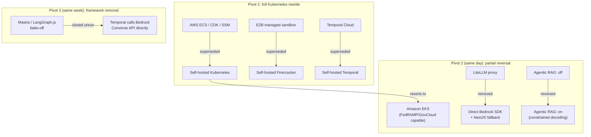

That's the whole arc: a full rewrite to Kubernetes for portability, a same-day narrowing to EKS specifically for FedRAMP/GovCloud reach while removing LiteLLM and turning Agentic RAG back on, and — in the same week — closing an agent-framework bake-off without ever running it, because Temporal and Bedrock Converse already did the job. Every one of those moves reduces to the same sentence: portability and auditability for regulated buyers, over the cheaper and faster managed-service default.

---

## Sources

- `.raw/dux/20-architecture/architecture-overview.md`
- `.raw/dux/20-architecture/architecture-diagrams.md`
- `.raw/dux/20-architecture/data-model.md`
- `.raw/dux/20-architecture/multi-tenancy.md`
- `.raw/dux/20-architecture/workflows.md`
- `.raw/dux/20-architecture/adr-index.md`
