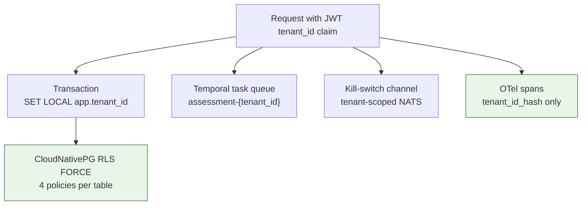

# Multi-Tenancy

## Summary

How tenant isolation is enforced, from the JWT claim to the connection pool, and how it is tested. Owner: Engineering. Status: canonical. Gate: 1. Decisions: D-18, D-34, D-43.

## Executive Summary

Dux uses shared database, shared schema with PostgreSQL RLS (FORCE), not database- or schema-per-tenant, accepting a roughly 5-15% RLS overhead (2026 field consensus) kept low by `tenant_id`-leading composite indexes. Tenant context comes from the authenticated JWT claim only, never a header or query parameter, and is asserted at every layer the request touches: application middleware, transaction-scoped `SET LOCAL app.tenant_id`, Valkey cache key hashing with a mismatch check on read, per-tenant envelope-encrypted storage, and OTel spans that carry only an HMAC hash of the tenant ID. **Any cross-tenant read is a CI merge block.** A dedicated two-number early-warning system governs the graph layer: a 150ms/1K-asset migration trigger fires deliberately before the 200ms/2K-asset SLO ceiling breaches, giving lead time to act — and per D-43, Apache AGE-native tuning (index tuning, read-replica routing, partitioning) is the first-line response, not a database migration to Neo4j.

## Specification

### Model

| Aspect | Decision |
|---|---|
| Isolation | shared database, shared schema |
| Tenant key | `tenant_id`, a cryptographically secure UUID |
| Database enforcement | PostgreSQL RLS with FORCE |
| Auth source of truth | NestJS JWT `tenant_id` claim (ADR-001) |
| Resource lookup | composite key `(tenant_id, id)` |
| Exceptions | none, without a new ADR |
| Overhead budget | ~5-15% RLS cost, owned explicitly |

### Context propagation rules (OWASP-validated, all seven mandatory)

1. Tenant context comes from the authenticated JWT claim only.
2. Every tenant-scoped DB operation runs inside a transaction with `SET LOCAL app.tenant_id = $1`.
3. Every tenant-scoped query runs through PgBouncer in transaction mode; `SET LOCAL` is transaction-scoped by construction and cannot leak to the next borrower.
4. Admin impersonation: validate admin JWT -> verify MFA -> read `X-Impersonate-Tenant` -> replace effective `tenant_id` -> write `admin.impersonate` audit record -> `SET LOCAL` -> query. RLS still applies to the impersonated tenant.
5. Service-to-service calls use an internal JWT (`iss=dux-internal`, `aud=worker`, TTL 5 min) that must carry `tenant_id`; the worker rejects a missing claim before `SET LOCAL`.
6. The kill-switch `LISTEN`/`NOTIFY` fallback (KS-007) uses CloudNativePG's direct, unpooled endpoint, since `LISTEN`/`NOTIFY` require a persistent session connection.
7. Every OTel span carries `dux.tenant_id_hash` (`HMAC-SHA256[:8]`) — the raw `tenant_id` never appears in a log.

### Application-layer enforcement

| Layer | Enforcement |
|---|---|
| API gateway | reject any request without valid JWT-derived tenant context |
| Service layer | assert `resource.tenant_id == request.tenant_id` |
| Cache (Valkey) | key is `tenant:{HMAC-SHA256(tenant_id, secret)[:16]}:`; on read, assert `payload.tenant_id === request.tenant_id` or treat as a miss |
| File storage | per-tenant envelope encryption (DEK wrapped by platform KEK in Vault); pre-signed URLs valid <=15 min, JWT-checked before DEK unwrap |
| Message queue | `tenant_id` travels in payload, validated by `WorkerTenantGuard` before `SET LOCAL` |
| LLM calls | `llm_usage_events` tagged with `tenant_id` |

`TenantScopedRepository<T>` enforces composite-key lookups; ESLint bans `findOne({ where: { id } })` without a `tenant_id`.

### Graph latency — two numbers, deliberately not unified

| Number | Value | Purpose |
|---|---|---|
| NFR-004 SLO ceiling | 3-hop CTE p95 <200ms above 2K assets | the commitment |
| Migration trigger | p95 >150ms above 1K assets, for 7 consecutive days | the early warning |

Apache AGE (D-34) is the first-line response to the trigger (D-43): AGE-native scaling levers, not a database migration. Neo4j remains a further-future escape valve only.

### Tenant lifecycle

**Provisioning:** create tenant + default roles (first user is admin) -> validate AWS role ARN/external ID -> run isolation tests + `check-rls.sh` (activation blocked on failure) -> connector sync -> audit `tenant.provisioned`.

**Suspension:** block new assessments/writes (403), set `agent_sessions.status = blocked`, send Temporal cancel signal, open a read-only 30-day export window, activate KS-L3, audit `tenant.suspended`.

**Deletion:** soft-delete -> days 0-30 export available (24h SLA) -> days 31-90 legal-hold retention -> day 90 hard purge across MinIO, database, backups. A `legal_hold` flag blocks the day-90 purge and notifies Legal.

### Noisy neighbor

Primary detector: per-tenant share of `pg_stat_statements_calls` rate exceeding 10% sustained for 5 min throttles that tenant's assessment queue (auto-resume below 5%). Secondary detector (TEN-05): above 8% for 30 min, catching slow bleeds the primary misses. Pool cap: 5 connections per tenant plus 20% headroom. Cost cap: $25/hour/tenant via the `LLM_USAGE_EVENT` index.

### Isolation testing

ISO-001 through ISO-010 plus API-layer tenant-ID fuzzing (`pnpm test:fuzz-tenant-id`, ISO-FUZZ-001-005) run on every PR touching `packages/api/`, `packages/database/`, or `packages/core/`. Any cross-tenant read is a merge block.

## Diagram

## Entities & Concepts

- [[Data Model]] — the RLS DDL enforced here
- [[Dux Architecture Decision Records]] — ADR-001 (auth), ADR-002 (RLS)

## Related

- [[Architecture Overview]]
- [[Compliance Program]]

## Sources

- `.raw/dux/20-architecture/multi-tenancy.md`
- `.raw/dux/20-architecture/architecture-diagrams.md` (diagram 10)
