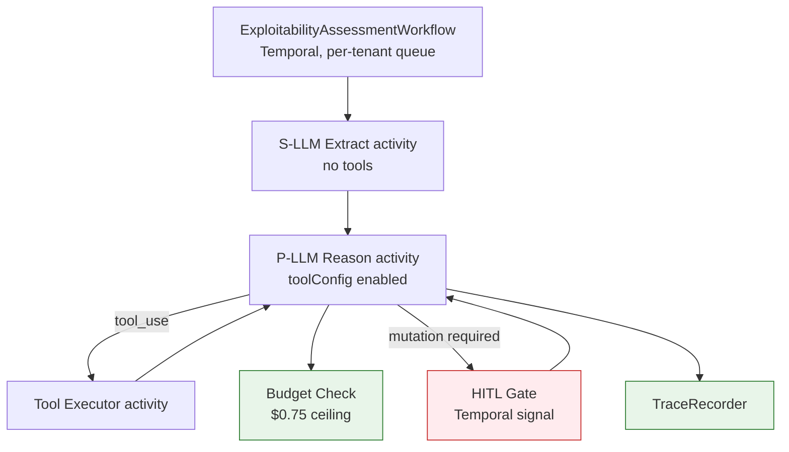

# Workflows & Agent Orchestration

## Summary

How an assessment runs: the orchestration loop, the Temporal contract, the action budget, and vendor write flows. Owner: Engineering. Status: canonical. Gate: 1. Decisions: D-2, D-22.

## Executive Summary

Dux deliberately rejected a monolithic, many-tool ReAct agent — production teams running that pattern hit context bloat (~180K tokens), early-result eviction, and high factual-error rates (one documented 47-tool monolith had 39% of outputs flagged for factual errors). Dux instead runs a **supervisor with isolated subagents**: three Gate-1 subagents, each mapped to a distinct evidence domain, each with a clean context window, a narrow tool allowlist, and a fixed output schema that doubles as the CaMeL security boundary. The engine is **self-hosted Temporal**, and the pattern is orchestrator plus isolated subagents, not a swarm. Multi-agent chaining is deferred behind a signed inter-agent-JWT stub. A typical assessment costs 40-80 weighted actions (p50 approximately 55, p95 approximately 58), comfortably inside the p95 <60 SLO; the rare 70-80 tail (under 5% of assessments) is driven by multi-hop attack-path traversal on large inventories, not by inefficiency.

## Specification

### Why supervisor plus isolated subagents

Each subagent runs in a clean context window with a narrow tool allowlist and a fixed output schema. Loop guards escalate to a human rather than retrying silently:

| Guard | Condition |
|---|---|
| `loop_detected` | same tool, same arguments, more than 3 times |
| `budget_exceeded` | action or cost budget exhausted |
| `convergence_failure` | 3 turns yielding zero new entities |
| `oscillation_detected` | A -> B -> A -> B within the last 4 turns |

### Orchestrator-worker layers

| Layer | Component | Responsibility |
|---|---|---|
| Outer orchestration | `ExploitabilityAssessmentWorkflow` (Temporal) | lifecycle, CVE trigger, state machine, one child workflow per tenant |
| Activity facade | `AssessmentActivity` | thin entrypoint, no inline business logic |
| Prerequisite subagent | `PrerequisiteExtractor` | S-LLM only, Zod-validated schema (US-001) |
| Asset-context subagent | `AssetContextWorker` | scoped asset/runtime evidence (US-002) |
| Control-mapping subagent | `ControlMappingWorker` | vendor control panels, attack-path evidence (US-003) |
| Reasoning loop | `ReasoningLoop` | direct Bedrock Converse `toolConfig` calls (no framework, ADR-021), enforces the action budget |
| Trace recording | `TraceRecorder` | persists reasoning steps, makes no LLM calls |

Hard rules: a distinct system prompt per tier (never reuse the orchestrator's prompt for a subagent); a worker's first message is a structured brief (objective, allowed tools, limits, output schema); one child workflow per tenant for blast-radius isolation; Saga compensation persists partial state ("analysis incomplete: asset context loaded, exploitability pending").

### Message history storage

Bedrock Converse resends the full `messages` array every turn; ten turns of tool results can exceed Temporal's ~50KB default workflow-state limit. Message history lives in Postgres (`assessment_messages`: `id`, `assessment_id`, `turn`, `role`, `content` jsonb, `tool_use_id`, `created_at`); workflow state carries only `history_id`, `turn_count`, `spent_usd`, `status`.

### Temporal execution contract

| Concern | Specification |
|---|---|
| Child workflows | one per tenant, `taskQueue: assessment-{tenant_id}` |
| Heartbeats | NVD 30s/10s; AWS 120s/30s; MCP 60s/15s; `scheduleToCloseTimeout` 15 min, max 2 retries, backoff 1s->30s |
| Continue-as-new | suggested at >=8K events, hard at >=10K, never exceed 35K safety cap |
| Versioning | pin `ExploitabilityAssessmentWorkflow` v1 until the golden-set gate passes v2 — an unversioned worker is the single most common Temporal production failure (Gate-1 exit criterion) |
| Tracing | OTel spans on every workflow (Gate-1 exit criterion); spans carry `tenant_id_hash`, never the raw ID |
| Action budget | `checkCostCap` runs every iteration alongside `checkKillSwitch`; hard checkpoints at iterations 5, 10, 15; halt with L2 kill switch at 200 weighted actions |

### Action budget

| Transition | Workflow/activity | Estimated actions |
|---|---|---|
| IDLE -> REASONING | `PrerequisiteExtractionWorkflow` | 2 |
| REASONING -> TOOL_CALLING (per iteration) | `ReasoningWorkflow` + `MCPInvocationWorkflow` | 4-6 |
| Per-iteration guards | `checkKillSwitch`, `checkCostCap` | 2 |
| EVALUATING -> COMPLETE | `FinalizeAssessmentWorkflow` | 2 |
| **Total (10 iterations typical)** | | **40-80 (p50 ~55, p95 ~58)** |

Weighting: LLM = 1, MCP read = 2, MCP write = 5. Complexity pre-downgrade: >100 assets or a CVE description over 2K tokens auto-routes to the pinned `gpt-5.4-mini`.

### Vendor integration flows

| Flow | Stage | Gate | Writes to vendor? |
|---|---|---|---|
| A — Analyze | Analysis | Gate 1 | No |
| B — Connector ingest | context source | Gate 1 | No |
| C — Action cards | Mitigations | Gate 1, unattended by default | Yes |
| D — Fast Actions | Mitigations | Gate 1, unattended by default | Yes |
| F — Remediation ticket | Remediation | Gate 1, unattended by default | Yes |
| G — Closed-loop validate | Mitigations | Gate 3 | re-assessment only |

Agents reason over World Model snapshots and external intel; they never invoke vendor mutation APIs inline — every mutation routes through `ActionPolicyGate.isAllowed` -> `VendorActionAdapter.execute` -> vendor native API -> audit.

### GDPR and lifecycle workflows

| Workflow | Contract |
|---|---|
| `TenantExportWorkflow` | GDPR Art. 15/20, completes within 24h |
| `GDPRDeletionWorkflow` | Art. 17: soft-delete -> 30-day export hold -> hard-delete -> crypto purge within 90 days |
| `WorldModelVersionPurgeJob` | cancels workflows older than 24h on a superseded version, scoped to the affected tenant only |
| `ReassessmentSchedulerWorkflow` | continuous re-assessment, see [[Continuous Re-Assessment]] |

## Diagram

## Entities & Concepts

- [[Dux Agent]] — the entity this orchestration loop implements
- [[Governance Kernel]] — the gate chain the budget/HITL checks belong to
- [[Architecture Overview]] — deployment context

## Related

- [[Continuous Re-Assessment]]
- [[Mitigation & Remediation Write Path]]

## Sources

- `.raw/dux/20-architecture/workflows.md`
- `.raw/dux/20-architecture/architecture-diagrams.md` (diagram 3)
