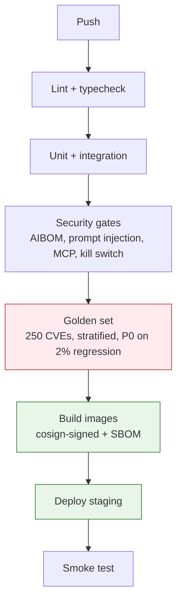

# CI/CD & Testing

## Summary

The merge-to-staging pipeline and mandatory security suites. Owner: Engineering. Status: canonical. Gate: 1. Decisions: D-3, D-34.

## Executive Summary

The golden set's defining discipline is that **the unit of evaluation is a (CVE x synthetic-environment) pair with a per-environment ground-truth verdict, not a CVE with a fixed label** — a CVE-only set would validate CVE triage, precisely what Dux says it is not. Accuracy floors ratchet from >=65% (Month 1) to >=80% held-out (Gate 1), with a hard rule that no single decile/KEV/maturity stratum may regress more than 2% even when the aggregate is within tolerance. A quietly important finding: the $0.55/$0.75 cost envelope was derived on an **assumed** 45% cache-hit rate that had never been measured — a dedicated validation task (A1/CI-07) now runs the full golden set with cache instrumentation to confirm or correct that assumption per CaMeL tier, since S-LLM and P-LLM have different cacheability profiles. The "Mini Shai-Hulud" npm/PyPI supply-chain worm (Apr-May 2026) compromised 170+ packages including TanStack — Dux's own frontend framework — while defeating SLSA Build L3 provenance, which promoted full-tree SBOM and CI-runner credential hygiene from fast-follow to Gate-1 blocking.

## Specification

### Pipeline

```
push -> lint+typecheck -> unit -> integration -> fuzz+isolation
     -> security gates (Snyk, AIBOM, prompt injection, auth, MCP, kill switch, visual, schema-decode)
     -> golden set -> build images (cosign-signed + signed SBOM) -> deploy staging -> smoke
```

### Merge gates (selected, all block merge)

| Gate | Trigger | Threshold |
|---|---|---|
| Cross-tenant isolation | PR touching api/database/core | ISO-001-010 |
| Golden set (stratified) | PR touching core/python-eval | P0 on any aggregate or per-stratum regression above 2% |
| Kill switch | PR touching admin routes/workflows | `test:kill-switch`, idempotency |
| Cost benchmark | PR touching assessment logic | staging assessment averaging above $0.55 blocks (D-3); $0.60 hard cap for cold-cache runs |
| RLS policy gate | PR touching database/ | `check-rls.sh` + negative fixture |
| Governance kernel | PR touching agent action paths | `test:governance-kernel`, GOV-001-013 |
| CaMeL benchmark | PR touching S-LLM/P-LLM boundary | defended-task-completion regression blocks |
| Full-tree SBOM + provenance | every PR, Gate 1 | CycloneDX SBOM, Sigstore/SLSA verification (H11) |
| Docs referential integrity | PR touching docs/ | `validate-playbooks.py` exit 0 |
| Coverage drop | every PR | warns above 2%, blocks at -5% |

### Golden set composition (250 CVEs x environment fixtures)

| Dimension | Distribution |
|---|---|
| CVSS | ~25 per decile bin |
| KEV | 40% KEV / 60% non-KEV |
| Exploit maturity | 30% functional / 50% PoC / 20% theoretical |
| Asset count | 30% single / 50% multiple / 20% widespread |

**Accuracy floors:** Month 1 >=65%, Month 2 >=75%, Month 3/Gate 1 >=80% (held-out set). A regression above 2% against the held-out set is a P0 block; per-stratum regression above 2% blocks even when the aggregate is within tolerance. ECE gate <=0.15 at n>=50. False-positive rate <5% is merge-blocking (DA-09), unlike the other four DeepEval metrics which are advisory-only nightly.

### Mandatory suites

Isolation (ISO-001-010): 404 masking not 403, fail-closed, SQL injection cannot bypass RLS. Tenant-ID fuzz (ISO-FUZZ-001-005): any cross-tenant read or write is a merge block. Auth (AUTH-001-005). Kill switch (KS-001-007): L2-L4 propagation <5s p99, L1 <=30s. MCP (MCP-001-005). Prompt injection: custom corpus every PR (blocks), Promptfoo on agent/LLM PRs (blocks critical/high), Garak nightly (0 critical, <=2 new high).

### Shadow mode and canary rollout (DA-10)

A candidate model version runs in parallel on sampled production traffic, scored against the golden set but never delivered to the tenant; promotion requires meeting or exceeding the pinned version's accuracy at the same stratification granularity. Once shadow-cleared: 5% -> 25% -> 100% traffic ramp over 7 days, monitored at each step; a regression halts the ramp and rolls back, never auto-advances.

### Full-tree supply chain (H11, Gate-1 blocking)

CycloneDX SBOM for the full application dependency tree; Sigstore/SLSA provenance verification in CI; CI-runner credential hygiene (short-lived scoped tokens); Renovate/Dependabot under the same signed-digest discipline.

## Diagram



## Entities & Concepts

- [[Governance Kernel]] — GOV-001-013 gate this pipeline enforces
- [[Confidence Calibration]] — ECE gate shared with the golden-set threshold
- [[AI Safety Incident Runbooks]] — R3b model-EOL runbook, R12 prompt brittleness

## Related

- [[Engineering Standards]]
- [[Local Development]]

## Sources

- `.raw/dux/50-engineering/ci-cd-testing.md`
