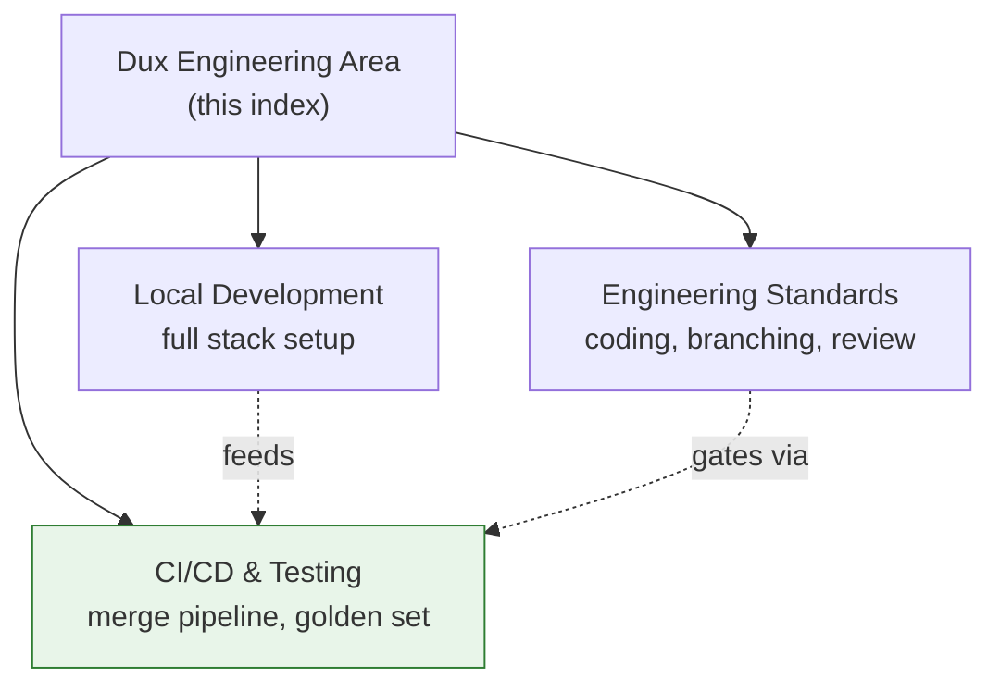

# Dux Engineering Area

## Scope

Everything under `50-engineering/` in the Dux corpus: coding standards, CI/CD pipeline, and local development. **In scope:** engineering-standards.md, ci-cd-testing.md, local-development.md. **Adjacent, not duplicated here:** system architecture and tech stack live in [[Dux Architecture Area]]; production monitoring and SLOs live in [[Dux Operations Area]] — this area is team practice and pipeline mechanics only.

## Reference material

- [[Engineering Standards]] — coding standards, branching, code review, contribution guide
- [[CI-CD & Testing|CI/CD & Testing]] — merge pipeline, golden set, mandatory security suites
- [[Local Development]] — full local stack, first-run setup, common failure modes

## Diagram

## Related

- [[Dux Architecture Area]]
- [[Dux Overview]]

## Review cadence

Weekly.
