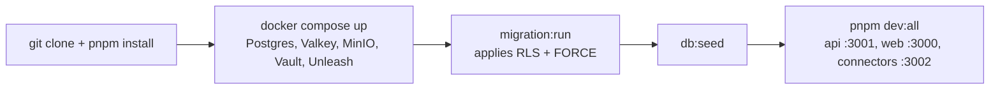
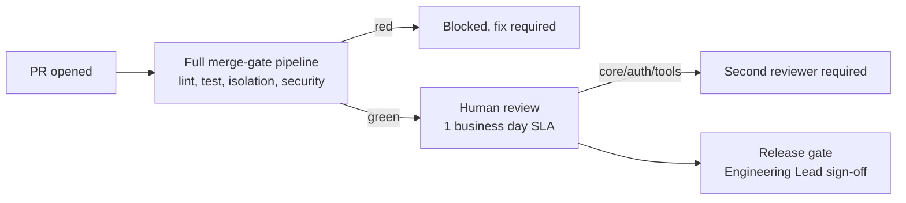
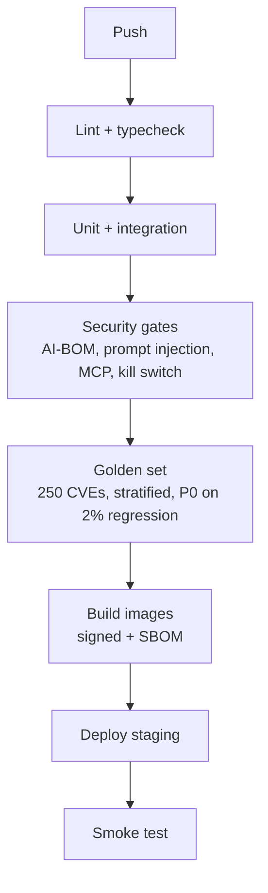

# Dux Engineering Guide

Navigation: [[Dux]] | [[Dux Architecture Guide]] | [[Dux AI Safety Guide]]

This guide is scoped deliberately narrow: team practice and pipeline mechanics only. System architecture and the technology stack live in [[Dux Architecture Guide]]; production monitoring and SLOs live in [[Dux Operations Guide]]. If you're looking for *why* a system is built a certain way, this isn't that page: it's *how the team ships it safely*.

## Getting the stack running locally

The canonical repository is `github.com/duxsecurity/dux.git`: a private monorepo. One naming trap worth flagging before anything else: `github.com/duxsec` is a different, unrelated GitHub account, and using it by mistake is an easy, embarrassing error the team has explicitly called out to avoid.

| Tool | Version | Purpose |
|---|---|---|
| Node.js | 22 LTS | API, web, and workflow workers (pinned via `.nvmrc` and `engines`) |
| pnpm | 9+ | `corepack enable && corepack prepare pnpm@9.15.0 --activate` |
| Docker Desktop | Latest | The full infrastructure stack |
| Python | 3.11+ | Optional before Week 2; after Week 2, the `python-eval` container is the only sanctioned path |
| Git | 2.40+ | Source control |

```bash
git clone git@github.com:duxsecurity/dux.git dux
cd dux && pnpm install
cp .env.example .env.local
```

`DATABASE_URL` lives in the root `.env.local` only: workers inherit it through the turbo environment rather than each defining their own.

```bash
cd infra
docker compose up -d          # Postgres, PgBouncer, Valkey, MinIO, Vault, Unleash
pnpm infra:wait
pnpm --filter database migration:run   # applies RLS + FORCE
pnpm --filter database db:seed
pnpm dev:all                  # everything at once
```

That brings up the web app on `:3000`, the API on `:3001/health`, and connectors on `:3002/health`. The local stack deliberately mirrors production self-hosting rather than a simplified dev mode: same Postgres, same Valkey, same MinIO, same Vault, same Unleash, and critically, no LiteLLM proxy anywhere, locally or in production. Bedrock calls go direct behind the LLM provider abstraction, same as prod.

A few first-run details that save real debugging time:

- **Temporal** runs via `temporal server start-dev`, the official embedded dev server with a web UI at `localhost:8233`: no external dependencies needed. The older `temporalite` tool is deprecated in favor of this.
- **Vault** starts in dev mode (`vault server -dev`), which auto-unseals itself and prints a root token to the console. This is explicitly *not* a template for how production Vault unsealing works: production uses a proper Shamir key-share unseal flow, and conflating the two is a real mistake to avoid.
- **Bedrock** authenticates locally through the standard AWS credential chain (`aws configure sso`, or a named profile with Bedrock invoke permissions): there's no Bedrock-specific environment variable to set.
- **`NVD_API_KEY`** is a per-developer secret requested directly from NVD's own key request form: it has no fixed source anywhere in the repo, by design.

One security rule worth internalizing early: no plaintext development credentials belong in the docs or the repo, ever: this is treated as a P0 issue, and both `git-secrets` and a pre-commit hook exist specifically to enforce it.

### Running the test suite

```bash
pnpm test                    # unit tests (Vitest)
pnpm test:isolation          # cross-tenant isolation: required for api/database/core changes
pnpm test:fuzz-tenant-id     # tenant-ID fuzzing
pnpm test:golden             # golden-set evaluation, runs in a container, never a host venv
pnpm test:kill-switch
pnpm test:governance-kernel  # merge-blocking before Gate 1
./check-rls.sh
```

The cost benchmark has no local equivalent by design: it only runs in CI, where a staging assessment averaging above $0.55 blocks the merge outright.

### Common failure modes and their fixes

| Symptom | Fix |
|---|---|
| RLS policy violation, or queries silently returning empty | Middleware isn't setting `app.tenant_id`: check the JWT tenant claim |
| Cross-tenant test failures | `pnpm db:reset --confirm && pnpm --filter database db:seed` |
| A cache key looks like it's leaking across tenants | Keys must use the `tenant:{HMAC-SHA256(tenant_id)[:16]}:` prefix pattern |
| A long-running assessment gets cancelled after 24 hours | The World Model version purge job ran against a superseded version: expected behavior, not a bug |



## Coding standards

TypeScript strict mode applies across every package. Python exists only in `packages/python-eval`, and it's containerized from Week 2 onward: no host virtualenv, ever. Naming follows a consistent convention: `camelCase` for variables and functions, `PascalCase` for classes/types/components, `UPPER_SNAKE_CASE` for constants, and (worth calling out because it trips people up) `SCREAMING_SNAKE` singular names for ERD entities against `snake_case` plural names for the physical tables that back them.

Five custom lint rules are indexed here, but each one is normative in the spec that actually owns it: this table is a map, not a second source of truth, specifically to avoid the kind of drift that produces contradictory numbers elsewhere in a large corpus:

| Rule | What it enforces |
|---|---|
| `import/no-restricted-paths` | Only `packages/adapters/*` may import a vendor SDK |
| `no-direct-llm-sdk` | Every LLM call routes through the instrumented LLM client |
| `no-aws-sdk-outside-adapters` | The Bedrock SDK is imported only inside `packages/adapters/*` |
| `no-direct-cves-query` | The global `cves` table is read-only; join through `findings` instead |
| `no-raw-findone` | Every lookup goes through the tenant-scoped repository pattern, never a raw `id`-only query |

No net-new `eslint-disable` comment is permitted in `api/` or `core/`: CI blocks the merge outright, no exceptions process. File organization follows feature/domain folders rather than grouping by type, targeting 200–400 lines per file and extracting well before a file hits 800.

One rule is worth explaining rather than just stating: immutability inside `packages/core/world-model`, and anywhere touching the async-local-storage-scoped tenant context, is treated as a **security property, not a style preference**. A mutated shared context is exactly the shape of bug that produces a cross-tenant leak: so this isn't about code aesthetics, it's a defense against a specific failure mode.

## Branching, review, and release

Development is trunk-based with short-lived feature branches off `main`, each PR getting its own ephemeral CloudNativePG cluster (cleaned up after 7 days of staleness, with an alert if more than 20 stay live at once). Merges are squash-merges following Conventional Commits. CODEOWNERS gates two paths specifically: the security team must review anything touching `packages/agents/tools/`, and the engineering lead plus on-call must review any migration that includes a `down` path. A P0 hotfix gets an expedited 30-minute merge window with a single approval: but that shortcut applies to the review SLA only, never to the automated merge gates themselves.

Every PR clears the full merge-gate pipeline (below) *before* a human reviewer is even requested: human review is never treated as a substitute for a red automated gate. The review SLA is a first response within 1 business day and a re-review within 4 business hours; anything touching `core/`, `api/auth`, or the agent tools package requires a second reviewer from outside the immediate feature team. Beyond what's automated, reviewers are expected to check that a PR traces to a real requirement ID (or is explicitly infra/chore work), that it introduces no new lint suppressions or TBD markers, that tests assert behavior rather than implementation details, and that every tenant-scoped query goes through the proper repository pattern rather than a raw ID lookup. A final release gate requires explicit engineering-lead sign-off before any tag goes out.



Before opening a PR: run `pnpm test:ci` locally, confirm `pnpm test:isolation` passes if the change touches `api/`, `database/`, or `core/`, write a PR description naming the requirement ID it closes plus a test plan, and keep the PR scoped to one logical change.

## The CI/CD pipeline

```
push → lint + typecheck → unit → integration → fuzz + isolation
     → security gates (dependency scan, AI-BOM, prompt injection, auth, MCP, kill switch, visual, schema-decode)
     → golden set → build images (signed, with a signed SBOM) → deploy to staging → smoke test
```

Ten categories of merge gate block a PR outright when red:

| Gate | Triggers on | Threshold |
|---|---|---|
| Cross-tenant isolation | Any PR touching api/database/core | The full isolation test suite |
| Golden set (stratified) | PR touching core or the eval package | A P0 on any aggregate *or* per-stratum regression above 2% |
| Kill switch | PR touching admin routes or workflows | Kill-switch and idempotency tests |
| Cost benchmark | PR touching assessment logic | A staging assessment averaging above $0.55 blocks; $0.60 is a hard cap on cold-cache runs |
| RLS policy gate | PR touching `database/` | The RLS check script plus a negative fixture |
| Governance kernel | PR touching agent action paths | The full 13-gate governance test suite |
| CaMeL benchmark | PR touching the S-LLM/P-LLM boundary | Any regression in defended-task completion blocks |
| Full-tree SBOM + provenance | Every PR, from Gate 1 | A CycloneDX SBOM plus Sigstore/SLSA verification |
| Docs referential integrity | PR touching `docs/` | The doc-validator script must exit 0 |
| Coverage drop | Every PR | Warns above a 2% drop, blocks at 5% |

### The golden set: what "80% accuracy" actually measures

The single most important discipline behind every accuracy number in this corpus: **the unit of evaluation is a (CVE × synthetic-environment) pair with its own ground-truth verdict, not a CVE with one fixed label.** A CVE-only evaluation set would validate CVE triage: precisely the thing Dux says, repeatedly, that it is not. The set itself spans 250 CVEs crossed with environment fixtures, stratified four ways:

| Dimension | Distribution |
|---|---|
| CVSS score | roughly 25 cases per decile bin |
| KEV status | 40% known-exploited, 60% not |
| Exploit maturity | 30% functional exploit, 50% proof-of-concept, 20% theoretical |
| Asset count | 30% single-asset, 50% multiple, 20% widespread |

Accuracy floors ratchet upward on a fixed schedule (65% or better by Month 1, 75% by Month 2, 80% held-out by Month 3/Gate 1) with a rule that matters more than the aggregate number: **no single stratum may regress more than 2%, even when the overall aggregate is comfortably within tolerance.** That per-stratum rule exists specifically to prevent an average that looks healthy while quietly masking a real regression on, say, theoretical-maturity exploits. A calibration expected-error gate of 0.15 or better (on a 50-sample-minimum holdout) rides alongside the accuracy floor, and a false-positive rate under 5% is merge-blocking: the other DeepEval metrics tracked nightly are advisory only, but this one isn't.

Worth flagging honestly rather than glossing over: the $0.55/$0.75 cost envelope referenced throughout this corpus was originally derived assuming a 45% cache-hit rate that had, at the time, never actually been measured. A dedicated validation task now runs the full golden set with cache instrumentation to confirm or correct that assumption, broken out per CaMeL tier: since the S-LLM and P-LLM stages have meaningfully different cacheability profiles and averaging them together would hide which one is actually driving cost.



### Mandatory security suites

Isolation tests (`ISO-001` through `ISO-010`) enforce that a cross-tenant lookup returns a 404, not a 403 (masking existence, not just denying access) and that isolation fails closed, including against a SQL-injection attempt trying to bypass RLS directly. Tenant-ID fuzzing makes any cross-tenant read or write a merge block, full stop. Kill-switch tests require L2 through L4 to propagate in under 5 seconds at p99, and L1 within 30 seconds. Prompt-injection testing runs a custom corpus on every single PR (blocking), a broader tool on any PR touching an agent or LLM path (blocking on critical/high findings), and a nightly adversarial scan that tolerates zero critical findings and at most 2 new high-severity ones.

### Shipping a new model version safely

A candidate model version first runs in shadow mode: in parallel on sampled production traffic, scored against the golden set, but never actually delivered to a tenant. Promotion requires matching or beating the currently-pinned version's accuracy at the same stratification granularity described above, not just in aggregate. Once shadow-cleared, traffic ramps 5% → 25% → 100% over 7 days with monitoring at every step; any regression during the ramp halts it and rolls back immediately: the ramp never auto-advances through a bad signal.

### Supply-chain hardening

This became a Gate-1 blocking requirement rather than a fast-follow after a real event: the "Mini Shai-Hulud" npm/PyPI supply-chain worm in spring 2026 compromised over 170 packages (including TanStack, which happens to be Dux's own frontend framework) while successfully defeating SLSA Build L3 provenance checks. In direct response, full-tree software-bill-of-materials generation (CycloneDX, covering the complete application dependency tree) and CI-runner credential hygiene (short-lived, narrowly scoped tokens) both moved from planned hardening into hard Gate-1 requirements, and Renovate/Dependabot updates are held to the same signed-digest discipline as every other build artifact.

## Sources

- `.raw/dux/50-engineering/engineering-standards.md`
- `.raw/dux/50-engineering/ci-cd-testing.md`
- `.raw/dux/50-engineering/local-development.md`
