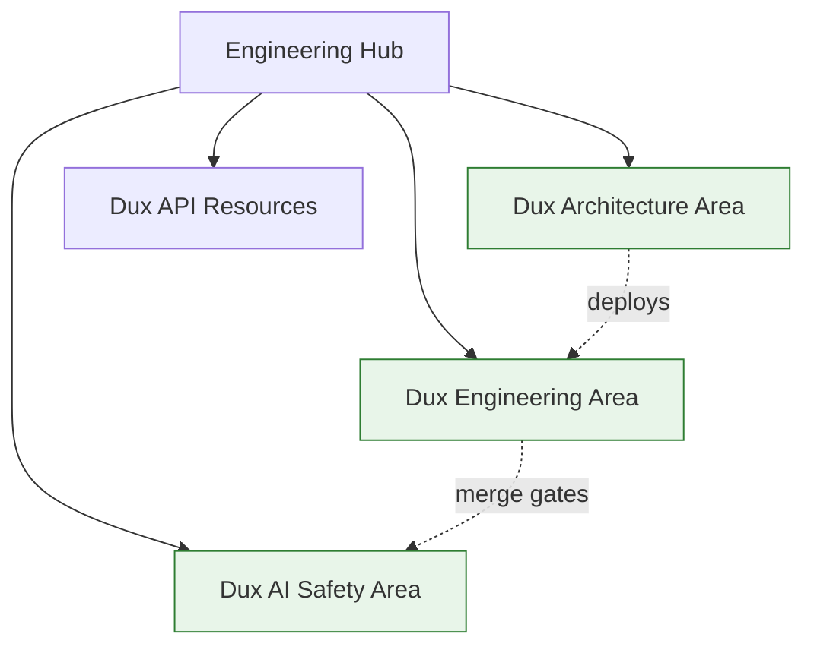

# Engineering Hub

Cross-cutting entry point spanning three vault domains that together form "Engineering" in the generic PARA sense: architecture, AI safety, and engineering practice. For full domain scope, see the three area indexes linked below.

## Architecture

- [[Dux Architecture Area]] — system context, deployment, data model, orchestration, multi-tenancy
- [[Dux Architecture Decision Records]] — the 21 ADRs; authoritative over any prose or diagram

## AI safety

- [[Dux AI Safety Area]] — the six-control safety spine, MCP security, OWASP assessments, incident runbooks

## Engineering practice

- [[Dux Engineering Area]] — coding standards, CI/CD, local development

## API contracts

- [[Dux API Resources]] — the three-plane REST contract

## Diagram

## Related

- [[Product Hub]]
- [[Legal-Finance Hub]]
