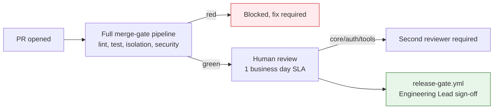

# Engineering Standards

## Summary

Coding standards, branching model, code-review process, and contribution guide. Owner: Engineering. Status: canonical. Gate: 1. Decisions: D-34.

## Executive Summary

This file states team practice only — it links to, rather than restates, the merge gates in [[CI-CD & Testing|CI/CD & Testing]], the RLS rules in [[Data Model]] and [[Multi-Tenancy]], and the provider-port boundary in the ADRs. TypeScript strict mode applies across all packages; Python is containerized-only from Week 2 (no host venv). The custom lint rules are indexed here but each is normative in its owning spec — this table is the index, not a second source of truth, avoiding the drift that produces contradictory numbers elsewhere in the corpus. Immutability in `packages/core/world-model` and anywhere touching `AsyncLocalStorage`-scoped `TenantContext` is treated as a security property, not a style preference — a mutated shared context is a cross-tenant-leak-shaped bug class.

## Specification

### Coding standards

TypeScript strict mode across `packages/*`; Python only in `packages/python-eval`, containerized from Week 2. Naming: `camelCase` variables/functions, `PascalCase` classes/types/components, `UPPER_SNAKE_CASE` constants, `SCREAMING_SNAKE` singular ERD entities against `snake_case` plural physical tables.

**Custom lint rules (index only, each normative elsewhere):**

| Rule | Enforces |
|---|---|
| `import/no-restricted-paths` | only `packages/adapters/*` imports a vendor SDK |
| `no-direct-llm-sdk` | every LLM call routes through `InstrumentedLLMClient` |
| `no-aws-sdk-outside-adapters` | Bedrock SDK imported only inside `packages/adapters/*` |
| `no-direct-cves-query` | `cves` is global read-only, join through `findings` |
| `no-raw-findone` | every lookup goes through `TenantScopedRepository<T>` |

No net-new `eslint-disable` in `api/` or `core/` — CI blocks the merge.

**File organization:** feature/domain folders, not by type; target 200-400 lines/file, extract before ~800.

**Error handling:** `DuxErrorCode` is the shared vocabulary across REST/SSE/webhooks; new error paths extend the enum. Never silently swallow a governance-kernel or connector failure.

### Branching model

Trunk-based, short-lived feature branches off `main`; ephemeral CloudNativePG cluster per PR (7-day stale cleanup, alert above 20 live). Squash-merge, Conventional Commits. CODEOWNERS gates: `@dux-security` on `packages/agents/tools/`; Engineering Lead + on-call on any `down` migration. P0 hotfix: 30-minute merge with 1 approval, may bypass review SLA but never the merge gates.

### Code review process

Every PR passes the full merge-gate pipeline before human review is requested — human review is not a substitute for a red gate. Review SLA: first response within 1 business day, re-review within 4 business hours. A PR touching `core/`, `api/auth`, or `packages/agents/tools/` requires a second reviewer from outside the immediate feature team.

**Reviewer checklist beyond automated gates:** traces to a BR/Epic/US/FR ID or is explicit infra/chore; no new `eslint-disable` or TBD in shipped code; tests assert behavior not implementation; tenant-scoped queries use `TenantScopedRepository<T>`, never a raw `id`-only lookup.

Release gate: `release-gate.yml` requires Engineering Lead sign-off before tagging.

### Contribution guide

Setup via [[Local Development]]. Before opening a PR: run `pnpm test:ci` locally; confirm `pnpm test:isolation` passes if touching `api/`, `database/`, or `core/`; write the PR description with the BR/FR/US it closes and a test plan; keep the PR scoped to one logical change.

## Diagram

## Entities & Concepts

- [[CI-CD & Testing|CI/CD & Testing]] — the merge-gate pipeline this process depends on
- [[Data Model]] — `TenantScopedRepository<T>` pattern referenced here
- [[Dux Architecture Decision Records]] — ADR-013 (provider ports)

## Related

- [[Local Development]]
- [[Dux Engineering Area]]

## Sources

- `.raw/dux/50-engineering/engineering-standards.md`
