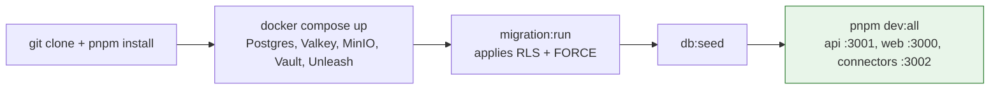

# Local Development

## Summary

Running the full stack locally, including cross-tenant isolation testing. Owner: Engineering. Status: canonical. Gate: 1. Decisions: D-3, D-34.

## Executive Summary

`github.com/duxsecurity/dux.git` is the canonical private monorepo — `github.com/duxsec` is a different, unrelated account and must never be used (resolves OI-23). The local stack mirrors production self-hosting: `docker compose up` brings up Postgres, PgBouncer, Valkey, MinIO, Vault, and Unleash at parity, with no LiteLLM proxy anywhere (local or production, D-34) — Bedrock calls go direct behind `LLMProviderPort`. Vault starts sealed by default; local dev uses dev mode (`vault server -dev`), which auto-unseals and prints a root token, and is explicitly never a template for the production Shamir-key-share unseal flow. No plaintext development credentials belong in the docs or repo (AI-66, P0) — `git-secrets` and a pre-commit hook enforce this.

## Specification

### Prerequisites

| Tool | Version |
|---|---|
| Node.js | 22 LTS |
| pnpm | 9+ |
| Docker Desktop | latest |
| Python | 3.11+ (containerized only after Week 2) |

### Clone and install

```bash
git clone git@github.com:duxsecurity/dux.git dux
cd dux && pnpm install
cp .env.example .env.local
```

`DATABASE_URL` lives in the root `.env.local` only; workers inherit it through the turbo env.

### Start infrastructure and services

```bash
cd infra
docker compose up -d          # Postgres, PgBouncer, Valkey, MinIO, Vault, Unleash
pnpm infra:wait
pnpm --filter database migration:run   # applies RLS + FORCE
pnpm --filter database db:seed
pnpm dev:all                  # everything at once
```

Verify: web on `:3000`, API on `:3001/health`, connectors on `:3002/health`. Local development must never expose a production workflow UI.

### First-run setup notes (D-57, confirmed matching actual team workflow)

- **Temporal:** `temporal server start-dev` — the OSS embedded dev server (Web UI on `localhost:8233`), no external dependencies. `temporalite` is deprecated upstream in favor of this.
- **Vault:** dev mode (`vault server -dev`) auto-unseals and prints a root token — never a template for production unseal.
- **Bedrock local auth:** the direct Bedrock SDK path authenticates via the standard AWS credential chain (`aws configure sso` or a named profile with Bedrock invoke permissions) — no Bedrock-specific env var required.
- **`NVD_API_KEY`:** requested directly from NVD (api.nvd.nih.gov key request form) — a per-developer secret with no fixed source in the repo.

### Tests

```bash
pnpm test                    # unit (Vitest)
pnpm test:isolation          # ISO-001-010, required for api/database/core changes
pnpm test:fuzz-tenant-id     # ISO-FUZZ-001-005
pnpm test:golden             # python-eval container, not a host venv
pnpm test:kill-switch
pnpm test:governance-kernel  # merge-blocking before Gate 1
./check-rls.sh
```

The cost benchmark has no local equivalent — it runs in CI only (staging assessment above $0.55 blocks the merge, D-3).

### Common failure modes

| Symptom | Fix |
|---|---|
| RLS policy violation, empty results | middleware not setting `app.tenant_id` — check JWT tenant claim |
| Cross-tenant test failures | `pnpm db:reset --confirm && pnpm --filter database db:seed` |
| Cache key appears cross-tenant | keys must use `tenant:{HMAC-SHA256(tenant_id)[:16]}:` prefix |
| Long assessment cancelled after 24h | `WorldModelVersionPurgeJob` ran on a superseded version |

## Diagram



## Entities & Concepts

- [[Engineering Standards]] — the branching/review process this stack supports
- [[CI-CD & Testing|CI/CD & Testing]] — the CI equivalent of the local test suite
- [[Architecture Overview]] — the self-hosted stack this mirrors

## Related

- [[Dux Engineering Area]]

## Sources

- `.raw/dux/50-engineering/local-development.md`
