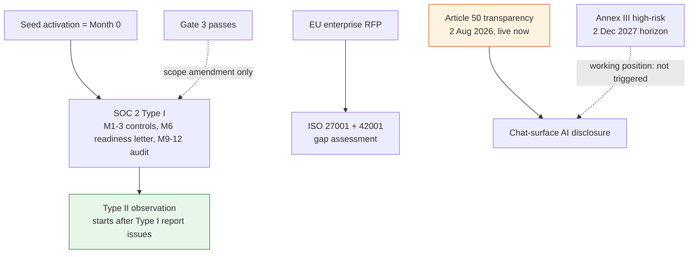

# Compliance Program

## Summary

SOC 2, ISO 27001/42001, EU AI Act certification programs plus policies, evidence automation, and AI governance. Owner: Founder. Status: canonical. Stage: Series A. Decisions: D-20, D-33, D-34, D-39.

## Executive Summary

The program activates on events, not the calendar — "seed activation" itself is the qualifying event that starts the SOC 2 Month-0 clock, and the later "Gate 3 passed" trigger is a scope-amendment on an already-running program, not a second timeline anchor. Both SOC 2 and ISO 27001 include the Mitigate and Remediate write surfaces from program start, because those surfaces are live at Gate 1 — only the closed-loop validation surface (US-019) waits for Gate 3. On EU AI Act: Dux's **working, non-final position is that it does not trigger Annex III** high-risk classification, because it is a security tool acting on posture (endpoints, network policy, tickets) rather than controlling critical-infrastructure operational-technology loops, and its two highest-blast-radius write actions carry mandatory HITL on every call regardless of confidence. The near-term live obligation is **Article 50 transparency (2 Aug 2026)**, independent of the Annex III determination, whose horizon sits 16 months out (2 Dec 2027, per the EU Digital Omnibus on AI that entered force July 2026). A live discrepancy is flagged rather than silently fixed: the public dux.io site already displays "ISO 27001 Certified" and SOC marks not backed by this program — confirmed as an unearned claim requiring a live-site fix (D-44), tracked outside this repo.

## Specification

### Triggers

| Trigger | Starts work on |
|---|---|
| Enterprise renewal/RFP requiring Type II | SOC 2 Type II observation |
| EU enterprise RFP | ISO 27001 + 42001 gap assessment |
| NHI inventory above 500 | NHI policy formalization, OWASP NHI Top 10 |
| First $100K+ ACV | customer self-service security portal (procurement blocker) |
| Federal RFP / FedRAMP path | NIST AI RMF crosswalk — EKS restores the FedRAMP-authorized-CSP prerequisite (D-34), but FedRAMP itself is not a near-term commitment (D-39) |

### SOC 2 Type I/II timeline (seed activation = Month 0)

| Months | Work |
|---|---|
| M1-3 | controls, evidence into S3, gap assessment |
| M6 | readiness letter (not a report) |
| M9-12 | Type I audit engagement |

Type II observation starts only after the Type I report issues. Type II TSC: Security (always, the minimum), Availability (when >=2 SLA contracts exist, A1 controls must run >=3 months before the letter), Confidentiality (NDA classification applies), Processing Integrity, Privacy.

### ISO 27001 / 42001

ISO 27001 scope: the SaaS platform, multi-tenant isolation, Dux Agent governance, MCP/CaMeL, connectors, auth, support. Exclusions: Gate-5 physical residency, third-party MCP server internals. Internal audit quarterly-thematic (Q1 access/NHI, Q2 change, Q3 AI/MCP, Q4 tenant isolation), full clause coverage across 12 months.

ISO 42001 scope: Dux Agent lifecycle, assessment governance, golden-set calibration, kill switch, model management, AI impact assessment. Milestones: gap M1-3, risk/SoA M3-6, internal audit M6-9, certification M9-15. Run as a 60-70% extension of the SOC 2/ISO 27001 evidence base — parallel programs fail roughly 60% of the time on duplicate evidence.

**EU AI Act Art. 9** sub-items mapped to existing mechanisms: data governance -> [[Data Model]]; technical documentation -> this corpus + ADRs; record-keeping -> hash-chained audit (7-year MinIO retention); human oversight -> [[Kill Switch]] HITL contract (D-17); accuracy/robustness -> [[Confidence Calibration]].

### Policies (Series A deltas)

Access control: dual approval for `platform_admin`; break-glass is two-person, 4h maximum, quarterly reviews. Change management: standard RFC needs 1 approval, 2 for security-sensitive; emergency change may be verbal with retroactive RFC within 24h. **A model-pin change requires security review + AIBOM + golden set + Promptfoo + 48h monitoring — a violation is a P1 and a SOX ITGC weakness.** NHI policy: creation ticket + approval; rotation 90 days (keys/agents), 180 days (CI/CD); revocation within 24h; quarterly inventory. GDPR Art. 17 erasure: tenant purge order (halt workflows/trip kill switch -> delete storage prefix -> cascade delete -> revoke secrets -> audit `tenant.purged`), export/delete <24h.

### NHI lifecycle and OWASP NHI Top 10 (triggered above 500 inventory)

| NHI control | Evidence |
|---|---|
| NHI1 Improper Offboarding | revocation within 24h of termination |
| NHI6 Shared Credentials | max 2 active per agent during rotation |
| NHI7 Unmonitored NHI | weekly shadow-AI reconcile, `undeclared_count: 0` |
| NHI10 Human Use of NHI | a service account cannot impersonate a user |

### Evidence framework

MinIO Object Locking, 7 years, deny-delete break-glass role. Automation metric `compliance.evidence_automation_pct`, target >=80% by M3; CC7.2/CC8.1 automated by M6. Trust portal minimum page set (SOC 2 summary, subprocessors, pentest summary, security FAQ) content-complete before the first $100K ACV.

### AI governance

NIST AI RMF and CSF 2.0 crosswalks published M4-6, gated on a federal RFP. AIBOM governance: monthly signed attestation; weekly drift sampling, 10% stratified structural drift above 2-sigma carries a 24h Security SLA. TenantHealthScore: reliability 40% / cost 30% / safety 30%, below 50 routes to Security + FinOps. AI red team: quarterly, plus continuous CI diff-scoped nightly.

## Diagram

## Entities & Concepts

- [[Kill Switch]] — HITL contract underpinning the Annex III non-trigger position
- [[Multi-Tenancy]] — RLS mapped to ISO 27001 Annex A.8.3
- [[Series B Scale Programs]] — the next-stage governance surface this program feeds into

## Related

- [[Quick Reference Card]]
- [[Dux Governance Area]]

## Sources

- `.raw/dux/70-governance/compliance-program.md`
