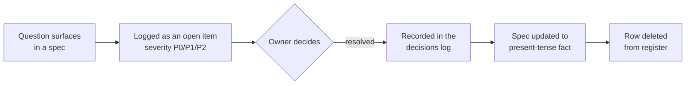
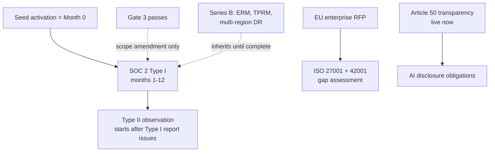

# Dux Governance & Compliance Guide

Navigation: [[Dux]] | [[Dux AI Safety Guide]] | [[Dux Decisions & Traceability Reference]]

## Quick reference: the numbers people ask for most

Before the full compliance program below, the handful of facts that get looked up constantly: all sourced in full detail elsewhere in this knowledge base, repeated here only as a cheat sheet:

- **Write-action HITL posture (5 canonical actions):** `endpoint.isolate` and `patch.deploy_special_devices` require mandatory human approval on every call; the other three are unattended by default with review only on anomaly escalation. Full detail: [[Dux AI Safety Guide]].
- **Kill-switch propagation:** L2 through L4 propagate in under 5 seconds at p99; L1 within 30 seconds. Full detail: [[Dux AI Safety Guide]].
- **Cost thresholds, first match wins:** a $0.675/assessment soft breaker, then a $25/hour hard per-tenant cap, then a 2x-rolling-baseline circuit breaker.
- **Confidence bands:** 0.85+ is `exploitable`, 0.70–0.85 is `likely`, 0.40–0.70 is `unlikely`, under 0.40 is `not_exploitable`, abstention is `insufficient_data`. Full detail: [[Dux Taxonomy & Catalogs]].
- **Gate-1 exit bar:** zero cross-tenant fuzz reads, zero critical findings in the adversarial test suite, row-level security forced on every tenant-scoped table and CI-verified.

This section never originates a number: if it ever disagrees with the fuller guide it's summarizing, the fuller guide wins.

## The open-items discipline

Every unresolved question in the corpus (architectural, legal, product, or operational) lives in exactly one register, under one ID scheme, rather than scattered across the seven ad hoc labeling schemes that preceded it. That consolidation matters less for tidiness than for a specific discipline it enables: **specs state current truth in the present tense and link here for anything still unresolved.** Nothing closes by quietly editing prose: it closes only when an owner records a decision in [[Dux Decisions & Traceability Reference]], the spec is updated to state the outcome as present-tense fact, and the row is deleted from this register. The decisions log and git history are the permanent record; the register itself is meant to trend toward empty.

Severity follows a simple three-tier model: **P0** blocks a Gate-1 ship or represents a live legal/compliance exposure; **P1** blocks a plan, a date, or an external commitment already made; **P2** is real spec debt, but nothing is currently unsafe or over-promised because of it.

As of the most recent full pass, the register runs close to empty: both P0 and P1 bands sit at zero, with only a small handful of P2 items open: re-deriving a Temporal namespace-sizing trigger for the self-hosted deployment (blocked on infrastructure sizing, not on an unknown), confirming a graph-index adversarial-neighbor test has actually been *run* against the live index rather than just designed, deriving rate-limit-based sync cadences for two connectors that don't yet have one, and closing out the Gate-1 test-coverage sign-off for `ExploitabilityAssessmentWorkflow`: a checklist of all 7 required scenarios (happy path, a 10-turn max-turns exit, a $0.75 budget-exceeded abort, tool failure and retry, a Bedrock timeout, a malformed tool response, and a 30-minute HITL-signal timeout) already exists, with only the actual test code itself, which lives in a separate application repository, still outstanding. That's a genuinely low open-question count for a corpus this size, and it's the direct result of the same present-tense discipline described above being enforced consistently.

## The compliance program

The certification and governance program activates on events, not a calendar: seed activation itself is the trigger that starts the SOC 2 clock at "Month 0," and a later Gate 3 pass is a scope amendment on an already-running program, not a second independent timeline.

### SOC 2 and ISO, on one track

| Months from seed activation | SOC 2 work |
|---|---|
| 1–3 | Controls implementation, evidence collection into storage, gap assessment |
| 6 | Readiness letter (not yet a report) |
| 9–12 | Type I audit engagement |

Type II observation only starts once the Type I report has actually issued. The Security criterion is always in scope as the floor; Availability joins once two or more SLA contracts exist (with its controls needing to run for at least 3 months before the readiness letter); Confidentiality, Processing Integrity, and Privacy layer on as the business needs them.

ISO 27001 scope covers the SaaS platform itself: multi-tenant isolation, the agent governance model, the MCP/CaMeL safety boundary, connectors, auth, and support: explicitly excluding Gate-5 physical residency and the internals of third-party MCP servers. ISO 42001 (the AI-management-system standard) runs as a genuine extension of the same evidence base rather than a parallel program, deliberately: industry data suggests parallel certification programs fail roughly 60% of the time specifically because of duplicated, inconsistent evidence collection, and reusing one evidence base is the direct mitigation for that failure mode.

Both SOC 2 and ISO 27001 include the Mitigate and Remediate write surfaces from day one of the program, because those surfaces are already live at Gate 1: only the closed-loop validation surface waits, because it doesn't ship until Gate 3.

ISO 27001's risk treatment maps each major risk straight to a specific Annex A control, not just to an internal ID:

| Risk | Treatment | ISO/IEC 27001:2022 Annex A |
|---|---|---|
| Cross-tenant leak | Row-level security; internal controls ISO-001 through ISO-010 | A.8.3 (information access restriction), A.8.16 (monitoring activities) |
| Agent incident | Kill switch; MCP controls | A.5.24 (incident management planning), A.8.16 (monitoring activities) |
| Supply chain | Model pins; DPAs | A.5.19 (supplier relationships), A.5.20 (addressing security in supplier agreements) |
| Admin access | MFA; break-glass | A.5.15 (access control), A.8.5 (secure authentication) |

Those Annex A codes are cited at the internal-control-ID level, not per sub-clause: the full clause-by-clause Statement of Applicability is a separate ISO 42001 deliverable due months 3 through 6, not this summary table.

### EU AI Act: where Dux actually stands

Dux's working position (stated as a position, not a settled legal conclusion) is that it does **not** trigger Annex III high-risk classification. The reasoning: it's a security tool acting on posture (endpoints, network policy, tickets), not a tool controlling critical-infrastructure operational-technology loops, and its two highest-blast-radius write actions require mandatory human approval on every single call regardless of confidence. That position has a real, independent near-term obligation sitting in front of it regardless of how the classification question ultimately resolves: **Article 50 transparency**, which took effect August 2026. The Annex III question itself, if it does apply, has a much longer runway: December 2027, per the EU's Digital Omnibus on AI that entered force in mid-2026.

The AI impact assessment procedure is the operative gate behind all of this, not just a paper exercise: an intake form runs through a 5-business-day Legal SLA, and it blocks EU contracts outright until sign-off.

One live discrepancy is worth flagging plainly rather than quietly fixing out of scope: the public marketing site currently displays "ISO 27001 Certified" and SOC marks that this compliance program does not yet back: a confirmed unearned claim that needs a live-site correction, tracked as work outside this documentation repository itself.

### Framework crosswalks

Three additional frameworks get mapped against Dux's existing controls, all published on the same month-4-through-6 cadence and gated on the same federal-RFP trigger as FedRAMP itself:

The **NIST AI RMF crosswalk** covers the four AI-specific functions (Govern, Map, Measure, Manage) against Dux's own AI-governance mechanisms.

The **NIST CSF 2.0 crosswalk** is a distinct, broader framework, not a duplicate of the AI RMF: where AI RMF scopes AI-system risk specifically, CSF 2.0 scopes organizational cybersecurity risk as a whole, and adds Govern as its sixth function:

| CSF 2.0 function | Dux control or mechanism |
|---|---|
| Identify | The asset and connector catalog; the World Model asset inventory |
| Protect | Row-level-security tenant isolation; the kill switch; the NHI lifecycle below |
| Detect | Governance-kernel anomaly triggers (the confidence-abstention band, sandbox timeout and out-of-memory signals, statistical outlier detection); AI-BOM drift monitoring |
| Respond | The incident runbooks; the operational runbook bridge |
| Recover | Disaster recovery: a 4-hour RTO and 1-hour RPO platform baseline |
| Govern | This governance program itself: its triggers, policies, and evidence framework |

The **CIS Controls v8 crosswalk** exists because Dux ingests CIS-aligned CSPM findings (via the Wiz connector's scanner role), so that ingested data needs a stated correspondence to Dux's own findings taxonomy:

| Dux findings category | CIS Controls v8 |
|---|---|
| Asset and connector inventory | Control 1: Inventory and Control of Enterprise Assets |
| CSPM misconfiguration findings | Control 4: Secure Configuration of Enterprise Assets and Software |
| Vulnerability findings (NVD, CISA-KEV, EPSS ingestion) | Control 7: Continuous Vulnerability Management |
| The hash-chained audit trail | Control 8: Audit Log Management |

### Policy highlights

Access to the `platform_admin` role requires dual approval, and break-glass emergency access is two-person, capped at 4 hours, and reviewed quarterly. Standard change requests need one approval; security-sensitive changes need two; a genuine emergency change can go out with verbal approval and a retroactive request-for-change filed within 24 hours. One rule carries real teeth: **a model-pin change requires a full security review, an updated AI-BOM, a golden-set run, a prompt-safety scan, and 48 hours of monitoring: skipping any of that is treated as a P1 and a control weakness under SOX IT general controls**, not a process nicety.

Non-human-identity governance (service accounts, API keys, agent credentials) requires an approval ticket at creation, rotates every 90 days for keys and agents (180 for CI/CD credentials), revokes within 24 hours of any relevant termination, and gets a quarterly full inventory. Once the NHI inventory passes 500, an annual OWASP NHI Top 10 (2025) attestation kicks in, owned by Security, mapping each control straight to that lifecycle:

| NHI control | Lifecycle mapping | Evidence |
|---|---|---|
| NHI1 Improper Offboarding | Revocation within 24 hours of termination | IdP and Kubernetes audit logs, Falco alerts, Vault audit log |
| NHI2 Weak Credentials | 90-day rotation; SSM/Vault only | Rotation calendar |
| NHI3 Excessive Permissions | Least-privilege scope at creation | Ticket plus approval |
| NHI4 Lack of Inventory | Quarterly inventory review | Inventory report in S3 |
| NHI5 No Rotation | Keys every 90 days; CI/CD every 180 | Rotation attestations |
| NHI6 Shared Credentials | Max 2 active credentials per agent during rotation | Agent credential table |
| NHI7 Unmonitored NHI | Weekly shadow-AI reconcile | An `undeclared_count: 0` check |
| NHI8 Insecure Storage | SSM/Vault only; Gitleaks on every PR | CI scan results |
| NHI9 Overprivileged Agents | A `supervised` agent requires a delegation token | Agent config audit |
| NHI10 Human Use of NHI | A service account cannot impersonate a user | Access-review export |

The inventory export itself (`pnpm admin:nhi-inventory --env production`, run quarterly against ECS/SSM, Vault, GitHub, and the MCP registry) pages Security the moment its `undeclared_count` exceeds zero, not just when the inventory review happens to run.

### AI-BOM governance

A separate mechanism from the merge-blocking AI-BOM check in CI, this one governs the artifact itself over its lifetime. A signed GPG-attested JSON manifest, carrying an `agent_registry_hash`, is generated monthly and stored in S3, tracking `models.json`, `mcp-registry.json`, the `prompts/` directory, and every agent config as its components. Drift monitoring runs weekly output sampling, and a 10% stratified structural drift beyond 2 standard deviations from baseline carries a 24-hour Security SLA. If a rollback is needed, the sequence is fixed: disable the flag, revert the agent config, roll back the MCP pin, then customer comms.

GDPR Article 17 erasure follows the same tenant-purge order used everywhere else in this corpus: halt workflows and trip the kill switch, delete the storage prefix, cascade-delete the database rows, revoke secrets, write the audit record: completed within 24 hours end to end.

### Evidence, and how much of it collects itself

Compliance evidence is anchored in immutable object storage with a 7-year retention and a deny-delete break-glass-only override. An automation-percentage metric tracks how much of that evidence collects without manual effort, targeting 80%+ by month 3 of the program. A minimum viable trust-portal page set (a SOC 2 summary, a subprocessor list, a penetration-test summary, a security FAQ) has to be content-complete before the first $100K+ annual contract, since that's reliably the point where a prospect's security team starts asking for exactly these documents.

## What's still a backlog shell: Series B governance

Everything in this section is explicitly forward-looking, and the source material itself is unusually direct about that: **most of it is a planning placeholder, and no P0 gate should ever be executed from a stub section without a counsel-signed risk acceptance in hand.** Only two pieces are actually ready to rely on today: the enterprise risk-appetite table and the data-room index. Third-party risk management, internal audit cadence, data residency, multi-region disaster recovery, and formal certifications are all "partial," meaning they inherit the Series A posture described above until they're independently content-complete. Most of the enterprise-platform and AI-governance-at-scale material is a bare stub.

The one exception worth memorizing regardless of stage: the risk appetite for **unmitigated cross-tenant access or uncontrolled agent autonomy is zero, at any level**: the only "none accepted" rating anywhere on the appetite table, everything else being at worst "low."

| Risk domain | Appetite |
|---|---|
| Innovation, non-production experiments | Medium risk accepted |
| Tenant isolation, agent safety, financial integrity | Low |
| Unmitigated cross-tenant access, uncontrolled agent autonomy | **None: zero risk accepted at any level** |

### Third-party risk, tiered

| Tier | Definition | Example vendors |
|---|---|---|
| Tier 0 | No data access, annual attestation only | - |
| Tier 1 | Handles tenant or financial data | OpenAI, Stripe, Cloudflare, Anthropic (fallback path) |
| Tier 2 | Critical-path infrastructure, reviewed quarterly | AWS (full-platform runtime via EKS) |

Worth noting explicitly: the observability vendors referenced elsewhere in this corpus (Grafana, Langfuse) are **not** subprocessors at all: both run fully self-hosted in-cluster, with no external data flow, so they don't enter the third-party risk register in the first place.

### Data residency, region by region

| Region | Posture | Sign-off required |
|---|---|---|
| US | Default, primary region | Standard Gate 2+ process |
| EU | Tenant-pinned for GDPR, primary plus replica in-region | Before the first EU-pinned tenant |
| APAC | Deferred, Singapore/Australia targeted | Before the first APAC tenant |
| LATAM | Deferred, Brazil shortlisted, an LGPD privacy impact assessment required | 30 days before any LATAM contract, with no contract clause finalized without Legal and Engineering pre-approval |

Breach notification clocks vary by jurisdiction and are worth knowing cold: 72 hours for the EU/UK and for Singapore's PDPA, 72 hours for India's DPDP Act, 30 days for Australia, "per state" requirements in the US, and Brazil's LGPD, which only requires notification within a "reasonable" period rather than a fixed clock.

### Multi-region disaster recovery, as a target

The stage ladder runs from today's Seed-stage 4-hour/1-hour baseline (see [[Dux Operations Guide]]) toward a Series B target of sub-1-hour active-active recovery, tightening to under 15 minutes at scale. Both an EU and an APAC go-live are gated on either a passed disaster-recovery game day or an explicit signed risk acceptance: neither region goes live on hope alone. One piece of good news buried in this section: because the platform already runs on Kubernetes/EKS from Gate 1, the old prerequisite of migrating off an earlier hosting platform before multi-region was even possible is already satisfied. The actual remaining Series B blocker is region topology and active-active capacity, not a hosting migration.

### Certification triggers, for when they matter

| Certification | What triggers starting the work |
|---|---|
| ISO 42001 | An EU RFP |
| FedRAMP | A federal RFP: and board approval is required before even responding |
| HIPAA | A prospect handling protected health information, with data-flow mapping due within 60 days |
| PCI | Handling cardholder data beyond what Stripe's tokenization already covers |

## Sources

- `.raw/dux/70-governance/compliance-program.md`
- `.raw/dux/70-governance/series-b-scale.md`
- `.raw/dux/00-meta/open-items.md`
- `.raw/dux/00-meta/quick-reference.md`
