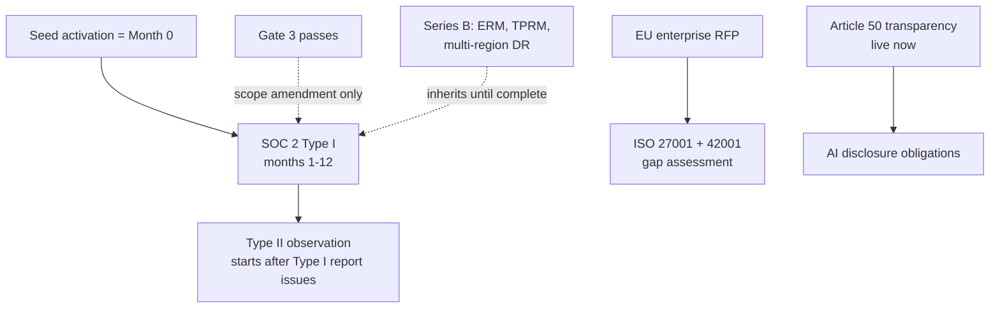

# Compliance Isn't a Calendar at Dux — It's a Set of Tripwires

### How a security-agent startup builds SOC 2, ISO 27001/42001, and EU AI Act readiness around events instead of dates — and what happens when a AWS reversal, an EU regulation freeze, and a Series B backlog shell all land in the same quarter

Navigation: [[Dux]] | [[Dux AI Safety Guide]] | [[Dux Decisions & Traceability Reference]]

Most startups treat compliance like a New Year's resolution: pick a date, hire an auditor, sprint. Dux does the opposite. Nothing on this page starts because a quarter turned over — it starts because a specific, named event fired: the 30th engineer got hired, the first $100K deal closed, an EU prospect asked for ISO 27001, or a federal RFP showed up with a FedRAMP requirement attached. That distinction matters more than it sounds: it means the compliance program can be genuinely dormant for months and then snap into motion the instant a trigger clears, without anyone having pre-spent budget or headcount on a certification nobody asked for yet.

## Quick Reference: The Numbers People Ask For Most

Before the full program below, the handful of facts that get looked up constantly — sourced in full detail elsewhere in this knowledge base, repeated here only as a cheat sheet:

- **Write-action HITL posture (5 canonical actions):** `endpoint.isolate` and `patch.deploy_special_devices` require mandatory human approval on every call; the other three are unattended by default with review only on anomaly escalation. Full detail: [[Dux AI Safety Guide]].
- **Kill-switch propagation:** L2 through L4 propagate in under 5 seconds at p99; L1 within 30 seconds. Full detail: [[Dux AI Safety Guide]].
- **Cost thresholds, first match wins:** a $0.675/assessment soft breaker, then a $25/hour hard per-tenant cap, then a 2x-rolling-baseline circuit breaker.
- **Confidence bands:** 0.85+ is `exploitable`, 0.70–0.85 is `likely`, 0.40–0.70 is `unlikely`, under 0.40 is `not_exploitable`, abstention is `insufficient_data`. Full detail: [[Dux Taxonomy & Catalogs]].
- **Gate-1 exit bar:** zero cross-tenant fuzz reads, zero critical findings in the adversarial test suite, row-level security forced on every tenant-scoped table and CI-verified.

This section never originates a number: if it ever disagrees with the fuller guide it's summarizing, the fuller guide wins.

## The Trigger Map: What Actually Starts the Clock

Seed activation itself is the event that starts the SOC 2 clock at "Month 0" — and a later Gate 3 pass is a *scope amendment* on that already-running program, not a second independent timeline. The company-level signals that matter: roughly 30+ engineers (40–50 employees), 16+ FTE unlocking dedicated incident roles, an NHI inventory above 500, the first $100K+ ACV, board risk reporting, AI vendor security reviews, and EU enterprise buyers requiring ISO 27001 and 42001.

| Trigger | Starts work on |
|---------|----------------|
| An enterprise renewal or RFP requiring Type II | SOC 2 Type II observation begins |
| An EU enterprise RFP | ISO 27001 + ISO 42001 gap assessment |
| An AI vendor security review | AIBOM governance, an AI red-team report, model-card updates |
| NHI inventory above 500 | NHI policy formalization; OWASP NHI Top 10 assessment |
| The first $100K+ ACV | The customer self-service security portal — a procurement blocker |
| Gate 3 passes | Amend the SOC 2 scope to cover the closed-loop validation surface (US-019). The Mitigate and Remediate write surfaces are in scope from program start — they are live at Gate 1 |
| A federal RFP, or a FedRAMP path | The NIST AI RMF crosswalk — see the FedRAMP path below |
| EU AI Act Art. 9 risk management | Runs through ISO 42001 impact assessments (owners: Security + Counsel). Tracks the Annex III 2 Dec 2027 horizon (D-26). Since Dux's working position is that it does not trigger Annex III, it is run as best practice rather than a triggered requirement |
| Azure OpenAI EU region activation | Before the first EU-pinned tenant (international data sovereignty table, below) |

## The FedRAMP Path: A Door That Closed and Reopened

FedRAMP is a good illustration of how fast the trigger-based model can flip on infrastructure changes alone. The platform runs on Amazon EKS ([ADR-006 R4](../20-architecture/architecture-overview.md)), a FedRAMP-authorized CSP with GovCloud availability — but that wasn't always true this year. **D-33 briefly closed the FedRAMP path** when the platform ran on DigitalOcean/Linode Kubernetes, neither of which carries a FedRAMP authorization. **D-34 (2026-07-19) reversed that** the moment the platform moved back onto Amazon EKS, restoring the AWS-hosting prerequisite. Per the v4.0 source doc's FedRAMP compliance matrix: EKS is authorized ✅ Moderate / High (GovCloud); Bedrock is ✅ Moderate / ⚠️ High (limited regions); CloudNativePG, Valkey, NATS, MinIO, self-hosted Temporal, and NestJS are all ✅ self-hosted and in-boundary.

None of that means FedRAMP is imminent. **D-39 (2026-07-20) confirms it is not a near-term target** — it stays gated on an untriggered federal-RFP condition, not a committed claim, and board approval is required before Dux even responds to a federal RFP. The point of keeping EKS/GovCloud-capable infrastructure is that it keeps the option open cheaply; a dedicated FedRAMP authorization push is not committed ahead of a real federal deal.

## SOC 2: The Slow Climb From Readiness Letter to Type II

SOC 2 runs on the same Month-0-at-seed-activation clock as everything else.

**Type I timeline:**

| Months | Work |
|--------|------|
| M1–3 | Controls; evidence into S3; gap assessment |
| M4–5 | Questionnaire responses |
| **M6** | **Readiness letter** — not a report |
| **M9–12** | **Type I audit engagement** |

Type II observation starts only after the Type I report is issued — not at the readiness letter. This is a subtle but important sequencing point, worth stating in its own words:

> "Seed activation" is itself the qualifying event that starts the Month-0 clock. That is consistent with "activate on events, not calendar," not an exception to it. The "Gate 3 passed" trigger above is a separate, later scope-amendment event on top of an already-running programme — not a second timeline anchor.

**SOC 2 Type II Trust Services Criteria:**

| Criterion | Included when |
|-----------|---------------|
| Security (CC6/7/8) | **Always — the minimum** |
| Availability (A1) | ≥2 SLA contracts exist. A1 controls must operate for ≥3 months before the letter |
| Confidentiality | NDA classification applies |
| Processing Integrity | Scores are used for compliance decisions |
| Privacy | Personal data beyond telemetry is handled |

**Observation windows:** first observation 6 months minimum; auditor-scoped 3–12 months depending on scope; renewal 12 months.

**Continuous evidence, running the whole time:** quarterly access reviews, weekly vulnerability scans, an annual external penetration test plus semi-annual internal ones, annual policy reviews, quarterly backup tests. SLA language itself is counsel-gated (AI-226a).

**SOC 2 and ISO, on one track.** Both SOC 2 and ISO 27001 include the Mitigate and Remediate write surfaces from day one of the program, because those surfaces are already live at Gate 1. Only the closed-loop validation surface waits — it doesn't ship until Gate 3, and the Gate 3 scope amendment covers only that validation surface (US-019).

## ISO 27001 and 42001: Certifying the Platform and the AI Program Together

### ISO 27001 (ISMS)

**Scope:** the Dux SaaS platform, multi-tenant isolation, Dux Agent governance, MCP and CaMeL, connectors via the Unified Integration Layer, the Mitigation and Exposure UI, auth, and support.

**Exclusions:** Gate-5 physical residency, and third-party MCP server internals — covered instead by a customer responsibility letter.

**Risk treatment:**

| Risk | Treatment | ISO/IEC 27001:2022 Annex A |
|------|-----------|------------------------------|
| Cross-tenant leak | RLS; ISO-001–010 | A.8.3 (information access restriction), A.8.16 (monitoring activities) |
| Agent incident | Kill switch; MCP controls | A.5.24 (incident management planning), A.8.16 (monitoring activities) |
| Supply chain | Model pins; DPAs | A.5.19 (supplier relationships), A.5.20 (addressing security in supplier agreements) |
| Admin access | MFA; break-glass | A.5.15 (access control), A.8.5 (secure authentication) |

Annex A numbers are cited at the internal-control-ID level (ISO-001–010), not per sub-clause — the full clause-by-clause Statement of Applicability is a separate ISO 42001 M3–6 deliverable, not this table.

**Internal audit** is quarterly and thematic: Q1 access and NHI, Q2 change management, Q3 AI and MCP, Q4 tenant isolation — reaching full clause coverage across 12 months. Management review is annual. Kickoff: Series A Month 1.

### ISO 42001 (AI Management System)

**Scope:** the Dux Agent lifecycle (on-demand queue, connector sync, and continuous re-assessment per ADR-016 — all Gate 1; ownership inference at Gate 1; preference learning at Gate 2c), assessment governance, golden-set calibration, the kill switch, model management, and the AI impact assessment.

**Milestones:**

| Phase | Months | Deliverable |
|-------|--------|-------------|
| Gap assessment | M1–3 | Baseline gaps identified |
| Risk and SoA | M3–6 | Risk treatment plan and Statement of Applicability |
| Internal audit | M6–9 | Thematic audit findings |
| Certification | M9–15 | Final certification audit |

Quarterly management review.

**Why the roadmap got pulled forward.** Certification itself stays fenced to Series A — but the milestone table above, dated and board-presentable, ships now, ahead of certification. The reasoning: roughly **40% of EU AI RFPs already screen on a stated ISO 42001 path**, and competitors — **AWS, Anthropic, OpenAI, and ServiceNow** — are already certified. Publishing the artifact closes the readiness gap without pulling certification spend forward. Target: **M2**, landing in the same board pack (§6) that already carries risk, certifications, AI governance, and DORA.

> Run ISO 42001 as a 60–70% extension of the SOC 2 / ISO 27001 evidence base — a unified control map, 4–6 months with guidance. Parallel programmes fail roughly 60% of the time, on duplicate evidence and control gaps.

### The Annex III Question Dux Keeps Re-Asking Itself

Owners: Founder + Counsel. Annex III §5 covers AI systems used for critical-infrastructure management and operation — the category most plausibly in play, since Dux's agent makes autonomous security-remediation decisions on customer infrastructure. **Working position: Dux does not trigger Annex III.** Three-part reasoning:

1. **Not the critical-infrastructure system.** Dux is a security tool sold to and operated by the infrastructure operator — it is not itself the critical-infrastructure system, nor does it control the infrastructure's core function (network routing, power, water, transport) the way Annex III targets; it acts on security posture (endpoints, network policy, tickets), not on operational-technology control loops.
2. **Mandatory human-in-the-loop.** Of the two highest-blast-radius write actions, `endpoint.isolate` and `patch.deploy_special_devices`, mandatory human-in-the-loop approval is preserved on every call regardless of confidence ([kill-switch-hitl.md §7](../40-ai-safety/kill-switch-hitl.md), D-17) — there is no autonomous decision loop over infrastructure without a human in it for the actions with the largest impact.
3. **Low-blast remaining actions.** The remaining three canonical write actions are reversible, low-blast, and tenant-scoped (`network.blocklist_add`, `policy.deploy_device_config`, `ticket.create_remediation`).

This is a working position, not a filed determination — it has not been counsel-confirmed, and a customer whose own system Dux touches (for instance an EU operator of energy or transport infrastructure) could still pull Dux into that customer's own Annex III assessment as a component supplier. It's tracked under the Week-6 counsel opinion below, and it's explicitly revisitable: if the pending CEN-CENELEC harmonized standards narrow or widen the "management and operation" language in Annex III's own scope guidance, this determination gets re-run.

## EU AI Act: Where Dux Actually Stands

### Status (D-26)

The EU **Digital Omnibus on AI is in force** — Parliament adopted it 16 Jun 2026, Council 29 Jun 2026, and it entered into force in July 2026 on Official Journal publication. **Annex III high-risk obligations are now 2 Dec 2027** (product-integrated high-risk 2 Aug 2028). **Article 50 transparency obligations did not move — they apply from 2 Aug 2026**, independent of any high-risk classification.

**The near-term live gate is Article 50, not Annex III.** The Annex III cliff is 16 months out; the obligation that binds *now* is chat-surface transparency — disclosing that a user is interacting with an AI system. The Week-6 counsel opinion is scoped to Art. 50 compliance on the chat surface as the immediate item; the Annex III determination above runs on the longer 2 Dec 2027 horizon. Annex IV conformity assessment is deferred further still — to Series B, or to the first EU high-risk contract, whichever comes first.

> **ISO 42001 is not EU AI Act conformity.** ISO 42001 certifies the *organization's* AI management system; the Act regulates the *system and the product*.
>
> The harmonized standards that grant presumption of conformity — **prEN 18286** (QMS), **prEN 18228** (risk), **prEN 18282** (cybersecurity) — are CEN-CENELEC JTC 21 work, targeted for late 2026. That is the actual conformity path. Never imply that ISO 42001 alone means EU-compliant.

### Art. 9 Sub-Items Mapped to Dux Mechanisms

In scope regardless of the Annex III determination — Art. 9 discipline is good practice, and the determination could still change:

| Art. 9 Sub-Item | Dux Mechanism |
|-----------------|---------------|
| Data governance and data quality | [data-model.md](../20-architecture/data-model.md) — schema, retention matrix, referential integrity, tenant purge order |
| Technical documentation | This corpus plus the ADR set ([adr-index.md](../20-architecture/adr-index.md)) — architecture, design rationale, and control decisions kept current and versioned |
| Record-keeping | Hash-chained audit trail, 7-year MinIO Object Locking retention with deny-delete break-glass role (Logging and Monitoring, and Evidence Framework, below) |
| Transparency and provision of information to users | Chat interface agent framing ([chat-guidance.md](../10-product/features/chat-guidance.md)) — "not a general-purpose security chatbot," every turn routed through governed agent workflows and surfaced with citations |
| Human oversight | [kill-switch-hitl.md](../40-ai-safety/kill-switch-hitl.md) §7 HITL contract, D-17 — mandatory live approval on `endpoint.isolate` and `patch.deploy_special_devices`, anomaly-escalation HITL on the other three canonical actions |
| Accuracy, robustness, and cybersecurity | [confidence-calibration.md](../40-ai-safety/confidence-calibration.md) — Platt scaling, abstention bands, confidence-floor escalation; the golden-set eval suite (250 CVE×environment pairs, sha256-locked, stratified) |

**AI Impact Assessment Procedure:** an intake form; a 5-business-day Legal SLA; it blocks EU contracts until sign-off, filed in `s3://dux-evidence-prod/ai-impact-assessments/`.

### Procurement Framing

SOC 2 alone is now "necessary but not sufficient" for an AI vendor. Lead with **SOC 2 + AI governance** — AI-BOM, model cards, and the ISO 42001 roadmap.

## The Policy Layer

**Access control.** Dual approval for `platform_admin`. Break-glass and provisioning approvers must be different people. Break-glass is two-person, 4 h maximum, with quarterly reviews. The RBAC matrix crosses tenant roles `admin` / `member` / `viewer` ([`USER.role`](../20-architecture/data-model.md#2-core-entities)) plus the separate `platform_admin` (Dux internal staff) against the KS-L scopes — see the endpoint-level matrix in [api-overview.md §3](../30-api/api-overview.md#3-auth).

**Change management.** A standard RFC needs 1 approval; 2 for anything security-sensitive. An emergency change may be verbal, with a retroactive RFC within 24 h.

**Model-pin change control.** A model-pin change requires all of: security review + AIBOM + golden set + Promptfoo + 48 h of monitoring. A violation is a P1, and a SOX ITGC weakness.

**SOX ITGC observation.** The clock starts at the first $100K+ ACV, or on IPO exploration. It runs 12+ months continuously, with an ITGC ↔ SOC 2 mapping.

## NHI Lifecycle: Governing the Identities That Aren't People

Non-human identities — service accounts, API keys, agent credentials — are formalized once the inventory crosses 500.

| Phase | Requirement |
|-------|-------------|
| Creation | Request ticket + security approval + least-privilege scope |
| Rotation | API keys 90 days; agent credentials 90 days; CI/CD 180 days |
| Revocation | Immediate on termination or compromise; otherwise 30 days post-project |
| Review | Quarterly inventory; disable anything unused |

The OWASP NHI Top 10 (2025) appendix (NHI1–10) applies once that 500-identity trigger fires. Annual attestation; owner: Security.

| NHI Control | Lifecycle Mapping | Evidence |
|-------------|-------------------|----------|
| NHI1 Improper Offboarding | Revocation within 24 h of termination | IdP + K8s audit logs / Falco alerts / Vault audit log |
| NHI2 Weak Credentials | 90-day rotation; SSM/Vault only | Rotation calendar |
| NHI3 Excessive Permissions | Least-privilege scope at creation | Ticket + approval |
| NHI4 Lack of Inventory | Quarterly inventory review | Inventory report in S3 |
| NHI5 No Rotation | Keys 90 days; CI/CD 180 days | Rotation attestations |
| NHI6 Shared Credentials | Max 2 active per agent during rotation | Agent credential table |
| NHI7 Unmonitored NHI | Weekly shadow-AI reconcile | `undeclared_count: 0` |
| NHI8 Insecure Storage | SSM/Vault; Gitleaks on every PR | CI scan results |
| NHI9 Overprivileged Agents | `supervised` requires a delegation token | Agent config audit |
| NHI10 Human Use of NHI | A service account cannot impersonate a user | Access-review export |

`pnpm admin:nhi-inventory --env production` exports active NHIs from ECS/SSM, Vault, GitHub, and the MCP registry, quarterly. **Page Security when `undeclared_count > 0`.**

## Operational Runbook Bridge

Seed runbooks ship §1–9 at Stage 1. Series A adds the mandatory §7–12:

| Section | Requirement |
|---------|-------------|
| §7 Pre-conditions | Must carry a verification command and its expected output |
| §8 Automation gate | Must link the rollback/halt last-test URL, no older than 30 days |
| §9 Execution steps | **Every step names a human fallback** |
| §10 | A full OWASP triple cross-link |
| §11 | RED + USE copy-paste queries, plus the error-budget delta |
| §12 | A SEV1/SEV2 scheduled review within 48 h |

## Incident Response: Formal and AI-Specific

**Formal incident response** runs on NIST 800-61 phase mapping, with S3 evidence paths. Regulatory clocks: **GDPR 72 h; EU DORA roughly 4 h initial; customer notification 24–72 h.** Annual tabletop, rotating the scenario.

**Breach notification clocks by jurisdiction:**

| Jurisdiction | Clock |
|--------------|-------|
| EU / UK | 72 h |
| US | Per state |
| LGPD (Brazil) | "Reasonable" |
| PDPA (Singapore) | 72 h |
| India DPDP | 72 h |
| Australia | 30 days |

**Breach procedure:** Legal is engaged within 30 minutes; PM signs off; the regulatory and contractual clocks are tracked separately; forensics land in R2; counsel confirms the filing.

**AI incident response (12-section outline):** 1. Detection · 2. Triage · 3. Containment (tenant scope) · 4. Agent halt (KS-L2/L4) · 5. Forensics · 6. Internal comms and war room · 7. Customer notification · 8. Recovery and safe restart · 9. Postmortem · 10. Evidence and audit · 11. Regulatory notification · 12. Retest and golden-set regression.

This outline stays reference-only until all four conditions hold: the Series B triggers have fired, the sections are content-complete (not stubs), one full tabletop has passed with S3 evidence, and the PagerDuty escalation URLs are real, not placeholders.

**AI Safety Lead appointment.** A primary and a deputy, holding halt authority. eBPF roadmap: draft M3, staging M6, production mandatory M9.

**Board pack minimum:** risk, certifications, AI governance, DORA.

## Evidence Framework: Making Compliance Provable, Not Just True

MinIO Object Locking retains evidence for 7 years, with a deny-delete break-glass role. GitHub Actions and in-cluster job collectors cover: CC6.1 access, CC6.2 joiners/movers/leavers, CC7.1 PRs, CC7.2 PagerDuty, CC8.1 deploys, vulnerability scans (Dependabot, Trivy), CloudNativePG restore, the DR game day, policy tags, and AI samples.

**Automation metric:** `compliance.evidence_automation_pct = automated ÷ total mapped`. **Target ≥80% by M3.** CC7.2 and CC8.1 must be automated by M6.

**Trust portal minimum page set** — SOC 2 summary, subprocessors, pentest executive summary, security overview, security FAQ, status link — content-complete before the first $100K ACV.

**Compliance-automation platform selection** (architecture-panel-review-2026-07 §5.3 M4). A compliance-automation platform (Vanta- or Drata-class) runs the continuous-evidence collection above — control monitoring, the GitHub Actions/Lambda collector integrations, and the `compliance.evidence_automation_pct` metric feed into it rather than a bespoke spreadsheet. Selection is in progress; target decision by M3, on the same clock as the ≥80% automation target. **SOC 2 Type II audit:** a qualified CPA firm (AICPA-member, PCAOB-registered where applicable) — selection in progress, and the engagement must be confirmed before the Type I readiness letter (M6) so the Type II observation window can start immediately after the Type I report issues, with no auditor-selection delay in between.

## Framework Crosswalks

**NIST AI RMF crosswalk:** Govern, Map, Measure, Manage. Published M4–6; a federal RFP gate.

**NIST CSF 2.0 crosswalk** is a distinct framework from the AI RMF — not a duplicate. AI RMF scopes AI-system risk; CSF 2.0 scopes organizational cybersecurity risk, and adds Govern as its sixth function:

| CSF 2.0 Function | Dux Control / Mechanism |
|-------------------|--------------------------|
| Identify | Asset/connector catalog ([catalogs.md §1](../10-product/catalogs.md)); the World Model asset inventory |
| Protect | RLS tenant isolation ([data-model.md §1](../20-architecture/data-model.md)); the kill switch ([kill-switch-hitl.md](../40-ai-safety/kill-switch-hitl.md)); NHI lifecycle above |
| Detect | Governance-kernel anomaly triggers — confidence-abstention band, sandbox `TIMEOUT`/`OOM`, T4 outlier ([governance-kernel.md](../40-ai-safety/governance-kernel.md)); AIBOM drift monitoring |
| Respond | Incident runbooks ([incident-runbooks.md](../40-ai-safety/incident-runbooks.md)); the operational runbook bridge above |
| Recover | DR RTO/RPO — 4 h RTO / 1 h RPO platform baseline ([dr-bcp.md §1](../60-operations/dr-bcp.md)) |
| Govern | This document — triggers, policies, evidence framework |

Published on the same M4–6 cadence as the AI RMF crosswalk, and the same federal-RFP gate.

**CIS Controls v8 crosswalk.** Dux ingests CIS-aligned CSPM findings (the Wiz connector, `scanner` role — [catalogs.md §1](../10-product/catalogs.md)), so ingested data needs a stated correspondence to Dux's own findings taxonomy:

| Dux Findings Category | CIS Controls v8 (Top-Level) |
|------------------------|------------------------------|
| Asset/connector inventory (`asset_discovery` role) | CIS Control 1 — Inventory and Control of Enterprise Assets |
| CSPM misconfiguration findings (Wiz `scanner` role) | CIS Control 4 — Secure Configuration of Enterprise Assets and Software |
| Vulnerability findings (NVD/CISA-KEV/EPSS ingestion) | CIS Control 7 — Continuous Vulnerability Management |
| The hash-chained audit trail | CIS Control 8 — Audit Log Management |

## AI Governance

**AIBOM governance.** Monthly attestation — a signed GPG JSON carrying `agent_registry_hash`, stored in S3. Component tracking covers `models.json`, `mcp-registry.json`, `prompts/`, and the agent configs. Drift monitoring runs weekly output sampling; 10% stratified structural drift above 2σ carries a **24 h Security SLA**, plus latency burn-rate, cost anomaly, and safety-rate monitoring. Rollback procedure: disable the flag → revert the agent config → roll back the MCP pin → customer comms.

**TenantHealthScore:** reliability 40%, cost 30%, safety 30%. Below 50 routes to Security and FinOps.

**AI red team:** quarterly, plus continuous CI — diff-scoped per config change, nightly, with a 5% flake quarantine.

**Model cards:** one per ADR-008 pin, refreshed quarterly and on any change.

> Use the ADR-008 canonical IDs — `gpt-5.4`, `claude-sonnet-4-6`. Not the drifted `claude-sonnet-4` from the original model-card example (BS-27).

**Enterprise pricing:** Professional at $50–150K ACV ($8K/month list); Enterprise at $150K+ — the full 3-stage offering post-Gate 3, with an outcome-based option.

**Platform and API strategy:** `/v2` with a 90-day overlap; partner webhooks at Gate 3; rate tiers per [api-overview §4](../30-api/api-overview.md).

## GDPR and Data Protection

**GDPR Art. 17 (right to erasure).** The tenant purge order ([data-model.md §3](../20-architecture/data-model.md)) is the mechanism: halt workflows and trip the kill switch → delete the S3 prefix → `DELETE FROM tenants` (cascade) → revoke Vault/SSM secrets → write the `tenant.purged` audit record. Export and delete complete within **<24 h** ([TR-NFR-009](../60-operations/observability-slo.md)); `chat_messages` (PII in `content`) and `mcp_tool_invocations` are purged on hard delete per the retention matrix.

**GDPR Art. 32 (security of processing / encryption).** Encryption at rest and in transit is already implemented: per-tenant envelope encryption on MinIO object storage (a DEK wrapped by the platform KEK in Vault — [multi-tenancy.md §5](../20-architecture/multi-tenancy.md)); connector credentials AES-256 in JSONB with Vault transit for OAuth ([adr-index.md](../20-architecture/adr-index.md)); self-hosted Temporal workflow/activity payloads encrypted per-tenant via a custom `PayloadCodec` before leaving the worker process, with cert-manager/Vault-issued mTLS on the transport (adr-index.md D-16 R2). Self-hosted Temporal never holds plaintext payloads.

**Data retention.** Cross-region pseudonymization: EU and APAC admin logs go to a US aggregate, with SHA-256 salted actor and IP, and email stripped. The salt rotates annually, with a 7-day dual window. SCCs apply. **Month 6 deadline.**

**Global privacy RoPA.** A Record of Processing Activities per jurisdiction — CCPA, GDPR, UK, APPI, LGPD, PDPA-SG.

**The live public-surface privacy commitment matters ahead of the certification program.** The dux.io Privacy Policy, effective **2025-12-01**, already represents Dux as a GDPR "Processor" and CCPA "Service Provider" for customer information, and already discloses that personal information is stored via AWS in both the US and EU regions. That's a present, external legal commitment, independent of when the Series A SOC 2/ISO 27001 programme itself kicks off — the two should never be conflated: the privacy commitments are already live, the certification programme is not. The same page also displays "ISO 27001 Certified" and SOC marks that are **not** backed by this programme — confirmed as an unearned claim requiring a live-site fix, outside this repo (D-44).

**Personnel.** Background checks; a 14-day security module.

**Vendor management.** Questionnaire, DPA/SCC, annual review, and a subprocessor register.

**Subprocessor register.** **Unleash** is self-hosted (`docker compose` locally, a Kubernetes-native Deployment in production — [architecture-overview §6](../20-architecture/architecture-overview.md)), not a SaaS subprocessor, so it does not carry a DPA/SCC entry — no customer data leaves Dux's own environment through it. It is licensed **AGPLv3**: Dux calls it over the network without modifying its source, which does not trigger AGPL's network-copyleft obligation — flag this for re-review if the Unleash server is ever forked or patched. Unleash Edge (the proxy/cache layer) is EOL 2026-12-31; Dux does not use it — `kill-switch-hitl.md` confirms KS-L1 has no Edge dependency — so no migration is required before that date.

**Grafana** and **Langfuse** are both self-hosted in-cluster — neither receives external data, so neither is a subprocessor.

**Coordinated vulnerability disclosure.** Contact `security@dux.io` (PGP optional). Acknowledge within 3 business days; triage and assign severity within 10. No bug bounty at pre-seed. The counsel-owned policy lands at `legal/coordinated-disclosure-policy.md`, target 2026-09-30.

**Logging and monitoring.** The audit trail is retained 7 years, per the canonical retention policy ([observability-slo §1](../60-operations/observability-slo.md)). Loki (self-hosted) application logs: 30 days. Archives live in MinIO Object Locking, with a hash manifest.

## Data Residency and International Operations

### Data Sovereignty by Region

| Region | Default | Topology | LLM | Sign-off Gate |
|--------|---------|----------|-----|---------------|
| US | Default | US-East primary | OpenAI US (GPT) / AWS Bedrock US (Claude) | Gate 2+ |
| EU | Tenant pin (GDPR) | EU primary + replica | Azure OpenAI EU | **Before the first EU-pinned tenant** |
| APAC | Deferred | Singapore / Australia target | Azure OpenAI APAC | Before the first APAC tenant; inherit the Series A pseudonymization interim |
| LATAM | Deferred | Brazil shortlist + LGPD DPIA | Azure OpenAI Brazil | 30 days before any LATAM contract. No clause without Legal and Engineering pre-approval |

Tenants are pinned at provisioning. **No cross-region read without a legal basis.** Adequacy is revalidated annually.

**A flag on that table, not yet resolved (D-34 judgment call b).** The Azure OpenAI EU/APAC/LATAM rows above predate [ADR-010 R5](../20-architecture/adr-index.md#adr-010-r5--llm-routing-layer)'s LiteLLM removal, and the v4.0 source doc that drove this pass's other changes never mentions Azure OpenAI. It may be an orphaned regional-routing leg now that LiteLLM's multi-provider routing is gone, or an intentionally-retained detail outside that doc's scope. Left as-is pending explicit Founder confirmation.

### Breach Notification Clocks (Detailed)

| Jurisdiction | Clock |
|--------------|-------|
| EU / UK | 72 h |
| US | Per state |
| LGPD (Brazil) | "Reasonable" |
| PDPA (Singapore) | 72 h |
| India DPDP | 72 h |
| Australia | 30 days |

**Procedure:** Legal is engaged within 30 minutes; PM signs off; the regulatory and contractual clocks are tracked separately; forensics land in R2; counsel confirms the filing.

## Series B Governance: The Backlog Shell

Everything past this point is explicitly forward-looking. The source material is unusually direct about that: most of it is a planning placeholder, and no P0 gate should ever be executed from a stub section without a counsel-signed risk acceptance in hand.

### Section Maturity — Check This First

| Maturity | Sections |
|----------|----------|
| **Ready** | ERM risk appetite; data-room index |
| **Partial** | TPRM; internal audit; data residency; global privacy; multi-region DR; the AI IR outline; SOX ITGC; certifications |
| **Stub** | company signals; triggers; board reporting; enterprise platform; CCM; chaos; vulnerability disclosure; purple team; continuous red team; model drift; the AI ethics board; EU AI Act |

### ERM Risk Appetite — the One Section That's Already Live

This one is exempt from the backlog-shell caveat — it's current policy, not a placeholder.

| Domain | Appetite |
|--------|----------|
| Innovation, in non-production | **Medium** risk accepted |
| Tenant isolation, agent safety, financial integrity | **Low** |
| **Unmitigated cross-tenant access, or uncontrolled agent autonomy** | **None. No risk accepted, at any level.** |

**Risk scoring** runs Impact × Likelihood, on a 1–25 scale:

| Score | Handling |
|-------|----------|
| 20–25 | Critical — goes to the board |
| 15–19 | High — a 30-day plan |
| 8–14 | Medium — monitored |
| 1–7 | Low — accepted |

Internal audit runs an annual Q1–Q4 plan, with a findings template. The audit-committee charter is still open.

### Third-Party Risk Management (TPRM)

| Tier | Definition | Vendors |
|------|-----------|---------|
| Tier 0 | No data; annual attestation | — |
| Tier 1 | Tenant or financial data | `V-OAI` OpenAI (GPT models, direct API) · `V-STR` Stripe · `V-CF` Cloudflare (DNS/CDN/edge WAF only) · `V-ANT` Anthropic (direct API, multi-provider fallback leg — ADR-017 R3) |
| Tier 2 | Critical path; reviewed quarterly | `V-AWS` — full-platform runtime subprocessor; Kubernetes runs on Amazon EKS ([ADR-006 R4](../20-architecture/adr-index.md#adr-006-r4--deployment-topology)). `V-GRAF` Grafana Cloud/Langfuse Cloud are **not** subprocessors — both are self-hosted in-cluster, so neither receives external data. |

Vendor register IDs carry over from the interim subprocessor list, reviewed annually.

### Multi-Region Disaster Recovery

The stage ladder runs from today's Seed-stage 4-hour/1-hour baseline toward a Series B target of sub-1-hour active-active recovery, tightening to under 15 minutes at scale. **This RTO/RPO ladder is a target — it is not yet operational.** Both an EU and an APAC go-live are gated on either a passed disaster-recovery game day or an explicit signed risk acceptance. Because the platform already runs on Kubernetes/EKS from Gate 1, the old prerequisite of a hosting migration ("Railway → AWS cutover before FedRAMP / Fortune 500") is already satisfied — the Series B trigger is region topology and active-active capacity, not a hosting migration.

### Continuous Red Teaming

- CI fuzzing on every config change
- Monthly novel-injection testing
- Quarterly compromise simulation
- Annual external report

### Continuous Control Monitoring Thresholds

| Signal | Severity |
|--------|----------|
| RLS check — any failure | P2 |
| Access review older than 90 days | P1 |
| A critical CVE open more than 7 days | P1 |
| Kill-switch burn of 5% in 1 h | **P0** |
| MCP denial burn | Per burn-rate policy |

The eBPF escape-detection runbook is still open.

> A gVisor-based sandbox (or an interim, signed risk acceptance) is P0 compliance debt at Series B. It requires the CTO and CISO to re-sign, and any slip must be disclosed.

### Certification Triggers

| Certification | Trigger |
|---------------|---------|
| ISO 42001 | An EU RFP |
| FedRAMP | A federal RFP. **Board approval is required before responding.** Needs an SSP and a boundary diagram |
| HIPAA | A PHI prospect. Data-flow mapping within 60 days |
| PCI | Cardholder data beyond Stripe tokenization |
| ISO 27001 | Enterprise demand |

### Enterprise Platform (Stub)

**Outcome-based pricing** becomes the Enterprise default: a base fee, plus a charge per validated true positive, plus an unexploitable credit. Flag it for revenue recognition and SOX.

**Partner requirements:** SOC 2 or ISO minimum; a DPA; blast-radius alignment; an annual questionnaire.

**Marketplace ISV:** 3% for AWS public, 1.5–3% private, plus 0.5% CPPO. Support tiering: the ISV holds T1; Dux holds T2 and T3. Requires a `third-party-isv` row in the agent catalog.

### Data-Room Index

Six categories: corporate, financial, technical and security, SOX ITGC, EU AI Act (conditional), people.

**AI incident response** at Series B stays partial/reference-only — see the 12-section outline above.

**Runbook reference legend:** Execute · Reference-only · SSoT.

## Diagrams

## Sources

- `.raw/dux/70-governance/compliance-program.md`
- `.raw/dux/70-governance/series-b-scale.md`
