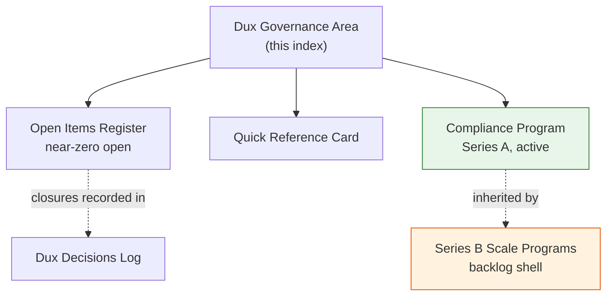

# Dux Governance Area

## Scope

Everything under `00-meta/` and `70-governance/` in the Dux corpus: the open-items register, quick reference, and the certification/compliance programs. **In scope:** open-items.md, quick-reference.md, compliance-program.md, series-b-scale.md. **Out of scope, reused by reference:** [[Dux Decisions Log]] and [[Dux Traceability Matrix]], which are resources in `wiki/resources/dux-meta/`, and [[Dux Architecture Decision Records]] in `wiki/resources/dux-architecture/`.

## Reference material

- [[Open Items Register]] — the single register of unresolved questions (near-zero as of 2026-07-21)
- [[Quick Reference Card]] — write-action autonomy, kill-switch levels, governance gates, confidence bands
- [[Compliance Program]] — SOC 2, ISO 27001/42001, EU AI Act, NHI lifecycle, AI governance (Series A)
- [[Series B Scale Programs]] — ERM, TPRM, data sovereignty, multi-region DR (backlog shell)

## Diagram

## Related

- [[Dux Overview]]
- [[Dux Decisions Log]]

## Review cadence

Weekly, or immediately after any Founder decisions-log update.
