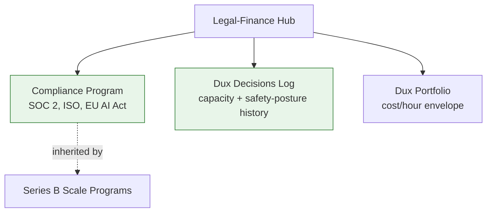

# Legal-Finance Hub

Cross-cutting entry point for compliance, governance, and financial/capacity planning. For the full governance domain, see **[[Dux Governance Area]]**.

## Compliance and governance

- [[Compliance Program]] — SOC 2, ISO 27001/42001, EU AI Act, NHI lifecycle
- [[Series B Scale Programs]] — ERM, TPRM, data sovereignty (backlog shell)
- [[Open Items Register]] — every unresolved question, with severity and owner

## Decisions and finance

- [[Dux Decisions Log]] — every decision, dated, with rationale — the capacity re-baseline history lives here
- [[Dux Portfolio]] — the 2,118h execution backlog against the 2,160h envelope
- [[Pricing & Packaging]] — outcome-pricing model, revenue lines

## Diagram

## Related

- [[Engineering Hub]]
- [[Growth Hub]]
