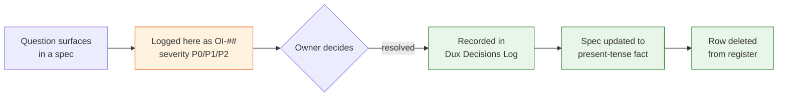

# Open Items Register

## Summary

The single register of unresolved questions across the Dux corpus. Owner: Founder. Status: canonical. Gate: n/a. Decisions: D-10, D-24, D-32 through D-57.

## Executive Summary

Every open question in the corpus carries one ID scheme (`OI-##`) instead of the seven ad hoc schemes (`E-`, `BS-`, `SR-`, `MC-`, `H-`, `CI-`, `AI-`) that preceded it; original IDs are preserved in an Origin column so historic cross-references still resolve. The register's core discipline is separation of concerns: specs state current truth in the present tense and link here for anything unresolved (the sole exception is [[Dux Decisions Log]], the historical record); nothing closes by editing prose, only by an owner's decision recorded in the decisions log. As of 2026-07-21 the register is worked to near-zero — P0 and P1 bands are both empty, and only three P2 items remain open, down from a running total that produced 57+ decisions since 00-meta/decisions-log.md began 2026-07-05.

## Specification

### Severity model

- **P0** — blocks a Gate-1 ship, or is a live legal/compliance exposure.
- **P1** — blocks a plan, a date, or an external commitment already made.
- **P2** — spec debt: real, but nothing is currently unsafe or over-promised because of it.

### Current state (2026-07-21)

| Band | Open count | Note |
|---|---|---|
| P0 | 0 | Last closure OI-57/OI-51 (2026-07-21) |
| P1 | 0 | Last closure OI-56/OI-55/OI-54 (2026-07-21) |
| P2 | 3 | OI-40, OI-59, OI-43 (partially), OI-58 |

### Open P2 items

| ID | Item | Blocks | Owner |
|---|---|---|---|
| **OI-40** | Temporal namespace-per-tenant trigger (formerly ~15K/20K-poller, keyed to Temporal Cloud) needs re-deriving for self-hosted Temporal on EKS — no Phase-1 impact. Re-derivation method: load-test matching/history/frontend pod allocation, find the p99 schedule-to-start degradation point, apply ~75% safety margin. Blocked on EKS node sizing, not on unknowns. | Namespace-per-tenant migration planning | Engineering |
| **OI-59** | Live execution of the ISO-012 adversarial-neighbor test against the deployed tenant-scoped HNSW index has never been run (docs-only repo cannot execute it). Narrowed out of former OI-41 once the embedding-signing spec and LLM04/LLM08 reassessment closed. | Empirical confirmation the HNSW index resists the documented attack, not just architectural design | Engineering / Security |
| **OI-58** | Wiz and Intune have no rate-limit-derived sync cadence, unlike the other 8 MVP connectors in [[Connector Hub]]'s authoritative table (D-47). Their prior 6h figures came from a now-superseded, unresearched table and were not carried forward. | Wiz and Intune sync-cadence figures on the same rate-limit-research basis as the other 8 | Engineering |

`OI-43` is substantively closed — a full 7-scenario test checklist exists (happy path, max-turns exit, budget-exceeded abort, tool failure/retry, Bedrock timeout, malformed tool response, HITL signal timeout at 30 min) — but the actual test code lives in the separate application repo, so it remains an execution-only gap outside this docs corpus.

### Closing an item

1. Record the decision in [[Dux Decisions Log]] with date and decision-maker.
2. Update the affected spec to state the outcome as present-tense fact, never as a diff.
3. Delete the row from this register — the decisions log and git history are the permanent record.

## Diagram

## Entities & Concepts

- [[Dux Decisions Log]] — where every closure is permanently recorded
- [[Dux Traceability Matrix]] — the BR→Epic→US chain some items block

## Related

- [[Dux Overview]]
- [[Dux Governance Area]]

## Sources

- `.raw/dux/00-meta/open-items.md`
