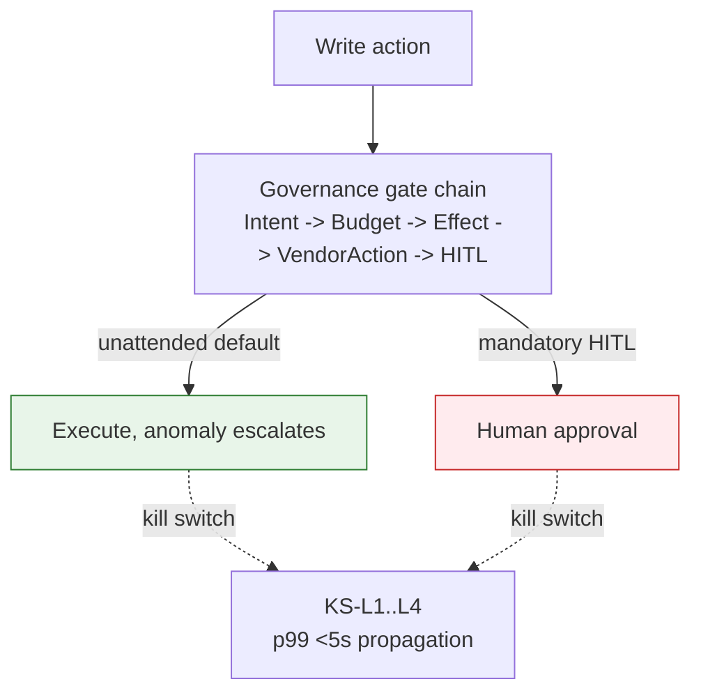

# Quick Reference Card

## Summary

A pure compilation of facts already documented elsewhere in the corpus — no new claims, no new numbers. Owner: Founder. Status: canonical. Gate: 1.

## Executive Summary

This is the corpus's single-page cheat sheet for the five numbers an engineer, reviewer, or auditor needs most often: write-action HITL posture, kill-switch propagation SLOs, governance-gate thresholds, confidence-band boundaries, and which compliance framework maps to which section of [[Compliance Program]]. Its governing rule is that it never originates a number — if this page ever disagrees with its source spec, the source spec wins.

## Specification

### Write-action autonomy (5 canonical actions, D-17)

| Action | HITL posture | Rollback |
|---|---|---|
| `endpoint.isolate` | mandatory HITL — every call | R-01 |
| `network.blocklist_add` | unattended by default, anomaly-only escalation | R-02 |
| `policy.deploy_device_config` | unattended by default, anomaly-only escalation | R-03 |
| `patch.deploy_special_devices` | mandatory HITL — every call | R-04 |
| `ticket.create_remediation` | unattended by default, anomaly-only escalation | R-05 |

### Kill-switch levels

| Level | Scope | Propagation target |
|---|---|---|
| KS-L1 Session | single assessment workflow | ≤30s |
| KS-L2 Tenant assessment | all sessions + queue, one tenant | p99 <5s |
| KS-L3 Tenant platform | all tenant agent features, dashboard read-only | p99 <5s |
| KS-L4 Global | entire platform agent fleet | p99 <5s, two-person approval |

Execution-interruption SLO: p99 <30s (one heartbeat interval).

### Governance gates (GOV-001–014)

Chain: `IntentGate → BudgetGate → EffectGate → VendorActionGate → HITLGate`

| Gate | Threshold |
|---|---|
| GOV-003 ActionBudget | warn >100, halt ≥200 weighted actions/assessment (LLM=1, MCP-read=2, MCP-write=5) |
| GOV-007 CostCap | $25/hour per-tenant hard cap |
| GOV-010 Loop | max 50 P-LLM iterations/assessment, max 10 MCP calls/iteration |
| GOV-014 VendorActionGate | write action blocked unless confidence floor met AND a rollback procedure is on file |

Cost-threshold evaluation order (first match wins): $0.675/assessment soft breaker → $25/hour CostCap → 2x rolling-baseline circuit breaker.

### Confidence bands

| Band | Label |
|---|---|
| [0.85, 1.00] | `exploitable` |
| [0.70, 0.85) | `likely` |
| [0.40, 0.70) | `unlikely` |
| [0.00, 0.40) | `not_exploitable` |
| abstain | `insufficient_data` |

Scoring: 3-signal ensemble (logprob 0.40 / semantic entropy 0.35 / verbalized confidence 0.25) → Platt scaling. This is confidence-in-exploitability, not a composite CVSS x EPSS x criticality x exposure score.

### Compliance framework map

| Framework | Where mapped |
|---|---|
| SOC 2 (AICPA TSC: CC6/7/8, A1, Confidentiality, PI, Privacy) | [[Compliance Program]] |
| ISO/IEC 27001:2022 | [[Compliance Program]] |
| ISO 42001 / EU AI Act Art. 9 | [[Compliance Program]] |
| NIST AI RMF + NIST CSF 2.0 | [[Compliance Program]] |
| CIS Controls v8 | [[Compliance Program]] |
| OWASP Agentic / LLM / MCP / NHI Top 10 | [[OWASP Assessments]], [[Compliance Program]] |

### Gate-1 exit criteria (selected)

- Zero cross-tenant fuzz reads (`pnpm test:fuzz-tenant-id` merge-blocking).
- Zero Critical findings in the adversarial suite.
- RLS `FORCE` on every tenant-scoped table, CI-verified (`check-rls.sh`).

## Diagram

## Entities & Concepts

- [[Governance Kernel]] — the gate chain this card summarizes
- [[Kill Switch]] — the propagation SLOs summarized here

## Related

- [[Dux Overview]]
- [[Mitigation & Remediation Write Path]]

## Sources

- `.raw/dux/00-meta/quick-reference.md`
