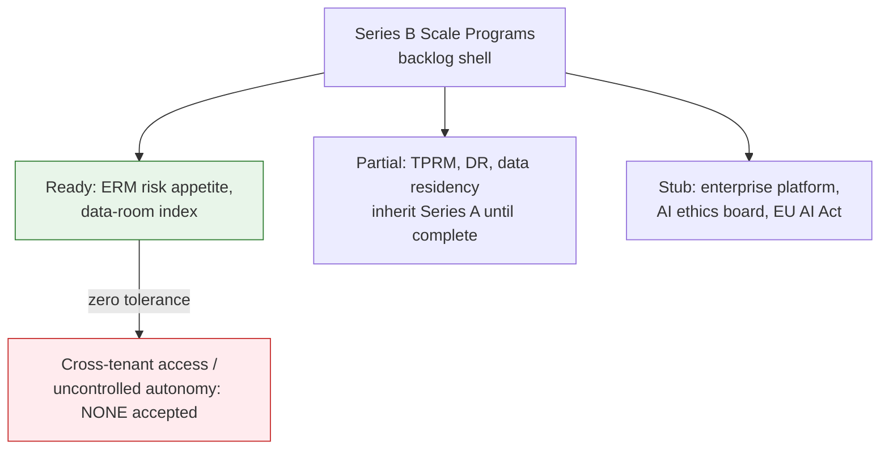

# Series B Scale Programs

## Summary

The Series B governance surface: ERM, TPRM, data sovereignty, multi-region DR, and the enterprise platform. Owner: Founder. Status: backlog-shell. Stage: Series B (Year 3-5+). Decisions: D-34.

## Executive Summary

**This is explicitly a backlog shell — most sections are planning placeholders, and the document itself instructs the reader not to execute any P0 gate from a stub section alone without a counsel-signed risk acceptance.** Only ERM risk appetite and the data-room index are marked Ready and exempt from that caveat; TPRM, internal audit, data residency, multi-region DR, and certifications are Partial (inherit Series A until content-complete); most of the enterprise-platform and AI-governance-at-scale material is Stub. The ERM risk appetite itself is unambiguous on the one line that matters most: unmitigated cross-tenant access or uncontrolled agent autonomy carries **zero accepted risk at any level** — the only "none" rating on the whole appetite table.

## Specification

### Section maturity (check before relying on anything below)

| Maturity | Sections |
|---|---|
| Ready | ERM risk appetite; data-room index |
| Partial | TPRM; internal audit; data residency; global privacy; multi-region DR; AI IR outline; SOX ITGC; certifications |
| Stub | company signals; triggers; board reporting; enterprise platform; CCM; chaos; vulnerability disclosure; purple team; AI ethics board; EU AI Act |

### ERM risk appetite (ready, exempt from shell caveat)

| Domain | Appetite |
|---|---|
| Innovation, non-production | medium risk accepted |
| Tenant isolation, agent safety, financial integrity | low |
| Unmitigated cross-tenant access, uncontrolled agent autonomy | **none — no risk accepted at any level** |

Risk scoring: Impact x Likelihood on a 1-25 scale. 20-25 critical (board), 15-19 high (30-day plan), 8-14 medium (monitored), 1-7 low (accepted).

### TPRM (partial, inherits Series A)

| Tier | Definition | Vendors |
|---|---|---|
| Tier 0 | no data, annual attestation | - |
| Tier 1 | tenant or financial data | OpenAI, Stripe, Cloudflare, Anthropic (fallback leg) |
| Tier 2 | critical path, reviewed quarterly | AWS (full-platform runtime, EKS). Grafana Cloud/Langfuse Cloud are **not** subprocessors — both self-hosted in-cluster, no external data flow |

### International and data sovereignty (partial)

| Region | Default | Sign-off gate |
|---|---|---|
| US | default, US-East primary | Gate 2+ |
| EU | tenant pin (GDPR), EU primary + replica | before the first EU-pinned tenant |
| APAC | deferred, Singapore/Australia target | before the first APAC tenant |
| LATAM | deferred, Brazil shortlist + LGPD DPIA | 30 days before any LATAM contract, no clause without Legal+Engineering pre-approval |

Breach notification clocks: EU/UK 72h, PDPA-SG 72h, India DPDP 72h, Australia 30 days.

### Multi-region DR (partial — target, not yet operational)

Stage ladder: Seed 4h/1h -> Series B targets <1h active-active, <15min at scale. EU and APAC go-live are blocked on a P0 game day or a signed risk acceptance. Under ADR-006 R4 (EKS from Gate 1), the former hosting-migration prerequisite is already satisfied — the Series B trigger is region topology and active-active capacity, not a hosting migration.

### Enterprise platform and AI governance at scale (stub)

Outcome-based pricing becomes the Enterprise default: base fee + charge per validated true positive + unexploitable credit (flagged for revenue recognition and SOX). Continuous control monitoring: kill-switch burn of 5% in 1h is P0; critical CVE open >7 days is P1.

### AI incident response (partial, reference-only)

12-section outline: detection -> triage -> containment -> agent halt -> forensics -> comms/war room -> customer notification -> recovery -> postmortem -> evidence/audit -> regulatory notification -> retest/golden-set regression. **Stays reference-only until all four hold:** Series B triggers fired, sections content-complete (not stubs), one full tabletop passed with S3 evidence, PagerDuty escalation URLs are real.

### Certification triggers

| Certification | Trigger |
|---|---|
| ISO 42001 | an EU RFP |
| FedRAMP | a federal RFP — board approval required before responding |
| HIPAA | a PHI prospect, data-flow mapping within 60 days |
| PCI | cardholder data beyond Stripe tokenization |

## Diagram

## Entities & Concepts

- [[Compliance Program]] — the Series A programs this document inherits from until content-complete
- [[DR-BCP]] — the Series A 4h/1h baseline this Series B target extends

## Related

- [[Dux Decisions Log]] — D-34 (EKS restoring the hosting prerequisite)
- [[Dux Governance Area]]

## Sources

- `.raw/dux/70-governance/series-b-scale.md`
