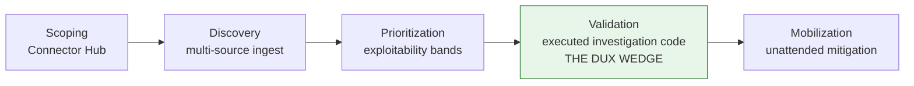

# Competitive Positioning & POC

## Summary

The analyst anchor, feature-availability matrix, competitor counters, press errata, and the 14-day POC framework. Owner: GTM lead. Status: canonical. Gate: 1. Decisions: D-25. Review: quarterly.

## Executive Summary

**A previously-cited "Gartner (Nunez)" quote is retracted from active use (D-48)** — a 2026-07-21 pass could not independently corroborate its wording, date, or attribution against any public source, superseding an earlier decisions-log call that it was "confirmed primary research." The corpus is disciplined about this: the broader positioning ("CVSS is not enough") does not depend on the quote and stays valid, but the specific quote must not be used internally or externally until Legal or the Founder locates the primary source — and even if later confirmed, no reprint license exists, so it stays internal-use-only regardless. Supporting category statistics (the 84% false-urgency reduction figure) are explicitly labeled as a third party's own reported figure, never a Dux SLA, pending Dux's own DeepEval/golden-set harness producing an owned, measured proof point. Dux's defensive-only positioning is treated as a wedge, not a limitation, against agentic-pentest competitors (Ethiack, SecRecon, Securifera) who attack to prove exploitability.

## Specification

### CTEM five-stage mapping

| CTEM stage | Dux surface |
|---|---|
| Scoping | Connector Hub (US-013) |
| Discovery | multi-source ingest (EP-02) |
| Prioritization | exploitability bands + factor cards |
| **Validation** | executed investigation code + trace (US-017) — **the Dux wedge** |
| Mobilization | unattended mitigation + routed ticket (US-004, US-018) |

### Feature availability matrix (attach to every RFP)

| Capability | Gate | Claim-safe? | Min. tier |
|---|---|---|---|
| Exploitability analysis | Gate 1 | Yes | Starter |
| Continuous re-assessment | Gate 1 | Yes | Starter |
| Executed investigation code (trace) | Gate 1 | Yes | Starter |
| Lightweight mitigations, unattended by default | Gate 1 | Yes | **Professional+** |
| Remediation ticket create + route | Gate 1 | Yes | **Enterprise only** |
| Preference learning | Gate 2c | Gate 2c only | Professional+ |
| Public REST data API | Seed trigger | Seed+ | Enterprise |
| Optional physical residency | Gate 5 | roadmap only | Enterprise |

### Competitor positioning (selected)

| Competitor | Their pitch | Dux counter |
|---|---|---|
| ZEST Security | owns "Agentic Exposure Management" phrase | Dux proves exploitability per environment — executed code, CaMeL boundary, claims firewall |
| Konvu | "deterministic checks" | per-environment agent reasoning with executed evidence traces, plus the governed write path |
| Ethiack/SecRecon/Securifera | agentic pentest, attack to prove | **Dux is defensive only** — reasons from evidence, never attacks (the wedge, not a limitation) |
| Tenable Hexa AI (GA May 2026, 40K customers) | agentic orchestration across Tenable One | prerequisite decomposition, per-source citations, executed-code traces |
| Wiz (Google Cloud, acquired Mar 2026) | risk graphs, exposure scores | environmental exploitability and control-aware paths over a posture score |
| Qualys Agent Val (GA Mar 2026) | agentic validation layer on scanner data | Dux **enriches** scanner findings (ingests Qualys/Wiz as input) rather than competing on scan breadth |
| Armis / Averlon / RunSybil / IONIX | AI validation with PoC evidence | Dux counters on a unified integration layer, preference learning, a CaMeL security boundary, and inspectable reasoning |
| Prioritization layers (CVSS + EPSS) | rank the backlog | per-environment exploitability reasoning, plus lightweight mitigation paths |

Honest competitive gaps stated plainly: broad scanner replacement (out of scope), PTaaS (rejected, defensive only), OT/IoT (Phase 2+), on-prem/air-gapped (Gate 5), financial-impact quantification (Phase 3), native mobile (Series A).

**2026 developments in the Armis/Averlon/RunSybil/IONIX category** (disclosed for transparency: an Armis executive is also a Dux angel investor, per the BusinessWire launch PR — the positioning here is independent of that relationship). ServiceNow agreed in December 2025 to acquire Armis for **$7.75B cash** (Armis ARR $340M, +50% YoY), expected to close H2 2026 — Armis may reposition as a ServiceNow-platform capability rather than a standalone vendor going forward. Averlon shipped "Precog" (May 2026, pre-production/CI-integrated exploitability evaluation ahead of merge) and joined Anthropic's Cyber Verification Program (June 2026). RunSybil raised a **$40M round** (March 2026, led by Khosla Ventures, including Anthropic/Menlo's Anthology Fund); valuation undisclosed. Konvu (a separate row above) has not raised since its $5M seed (June 2024) despite rising visibility (RSAC 2026 Launch Pad finalist; won Infosecurity Europe's inaugural Cyber Startup competition, June 2026).

### Proof of concept (14 days)

| Phase | Days | Success criteria |
|---|---|---|
| Onboard | 1-3 | AWS connector live, NDA + design-partner MSA executed |
| Assess | 4-10 | >=10 exploitability assessments queued, trace export reviewed |
| Review | 11-14 | CISO readout — reduction delta, top 3 validated findings, gate roadmap |

A 1-2 page security excerpt (tenant isolation, kill switch, data-flow diagram, subprocessors) ships before the first enterprise POC.

### ROI calculator

Inputs: critical findings/month, remediation capacity %, engineer hourly rate. Phase-1 outputs (triage time saved, false-urgency reduction) are illustrative from design-partner N=3 — must validate at N>=10 before entering signed collateral. **MTTR reduction is a Gate 3+ output and is deliberately kept out of the Phase-1 calculator.**

## Diagram

## Entities & Concepts

- [[GTM Guardrails]] — the claims firewall enforcing every row of the feature-availability matrix
- [[Pricing & Packaging]] — tier-gated minimums referenced in the matrix

## Related

- [[Lean Canvas]]
- [[Dux Decisions Log]]

## Sources

- `.raw/dux/80-gtm/competitive.md`
