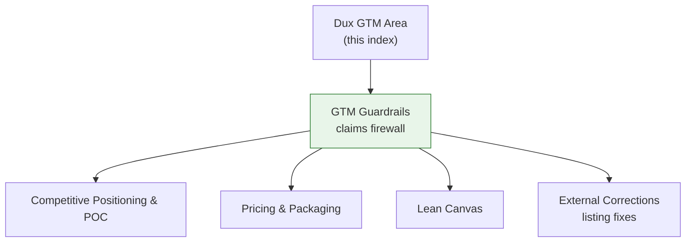

# Dux GTM Area

## Scope

Everything under `80-gtm/` in the Dux corpus: competitive positioning, pricing, claims guardrails, the lean canvas, and external-listing corrections. **In scope:** competitive.md, pricing-packaging.md, gtm-guardrails.md, lean-canvas.md, external-corrections-2026-07.md.

## Standards

**Authority:** the [[GTM Guardrails]] claims firewall (D-10) binds every note in this area — GTM copy, product naming, and UI strings only, never safety posture or gate criteria.

## Reference material

- [[Competitive Positioning & POC]] — analyst anchor, feature matrix, competitor counters
- [[Pricing & Packaging]] — tier structure, outcome pricing, Phase-1 KPIs
- [[GTM Guardrails]] — the claims firewall
- [[Lean Canvas]] — one-page business model, validated vs. hypothesis
- [[External Corrections 2026-07]] — third-party listing correction tracker

## Diagram

## Related

- [[Dux Overview]]
- [[Dux Governance Area]]

## Review cadence

Weekly, quarterly for competitive/canvas review.
