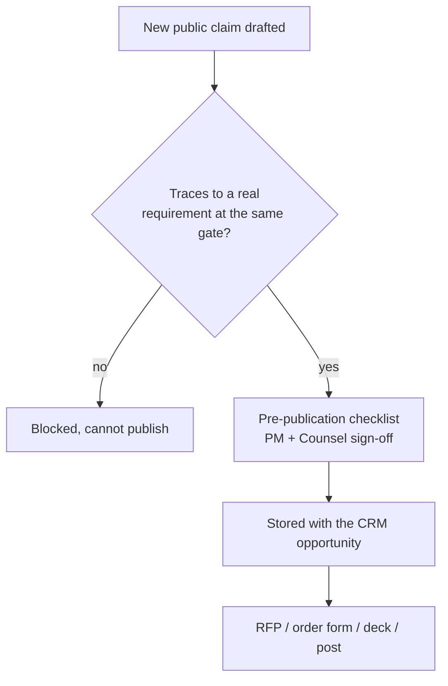
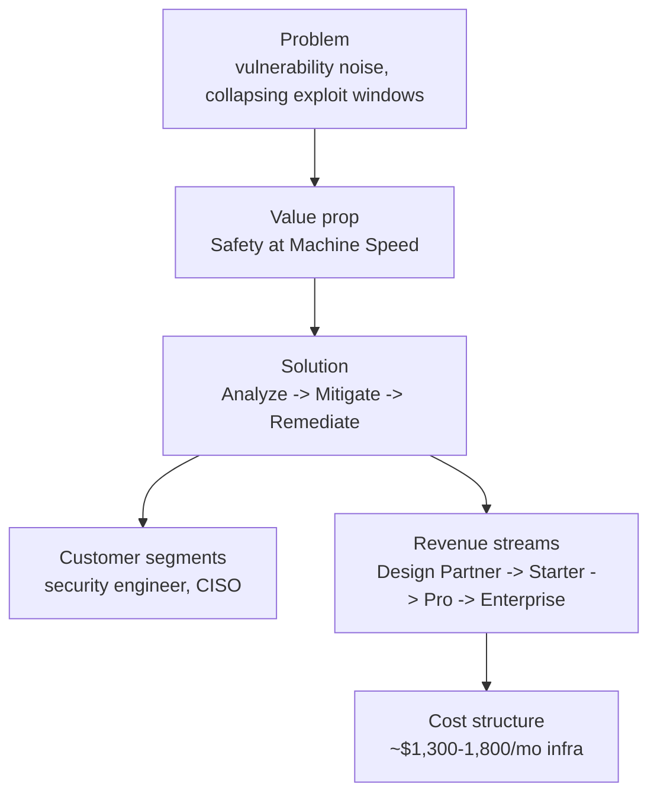
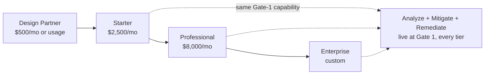
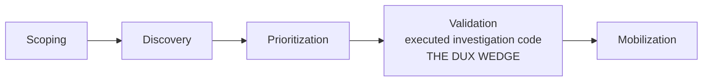
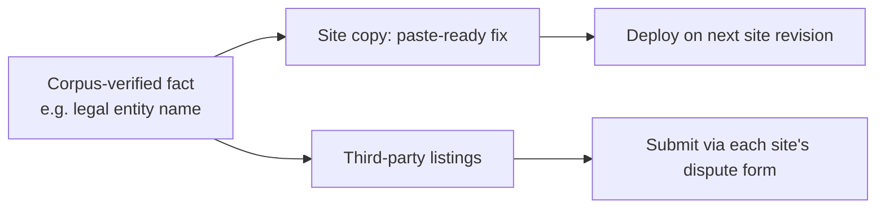

# Dux GTM Guide

Navigation: [[Dux]] | [[Dux Product Guide]] | [[Dux Customer Success Guide]]

## The claims firewall: what governs everything below

Before pricing, positioning, or the business model: one rule sits above all of it. A single claims map governs what GTM copy, product naming, and UI strings are allowed to say, and it binds *only* those three surfaces. It never binds safety posture, control design, gate criteria, or SLOs: those are set by engineering, and if marketing copy and engineering reality ever diverge, that divergence gets raised as an open item and resolved by fixing the copy, never by quietly editing a spec to match the marketing.

Worth understanding the direction this firewall moved in: the guardrails **inverted** from an earlier, more conservative playbook. Capabilities that used to be suppressed as "Gate 2+ or Gate 3, don't claim yet" (code execution in traces, continuous re-assessment, the Mitigate/Remediate write path) now genuinely ship at Gate 1. What was once suppressed is now safe to say plainly. Only two fences remain:

| Fenced capability | Gate | What to say instead |
|---|---|---|
| Preference-learning refinement | Gate 2c | The Gate-1 substitute is per-instance acknowledgment plus session-scoped routing preferences |
| Optional physical residency | Gate 5 | "Lives inside your environment" means *logical* residency (read-only APIs and OAuth) for Phases 1 through 4 |

A short list of claims worth knowing cold because they come up constantly:

| Claim | Status |
|---|---|
| "Continuous exploitability analysis" | True, unqualified |
| "Agents write and run investigation code" | True: self-hosted sandbox execution ships at Gate 1 |
| "Lightweight mitigations / rapid remediation" | True, unqualified: no human-in-the-loop caveat needed |
| The full Analyze → Mitigate → Remediate pipeline | True end to end at Gate 1 |
| "Machine-speed analysis" | True, unqualified, end to end |
| "Zero-day investigated in minutes" | **Qualified**: true per individual CVE, but an environment-wide sweep is queue-paced (hours, bounded by sandbox capacity) and must never be implied as minutes-scale |

A few rules apply permanently, regardless of gate: customer references are only ever "enterprise design partners under NDA" without written permission: never generic language like "major U.S. enterprises" used as a stand-in for real proof. Scale language ("hundreds of thousands of assets") stays out of signed collateral until the next capacity re-baseline completes. And four things are never claimed at any gate, ever: scanner replacement, PTaaS or offensive execution, OT/IoT discovery, and an on-prem resident agent before Gate 5.

A **pre-publication claims checklist**, signed by both product management and counsel and stored against the CRM opportunity, is required before every RFP response, order form, sales-deck revision, founder interview, social post, and conference talk. Any statistic that appears in a public post has to carry a source URL and a date, no exceptions. This isn't bureaucratic theater: it's already caught real problems: two AI-search-summary-shaped false claims about Dux (a fabricated hosted conference reception, a fabricated award placement) were caught before they ever entered the corpus, while a third, genuinely real claim was independently confirmed and is now safely citable with its source.

## The business model in one page

Every entry in the underlying lean canvas is explicitly tagged validated or hypothesis: a discipline that keeps a strategy document honest rather than letting it drift into an unverified set of claims dressed up as facts.

**Validated today:** the core problem (security teams drowning in noise, evidenced by real design-partner data showing roughly 1,247 critical findings per month against only ~15% remediation capacity); the primary customer segments (security engineer as the hands-on user, CISO as the buyer, with the AI Safety Lead and DevOps/SRE as secondary personas); the value proposition ("Safety at Machine Speed", evidence-backed action groups with a defensible reasoning chain, unattended by default); the full solution shape (Analyze → Mitigate → Remediate, live end to end at Gate 1); and the cost structure (detailed below).

**Still a hypothesis, honestly labeled as such:** exactly how much of a security engineer's time goes to triage versus actual remediation (awaits validation at 5+ design partners); the revenue-stream ladder itself (Design Partner at $500/mo scaling to Enterprise contracts in the $150K+ range); and the "unfair advantage" claim (per-customer executed investigation code layered on the CaMeL boundary, tenant isolation, and hash-chained audit): a real differentiator today, but not yet proven to be durable against competitive response.

One data point worth citing carefully: the urgency behind the whole problem statement traces to Mandiant's M-Trends 2026 report, which found mean time-to-exploit had gone *negative*: roughly 1 day before patch availability in 2024, worsening to roughly 7 days before patch availability in 2025. A separate, frequently paired "32-day" statistic from a different research source is a genuinely different metric and is deliberately never conflated with the Mandiant figure in this corpus.

### Cost structure, fully validated

| Line item | Figure |
|---|---|
| LLM cost per assessment | $0.75 hard ceiling, $0.55 design target |
| Self-hosted Kubernetes infrastructure (EKS, database, cache, storage, workflow engine) | Roughly $1,300–1,800/month at MVP 3-node scale |
| LLM token spend | Roughly $500–1,000/month at MVP scale |
| Team | 5 engineers against a 2,080-hour capacity envelope |

Capacity is tracked honestly rather than absorbed silently: backlog currently runs at 2,118 hours against that 2,080-hour envelope (about 102%, 38 hours over) logged as an open item, not quietly ignored.

## Pricing and packaging

Tier gating is deliberately commercial, not technical: the full Analyze pipeline and the Mitigate/Remediate write path ship at Gate 1 for *every* tier, unattended by default the same way everywhere: human review is an anomaly-escalation path, never something a customer pays more to unlock. Pricing tiers gate access and scale, not capability depth.

| Tier | Price | Asset band | API rate limit | SLA |
|---|---|---|---|---|
| Design Partner | $500/mo or usage-based | - | - | Beta, no formal SLA |
| Starter | $2,500/mo | Up to ~1,000 assets | 1,000 req/min | 99.5% |
| Professional | $8,000/mo | Up to ~10,000 assets | 5,000 req/min | 99.9% (contractual target) |
| Enterprise | Custom | Unlimited | 10,000 req/min | 99.99% (commercial commitment) |

A dedicated per-tenant database option exists for Enterprise buyers who need physical isolation beyond the standard shared-schema row-level security: priced at deal time, not offered as a self-serve SKU. SSO is sold as a contractual entitlement at signing, but the actual SAML/OIDC implementation work only kicks off once the seed-stage trigger fires: a gap worth knowing about before promising a specific delivery date.

### Outcome-based pricing, where it applies

| Meter | What it counts |
|---|---|
| Validated true positive | A confirmed exploitable finding, deduplicated per CVE-and-asset within a 30-day window |
| Unexploitable credit | A finding that gets reclassified as unexploitable after assessment, which issues a billing credit |

Publishing an outcome-based SKU requires explicit sign-off from both product management and finance on the underlying algorithm, plus at least one signed design-partner letter of intent: it doesn't ship speculatively. At Series A, Professional-tier deals run $50–150K ACV and Enterprise runs $150K+ with an outcome-based option available; by Series B, outcome-based pricing becomes the *default* for Enterprise, at which point it gets flagged for formal revenue-recognition and SOX treatment rather than handled ad hoc.

### The KPIs that actually get tracked

| KPI | Target |
|---|---|
| Mean time to exploitability verdict | Under 15 minutes per CVE |
| Actions per assessment (p95) | Under 60: governance warns above 100, halts at 200 |
| Mean time to protection | Measured end to end by Phase-1 exit: a metric, not yet an SLA |
| Time to value | Under 48 hours |
| Kill switch | Under 5 seconds p99 |
| Golden-set regression | Under 2% |
| Design partners | 2+ by the Gate-1 review |

One naming trap worth being precise about: **product MTTR is not DORA MTTR.** Product mean-time-to-remediate targets under 72 hours by Gate 3; DORA's incident-recovery MTTR targets under 1 hour. They measure genuinely different things, and conflating them in a sales conversation or an internal report produces a nonsensical number.

Market sizing figures (a total addressable market of $8–12B, a serviceable market of $800M–1.2B, and a realistic obtainable slice of $5–15M over the first two years) are explicitly labeled forward-looking hypotheses, not projections, and any external deck citing them has to attach a source URL and a date.

## Competitive positioning

Dux's structural framing against the market is the five-stage Continuous Threat Exposure Management model, with one stage claimed as a genuine wedge rather than a feature checkbox:

| CTEM stage | Dux surface |
|---|---|
| Scoping | Connector Hub |
| Discovery | Multi-source ingest |
| Prioritization | Exploitability bands and factor cards |
| **Validation** | **Executed investigation code plus a full trace: the actual Dux wedge** |
| Mobilization | Unattended mitigation plus a routed remediation ticket |

Against the competitive set, the positioning differs by category. Against agentic-pentest vendors (Ethiack, SecRecon, Securifera) (who attack live environments to prove exploitability) Dux's defensive-only stance is framed as a wedge, not a limitation: it reasons from evidence rather than attacking, which matters to buyers who can't authorize an offensive tool internally. Against scanner-and-posture vendors (Wiz, Tenable Hexa AI, Qualys Agent Val), Dux positions as an enrichment layer that reasons over their output rather than competing on scan breadth. Against a category of AI-validation vendors (Armis, Averlon, RunSybil, IONIX), the counter is a combination the source material treats as a real moat: a unified integration layer, preference learning, the CaMeL security boundary, and fully inspectable reasoning traces.

Worth disclosing plainly rather than glossing over: an Armis executive is also a Dux angel investor, per the company's own launch press release: the competitive positioning here is asserted to be independent of that relationship, but the relationship itself is disclosed rather than hidden. And the category moved fast in 2026: ServiceNow agreed to acquire Armis for $7.75B cash (Armis was running roughly $340M ARR, growing 50% year over year) in a deal expected to close in the second half of 2026; Averlon shipped a pre-production, CI-integrated exploitability tool and joined Anthropic's Cyber Verification Program; RunSybil closed a $40M round led by Khosla Ventures.

Two smaller, faster-moving competitors contest the category label directly rather than just the feature set. ZEST Security uses the exact same "Agentic Exposure Management" phrase Dux does; the counter is to differentiate on validation depth rather than argue the label, since Dux proves exploitability per environment with agent-written and executed code behind the CaMeL boundary before it ever routes a fix. Konvu makes a similar "deterministic checks to confirm exploitability" claim; Dux's counter is that its per-environment agent reasoning runs on executed code and real evidence traces rather than fixed checks, and that it owns the governed write path end to end (unattended by default, kill-switch-covered). Konvu's visibility is rising fast (a Launch Pad finalist at RSAC 2026, and winner of Infosecurity Europe's inaugural Cyber Startup competition in June 2026), though it hasn't raised new funding since a $5M seed in June 2024.

Strobes AI is the fast-triage comparison, and its own reported figures are worth naming since prospects will cite them: as of March 2026, 4.2 seconds per finding, 100+ integrations, and 95% noise reduction, with an April 2026 "AI Harness" claiming pentests compressed from 2 to 4 weeks down to under 48 hours. The counter isn't speed, it's depth: Dux delivers exploitability-validated buckets plus a full reasoning trace, with customer-environment code artifacts running behind the CaMeL boundary, and Analyze is already live at Gate 1.

A fourth comparison, named for completeness: prioritization-layer tools built on CVSS plus EPSS scoring rank the backlog but stop there, with no per-environment reasoning of their own; Dux's counter is the same exploitability reasoning plus the lightweight mitigation paths on top of it.

The honest gaps are stated plainly rather than argued around: broad scanner replacement is out of scope permanently, PTaaS is rejected on principle (defensive-only is a permanent stance, not a phase), OT/IoT support is Phase 2+, on-prem/air-gapped deployment is Gate 5, and financial-impact quantification is Phase 3.

### The 14-day proof of concept

| Phase | Days | Success looks like |
|---|---|---|
| Onboard | 1–3 | AWS connector live, NDA and design-partner agreement signed |
| Assess | 4–10 | 10+ exploitability assessments queued, trace export reviewed with the customer |
| Review | 11–14 | A CISO readout covering the reduction delta, the top 3 validated findings, and the gate roadmap |

A one-to-two-page security excerpt (tenant isolation, kill switch, a data-flow diagram, the subprocessor list) ships ahead of the first enterprise POC every time, since it's reliably the first thing a security-conscious buyer asks for.

**One retraction worth knowing about, because it shows the discipline working as intended:** a previously cited analyst quote was formally retracted from active use after a verification pass couldn't independently confirm its wording, date, or attribution against any public source: superseding an earlier internal call that had marked it "confirmed." The broader positioning point the quote supported doesn't depend on it and remains valid; only the specific quote itself is off-limits until independently re-verified, and even if it later is, it would still need a reprint license before external use.

Two more category-sizing figures, kept separate from that retracted quote because they're independently sourced: testing exploitability reduces false urgency by up to 84%, per Picus Security's own reported figure (not independent research), and CybersecTools sizes the exposure-management category at 85 tools against a broader 459-tool attack-surface category. A "Missing Blocklist"/"Protected By Policy" example count of 307 and 1,030 respectively rounds out that same category-sizing picture.

### Market validation, verbatim

Ten attributed quotes back the launch narrative, approved for sales collateral and RFP attachments through 2026-09-30 and due for a quarterly refresh against dux.io and primary press sources:

| Speaker | Quote |
|---|---|
| Or Latovitz, co-founder and CEO | "These attacks don't wait for patch cycles. Defenders need rapid insight into what's actually exploitable and the means to reduce those exposures effectively, at the pace modern attacks demand." |
| Erica Brescia, Managing Director, Redpoint | "Attackers are moving faster than ever, and defenders need a platform built for that pace. Dux puts vulnerabilities in the context of their actual threat to a business, and then uses AI agents exactly where speed and precision matter most to resolve them." |
| Rona Segev, co-founder and managing partner, TLV Partners | "Most security tools show you what's vulnerable. Dux shows you what attackers can actually use, and that's a game changer." |
| Amit Nir, co-founder and CPO | "Most scanner findings aren't exploitable once you account for real context. Agentic AI lets teams apply that level of reasoning across every vulnerability and asset, every time." |
| Nadav Geva, co-founder and CTO | "Every time a zero-day drops or a critical vulnerability hits the news, teams need answers fast. Our customers spin up AI-workers to investigate those vulnerabilities across their environment within minutes." |
| Andrew Wilder, CSO at Vetcor, ex-Nestlé | "CISOs will not turn over a rock to find another risk unless they have a solution for it. Dux solves the tale as old as time: too many vulns, not enough resources." |
| Mille Gandelsman, CPO at Opti, ex-VP at Tenable | "After nearly a decade in exposure management, determining true exploitability always felt like the holy grail, but out of reach. Dux is the first approach I've seen that uses modern AI to actually make it practical in real environments." |
| Rinki Sethi, CSO at Upwind, ex-BILL | "The biggest gap in exposure management today isn't a lack of data, it's the inability to determine what actually matters amidst constant change." |
| Karl Mattson, Squared Circle, ex-PennyMac | "The reality today is that attackers move faster than traditional security workflows. Dux changes that dynamic by helping teams reason about exposure and respond at the pace modern threats demand." |
| Or Latovitz (Redpoint YouTube, 2026) | "Dux agents act like an autonomous researcher inside each customer's environment: breaking vulnerabilities into real-world exploitation requisites, gathering runtime, identity, network, and controls evidence, and backing every investigation with agent-written code." |
| Erica Brescia (Redpoint YouTube, 2026) | "We chat with a lot of CISOs at Redpoint, and every single one bemoans the millions of vulnerabilities across their tooling. Most aren't actually exploitable: teams waste time on low-priority noise." |
| Or Latovitz (Redpoint YouTube, 2026) | "Up until now, vulnerability management teams mainly had one 1000 lb hammer: patching. For the first time, we're expanding that arsenal so VM teams can close the loop and fix problems themselves, not only orchestrate remediation with IT." |

## Live corrections: fixing what's already wrong externally

A short, ready-to-use action list exists specifically because a correct internal record doesn't automatically fix a stale external one: a directory listing or an old press link stays wrong until someone actually submits the correction. The facts anchoring every item below: the legal entity is **Dux, Inc.** (not any variant with "Technologies" in it), the company is dual-headquartered in Tel Aviv (R&D) and New York (go-to-market), founded in 2024, with a seed round co-led by three named investors.

Site-copy fixes ready to paste directly: correcting the seed-round investor list on the site banner, making the footer year a template token instead of a static number, retargeting a press link to the correctly-named source, and replacing a placeholder privacy-policy link with actual hosted, counsel-approved content.

Third-party listing corrections, each requiring its own dispute-form submission rather than a single fix: a funding-database entry that overstates automation capability (two of the five highest-impact write actions always require human approval, which the listing doesn't reflect); an entity-name correction on a data aggregator; a founding-year correction elsewhere; adding the Tel Aviv R&D headquarters to listings that currently show New York only; and removing or properly labeling an unsourced compliance-coverage percentage on a third-party tools directory.

## Sources

- `.raw/dux/80-gtm/competitive.md`
- `.raw/dux/80-gtm/pricing-packaging.md`
- `.raw/dux/80-gtm/gtm-guardrails.md`
- `.raw/dux/80-gtm/lean-canvas.md`
- `.raw/dux/80-gtm/external-corrections-2026-07.md`
