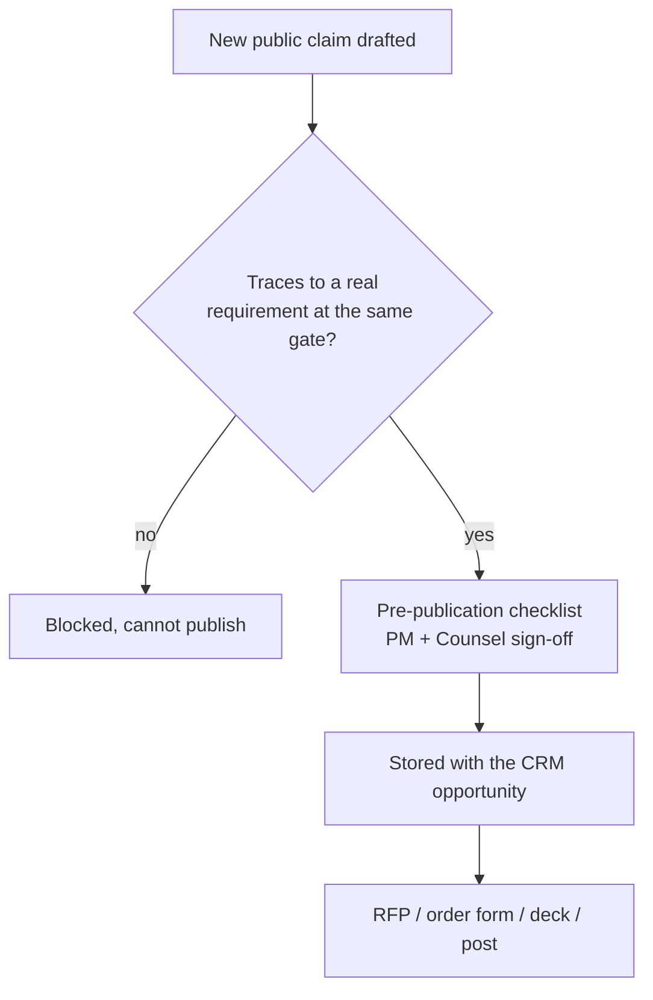
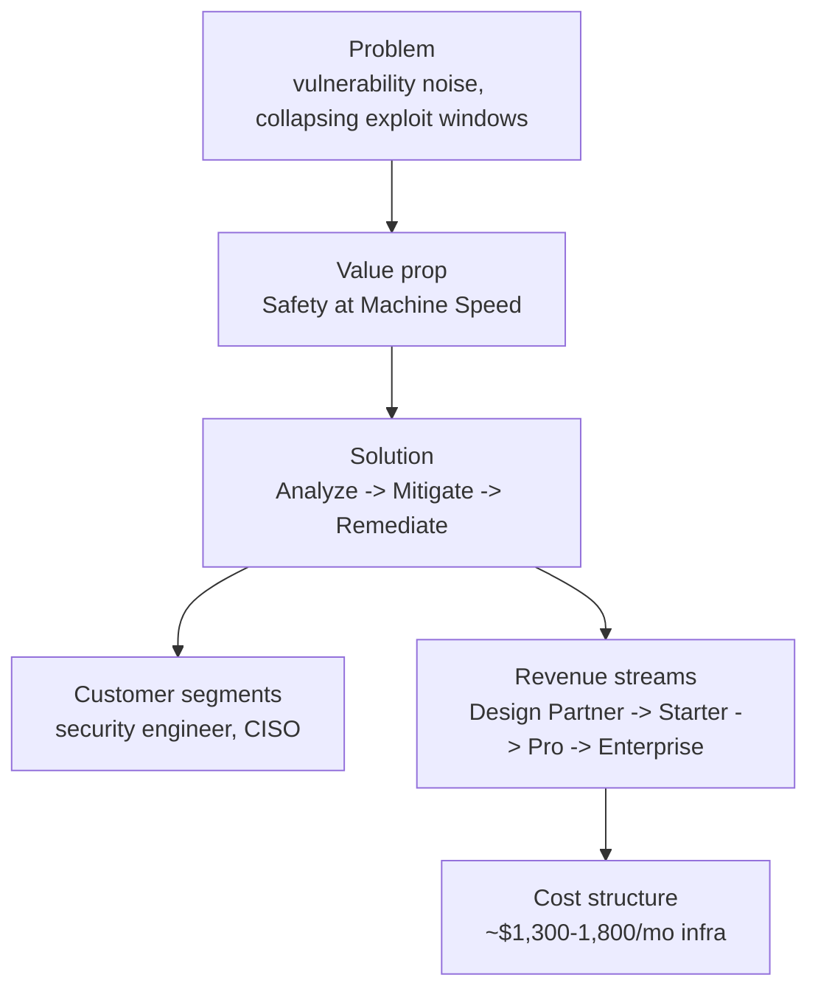
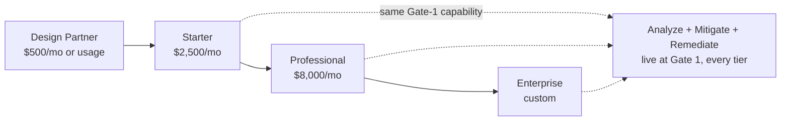
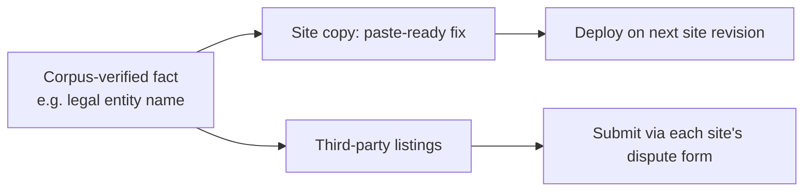
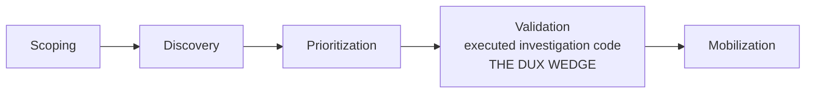

# Dux GTM Guide

Navigation: [[Dux]] | [[Dux Product Guide]] | [[Dux Customer Success Guide]]

Everything GTM needs in one place: the claims firewall, competitive positioning, the lean canvas, pricing and packaging, and a ready-to-use corrections list for fixing stale external surfaces.

## The claims firewall: what governs everything below

Before pricing, positioning, or the business model: one rule sits above all of it. A single claims map governs what GTM copy, product naming, and UI strings are allowed to say, and it binds *only* those three surfaces. It never binds safety posture, control design, gate criteria, or SLOs: those are set by engineering, and if marketing copy and engineering reality ever diverge, that divergence gets raised as an open item and resolved by fixing the copy, never by quietly editing a spec to match the marketing.

### Why the guardrails inverted

The original GTM guidance **suppressed** claims — code execution was "Gate 2+", continuous was "Gate 3", Mitigate and Remediate were "Gate 3" — because the product was Analyze-only. Under GCIS v2.2 those capabilities ship at Gate 1. **The claims became true, so the guardrails inverted: what was once suppressed is now safe to say.** Only two fences remain.

### The two remaining fences

Do not imply either has shipped before its gate.

| Fenced capability | Gate | What to say instead |
|---|---|---|
| Preference-learning refinement | Gate 2c | The Gate-1 substitute is per-instance acknowledgment plus session-scoped routing preferences |
| Optional physical residency | Gate 5 | "Lives inside your environment" means *logical* residency (read-only APIs and OAuth) for Phases 1 through 4 |

### Claim-safe at Gate 1

| Claim | Status |
|---|---|
| "Continuous exploitability analysis" | True, unqualified — continuous re-assessment (US-021, ADR-016) plus the on-demand queue |
| "Agents write **and run** investigation code" | True: self-hosted Firecracker microVM execution at Gate 1; code artifacts and executed results appear in traces |
| "Ties together all data sources / auto-tags every asset" | True, unqualified — integration-catalog coverage is tracked separately as an engineering roadmap item |
| "Lightweight mitigations / rapid remediation" | True, unqualified — no HITL caveat required in customer-facing messaging |
| The full Analyze → Mitigate → Remediate pipeline | True end to end at Gate 1 |
| "Machine-speed analysis" / "full protection at machine speed" | True, unqualified, end to end |
| "Instant" — "instant exploitability analysis", "close critical gaps instantly" | Claim-safe as stated — both accepted verbatim |
| **"Zero-day investigated in minutes"** | **Qualified** — true per individual CVE, but an environment-wide sweep is queue-paced (hours, bounded by sandbox capacity) and must never be implied as minutes-scale |

### Permanent rules

Some rules apply regardless of gate:

- **Customer references:** only "enterprise design partners under NDA" without written permission. Never use "major U.S. enterprises" as a stand-in proof claim.
- **Scale language:** never use "hundreds of thousands of assets" or "millions of vulnerabilities" in signed collateral until the Gate-2 re-baseline (≥100 assessments/day) is complete. Cite design-partner scale only.
- **Residency:** logical, not physical, for Phases 1–4. Gate 5 is physical, and remains roadmap.
- **Never claim, at any gate:** scanner replacement · PTaaS or offensive execution · OT/IoT discovery · an on-prem resident agent before Gate 5 · financial-impact quantification.
- **Naming:** public/press materials have used "AI-workers" — never use it in Dux-authored copy. Canonical is **Dux Agent** (historical usage recorded in [[Dux Product Guide]]).
- **Ecosystem mentions:** the CrowdStrike / AWS / NVIDIA 2026 Accelerator (Dux among 35 startups), and InfraRed-100-style listings, are ecosystem validation only, used with GTM approval. Never present them as product-feature claims.

### The pre-publication claims checklist

A pre-publication claims checklist, signed by both product management and counsel and stored against the CRM opportunity, is required before every RFP response, order form, sales-deck revision, founder interview, social post, and conference talk. Any statistic that appears in a public post has to carry a source URL and a date, no exceptions.

The checklist has already caught real problems: two AI-search-summary-shaped false claims about Dux (a fabricated hosted conference reception, a fabricated Redpoint award placement) were caught before they entered the corpus, while a genuinely real LinkedIn post claim was independently confirmed and is now safely citable with its source.

### Public-surface launch blockers

| Item | Required state |
|---|---|
| `trust.dux.io`, `status.dux.io` | HTTP 200 |
| Privacy policy | served from `dux.io/privacy`, not Google Drive |
| Footer | current year |
| ZoomInfo entity | Dux, Inc. |
| CybersecTools listing | corrected |
| cyberdb.co | corrected — verify, then close (listing may have been removed) |

### Archive step

The Wayback Machine holds zero 2025–2026 captures of dux.io. After every site revision — and once now — trigger Save Page Now on `https://dux.io/`, and store the capture URL in provenance. Without it there is no independent record of what the public surface claimed, and when.

## Claim-safe short-form blocks

### Hero copy

> Dux is an agentic exposure management platform, built for a world where vulnerability exploitation windows are collapsing from weeks to minutes. Use Dux Agent for instant exploitability analysis, rapid mitigation, and accelerated remediation, so you reach full protection at machine speed. Dux ties together all your data sources and auto-tags every asset, to make sure urgent fixes get done fast.

### "How it works" block (resolves MC-14)

> **Proof, not a guess.** Dux doesn't score a CVE and hope — it writes and runs real investigation code in an isolated sandbox to prove whether a vulnerability is actually exploitable in your environment, and shows you the code and the result.
>
> **A safety boundary between the internet and your environment.** Untrusted data from public CVE feeds is reasoned over in a separate, sandboxed layer from the one that has access to your environment's context — so a poisoned advisory can't manipulate what the agent does with your data.
>
> **A kill switch you control.** Any agent, any session, any customer — halted in under 5 seconds, on your command, not just ours.
>
> **Human approval where the blast radius is highest.** Isolating an endpoint or patching a firmware-only device always waits for your sign-off. Lower-risk actions — like updating a blocklist or opening a ticket — execute automatically, fully audited, so your team isn't the bottleneck on the easy calls.

Framing rule: this block describes mechanisms (sandbox execution, CaMeL boundary, kill switch, HITL tiers), not outcomes or speed — it does not need the "instant"/"machine speed" fences, and must not be edited to add them.

### Customer qualification answers

| Customer asks | Say | Do not say |
|---|---|---|
| "Do you run agents in our VPC?" | "No — Dux runs in our cloud, and connects via read-only APIs and OAuth. Optional physical residency is a Gate 5 roadmap option." | "Yes, Dux lives inside your network." |
| "Is this continuous and real-time?" | "Yes — continuous re-assessment and connector polling. Real-time webhooks for supported integrations." | "Everything is real-time." |
| "Can you see runtime behavior?" | "Yes, if you connect CrowdStrike or SentinelOne and grant read scope. Otherwise we reason from asset and network context." | "We see all runtime behavior." |
| "Can Dux remediate automatically?" | "Yes — Dux agents identify and deploy lightweight mitigations and accelerated remediation, blowing past the usual bottlenecks to get urgent fixes done fast." | Do not understate it |
| "Do you shut exposures down automatically?" | "Dux identifies exploitable paths and closes critical gaps instantly, reaching full protection at machine speed." | Do not understate it |
| "Is the analysis instant?" | "Yes — instant exploitability analysis, reaching full protection at machine speed." | Do not add a "starts / streams / completes-in-minutes" hedge |
| "Do you think like an attacker?" | "We apply an attacker-minded lens to determine real-world exploitability in your environment — defensive analysis only, not PTaaS." | "We hack your environment" / "We run pen tests" |

## The business model in one page

Every entry in the lean canvas is explicitly tagged validated or hypothesis: a discipline that keeps a strategy document honest rather than letting it drift into an unverified set of claims dressed up as facts.

**Tags:** `[V]` = validated · `[H]` = hypothesis. Review quarterly, at the gap-closure workshop.

### Problem

**`[V]`** Security teams drown in vulnerability noise. The design-partner aggregate (N = 3) shows roughly **1,247 critical findings per month against ~15% remediation capacity**, while exploitation windows collapse (M-Trends reports a negative mean time-to-exploit).

**`[H]`** The majority of vulnerability-management time goes to triage rather than remediation. Validate at N ≥ 5, by Gate 2b.

→ [[Dux Product Guide]], [[Dux Customer Success Guide]]

### Customer segments

**`[V]`** Primary user: the **security engineer** — the person turning a queue of thousands into tens. Buyer: the **CISO**.

Also: the **AI Safety Lead** (halt authority), and **DevOps/SRE** (who owns the remediation).

Early adopters: 2+ NDA design partners. GTM is US-first.

### Unique value proposition

**`[V]`** **"Safety at Machine Speed."**

Thousands of alerts become a small set of evidence-backed action groups, each with a defensible reasoning chain: *what is actually exploitable here*, and *the fastest path to protection* — with the write path unattended by default.

### Solution

**`[V]`** A three-stage agentic pipeline — **Analyze → Mitigate → Remediate** — live end to end at Gate 1, unattended by default.

Agents **write and execute** investigation code in microVM sandboxes, and re-assess continuously.

### Channels

**`[V]`** Phase 1: Contact-Us, plus the NDA design-partner flow.

**`[H]`** Self-serve PLG opens at Gate 2b — Stripe SKUs, automated provisioning, and KS-L3 tested in production.

### Revenue streams

**`[H]`** Design partner at $500/month or usage-based → Starter $2,500/month and Professional $8,000/month at Gate 2b list → Series A ACV of $50–150 K, or $150 K+.

Outcome-based pricing — per validated true positive, plus an unexploitable credit — becomes the Enterprise default at Series B.

→ [[Dux Governance & Compliance Guide]] (enterprise pricing)

### Unfair advantage

**`[H]`** Per-customer **executed investigation code** — consistent, inspectable, repeatable — on top of the CaMeL dual-LLM boundary, RLS isolation, and a hash-chained audit spine.

**Competitors rank findings. Dux proves exploitability, per environment.**

### Market sizing

All forward-looking hypotheses:

| Measure | Range |
|---|---|
| TAM | $8–12 B |
| SAM | $800 M – $1.2 B |
| SOM, years 1–2 | $5–15 M — 50–150 enterprises × $50–100 K ACV |

Category sizing: CybersecTools lists 85 exposure-management tools. Every range here is a stage-model illustration. Any external deck must cite a source URL and a date.

### Cost structure

| Line item | Figure |
|---|---|
| LLM cost per assessment | $0.75 hard ceiling, $0.55 design target (D-3 gates: breaker $0.675, CI $0.55) |
| Self-hosted Kubernetes infrastructure (EKS, database, cache, storage, workflow engine) | ~$1,300–1,800/month at MVP 3-node scale (3× m6i.2xlarge + CloudFront/DNS ~$100, EKS control plane ~$73/mo) |
| LLM token spend (Bedrock) | ~$500–1,000/month at MVP scale |
| Team | 5 engineers against a 2,160-hour capacity envelope (D-40: 27 h/week) |

Capacity is tracked honestly rather than absorbed silently: backlog currently runs at **2,118 hours against 2,160 hours** (~98%, 42 hours buffer), logged as an open item.

→ [[Dux Operations Guide]]

## Pricing and packaging

Tier gating is deliberately commercial, not technical: the full Analyze pipeline and the Mitigate/Remediate write path ship at Gate 1 for *every* tier, unattended by default, the same way everywhere. Human review is an anomaly-escalation path, never something a customer pays more to unlock. Pricing tiers gate access and scale, not capability depth.

### Tier structure

| Tier | Price | Asset band | API rate limit | SSO | SLA | Support |
|---|---|---|---|---|---|---|
| Design Partner | $500/mo or usage-based | — | — | — | Beta, no formal SLA | email |
| Starter | $2,500/mo | Up to ~1,000 assets | 1,000 req/min | — | 99.5% | email |
| Professional | $8,000/mo | Up to ~10,000 assets | 5,000 req/min | included¹ | 99.9%² | email + chat |
| Enterprise | custom | Unlimited | 10,000 req/min | included | 99.99%³ | dedicated CSM |

**Per-tenant database isolation (D-38).** A dedicated-CloudNativePG-per-tenant option is offered to Enterprise buyers who require physical isolation beyond the default shared-schema row-level security model — priced and scoped at deal time, on the same enterprise-RFP trigger as the FedRAMP path, not a self-serve SKU.

**¹ SSO entitlement is not SSO delivery.** The contract entitles it; the technical SAML/OIDC work is a seed trigger, and US-014 shows a deferral note in Phase 1.

**² 99.9% is a contractual target, not an operating SLO.** Per-tenant operational SLO objects activate at Gate 2+. LLM provider outages are excluded. Counsel must approve the order-form SLA language.

**³ Enterprise's 99.99% target is a commercial commitment.** The warm-pool / provisioned-concurrency capacity planning needed to underwrite it at the infrastructure layer is tracked in [[Dux Architecture Guide]].

The public data API is a separate plane, with its own limits: Starter 60, Professional 300, Enterprise negotiated — req/min.

Pipeline stages by tier: Starter is Analyze only; Professional adds Mitigate; Enterprise gets all three. But that gating is commercial, not technical — the Analyze pipeline *and* Mitigate/Remediate all ship at Gate 1 for every tier.

### Outcome-based pricing

**Seed pilot (pre-Gate 2b):** Design partners at $500/month, or usage-based.

| Meter | What it counts |
|---|---|
| `dux.validated_true_positive` | A confirmed exploitable finding, deduplicated per CVE + asset within a 30-day window |
| `dux.unexploitable_credit` | A finding reclassified as unexploitable after assessment → issues a billing credit |

Finance reconciles monthly, with a 14-day dispute window. Publishing an outcome-based SKU requires explicit sign-off from both product management and finance on the algorithm, plus at least one signed design-partner letter of intent.

**Gate 2b readiness:** PM and Finance sign off, and at least one design-partner LOI exists, before any Stripe SKU publishes. Finance and the CTO must validate the cost model against real partner telemetry, define usage caps, and confirm Starter profitability — or explicitly reposition it as a loss-leader.

**Series A enterprise pricing.** Professional at $50–150K ACV ($8K/mo list). Enterprise at $150K+ — the full 3-stage offering post-Gate 3, with an outcome-based option: base + per-validated-true-positive + unexploitable credit.

**Series B.** Outcome pricing becomes the Enterprise default. Flag it for revenue recognition and SOX.

**Renewal drivers.** A TenantHealthScore below 50 triggers a Security/FinOps review. Golden-set drift triggers a contract-amendment discussion.

### The KPIs that actually get tracked

| KPI | Target |
|---|---|
| Mean time to exploitability verdict (MTXV) | <15 min per CVE |
| Actions per assessment (p95) | <60 — governance warns above 100, halts at 200 |
| Mean time to protection (MTTP) | Measured end to end by Phase-1 exit — a metric, not an SLA, and distinct from MTTR |
| Mean time to remediate (MTTR) | <72 h (Gate 3) |
| Time to value | <48 h from connector |
| Kill switch (p99) | <5 s |
| Golden-set regression | <2% |
| Design partners | 2+ by Gate-1 review (Week 12) |
| Cross-tenant isolation | 100% in CI |

**Product MTTR is not DORA MTTR.** DORA MTTR is incident recovery, targeted under 1 h. Product MTTR targets under 72 h by Gate 3. They measure different things.

Reconciled against engineering data: observed range of 40–80 actions (p50 ≈ 55, p95 ≈ 58). The p95 <60 figure is consistent with that data.

## Competitive positioning

### The CTEM framing

Dux's structural framing against the market is the five-stage Continuous Threat Exposure Management model, with one stage claimed as a genuine wedge rather than a feature checkbox:

| CTEM stage | Dux surface |
|---|---|
| Scoping | Connector Hub (US-013) |
| Discovery | Multi-source ingest (EP-02) |
| Prioritization | Exploitability bands + factor cards |
| **Validation** | **Executed investigation code + full trace (US-017) — the Dux wedge** |
| Mobilization | Unattended mitigation + routed ticket (US-004, US-018) |

The outcome metric "thousands → tens" (the actionable-queue ratio) stays illustrative until measured on real partner data at N ≥ 10.

### Supporting category statistics

| Statistic | Note |
|---|---|
| Testing exploitability reduces false urgency by **up to 84%** | Picus Security's own reported figure, not independent research (D-53). CTEM-validation research — validation is the stage most teams skip |
| Only **16%** of organizations have operationalized CTEM, though **84%** call it important | Reflectiz survey, n=128 (D-53) — a small, single-vendor-run survey |
| **~5% of published CVEs have a known exploit in the wild** | EPSS (FIRST.org), corroborated by independent secondary analysis (~5–6%) and consistent with Tenable (~3%), Fortinet (~5.7%), Kenna/Cyentia (<2%) |

### Analyst validation

A quote previously attributed to "Gartner (Nunez, Mar 2026)" — **status: unconfirmed, not "primary research."** A 2026-07-21 web pass could not independently corroborate this quote's exact wording, date, or attribution. **Do not use this quote internally or externally — in decks, sales enablement, or RFPs — until Legal or the Founder locates and confirms the primary source.** Jonathan Nunez is a real Gartner analyst covering Exposure Management, but that does not confirm this specific quote.

**No reprint/syndication licence exists (confirmed 2026-07-16).** Even if confirmed, it remains internal-use-only unless Legal secures a Gartner reprint licence.

The broader positioning claim does not depend on this quote: "CVSS is not enough" is the mainstream Gartner, Rapid7, and Zafran position. Dux's capabilities map onto that direction regardless.

> **Note on CybersecTools CSF percentages:** NIST CSF 2.0 coverage numbers (ID 72% / PR 85% / DE 60% / RS 45% / RC 38% / GV 55%) on the CybersecTools listing were never provided by Dux — directory-generated, third-party fabrication. These must never be cited as Dux's own.

### Competitor profiles

| Competitor | Their pitch | The Dux counter | Caveat |
|---|---|---|---|
| **ZEST Security** | Owns "Agentic Exposure Management"; AI maps risks to resolution pathways | Dux **proves** exploitability per environment — agent-written and executed code, CaMeL safety boundary, claims firewall — *before* routing a fix | Same category phrase. Differentiate on validation depth, not the label |
| **Konvu** | "Deterministic checks to confirm exploitability" | Per-environment agent reasoning with executed code and evidence traces, not fixed checks. Dux also owns the governed write path — unattended by default, kill-switch-covered | Rising visibility (RSAC 2026 Launch Pad finalist; won Infosecurity Europe Cyber Startup competition, Jun 2026). No new funding since $5M seed (Jun 2024) |
| **Ethiack / SecRecon / Securifera** (agentic pentest, CART) | "Prove what's exploitable" — by attacking | **Dux is defensive only.** Reasons about exploitability from evidence, never attacks. That is the wedge, not a limitation | Buyers who conflate validation with pentesting |
| **Tenable Hexa AI** (GA May 2026, 40K customers) | Agentic orchestration across Tenable One; remediation workflows — GA adds multistep reasoning and MCP support | Prerequisite decomposition, per-source citations, executed-code traces (US-017); connector-backed live context vs. cloud-side Exposure Data Fabric | Buyers already bundled into Tenable One |
| **Strobes AI** (Mar 2026 — 4.2 s per finding, 100+ integrations, 95% noise reduction; Apr 2026 "AI Harness") | Fast triage, noise reduction | Exploitability-validated buckets **plus a reasoning trace** — not speed-only triage. Customer-environment code artifacts behind the CaMeL boundary | Analyze is live at Gate 1 |
| **Wiz** (part of Google Cloud — acquisition closed March 2026) | Risk graphs, exposure scores | Environmental exploitability and control-aware paths, over a posture score | Wiz/Google Cloud standardization; watch for deeper bundling as Gemini AI integration proceeds |
| **Tenable / Qualys VM** (Qualys "Agent Val" GA March 2026) | Scanner breadth, now with Qualys shipping its own agentic validation layer | **Enrich** scanner findings with environmental exploitability — Dux ingests Qualys and Wiz as input | A scanner vendor shipping a comparable agentic layer inside the renewal window |
| **Armis / Averlon / RunSybil / IONIX** | AI validation with PoC evidence | Unified integration layer, preference learning, CaMeL security boundary, inspectable reasoning | **Disclosure: an Armis executive is also a Dux angel investor** (BusinessWire, Dec 2025). ServiceNow agreed to acquire Armis for $7.75B cash (Armis ARR $340M, +50% YoY), expected close H2 2026. Averlon shipped "Precog" (May 2026) and joined Anthropic's Cyber Verification Program (Jun 2026). RunSybil raised $40M (Mar 2026, Khosla Ventures, incl. Anthropic/Menlo's Anthology Fund) |
| **Prioritization layers (CVSS + EPSS)** | Rank the backlog | Per-environment exploitability reasoning, plus lightweight mitigation paths | — |

### Honest competitive gaps

Stated plainly: broad scanner replacement (out of scope permanently) · PTaaS (rejected — defensive only) · OT/IoT (Phase 2+) · on-prem and air-gapped (Gate 5) · financial-impact quantification (Phase 3) · native mobile (Series A).

### Feature availability matrix

**Attach this to every RFP and every pre-Gate-3 contract.**

The "Live" cells describe what the *capability* does at that gate — not what every tier includes. A Starter or Professional prospect must not read this matrix as full access; check the minimum-tier column.

| Capability | Gate 1 | Gate 2c | Gate 3 | Claim-safe? | Min. tier |
|---|---|---|---|---|---|
| Exploitability analysis (queue + drill-down) | Live (US-010, US-011) | — | — | Yes | Starter |
| Continuous re-assessment | Live (US-021, ADR-016) | — | — | Yes | Starter |
| Executed investigation code (trace) | Live (US-017, self-hosted Firecracker) | — | — | Yes | Starter |
| Asset context / protection breakdown | Live (US-002, US-003) | richer vendor data | — | Yes | Starter |
| Lightweight mitigations | **Live, unattended by default** (US-004, US-016) | — | closed-loop validation (US-019) | Yes | **Professional+** |
| Remediation ticket create + route | Live (US-018) | — | closed-loop automation | Yes | **Enterprise only** |
| Ownership inference / auto-tagging | Live (US-007) | — | — | Yes | Starter |
| Preference learning | — | US-009 | — | Gate 2c only | Professional+ |
| Public REST data API | — | Seed trigger | — | Seed+ | Enterprise |
| Optional physical residency | — | — | Gate 5 | roadmap only | Enterprise |

### Press errata

Attach when a prospect cites the December-2025 press.

| Press claim | Gate-safe response |
|---|---|
| Full pipeline at machine speed | **True** — Analyze → Mitigate → Remediate live at Gate 1, unattended by default |
| "Continuous exploitability analysis" | **True** — continuous re-assessment ships at Gate 1 (ADR-016) |
| "Major U.S. enterprises" / millions of vulnerabilities | **Design partners under NDA.** No scale claims until Gate-2 re-baseline |
| CEO: agents "write and run" code | **True** — sandboxed execution at Gate 1 (self-hosted Firecracker) |
| "Dux Technologies Inc." (SiliconANGLE) | **The contracting entity is Dux, Inc.** (D-51). Dux's Privacy Policy PDF names "Dux Technologies Inc." in error — external follow-up needed |
| "fastest safe fix" (BusinessWire) | **The phrase is retired, stays retired** (V-13). Say **"fastest path to protection"** — fix-safety validation is closed-loop at Gate 3 |
| PR subhead: "shuts them down before they're used in an attack" | "Dux identifies exploitable paths and closes critical gaps instantly, reaching full protection at machine speed" — the gtm-guardrails wording |
| FinSMEs: "already supporting major U.S. enterprises … hundreds of thousands of assets and millions of vulnerabilities" | **Design partners under NDA** (V-7). No scale claims until Gate-2 re-baseline (V-9) |

### 14-day proof of concept

| Phase | Days | Success looks like |
|---|---|---|
| Onboard | 1–3 | AWS connector live; NDA and design-partner MSA executed |
| Assess | 4–10 | ≥10 exploitability assessments queued (US-010); trace export reviewed (US-017) |
| Review | 11–14 | CISO readout — the reduction delta (US-006), the top 3 validated findings, and the gate roadmap |

A 1–2 page security excerpt (tenant isolation, kill switch, data-flow diagram, subprocessors) ships before every enterprise POC.

**POC exit:** convert to a paid pilot, or record a documented disqualification.

### ROI calculator

**Inputs:** critical findings per month; remediation capacity (%); engineer hourly rate.

**Phase-1 outputs:** triage time saved, false-urgency reduction — illustrative, from design-partner N = 3. Validate at N ≥ 10 before entering signed collateral. Plus a build-versus-buy comparison.

MTTR reduction is a Gate 3+ output. Product MTTR is not measured in Phase 1 — keep it out of the calculator.

### Market validation quotes

| Speaker | Quote |
|---|---|
| Or Latovitz, co-founder and CEO | "These attacks don't wait for patch cycles. Defenders need rapid insight into what's actually exploitable and the means to reduce those exposures effectively, at the pace modern attacks demand." |
| Erica Brescia, Managing Director, Redpoint | "Attackers are moving faster than ever, and defenders need a platform built for that pace. Dux puts vulnerabilities in the context of their actual threat to a business, and then uses AI agents exactly where speed and precision matter most to resolve them." |
| Rona Segev, co-founder and managing partner, TLV Partners | "Most security tools show you what's vulnerable. Dux shows you what attackers can actually use, and that's a game changer." |
| Amit Nir, co-founder and CPO | "Most scanner findings aren't exploitable once you account for real context. Agentic AI lets teams apply that level of reasoning across every vulnerability and asset, every time." |
| Nadav Geva, co-founder and CTO | "Every time a zero-day drops or a critical vulnerability hits the news, teams need answers fast. Our customers spin up AI-workers to investigate those vulnerabilities across their environment within minutes." |
| Andrew Wilder, CSO at Vetcor, ex-Nestlé | "CISOs will not turn over a rock to find another risk unless they have a solution for it. Dux solves the tale as old as time: too many vulns, not enough resources." |
| Mille Gandelsman, CPO at Opti, ex-VP at Tenable | "After nearly a decade in exposure management, determining true exploitability always felt like the holy grail, but out of reach. Dux is the first approach I've seen that uses modern AI to actually make it practical in real environments." |
| Rinki Sethi, CSO at Upwind, ex-BILL | "The biggest gap in exposure management today isn't a lack of data, it's the inability to determine what actually matters amidst constant change." |
| Karl Mattson, Squared Circle, ex-PennyMac | "The reality today is that attackers move faster than traditional security workflows. Dux changes that dynamic by helping teams reason about exposure and respond at the pace modern threats demand." |
| Or Latovitz (Redpoint YouTube, 2026) | "Dux agents act like an autonomous researcher inside each customer's environment: breaking vulnerabilities into real-world exploitation requisites, gathering runtime, identity, network, and controls evidence, and backing every investigation with agent-written code." |
| Erica Brescia (Redpoint YouTube, 2026) | "We chat with a lot of CISOs at Redpoint, and every single one bemoans the millions of vulnerabilities across their tooling. Most aren't actually exploitable: teams waste time on low-priority noise." |
| Or Latovitz (Redpoint YouTube, 2026) | "Up until now, vulnerability management teams mainly had one 1000 lb hammer: patching. For the first time, we're expanding that arsenal so VM teams can close the loop and fix problems themselves, not only orchestrate remediation with IT." |

## External corrections: fixing what's already wrong

A short, ready-to-use action list exists because a correct internal record doesn't automatically fix a stale external one: a directory listing or an old press link stays wrong until someone actually submits the correction. The facts anchoring every item below: the legal entity is **Dux, Inc.**, the company is dual-headquartered in Tel Aviv (R&D) and New York (GTM), founded in 2024, with a seed round co-led by Redpoint, TLV Partners, and Maple Capital.

### Site copy fixes (paste directly)

**MC-13 — banner omits a co-lead.**

> Was: "led by Redpoint and TLV Partners"
> Fix: "led by Redpoint, TLV Partners, and Maple Capital"

**Footer year.**

> Was: "© 2025 Dux, Inc." (or equivalent)
> Fix: "© 2026 Dux, Inc." — better long-term: a `{{current_year}}` template token if Framer supports it.

**MC-08 — seed-round banner links to SiliconANGLE article, which carries the wrong entity name.**

> Retarget the banner's hyperlink from the SiliconANGLE URL to the BusinessWire launch PR — the canonical, correctly-named source — or to an owned blog post once one exists.

**Privacy policy — currently a raw Google Drive link (MC-01).**

> A structural skeleton for Legal to fill in and approve — not to be published as-is. Sections 4–6 point at real corpus facts; sections 1, 5, and 7 need Legal's actual wording. The draft covers: who Dux is, data collected, how it's used, subprocessors, user rights (export/deletion), security posture, and change-notice process.

### Third-party listing corrections

Submit via each site's correction/dispute form:

| Surface | Correction |
|---|---|
| **PitchBook** (771870-88) | "automated remediation" overstates current capability — 3 of 5 canonical write actions execute unattended, but the 2 highest-impact actions (endpoint isolation, firmware patching) always require human approval. HQ listed as "New York, NY" only — add Tel Aviv, Israel as R&D HQ |
| **ZoomInfo** (547149997) | Entity name "Dux Technologies Inc." is incorrect. Legal entity is **Dux, Inc.** Update name and URL slug |
| **clawandtalon.capital** | Founding year reads "2025"; actual year is **2024**. "Remediation automation" overstates — revise to AI-driven exploitability assessment with automated mitigation on lower-risk actions and human approval on highest-impact ones |
| **cybersecurityintelligence.com** | HQ listed as "New York, New York, USA" only. Dux is dual-HQ'd: Tel Aviv (R&D) + New York (GTM) |
| **SiliconANGLE** | Live, immutable press article — lower priority. Handle via site-side banner retarget instead of chasing article edit |
| **CybersecTools** | NIST CSF 2.0 coverage percentages (ID 72% / PR 85% / DE 60% / RS 45% / RC 38% / GV 55%) attributed to Dux that Dux never supplied. Request removal or relabel as third-party estimates |

### What's still not covered

- **trust.dux.io / status.dux.io / docs.dux.io DNS** (MC-01) — infrastructure work (point DNS, deploy pages), not copy.
- **MC-14 "how it works" section** — drafted in the claim-safe short-form block above.

## Sources

- `.raw/dux/80-gtm/competitive.md`
- `.raw/dux/80-gtm/pricing-packaging.md`
- `.raw/dux/80-gtm/gtm-guardrails.md`
- `.raw/dux/80-gtm/lean-canvas.md`
- `.raw/dux/80-gtm/external-corrections-2026-07.md`
