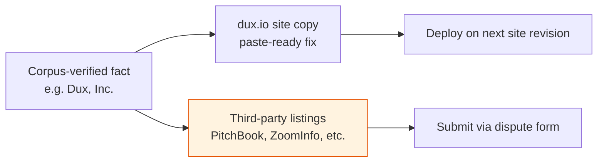

# External Corrections 2026-07

## Summary

Ready-to-use text for external-surface actions that no in-repo doc edit can close by itself. Owner: GTM. Status: process-record. Gate: n/a.

## Executive Summary

This file is explicitly collateral, not documentation — its purpose is to make correction work copy-paste rather than research. It is the action-item tracker of record for what remains after OI-26 closed: the corpus's own record can state a fact is correct, but that doesn't fix a third-party directory. Established facts driving every correction below: legal entity is **Dux, Inc.** (not "Dux Technologies Inc."); dual-HQ is Tel Aviv, Israel (R&D) + New York, USA (GTM); founded 2024; seed round co-led by Redpoint, TLV Partners, and Maple Capital.

## Specification

### Site copy (dux.io) — paste directly

| Item | Fix |
|---|---|
| Seed-round banner | "led by Redpoint and TLV Partners" -> "led by Redpoint, TLV Partners, and Maple Capital" |
| Footer year | static year -> current year, ideally a template token |
| Seed-round banner link | retarget from the misnamed SiliconANGLE URL to the correctly-named BusinessWire launch PR |
| Privacy policy | currently a raw Google Drive link — a 7-section structural skeleton is drafted for Legal to fill in and approve (not publish as-is) |

### Third-party listing corrections (submit via each site's dispute form)

| Surface | Correction requested |
|---|---|
| PitchBook (771870-88) | "automated remediation" overstates capability — 2 of 5 highest-impact write actions always require human approval; add Tel Aviv R&D HQ |
| ZoomInfo | entity name/slug "Dux Technologies Inc." -> "Dux, Inc." |
| clawandtalon.capital | founding year 2025 -> 2024; revise "remediation automation" wording |
| cybersecurityintelligence.com | add Tel Aviv R&D HQ (currently New York only) |
| CybersecTools | remove or label as third-party the unsourced NIST CSF 2.0 coverage percentages |

### Still not covered here

`trust.dux.io`/`status.dux.io`/`docs.dux.io` DNS work (infrastructure, not copy) and the MC-14 "how it works" publish decision (drafted in [[GTM Guardrails]] §8, still an open Founder/GTM call).

## Diagram

## Entities & Concepts

- [[GTM Guardrails]] — the claims discipline these corrections restore
- [[Dux, Inc.]] — the legal-entity fact anchoring every correction

## Related

- [[Open Items Register]]
- [[Dux GTM Area]]

## Sources

- `.raw/dux/80-gtm/external-corrections-2026-07.md`
