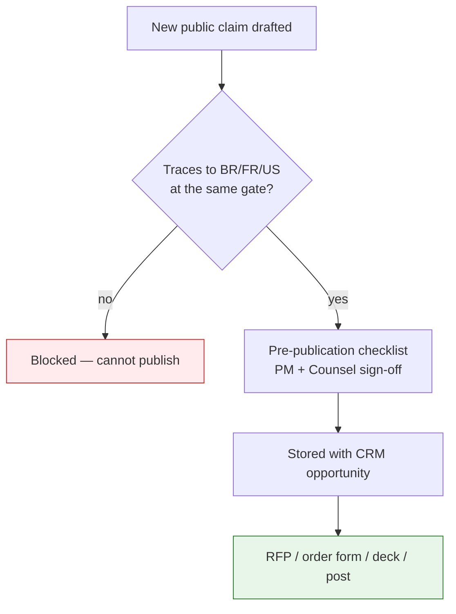

# GTM Guardrails — the Claims Firewall

## Summary

What may be said publicly, what may not, and the process gate that enforces it. Owner: GTM. Status: canonical. Gate: 1. Decisions: D-10.

## Executive Summary

The claims map binds GTM copy, product naming, and UI strings only (D-10) — it never binds safety posture, control design, gate criteria, or SLOs, which are stated by engineering; a divergence is raised as an open item, never resolved by editing a spec. The guardrails **inverted** from the original playbook: capabilities once suppressed as "Gate 2+/3" (code execution, continuous re-assessment, Mitigate/Remediate) now ship at Gate 1 under GCIS v2.2, so what was once suppressed is now safe to say — only two fences remain (preference-learning refinement at Gate 2c, and physical residency at Gate 5). The pre-publication claims checklist, signed by PM and Counsel, is blocking for every RFP response, order form, and sales-deck revision — an RFP answer without a stored checklist is a blocked send. Two AI-search-summary-shaped false claims about Dux were caught and never entered the corpus (a fabricated Dux-hosted RSA reception, a fabricated Redpoint InfraRed 100 placement), while a third genuinely-real claim (the "65-day MTTR" LinkedIn post) was confirmed and is now citable with its URL.

## Specification

### The two remaining fences

| Fenced capability | Gate | Guardrail |
|---|---|---|
| Preference learning refinement | Gate 2c | needs behavioral-data volume; Gate-1 substitute is per-instance acknowledgment + session routing |
| Optional physical residency | Gate 5 | "Lives inside your environment" means logical residency (read-only APIs + OAuth) for Phases 1-4 |

### Claim-safe at Gate 1 (selected)

| Claim | Status |
|---|---|
| "Continuous exploitability analysis" | True — US-021, ADR-016 |
| "Agents write and run investigation code" | True — self-hosted Firecracker at Gate 1 |
| "Lightweight mitigations / rapid remediation" | True, unqualified — no HITL caveat required |
| Full Analyze -> Mitigate -> Remediate pipeline | True end to end at Gate 1 |
| "Machine-speed analysis" | True, unqualified, end to end |
| "Zero-day investigated in minutes" | **Qualified** — true per CVE, but environment-wide sweeps are queue-paced (hours, bounded by the D-9 sandbox caps), never implied as minutes-scale |

### Permanent rules

Customer references: only "enterprise design partners under NDA" absent written permission — never "major U.S. enterprises" as a proof stand-in. Scale: never generalized scale language ("hundreds of thousands of assets") in signed collateral until the Gate-2 re-baseline completes. Never claim at any gate: scanner replacement, PTaaS/offensive execution, OT/IoT discovery, an on-prem resident agent before Gate 5, financial-impact quantification.

### Customer qualification script (selected)

| Customer asks | Say | Do not say |
|---|---|---|
| "Do you run agents in our VPC?" | "No — Dux runs in our cloud, connects via read-only APIs and OAuth. Optional physical residency is a Gate 5 roadmap option." | "Yes, Dux lives inside your network." |
| "Do you think like an attacker?" | "We apply an attacker-minded lens ... defensive analysis only, not PTaaS." | "We hack your environment." |

### Process gate

The pre-publication claims checklist (PM + Counsel signature, stored with the CRM opportunity) is required for every RFP response, order form, sales-deck revision, founder interview, social post, and conference talk. Any statistic in a public post must carry its source URL and date.

### Public-surface launch blockers (GCIS §E)

`trust.dux.io`/`status.dux.io` must return HTTP 200; privacy policy served from `dux.io/privacy` (not Google Drive); footer shows the current year; ZoomInfo entity corrected to Dux, Inc.

## Diagram

## Entities & Concepts

- [[Dux Decisions Log]] — D-10 (claims scope), D-48/D-49 (Gartner quote retraction, LinkedIn post confirmation)
- [[Dux, Inc.]] — the legal-entity-name correction this firewall enforces

## Related

- [[Competitive Positioning & POC]]
- [[External Corrections 2026-07]]

## Sources

- `.raw/dux/80-gtm/gtm-guardrails.md`
