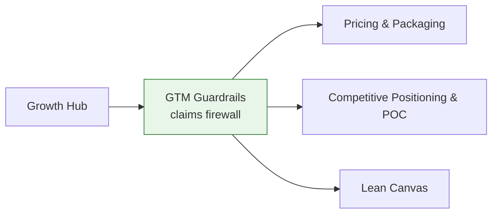

# Growth Hub

Cross-cutting entry point for GTM, pricing, and positioning work. For the full domain scope, see **[[Dux GTM Area]]**.

## Positioning and pricing

- [[Competitive Positioning & POC]] — analyst anchor, feature matrix, competitor counters
- [[Pricing & Packaging]] — tiers, outcome pricing, Phase-1 KPIs
- [[Lean Canvas]] — one-page business model, validated vs. hypothesis

## Claims discipline

- [[GTM Guardrails]] — the claims firewall every public statement must clear
- [[External Corrections 2026-07]] — third-party listing correction tracker

## Diagram

## Related

- [[Customer Success Hub]]
- [[Product Hub]]
