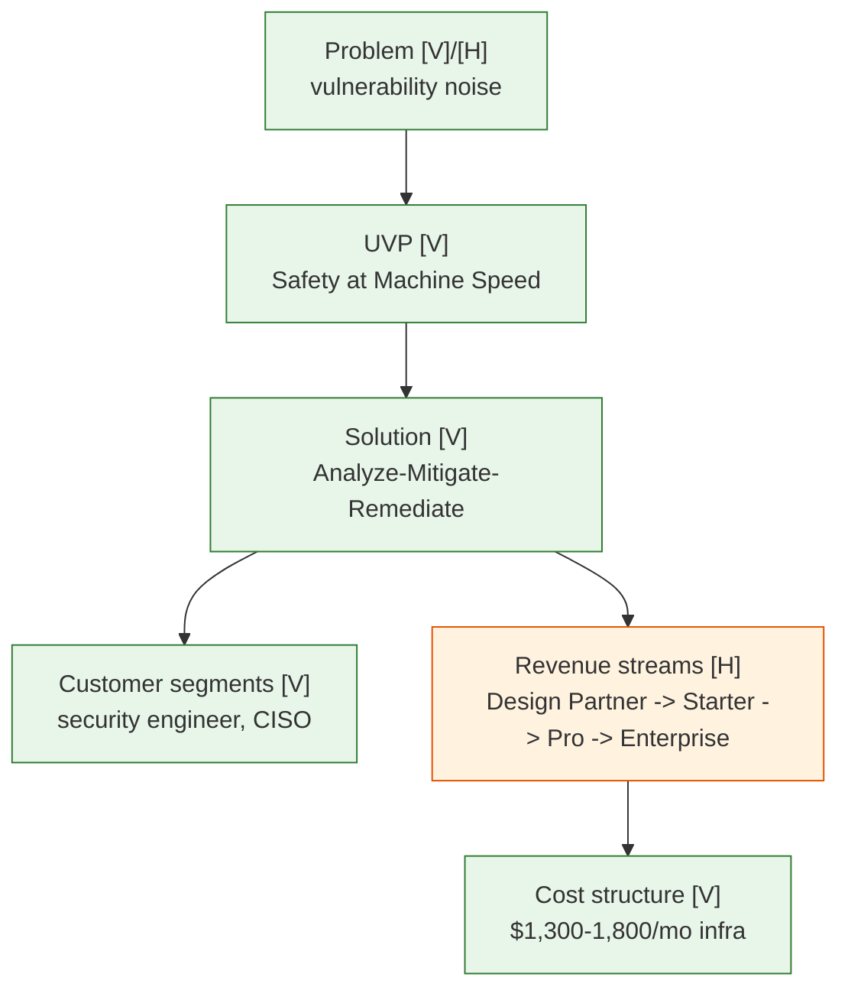

# Lean Canvas

## Summary

The one-page business model, with every entry traced to its canonical source. Owner: Founder. Status: canonical. Decisions: D-3, D-7, D-34. Review: quarterly.

## Executive Summary

No new claims originate in this document — every box links out to the spec that owns the fact, and each entry is explicitly tagged `[V]` (validated) or `[H]` (hypothesis), a discipline that keeps a strategy document from silently drifting into an unverified-claims document. The problem statement is validated at design-partner N=3 (1,247 critical findings/month against ~15% remediation capacity) but the "majority of time goes to triage" hypothesis awaits validation at N>=5 by Gate 2b. Cost structure is fully validated: self-hosted K8s infrastructure runs ~$1,300-1,800/month for the MVP-scale 3-node cluster (replacing the separate Temporal Cloud and ECS Fargate line items entirely), and the 2,080-hour engineering capacity envelope currently sits at 2,118h backlog (~101.8%, 38h over) — tracked, not silently absorbed.

## Specification

| Box | Tag | Content |
|---|---|---|
| Problem | [V]/[H] | Security teams drown in vulnerability noise (N=3 design-partner data); triage-vs-remediation time split is a hypothesis pending N>=5 validation |
| Customer segments | [V] | Primary user: security engineer. Buyer: CISO. Also AI Safety Lead (halt authority), DevOps/SRE (remediation owner) |
| Unique value proposition | [V] | "Safety at Machine Speed" — evidence-backed action groups with a defensible reasoning chain, write path unattended by default |
| Solution | [V] | Analyze -> Mitigate -> Remediate, live end to end at Gate 1, unattended by default; agents write and execute investigation code in microVM sandboxes |
| Channels | [V]/[H] | Phase 1: Contact-Us + NDA design-partner flow. Self-serve PLG (hypothesis) opens at Gate 2b |
| Revenue streams | [H] | Design partner $500/mo -> Starter $2,500/mo -> Professional $8,000/mo (Gate 2b list) -> Series A ACV $50-150K/$150K+ |
| Key metrics | [V] | MTXV <15min, time to value <48h, queue reduction thousands->tens, golden set >=80%/<2% regression, kill switch p99 <5s |
| Unfair advantage | [H] | Per-customer executed investigation code (inspectable, repeatable) on top of CaMeL, RLS isolation, hash-chained audit |
| Market sizing | [H] | TAM $8-12B / SAM $800M-1.2B / SOM $5-15M — cite source URL and date in any external deck |

### Cost structure (validated)

| Line | Figure |
|---|---|
| LLM cost per assessment | <=$0.75 hard, <=$0.55 design (D-3 gates: $0.675 breaker, $0.55 CI) |
| Self-hosted K8s infra (EKS + CloudNativePG/NATS/Valkey/MinIO/Temporal) | ~$1,300-1,800/month MVP-scale 3-node cluster |
| Bedrock/LLM tokens | ~$500-1,000/month at MVP scale |
| Team | 5 engineers, 2,080h envelope (D-7 R1, re-baselined D-23) |

Capacity: backlog at 2,118h against the 2,080h envelope (~101.8%, 38h over) — tracked as an open item, not absorbed silently.

## Diagram

## Entities & Concepts

- [[Pricing & Packaging]] — the full revenue-stream detail this canvas summarizes
- [[Dux Decisions Log]] — D-7/D-23 capacity re-baseline history

## Related

- [[Competitive Positioning & POC]]
- [[Dux GTM Area]]

## Sources

- `.raw/dux/80-gtm/lean-canvas.md`
