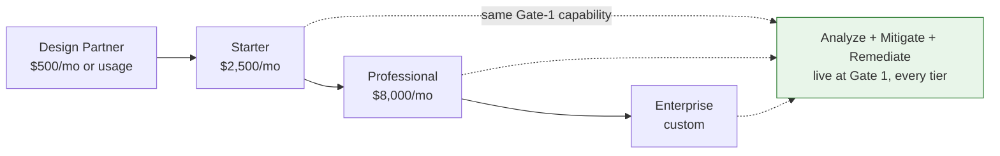

# Pricing & Packaging

## Summary

Tier structure, outcome-pricing model, and Phase-1 KPIs. Owner: GTM. Status: canonical. Gate: 2. Decisions: D-22, D-38.

## Executive Summary

Tier gating is commercial, not technical: the Analyze pipeline and Mitigate/Remediate all ship at Gate 1 for every tier, unattended by default — HITL is an anomaly-escalation path, never a tier-gated feature, and pricing tiers gate *access*, not capability depth. Enterprise's 99.99% SLA target is a commercial commitment whose infrastructure underwriting (warm-pool capacity planning) is tracked separately in architecture docs, not invented here. Every market-sizing figure (TAM $8-12B, SAM $800M-1.2B, SOM $5-15M) is explicitly labeled a forward-looking hypothesis, not a projection, and any external deck citing them must attach a source URL and date. The Phase-1 actions-per-assessment p95 <60 KPI is reconciled directly against the engineering-measured range (p50~55, p95~58) from [[Workflows & Agent Orchestration]] — the sales figure is not invented independently of the engineering data.

## Specification

### Tiers

| Tier | USD/month | Asset band | App API rate | SLA |
|---|---|---|---|---|
| Design Partner | $500 or usage-based | - | - | beta, no SLA |
| Starter | $2,500 | up to ~1K | 1,000 req/min | 99.5% |
| Professional | $8,000 | up to ~10K | 5,000 req/min | 99.9% (contractual target) |
| Enterprise | custom | unlimited | 10,000 req/min | 99.99% (commercial commitment) |

Per-tenant database isolation (D-38): a dedicated CloudNativePG-per-tenant option for Enterprise buyers requiring physical isolation beyond shared-schema RLS FORCE — priced at deal time, not a self-serve SKU. SSO entitlement is contractual; the technical SAML/OIDC work is a seed trigger, not delivered at signing.

### Data and GDPR

Export: Parquet default or JSON via `POST /tenants/{id}/export`, 30-day retention. GDPR deletion: one-calendar-month read-only export window, then a 90-day hard purge (operational retention, not a statutory maximum).

### Market context (forward-looking hypotheses, not projections)

| Measure | Range |
|---|---|
| TAM | $8-12B |
| SAM | $800M-$1.2B |
| SOM, years 1-2 | $5-15M (50-150 enterprises x $50-100K ACV) |

### Outcome-based pricing

| Meter | Definition |
|---|---|
| `dux.validated_true_positive` | validated exploitable finding, deduplicated per CVE+asset per 30 days |
| `dux.unexploitable_credit` | a finding reclassified unexploitable after assessment, issues a meter credit |

Gate 2b readiness requires PM+Finance sign-off on the algorithm and at least one design-partner LOI before any Stripe SKU publishes. Series A enterprise: Professional $50-150K ACV, Enterprise $150K+ with an outcome-based option. Series B: outcome pricing becomes the Enterprise default (flagged for revenue recognition and SOX).

### Phase-1 KPIs

| KPI | Target |
|---|---|
| MTXV | <15 min per CVE |
| Actions per assessment, p95 | <60 (governance warns above 100, halts at 200) |
| MTTP | measured end to end by Phase-1 exit — a metric, not an SLA |
| Time to value | <48h |
| Kill switch | p99 <5s |
| Golden-set regression | <2% |
| Design partners | 2+ by Gate-1 review (Week 12) |

**Product MTTR is not DORA MTTR** — product MTTR targets <72h (Gate 3), DORA MTTR (incident recovery) targets <1h; the two must never be conflated.

## Diagram

## Entities & Concepts

- [[GTM Guardrails]] — the claims discipline binding this pricing copy
- [[Workflows & Agent Orchestration]] — the engineering data the p95<60 KPI reconciles against
- [[API Overview]] — the separate rate-limit plane for the Public Data API

## Related

- [[Competitive Positioning & POC]]
- [[Lean Canvas]]

## Sources

- `.raw/dux/80-gtm/pricing-packaging.md`
