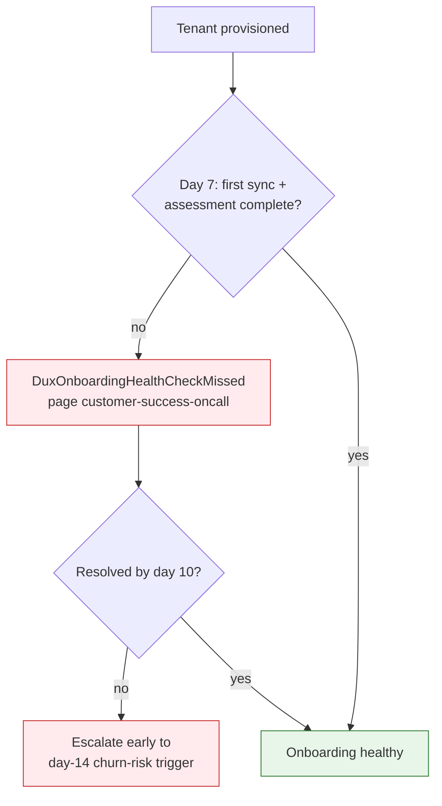

# Customer Lifecycle & Comms

## Summary

Onboarding, offboarding, billing, status-page copy, and health monitoring. Owner: Engineering. Status: canonical. Gate: 2. Decisions: D-18.

## Executive Summary

A dedicated 7-day onboarding health check (`DuxOnboardingHealthCheckMissed`, resolving OI-20) closes a detection gap the CSM-only 14-day cadence left open: a tenant with no completed first sync and no completed first assessment now pages Customer Success at day 7, not day 14, roughly halving worst-case time-to-notice for a stalled onboarding. Three separate tenant health formulas exist by design and are explicitly never merged: the CSM health score (0-100, usage/CSAT/connector/quota-weighted, owned by CSM), TenantHealthScore (Series A, reliability/cost/safety-weighted, owned by AI Safety Lead, routes low scores to Security and FinOps rather than CSM), and the Governance dashboard (queue depth/reduction delta/kill-switch activations/connector health, owned by PM+Security, any L3/L4 kill-switch activation triggers a mandatory audit). `status.dux.io` returning HTTP 200 is a hard launch blocker before the first design partner, with a 15-minute update SLA and severity-specific literal copy templates spanning platform outages through KS-L2/L3 tenant-scoped pauses.

## Specification

### Onboarding (9-step procedure)

Provision + verify RLS -> land on Dashboard -> 30-minute admin training video -> connect AWS -> run first assessment -> demonstrate kill switch (L1, L3) -> test audit-log export -> optionally test API key/webhook -> document escalation path.

**7-day health check:** `DuxOnboardingHealthCheckMissed` fires at exactly 7 days if no completed first sync and no completed first assessment (daily sweep, `admin:onboarding-health-sweep`). Routes to `@customer-success-oncall` (a customer-motion gap, not a platform incident); if `aws_role_status`/`connector_configs.status` look clean, CSM reaches out directly; unresolved by day 10 escalates early into the day-14 churn-risk trigger.

### Offboarding

Soft-delete day 0 -> days 0-30 export bundle available (24h SLA) + credential revocation -> days 31-90 legal-hold retention (`legal_hold` flag blocks purge) -> day 90 hard purge across MinIO/database/backups -> destruction certificate emailed. Matches [[Multi-Tenancy]]'s lifecycle authority.

### Trust and status portal gates

| Tier | Requirement | Blocks |
|---|---|---|
| P0 | `status.dux.io` + `trust.dux.io` return HTTP 200 | onboarding the first NDA design partner |
| P2 | content-complete: SOC 2 summary, pentest summary, security FAQ | procurement — first $100K ACV or enterprise questionnaire |

Interim exception: provisioning a partner before P0 requires a CEO + Security Officer signed risk acceptance per tenant.

### Status page severity copy (selected)

| Severity | Status page copy |
|---|---|
| P0 platform outage | "Dux is experiencing a platform-wide issue affecting dashboard and API access." |
| P0 AI safety (KS-L4) | "We detected a potential data isolation issue and paused AI analysis as a precaution." |
| KS-L3 (tenant platform) | "Your organization's dashboard is in read-only mode while we review a billing or security matter." |
| Degraded AI (fallback) | "AI analysis is running in reduced-capability mode." |

### Support tiers (add-on, separate from product packaging)

| Tier | Response | Channels |
|---|---|---|
| Standard | 24h business days | email, docs |
| Professional | 8h business days | email, Slack Connect (~$500/mo add-on) |
| Enterprise | 2h; 24x7 for P1 | Slack, email, phone, named CSM, QBRs |

### Health monitoring — three formulas, never merged

| Formula | Composition | Owner | Escalation |
|---|---|---|---|
| CSM health score | assessment freq 40% / CSAT 20% / connector health 20% / quota trend 20% | CSM | below 50 for 2 weeks -> churn-risk trigger + EBR |
| TenantHealthScore (Series A) | reliability 40% / cost 30% / safety 30% | AI Safety Lead | below 50 -> Security + FinOps, not CSM |
| Governance dashboard v1 | queue depth 30% / reduction delta 25% / kill-switch activations 25% / connector health 20% | PM + Security | green >=70, yellow 50-69 (CSM outreach), red <50 (exec review) |

## Diagram

## Entities & Concepts

- [[Multi-Tenancy]] — the tenant lifecycle authority this onboarding/offboarding process implements
- [[Seed Operational Runbooks]] — billing reconciliation drift runbook referenced here

## Related

- [[Operations Overview]]
- [[Pricing & Packaging]]

## Sources

- `.raw/dux/60-operations/customer-lifecycle.md`
