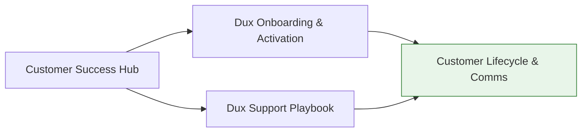

# Customer Success Hub

Cross-cutting entry point for onboarding, support, and customer health. For the full operations domain, see **[[Dux Operations Area]]**.

## Onboarding and activation

- [[Dux Onboarding & Activation]] — the 9-step procedure, 7-day activation gate, funnel caveats

## Support

- [[Dux Support Playbook]] — support tiers, incident-routing decision tree, escalation ladder
- [[Customer Lifecycle & Comms]] — full onboarding/offboarding/status-page/health-monitoring source

## Diagram

## Related

- [[Growth Hub]]
- [[Engineering Hub]]
