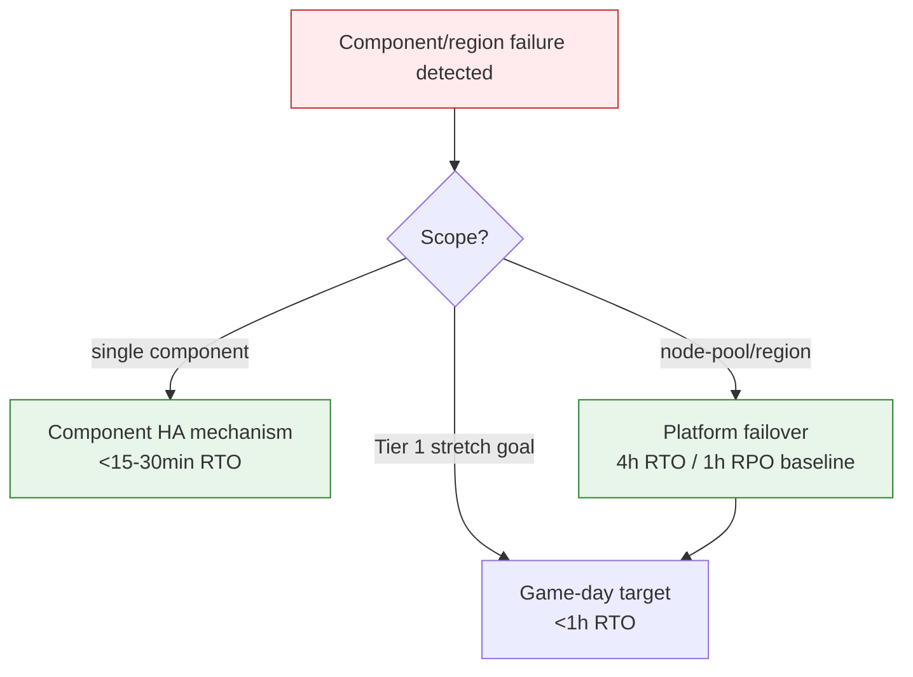

# DR / BCP

## Summary

RTO/RPO ladder, partition matrix, and game-day gates. Owner: Engineering. Status: canonical. Gate: 2. Decisions: D-34.

## Executive Summary

The platform-baseline RTO/RPO (4h/1h) and the individual-component failover targets (CloudNativePG <15min RTO, NATS <5min, Valkey/MinIO <30min) are deliberately not the same number and not a contradiction — the platform baseline assumes a harder failure (node-pool or region loss) than a single component's own HA mechanism absorbing. The circuit-breaker trip-and-recovery bounds for MCP gateway failure were formalized to resolve OI-18: detection under 5 minutes, a bounded queue depth (capped at the governance kernel's per-tenant daily budget, never unbounded), and full recovery under 10 minutes — a drill exceeding that bound is a scenario failure like any other RTO miss. Under ADR-006 R4 (Kubernetes/EKS from Gate 1), the former "Railway to AWS migration" prerequisite for multi-region is already satisfied — the Series B trigger is now capacity and region topology, not a hosting migration.

## Specification

### RTO / RPO

| Target | Value | Implementation |
|---|---|---|
| RTO (platform baseline) | 4h | K8s multi-AZ node pools + CloudNativePG base-backup failover |
| RTO, Tier 1 (game-day stretch) | <1h | auth, API, workflows |
| RPO | 1h | CloudNativePG WAL archiving to MinIO + hourly logical backups |
| Restore drill | quarterly | full staging restore from base-backup or snapshot |

Per-component failover (narrower scope than platform baseline): CloudNativePG <5min RPO/<15min RTO; NATS JetStream <1min RPO/<5min RTO; Valkey <1h RPO/<30min RTO; MinIO <1h RPO/<30min RTO.

### Chaos and partition scenarios

| Scenario | Expected behavior | RTO | Cadence |
|---|---|---|---|
| NATS outage 30min | kill switch falls back to `LISTEN/NOTIFY` (<10s); rate limits degrade to in-memory (documented over-admission risk) | <10s kill propagation | quarterly |
| K8s node-pool or region loss | redeploy to alternate node pool/region, DNS failover | <4h | semi-annual |
| Bedrock provider outage | `LLMFallbackService` reweights to direct Anthropic then vLLM | <60s | quarterly |
| MCP gateway failure | circuit breaker trips, queue degrades gracefully | <5min circuit-open, <10min full recovery | quarterly |

**Circuit-breaker bounds (resolves OI-18):** detection <5min (R4 trigger: MCP errors >50%/5min or health-check failure); queue-depth capped at GOV-004's per-tenant daily budget; recovery (half-open to closed) <10min total once error rate drops below 5%.

### Game days

**Chaos Friday:** first Friday monthly in staging; scenarios must meet success criteria before that week's production deploy, SRE sign-off required to bypass.

**DR game day (Seed Month 6):** full timed regional-failover exercise, target RTO <1h for Tier 1; documents the gap against the 4h baseline and feeds the Series B multi-region design.

**DNS abort path (resolves OI-19):** MinIO static-frontend revert via object versioning; DNS record revert via Cloudflare API restoring pre-change snapshot values; credentials (scoped Cloudflare token + MinIO admin) in Vault, rotated 90 days; `@platform-oncall` owns it, console access is break-glass fallback only.

### Series B forward

Target Tier 1 active-active RTO <1h (<15min at scale), with a required multi-region game day before any EU or APAC go-live. Inherit the Series A BCP/DR posture until `series-b-scale.md` is content-complete.

## Diagram

## Entities & Concepts

- [[Architecture Overview]] — the K8s/EKS multi-AZ topology this DR posture relies on
- [[AI Safety Incident Runbooks]] — R4 MCP dependency failure trigger this shares

## Related

- [[Seed Operational Runbooks]]
- [[Operations Overview]]

## Sources

- `.raw/dux/60-operations/dr-bcp.md`
