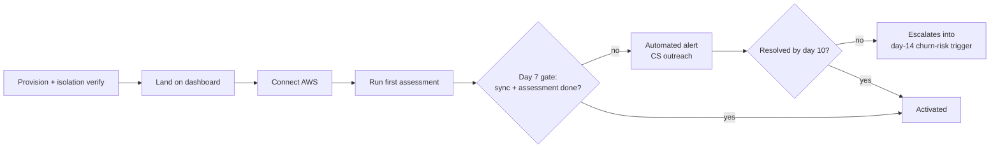
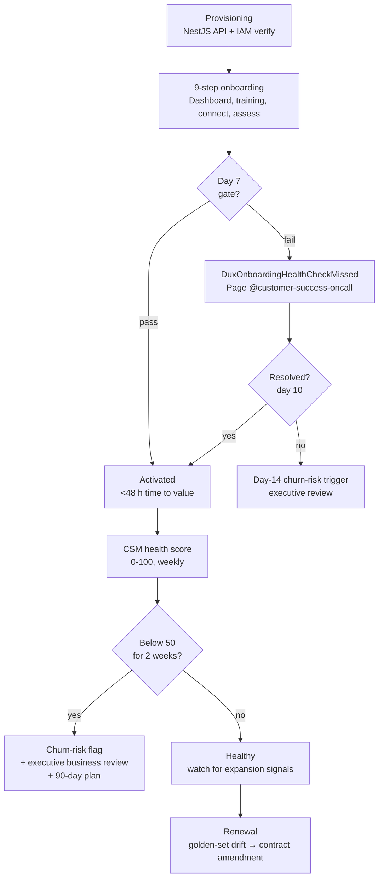

# Dux Customer Success Guide

Navigation: [[Dux]] | [[Dux Operations Guide]] | [[Dux GTM Guide]]

Everything a customer-facing team needs in one place: provisioning, onboarding health checks, trust portal gates, billing metering, incident comms, support tiers, health formulas, risk signals, and the triage-value hypothesis.

## Provisioning and onboarding

### The provisioning flow

Create the tenant through the NestJS API (idempotent) → validate the AWS cross-account IAM role → send the welcome email and admin training video → run the RLS verification auto-test → health check: a first asset sync and assessment within 7 days.

### The 9-step onboarding procedure

1. Provision, and verify RLS (row-level security isolation).
2. Land the customer on the Dashboard (US-012).
3. Admin training — a 30-minute video.
4. Connect AWS, via Connector Hub (US-013).
5. Run the first assessment.
6. Demonstrate the kill switch (L1 and L3, so the admin has actually seen it work).
7. Test the audit-log export.
8. Optionally, test an API key and a webhook.
9. Document the escalation path for that specific customer.

### 7-day health-check alert (resolves OI-20)

A daily automated sweep, not the biweekly customer-success check-in cadence, is what actually catches a stalled onboarding. `DuxOnboardingHealthCheckMissed` fires at exactly **7 days post-provisioning** if the tenant has **no** completed first sync **and** no completed first assessment — checked by a scheduled job (`admin:onboarding-health-sweep`, daily), not the 2-week CSM cadence.

Routing:

1. Page `@customer-success-oncall` (not engineering — this is a customer-motion gap, not a platform incident).
2. CSM runbook: check `aws_role_status` and `connector_configs.status` for a stuck `aws_role_failed`/`credential_revoked` state; if clean, reach out to the tenant admin directly.
3. If unresolved by day 10, escalate to the day-14 CSM health-score churn-risk trigger early rather than waiting for the regular cadence.

This closes the up-to-14-day detection gap the CSM-only cadence left: worst case is now **7 days, not 14**.

Time-to-value is tracked as a hard Phase-1 KPI: under 48 hours from connector setup to first value, and under 15 minutes from CVE to exploitability verdict once the pipeline is running.



**Worth being honest about:** the "8,341 → 2,143" queue-reduction number sometimes quoted alongside onboarding is explicitly labeled illustrative in the source material, not a measured activation funnel. It needs validation against at least 10 real design partners before it could be treated as a real metric. There is no activation A/B-test log or stage-by-stage conversion funnel (signup → connector → first sync → first assessment → first mitigation) anywhere in the source corpus.

## Trust and status portal gates

| Tier | Requirement | Blocks |
|---|---|---|
| **P0** | `status.dux.io` (uptime + incident copy) and `trust.dux.io` (home, `/subprocessors`, security contact, status link, SOC 2 readiness note) **return HTTP 200** | **Onboarding the first NDA design partner** |
| P1 | Portal shell complete — engineering milestone 2026-09-30 | — |
| **P2** | Content-complete: SOC 2 summary, pentest executive summary, security FAQ | **Procurement — the first $100K ACV, or an enterprise questionnaire** |

### Interim exception

Provisioning a partner before P0 requires a **CEO and Security Officer signed risk acceptance, per tenant** — artifact `RA-TRUST-INTERIM-{tenant_id}-{YYYYMMDD}`, filed in the provisioning ticket. Not a blanket policy, a per-tenant sign-off.

## Billing metering

Stripe meter events for tokens and agent runs. Daily reconciliation of platform usage against the Stripe meter. Invoice line items must match the usage dashboard. Overage alerts fire at **80%, 100%, and 120%** of quota.

**Drift above 5%** → the billing reconciliation drift runbook in [[Dux Operations Guide]].

## Status page and incident communications

`https://status.dux.io` — **a launch blocker. It must return 200 before the first design partner.**

Approver: Founder or PM before Gate 2; `@product-oncall` after. **SLA: 15 minutes.** Subscribe-by-email is available, and 99.5% historical uptime is visible.

### Literal copy table

| Severity | Status page | In-app banner | Email subject |
|---|---|---|---|
| P0 platform outage | "Dux is experiencing a platform-wide issue affecting dashboard and API access. Our team is investigating." | "Platform issue — some features unavailable. See status.dux.io." | "Dux — service disruption (investigating)" |
| P1 tenant incident | "Some customers may experience delayed assessments. We are investigating." | "Mitigation queue delayed — your data is safe." | "Dux — temporary delay in exploitability analysis" |
| P0 AI safety (KS-L4) | "We detected a potential data isolation issue and paused AI analysis as a precaution." | "AI features temporarily unavailable — your data is being reviewed." | "Dux — precautionary pause of AI analysis (action may be required)" |
| Degraded AI (fallback) | "AI analysis is running in reduced-capability mode. Results may take slightly longer." | "Exploitability analysis using backup AI provider. No action required." | "Dux — temporary AI provider switch (no data impact)" |
| KS-L2 (tenant assessment) | "Agent features paused for your organization pending security review." | "AI analysis paused by your administrator or Dux safety controls." | "Dux — AI analysis paused for your organization" |
| KS-L3 (tenant platform) | "Your organization's dashboard is in read-only mode while we review a billing or security matter. Existing data remains accessible." | "Dashboard read-only — new assessments paused. Contact your administrator." | "Dux — read-only mode for your organization" |

Updates go out on a 15-minute cadence during any active incident, using pre-written, severity-specific copy so a stressed on-call engineer isn't drafting customer-facing language in the middle of a P0.

## Support tiers

An add-on, **separate from product packaging**.

| Tier | Response time | Channels | Price |
|---|---|---|---|
| Standard | 24 h, business days | email, docs | included with Starter |
| Professional | 8 h, business days | email, Slack Connect | ~$500/month add-on (model) |
| Enterprise | 2 h; 24×7 for P1 | Slack, email, phone, named CSM, quarterly business reviews | custom, ~$2K+/month |

### The escalation ladder

| Trigger | First responder | Escalates to |
|---|---|---|
| Onboarding stall (7 days, no sync or assessment) | Customer-success on-call | Day-14 churn-risk trigger if still unresolved by day 10 |
| Health score below 50 for 2 weeks | CSM | Churn-risk trigger + executive business review |
| Any L3 or L4 kill-switch activation | AI-safety on-call | Mandatory audit, regardless of support tier |
| MRR-at-risk threshold crossed | Incident Commander | Auto-pages the CEO and Founder directly |

### Incident routing decision tree

Every incident that reaches support routes through the same decision tree:

```
Incident detected
├── Is an AI agent involved (reasoning, a tool call, code execution)?
│   ├── YES → routes to the 12 canonical AI-safety runbooks
│   │         (see Dux AI Safety Operations Reference)
│   │         plus 2 seed-only extensions (agent quota, shadow AI)
│   │         → the AI Safety Lead holds 60-second halt authority
│   │         → and can never be the same person as the Incident Commander
│   └── NO  → infrastructure-only incident → general incident response
│             (deploy, rollback, DB, DNS)
└── Does spend cross the MRR-at-risk threshold?
    └── YES → auto-pages the CEO and Founder, regardless of branch
```

That separation — agentic incidents on one track, pure infrastructure on the other, with a revenue-risk tripwire cutting across both — is what keeps a routine infrastructure blip from ever being handled with the same gravity (or the same halt authority) as a genuine agent-safety event, and vice versa.

**Worth being honest about:** there's no historical support-ticket-category breakdown or volume data anywhere in the source corpus — reasonably, since the source is a pre-launch planning corpus with no live support history yet. A real top-ticket-categories table would need an actual helpdesk export once the product has real customers.

## Offboarding

Offboarding mirrors the tenant-lifecycle authority described in [[Dux Architecture Guide]] and [[Dux Governance & Compliance Guide]], applied to the customer-facing side:

| Phase | Days | Actions |
|---|---|---|
| Soft-delete | Day 0 | Tenant marked deleted; export bundle available (JSON/CSV for customer, Parquet for internal archive; 24 h SLA) |
| Export window | Days 0–30 | Revoke sessions, keys, agent credentials; export bundle available |
| Legal-hold retention | Days 31–90 | `legal_hold` flag blocks purge and notifies Legal |
| Hard purge | Day 90 | Purge across MinIO, database, and backups; email destruction certificate to customer |

## Tenant health: three formulas, deliberately never merged

There are three separate tenant-health scoring systems in play, each owned by a different team, each routing to a different response. The source material is explicit that merging them into one number would be a mistake, not a simplification.

| Formula | Composition | Owner | Escalation |
|---|---|---|---|
| **CSM health score** (0–100) | Assessment frequency 40% · CSAT 20% · connector health 20% · quota trend 20% | Customer Success | **Below 50 for 2 weeks** → churn-risk trigger + EBR: usage trends, open incidents, expansion blockers, a 90-day plan |
| **TenantHealthScore** (Series A) | Reliability 40% · cost 30% · safety 30% | AI Safety Lead | Below 50 routes to **Security and FinOps — not CSM** |
| **Governance dashboard v1** (Seed Month 3, Grafana `governance-dashboard-v1`) | Queue depth 30% (>50 pending per tenant → CSM outreach) · reduction delta 25% (negative 2-week trend → exec review) · kill-switch activations 25% (**any L3 or L4 → mandatory audit**) · connector health 20% (AWS sync stale >24 h → P2) | PM + Security | **Green ≥70 · Yellow 50–69** (CSM outreach) **· Red <50** (exec review, optional L2 freeze) |

The reason these stay separate rather than blending into a single "health score" is that they're answering genuinely different questions:

- **CSM health score:** Is this customer happy and using the product?
- **TenantHealthScore:** Is the platform itself behaving safely and cost-effectively for them?
- **Governance dashboard:** Is the governance/safety posture on their tenant specifically healthy?

Collapsing them would hide which of those three questions is actually the problem.

## Risk signals to watch

| Signal | What it means | Action |
|---|---|---|
| 14 days with no assessment | Churn alert — the tenant may have disconnected or deprioritized | CSM outreach, escalate if no response |
| Quota utilization at 80% | Expansion signal — the tenant is approaching their asset band limit | Proactive expansion conversation |
| `aws_role_failed` / `credential_revoked` state | Connector is broken or credentials were rotated without updating Dux | CSM runbook: check role status, guide re-provisioning |
| Governance dashboard red (<50) | Safety or operational posture degraded on this tenant | Executive review, optional L2 freeze |
| Kill-switch L3 or L4 activation | Agent-safety event | Mandatory audit — this overrides all other priorities |

## Triage-value hypothesis

**A GTM input, not an SLO.** Practitioners report that the majority of vulnerability-management time goes to triage rather than remediation.

**This is qualitative and unvalidated.** It awaits design-partner validation at N ≥ 5, with a decision target of Gate 2b GTM sign-off. ROI-calculator inputs live in [[Dux GTM Guide]].

The urgency behind this hypothesis traces to Mandiant's M-Trends 2026 report, which found mean time-to-exploit had gone *negative*: roughly 1 day before patch availability in 2024, worsening to roughly 7 days before patch availability in 2025. When exploitation windows are shorter than patch cycles, teams need to know *what* to patch first — and that's exactly what exploitability validation provides.

## Key metrics tracked across the lifecycle

| KPI | Target | Owner |
|---|---|---|
| MTXV (mean time to exploitability verdict) | <15 min per CVE | Engineering |
| Time to value | <48 h from connector | CSM + Engineering |
| Actions per assessment (p95) | <60 | Engineering (governance warns >100, halts >200) |
| Kill switch (p99) | <5 s | Engineering |
| MTTR (mean time to remediate) | <72 h (Gate 3) | Engineering + CSM |
| Golden-set regression | <2% | Engineering |
| Design partners | 2+ by Gate-1 review (Week 12) | GTM + CSM |

**Product MTTR is not DORA MTTR.** DORA MTTR is incident recovery, targeted under 1 h. Product MTTR targets under 72 h by Gate 3. They measure different things, and conflating them produces a nonsensical number.



## Sources

- `.raw/dux/60-operations/customer-lifecycle.md`
- `.raw/dux/40-ai-safety/incident-runbooks.md`
- `.raw/dux/60-operations/runbooks.md`
- `.raw/dux/80-gtm/pricing-packaging.md`
- `.raw/dux/80-gtm/gtm-guardrails.md`
