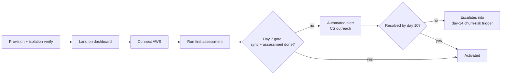

# Dux Customer Success Guide

Navigation: [[Dux]] | [[Dux Operations Guide]] | [[Dux GTM Guide]]

Everything a customer-facing team needs in one place: how a tenant gets activated, how support is tiered and routed, and how the incident-communication machinery actually talks to a customer mid-outage.

## Onboarding: the nine steps and the one gate that matters

Every new tenant walks the same nine-step path: provision the tenant and verify tenant isolation → land on the dashboard → a 30-minute admin training video → connect AWS through Connector Hub → run the first assessment → demonstrate the kill switch (levels 1 and 3, so the admin has actually seen it work) → test an audit-log export → optionally test an API key and webhook → document the escalation path for that specific customer.

Underneath that walkthrough sits one hard, automated gate: **activation is measured as a completed first connector sync *and* a completed first assessment, both within 7 days of provisioning**: not a softer "logged in a few times" definition. A daily automated sweep, not the biweekly customer-success check-in cadence, is what actually catches a stalled onboarding: if a tenant hasn't hit that bar by day 7, an alert fires and routes straight to customer success, not engineering: this is treated as a customer-motion gap, not a platform incident. If it's still unresolved by day 10, it escalates early into the day-14 broader churn-risk trigger, which roughly halves the worst-case time to notice a stalled account compared to relying on the 14-day cadence alone.

Time-to-value is tracked as a hard Phase-1 KPI: under 48 hours from connector setup to first value, and under 15 minutes from CVE to exploitability verdict once the pipeline is running.



**Worth being honest about:** the "8,341 → 2,143" queue-reduction number sometimes quoted alongside onboarding is explicitly labeled illustrative in the source material, not a measured activation funnel: it needs validation against at least 10 real design partners before it could be treated as a real metric. And there's a genuine content gap worth naming rather than papering over: **no activation A/B-test log or stage-by-stage conversion funnel (signup → connector → first sync → first assessment → first mitigation) exists anywhere in the source corpus.** If this vault is ever meant to track growth experiments, that data has to come from a growth/analytics system that simply isn't part of this ingest yet: it would need to be sourced and added separately, not inferred or invented here.

## Support: tiers, routing, and who gets paged

Three commercial support tiers sit alongside product packaging as a separate add-on axis:

| Tier | Response time | Channels | Price |
|---|---|---|---|
| Standard | 24 hours, business days | Email, docs | Included with Starter |
| Professional | 8 hours, business days | Email, Slack Connect | Roughly $500/mo add-on |
| Enterprise | 2 hours; 24/7 for P1 | Slack, email, phone, named CSM, quarterly business reviews | Custom, roughly $2K+/mo |

Every incident that reaches support routes through the same decision tree, and the first branch is the one that matters most:

```
Incident detected
├── Is an AI agent involved (reasoning, a tool call, code execution)?
│   ├── YES → routes to the 12 canonical AI-safety runbooks (see Dux AI Safety Operations Reference)
│   │         plus 2 seed-only extensions (agent quota, shadow AI)
│   │         → the AI Safety Lead holds 60-second halt authority
│   │         → and can never be the same person as the Incident Commander
│   └── NO  → infrastructure-only incident → general incident response (deploy, rollback, DB, DNS)
└── Does spend cross the MRR-at-risk threshold?
    └── YES → auto-pages the CEO and Founder, regardless of which branch above it took
```

That separation (agentic incidents on one track, pure infrastructure on the other, with a revenue-risk tripwire cutting across both) is what keeps a routine infrastructure blip from ever being handled with the same gravity (or the same halt authority) as a genuine agent-safety event, and vice versa.

**Worth being honest about here too:** there's no historical support-ticket-category breakdown or volume data anywhere in the source corpus: reasonably, since the source is a pre-launch planning corpus with no live support history yet. A real top-ticket-categories table would need an actual helpdesk export once the product has real customers, not something this guide can responsibly estimate.

### The escalation ladder

| Trigger | First responder | Escalates to |
|---|---|---|
| Onboarding stall (7 days, no sync or assessment) | Customer-success on-call | Day-14 churn-risk trigger if still unresolved by day 10 |
| Health score below 50 for 2 weeks | CSM | A churn-risk trigger plus an executive business review |
| Any L3 or L4 kill-switch activation | AI-safety on-call | A mandatory audit, regardless of support tier |
| MRR-at-risk threshold crossed | Incident Commander | Auto-pages the CEO and Founder directly |

## Talking to customers during an incident

A public status page returning a healthy check is treated as a hard launch blocker before the very first design-partner tenant goes live: not a nice-to-have. Updates go out on a 15-minute cadence during any active incident, using pre-written, severity-specific copy so a stressed on-call engineer isn't drafting customer-facing language in the middle of a P0:

| Severity | What customers see |
|---|---|
| P0 platform outage | "Dux is experiencing a platform-wide issue affecting dashboard and API access." |
| P0 AI safety (platform-wide kill switch, KS-L4) | "We detected a potential data isolation issue and paused AI analysis as a precaution." |
| P1 tenant incident | "Some customers may experience delayed assessments. We are investigating." |
| KS-L2 (tenant assessment paused) | "Agent features paused for your organization pending security review." |
| KS-L3 (tenant platform, read-only mode) | "Your organization's dashboard is in read-only mode while we review a billing or security matter." |
| Degraded AI (running on a fallback model) | "AI analysis is running in reduced-capability mode." |

An interim exception exists for the earliest days: provisioning a design partner before the status/trust portals are actually live requires a signed risk acceptance from both the CEO and the Security Officer for that specific tenant: not a blanket policy, a per-tenant sign-off. That gate itself has three tiers: P0 (both `status.dux.io` and `trust.dux.io` returning a healthy response) blocks onboarding the very first NDA design partner; P1 (the portal shell fully built out) is an engineering milestone rather than a hard blocker; and P2 (content-complete, with a SOC 2 summary, a penetration-test executive summary, and a security FAQ) blocks procurement, specifically the first $100K annual contract or any enterprise security questionnaire.

## Billing metering

Usage that feeds an invoice runs on Stripe meter events for tokens and agent runs, reconciled daily against the platform's own usage dashboard: invoice line items have to match what that dashboard shows. Overage alerts fire at three thresholds, 80%, 100%, and 120% of quota, and a reconciliation drift above 5% between Stripe and the platform's own ledger routes into the billing-reconciliation-drift runbook in [[Dux Operations Guide]].

## Offboarding

Offboarding mirrors the same tenant-lifecycle authority described in [[Dux Architecture Guide]] and [[Dux Governance & Compliance Guide]], applied to the customer-facing side of the process: a soft-delete on day 0, a 24-hour-SLA export bundle available through day 30 alongside immediate credential revocation, a legal-hold retention window from day 31 through day 90, and a hard purge on day 90 across every data store, closed out with a destruction certificate emailed to the customer as proof.

## Tenant health: three formulas, deliberately never merged

A recurring point of confusion worth resolving clearly: there are three separate tenant-health scoring systems in play, each owned by a different team, each routing to a different response, and the source material is explicit that merging them into one number would be a mistake, not a simplification.

| Formula | What it weighs | Owner | Where it routes |
|---|---|---|---|
| CSM health score | Assessment frequency (40%), CSAT (20%), connector health (20%), quota trend (20%) | Customer Success | Below 50 for 2 weeks triggers a churn-risk flag and an executive business review |
| Tenant reliability score (Series A) | Reliability (40%), cost (30%), safety (30%) | AI Safety Lead | A low score routes to Security and FinOps: deliberately *not* to CSM |
| Governance dashboard | Queue depth (30%), reduction-rate delta (25%), kill-switch activations (25%), connector health (20%) | Product + Security | Green at 70+, yellow 50–69 triggers CSM outreach, red under 50 triggers executive review |

The reason these stay separate rather than blending into a single "health score" is that they're answering genuinely different questions: is this customer happy and using the product, is the platform itself behaving safely and cost-effectively for them, and is the governance/safety posture on their tenant specifically healthy. Collapsing them would hide which of those three questions is actually the problem.

## Sources

- `.raw/dux/60-operations/customer-lifecycle.md`
- `.raw/dux/40-ai-safety/incident-runbooks.md`
- `.raw/dux/60-operations/runbooks.md`
- `.raw/dux/80-gtm/pricing-packaging.md`
- `.raw/dux/80-gtm/gtm-guardrails.md`
